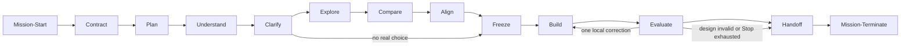

# Mission Lifecycle Shape

This is a review aid. `SKILL.md` remains the lifecycle authority.

- Every root message traverses the seven outer stages; unused stages are `noop`.
- Exact mechanical work uses a visible mini-plan. Consequential choices require user alignment.
- A design failure does not auto-replan and rebuild in the same mission.
- Hooks project admission, the standard write gate, and termination; they do not own planning.
