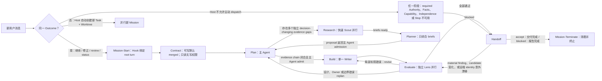

# Mission Lifecycle Shape

Load this reference only when the skill is explicitly invoked to maintain, audit, or explain the
workflow architecture. It is a visual model, not lifecycle authority; operational rules remain in
`SKILL.md`.

Scout 或 Lens 数量不固定。仅在存在独立且会改变决策的任务包时，才在当前 host 容量内并行；
不要为了凑数量制造工作。

- Mission-Start、Contract、Plan、Build、Evaluate、Handoff、Mission-Terminate 是串行阶段；任一
  阶段可以 noop，但不可跳过。
- Mission 与 Codex task/chat、worktree、branch、PR 一一绑定。同一 Outcome 的继续、修正、
  review、status 留在原 Mission；独立 Outcome 由 Host 自动分派新 task/worktree 并行执行。
  Host 不允许主动分派时必须 blocked，不得把第二个 Mission 塞进当前 worktree。
- Contract 后由主 Agent 进入 Plan。仅在仍有多个独立 decision-changing evidence gaps 时并行
  Research；required briefs 返回后才用 Planner 综合；零或单一 evidence chain 留在主 Plan。
- Build 保持单一可写者；Evaluate 针对同一候选运行互不重叠的独立 lens。
- 局部实现错误回到 Build；设计、Owner 或边界错误回到 Plan，只有仍有 evidence gap 才先重新
  Research；全部通过才进入 Handoff。
- 任一阶段因 required Authority、Facts、Capability、Independence 或 Stop 不可用而 `blocked`，仍
  进入 Handoff 和 Terminal 完成报告。
- Handoff 发现 material finding、candidate 变化，或 tracked remote head、base、merge tree
  意外漂移时回到 Evaluate；`accept` 需交付信号闭合，`blocked` 完成 Handoff 报告后进入
  Terminal。
- 一个 Mission 最多一个 PR；PR opening Codex review 只消费一次并仅用于 discovery。所有
  findings 一次性 adjudicate，同一设计最多形成一个 consolidated revision，随后只重跑
  final-head deterministic checks，不再触发 review 或新开 PR。
