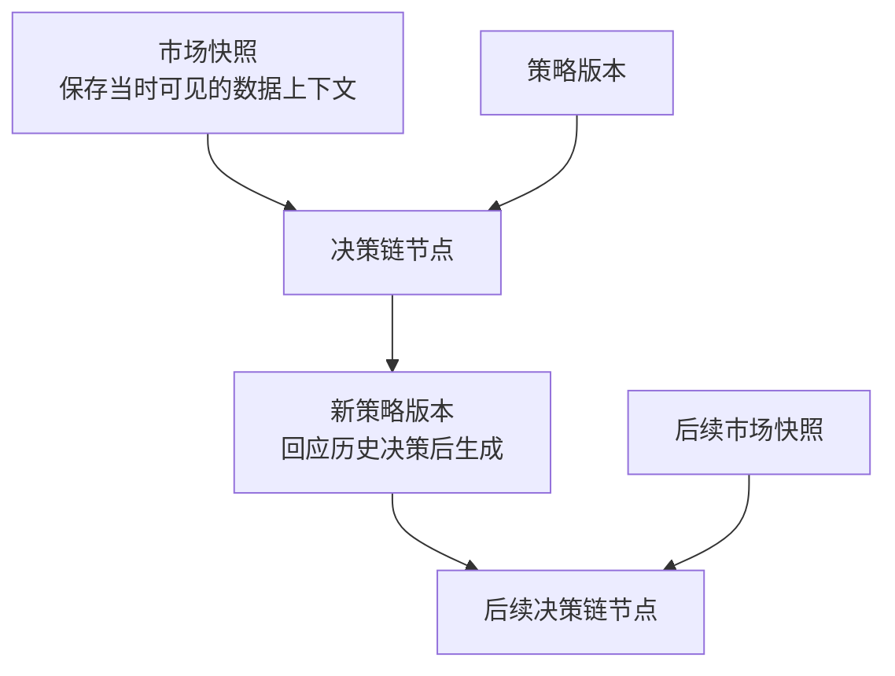
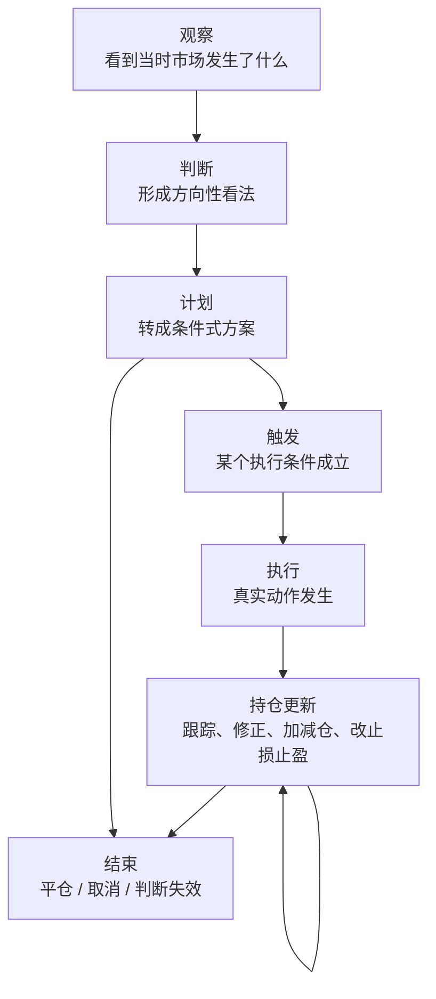

# BTC Trade Workspace

这是一个在 Codex 里直接使用的 BTC 交易工作仓库。

这个仓库围绕的产品，是一位在 Codex 中持续参与判断、更新和复盘的加密货币投资搭子。

## 产品定位

这个产品更像一个长期协作的投资搭子，而不是单次给结论的信号机。

它至少应该具备这些基础特征：

- 能日常对话，不需要用户每次重新描述上下文
- 能围绕市场、策略、风险给出一致风格的回答
- 能把“看市场 -> 出建议 -> 后续跟踪 -> 复盘”视为一条连续链路
- 能保留多个并行判断，而不是强行压成单一路径
- 能在后续复盘时回看每次建议是如何基于当时上下文产生和演变的

它首先要做到：

- 在 Codex 里直接对话
- 稳定地产出有依据的投资判断
- 让建议可以被后续跟踪、更新和复盘

## 协作闭环

产品围绕一笔交易判断的完整协作闭环展开：

- 用户可以直接在 Codex 里发起市场或交易问题
- Codex 能基于当时上下文给出结构化判断和条件式计划
- 这次判断能进入一条可跟踪的决策链
- 决策链后续可以被更新、结束和复盘
- 复盘结果能形成候选策略更新意见

这个闭环的默认协作方式是：

- 用户先提出市场或交易问题
- Codex 先确认当时市场上下文，再给结构化判断、条件式计划、风险边界和后续观察点
- 是否写入仓库，仍只在用户明确要求记录、保存或复盘时才发生

## 判断框架

### 市场状态

产品不只处理单笔判断，还需要持续回答更上层的市场状态问题。市场状态不是某一笔交易的私有备注，而是决策链之上的共享背景，用来统一回答“现在属于什么环境”以及“因此更该怎么打”。

它的作用，不是替代具体判断，也不是把市场硬拆成一套过细分类，而是持续回答几类更慢的问题：

- 当前更接近趋势推进、震荡消化、风险释放、修复回暖，还是高不确定阶段
- 在这样的状态下，哪些策略更应该被优先采用，哪些只应降权、等待或暂停
- 当前整体更适合进攻、防守还是耐心等待，组合风险预算应收缩、扩张还是重新分配
- 什么变化意味着市场状态已经切换，需要批量重看正在跟踪的判断、计划和持仓

产品需要把这个市场状态视角看成决策链之上的共享背景，而不是某一笔交易私有的备注。否则多个局部判断即使各自有理，整体上也可能出现风格漂移、策略错配和预算失衡。

### 正式判断

一次正式判断至少需要分清下面这些维度，避免在跟踪和复盘时把不同问题混在一起。

1. **证据归因**

   正式判断不只要给结论，还要尽量区分：哪些证据真正进入了判断，哪些反向证据当时存在但没有改变主判断，以及为什么在那个时点更愿意相信前者。否则复盘时，很容易把“当时看到的一切”误当成“当时真正依赖的依据”。

2. **催化剂导向**

   正式判断不只回答现在怎么看，还要尽量说明接下来在等什么催化剂、什么变化会触发重看，以及如果这些变化迟迟不来或提前落空，原判断应如何降级、延后或取消。否则“建议 -> 跟踪 -> 更新”很容易退化成被动观察。

3. **行动阈值**

   形成方向判断，不等于默认要给出动作。正式判断应尽量区分“有观点”和“值得出手”，并把观望 / 不做视为正式、有效的结论，同时说明还缺哪些执行前提，以及什么变化会把继续等待升级为正式计划，或者直接让原判断失效。

4. **组合预算意识**

   这不是单次判断内部的新模块，而是多个计划并行出现时必须补看的一层上层视角。正式计划应尽量回答：它是否值得占用当前有限的资金、仓位或风险预算；它和已有计划 / 持仓之间是什么关系；以及当更高质量机会出现时，它在什么条件下应该缩小、让位、合并或取消。

5. **时间尺度锚定**

   正式判断不应该脱离时间尺度存在，而应尽量说明它主要属于哪个持有周期 / 观察周期、预计在多长窗口里被验证或失效，以及更高和更低时间尺度里的哪些信息只是背景、哪些真正参与了这次判断。否则不同时间尺度上的看法很容易被错误地揉成一团。

6. **过程与结果分离**

   一次结束、复盘或策略反思，不应把结果好坏直接等同于决策质量高低，而应尽量把判断质量、执行质量和最终结果拆开来看。至少要分开回答：这次判断在当时上下文下是否成立，这次执行是否遵守了原计划和风险边界，以及最终结果里哪些来自判断与执行、哪些更像市场随机性或时点运气。

## 产品结构

### 核心对象

产品围绕三类核心对象展开：市场快照、决策链、策略链。

- **市场快照**：保存“当时看到了什么”。
  一个决策节点可以关联一个或多个市场快照；这些快照必须代表“当时可见”的上下文，而不是事后回填的数据；后续复盘时，应优先回看决策节点绑定的快照，而不是直接重跑最新市场数据。
- **决策链**：保存“一次判断如何演化成后续动作、更新和结束”。
  决策节点可以明确挂靠某个策略版本；同一观察时点可以产生多个并行判断；后续某个判断可以继续分叉；多个判断在后续也可以收敛为一个执行方案；最终执行的动作，只是整条决策链中的某个节点结果，不等于整条链本身。
- **策略链**：保存“判断背后的方法如何延续和修正”。
  同一策略版本可以影响多个决策节点；如果某次判断并不是由正式策略驱动，也应该允许它先作为非策略化判断存在；一个新策略版本可以关联一个或多个历史决策节点；这些被关联的历史决策，通常是失败案例、低质量案例，或者暴露明显缺陷的案例；一个失败决策也可以同时影响多个后续策略分支；新策略版本可以从旧策略版本派生；一个策略版本可以继续分叉成多个方向；某些策略分支后续可以合并成新的统一版本；策略链要能表达“继承了什么”和“修正了什么”。

三类对象的关系如下：

1. 市场快照为某个决策节点提供当时上下文
2. 决策节点可以明确挂靠某个策略版本
3. 历史决策节点可以反向进入策略更新，生成新策略版本
4. 新策略版本再影响后续新的决策节点

### 决策链

决策链内部至少需要 7 类节点，作为对话、记录、跟踪、复盘和策略迭代共享的一套最小语言：

1. `观察`
2. `判断`
3. `计划`
4. `触发`
5. `执行`
6. `持仓更新`
7. `结束`

最小流转图如下：

这张图只表达常见演化方向：`观察 -> 判断 -> 计划 -> 触发 -> 执行 -> 持仓更新 -> 结束`。

其中 `计划` 可以直接进入 `结束`，`持仓更新` 可以反复出现；这里定义的是最小节点语言，而不是一张必须按顺序执行的固定流程图。

- **观察**：承接一次新的市场上下文，回答这次在看什么对象、出现了什么现象、绑定了哪些市场快照；重点是把“当时看到的东西”固定下来。
- **判断**：在观察基础上形成方向性看法，回答当前更偏多、偏空还是观望，主要依据是什么，哪些前提失效后判断不成立；重点不是下单，而是形成一个明确、可被后续修正的立场。
- **计划**：把判断转成条件式行动方案，回答什么条件满足时才行动、预计怎么开仓或不做、风险边界是什么、计划中的止损止盈仓位和加减仓条件是什么；重点是把模糊判断压缩成可执行结构。
- **触发**：说明为什么从计划进入动作，回答计划中的哪个条件已经成立、是什么事件让当前时刻变成执行时点、这次触发和原计划相比有没有偏差；重点是防止“事后感觉差不多就做了”。
- **执行**：记录真实发生的动作，回答实际做了什么动作、动作是在什么价位和什么仓位条件下发生的、这次执行和计划是否一致；重点是把“想法”与“真实动作”分开。
- **持仓更新**：记录执行之后的持续跟踪和修正，回答当前仓位状态发生了什么变化、是否加仓减仓移动止损调整止盈、这次更新是因为市场变化执行问题还是原判断变化；重点是承认交易不是一次性动作，而是一个持续管理过程。
- **结束**：关闭这条决策链当前阶段，回答这条链是怎么结束的、是平仓取消计划还是判断失效、最终结果是什么、哪些信息值得进入复盘；重点不是只记录盈亏，而是给后续复盘留下明确出口。

除了上面 7 类主节点，产品还需要记住两个横切动作：

- `复盘`：回看整条决策链
- `反思入策`：把复盘结果送入策略链，推动后续策略版本更新
