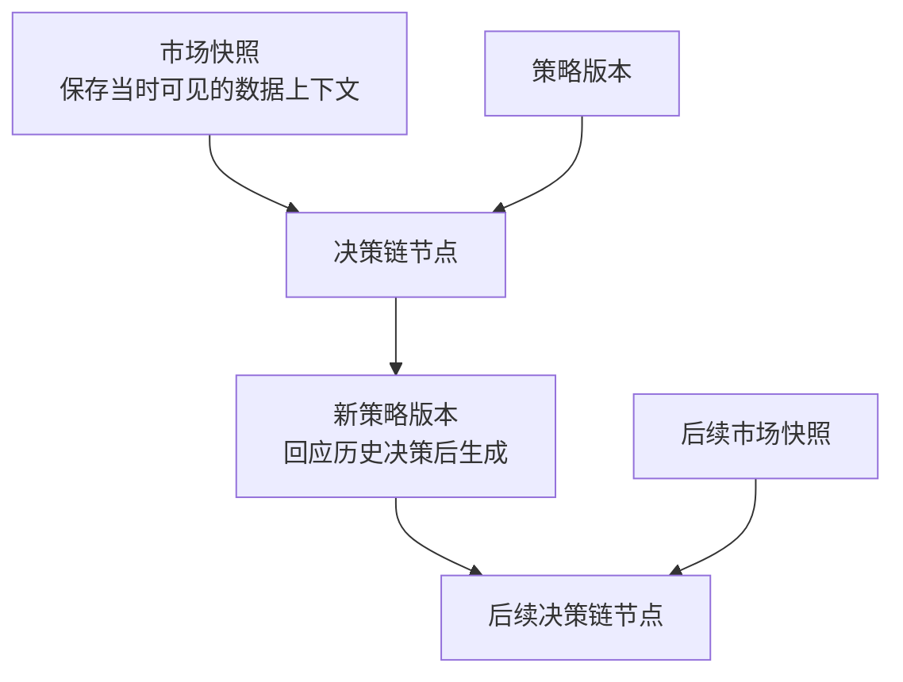
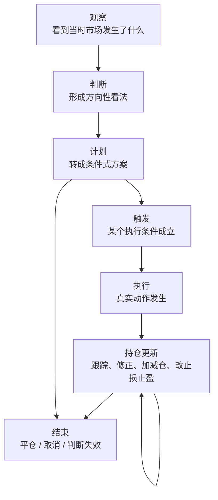

# BTC Trade Workspace

这是一个在 Codex 里直接使用的 BTC 交易工作仓库。

这个仓库围绕的产品，是一位在 Codex 中持续参与判断、更新和复盘的加密货币投资搭子。

## 产品定位

这个产品是一个长期协作的投资系统，而不是单次给结论的信号机。

它的核心前提不是“用户问得详细”，而是“系统必须先拿到足够上下文，才能给出交易判断”。

它需要做到：

- 用户可以直接在 Codex 里发起市场或交易问题
- 用户入口可以很短，但只要问题指向真实资金决策，系统就必须按正式判断标准工作
- 能日常对话，不需要用户每次重新描述完整上下文
- 能围绕市场、策略、风险给出一致风格的回答
- 能主动调用合适的 skill，补齐形成判断所需的市场数据、历史策略、历史快照和历史决策链
- 能基于当时上下文给出结构化判断、条件式计划、风险边界和后续观察点
- 能先收束当前最值得持续跟踪的关注清单，再决定哪些机会值得升级成正式判断
- 能把“看市场 -> 出建议 -> 后续跟踪 -> 复盘”视为一条连续链路
- 能保留多个并行判断，而不是强行压成单一路径
- 能在后续复盘时回看每次建议是如何基于当时上下文产生和演变的
- 不是每次判断都强制写入仓库；只有用户采纳、需要持续跟踪、已经持仓或明确要求记录复盘时，才进入链路维护和存储

## 运行原则

这个产品的“重”主要体现在判断质量，而不是体现在每次都做完整存储。

- 交易判断默认是重判断。只要问题实质上是在问“能不能做”“要不要继续拿”“现在该不该调整风险”，系统就不能因为用户问得短而降低严谨度。
- Codex 不依赖关闭窗口后仍保留的对话记忆来工作，而是依赖 skill 在当下重建决策上下文。
- market skill 负责拉取最新市场数据，包括多周期 K 线、结构、指标和其他形成判断所需的实时信息。
- chain skill 负责读取和维护历史策略、策略变体、市场快照、历史决策链以及相关数据库结构。
- Codex 根据当前任务自主决定调用哪些 skill；真正被依赖的是“可重建的上下文能力”，不是“碰巧还记得”。
- 因此，产品追求的是“简入口，不简化判断；轻存储，不轻分析”。

## 共享判断

产品不只处理单笔交易建议，还要先回答市场背景、关注优先级、策略权重、组合分配、基准坐标和统计优势校准这六层共享判断，再把它们落到单次正式判断上。

这些共享判断不要求靠长期记忆常驻在 Codex 里，而是要求 Codex 能在当前会话中通过 skill 重新拿到足够可靠的底板，然后在这个底板上做正式判断。

也就是说，这里强调的是“决策前必须补齐的共享判断”，不是“每次打开对话都要靠用户从头手工重建一遍”。

### 市场状态

市场状态是决策链之上的共享背景，用来统一回答“现在属于什么环境”以及“因此更该怎么打”。

- 当前更接近趋势推进、震荡消化、风险释放、修复回暖，还是高不确定阶段
- 在这样的状态下，哪些策略更应该被优先采用，哪些只应降权、等待或暂停
- 当前整体更适合进攻、防守还是耐心等待，组合风险预算应收缩、扩张还是重新分配
- 什么变化意味着市场状态已经切换，需要批量重看正在跟踪的判断、计划和持仓

### 关注清单与机会优先级

这一层负责回答：在当前市场状态下，哪些对象、时间尺度、结构位置或事件窗口值得系统持续盯住，哪些暂时只保留为背景噪音，不急着升级成正式判断。

- 当前最值得进入主动跟踪清单的，是哪些时间尺度、哪些关键结构位、哪些潜在方向或哪些事件窗口，而不是把所有能聊的点都平铺展开
- 同一个市场状态下，不同机会的优先级是否不同：哪些值得先占用注意力和研究时间，哪些只保留轻跟踪，哪些应明确移出当前关注范围
- 一个观察对象从“值得看”升级到“值得形成正式判断”，需要满足什么额外条件；反过来，什么变化意味着它应降回观察、移出清单或让位给更高质量机会
- 当市场状态切换、波动结构变化或新的强催化剂出现后，当前关注清单是否应整体重排，而不是只在旧对象上被动追加解释

### 策略优势与权重

这一层负责回答：哪些打法在什么环境下真正有优势，以及这些优势现在是否还值得继续信任。

- 哪些策略、setup、触发条件或时间尺度组合，在不同市场状态下真正表现出可重复优势，而不是只是在最近几笔里碰巧赚钱
- 当某类打法的样本开始变多后，它的优势是在增强、衰减，还是其实从一开始就不稳定
- 当某类判断持续失真、性价比下降或回撤变得不值得承受时，系统是否应该主动建议降权、停用、回到观察，或缩小它占用的风险预算
- 当某类打法在特定 regime 下持续有效时，系统是否应该提高它的优先级，让它在后续判断和组合分配里拥有更高话语权

### 组合构成与资金分配

这一层负责回答：当前整体资金和风险预算应如何分布，以及多个机会同时出现时谁应该优先、谁应该让位。

- 当前总风险预算应更多留在现金、核心仓位、战术仓位还是试错仓位，整体暴露是在扩张、收缩还是等待重新部署
- 当多个判断同时成立时，哪些其实在表达同一种风险，哪些值得并存，哪些应该互斥、替换或让位，避免相关性堆叠和重复押注
- 新机会出现时，系统更应该新增风险、从旧仓位里腾挪预算，还是明确拒绝这次机会，把“不加仓 / 不开新仓”视为组合层面的正式结论
- 当市场状态切换、策略权重变化或已有持仓表现失真后，组合是否应该整体去杠杆、提现金、降集中度，或者把预算重新分给更该被优先使用的打法

### 统计优势归因与动态校准

这一层负责回答：系统当前相信的优势究竟来自哪里，哪些变化只是阶段性噪音，哪些已经足以改变后续判断里的信心、门槛和预算。

- 某类优势的改善或退化，主要来自市场状态匹配、策略本身、执行质量，还是样本偶然，不把“最近赚了 / 亏了”直接等同于打法变强或变弱
- 系统应持续比较不同 setup、时间尺度、触发条件和持仓管理方式在不同 regime 下的表现，明确哪些优势可以迁移，哪些只在特定环境里成立
- 当统计表现开始变化时，系统更应该先做校准：下调信心、缩短有效窗口、收紧触发门槛、降低预算，而不是只在“继续照旧”和“彻底停用”之间二选一
- 复盘输出不应只停留在经验描述，还应反过来改变后续判断里的优先级、容忍度和风险承接速度，让反馈真正进入下一轮共享判断

### 基准与机会成本坐标

这一层负责回答：系统当前的主动判断，究竟有没有持续跑赢那些更简单、更自然也更真实存在的替代方案。

- 对 BTC 这类高波动且长期有自身漂移的资产，系统不应只问“这次有没有赚”，还应持续对照至少几类天然基准：持币不动、持现金等待、维持当前仓位不调整，避免把忙碌误当成优势
- 当某类主动交易在绝对收益上看似还可以，但持续跑输更合适的基准或反事实路径时，系统应把它视为优势不足、节奏过密或复杂度不值得，而不是继续用局部成功掩盖整体平庸
- 不同市场状态下，最该比较的基准也应变化：趋势期更该对照持币与低频持有，震荡期更该对照空仓等待或低暴露配置，组合层面则要对照“不新增风险 / 维持现状”是否其实更优
- 复盘和动态校准不只看收益、胜率、回撤，还要看主动判断相对基准到底多贡献了什么；只有能持续说明“为什么值得比简单方案更复杂”，产品才更像完整系统，而不是不断给动作的陪练

### 系统级风险闸门

这一层不再回答“某一笔该怎么止损”，而是回答“系统现在是否还适合继续承接新风险”。

- 当连续回撤、执行偏差、流动性恶化、波动异常或外部事件密集到一定程度时，系统是否应该从正常状态切换到收缩、保护或只观察状态，而不是继续按原节奏找机会
- 当市场状态还没完全反转，但统计优势明显变差、判断质量连续失真或多个打法开始同时失效时，系统是否应该先降低整体风险承接速度，而不是仓促切到另一个更激进的打法
- 当组合已经承受较高相关性、较高热度或连续试错之后，新增机会是否应该先经过更严格门槛，甚至明确暂停新增风险，只允许管理、减仓或兑现已有仓位
- 当系统进入收缩或停手状态后，什么变化才足以让它恢复正常节奏：是回撤修复、优势重新出现、市场结构更清晰，还是执行质量恢复稳定

## 核心对象与判断生命周期

产品围绕三类核心对象和一条判断生命周期组织。

### 核心对象

三类核心对象分别回答“当时看到了什么”“一次判断如何演化”“方法如何延续和修正”。

- **市场快照**：保存“当时看到了什么”。
  一个决策节点可以关联一个或多个市场快照；这些快照必须代表“当时可见”的上下文，而不是事后回填的数据；后续复盘时，应优先回看决策节点绑定的快照，而不是直接重跑最新市场数据。
- **决策链**：保存“一次判断如何演化成后续动作、更新和结束”。
  决策节点可以明确挂靠某个策略版本；同一观察时点可以产生多个并行判断；后续某个判断可以继续分叉；多个判断在后续也可以收敛为一个执行方案；最终执行的动作，只是整条决策链中的某个节点结果，不等于整条链本身。不是每次临时分析都必须生成完整决策链；真正需要持续维护的，是那些被用户采纳、进入执行、进入持仓管理，或明确要求后续跟踪的判断。
- **策略链**：保存“判断背后的方法如何延续和修正”。
  同一策略版本可以影响多个决策节点；如果某次判断并不是由正式策略驱动，也应该允许它先作为非策略化判断存在；一个新策略版本可以关联一个或多个历史决策节点；这些被关联的历史决策，通常是失败案例、低质量案例，或者暴露明显缺陷的案例；一个失败决策也可以同时影响多个后续策略分支；新策略版本可以从旧策略版本派生；一个策略版本可以继续分叉成多个方向；某些策略分支后续可以合并成新的统一版本；策略链要能表达“继承了什么”和“修正了什么”。策略链的存在是为了在需要时读取和更新方法论，不意味着每次判断都要即时产出一个新策略版本。

三类对象的关系如下：

1. 市场快照为某个决策节点提供当时上下文
2. 决策节点可以明确挂靠某个策略版本
3. 历史决策节点可以反向进入策略更新，生成新策略版本
4. 新策略版本再影响后续新的决策节点

### 正式判断

一次正式判断至少需要分清下面这些维度，避免在跟踪、执行和复盘时把不同问题混在一起。

1. **证据归因**

   正式判断不只要给结论，还要尽量区分：哪些证据真正进入了判断，哪些反向证据当时存在但没有改变主判断，以及为什么在那个时点更愿意相信前者。否则复盘时，很容易把“当时看到的一切”误当成“当时真正依赖的依据”。

2. **催化剂导向**

   正式判断不只回答现在怎么看，还要尽量说明接下来在等什么催化剂、什么变化会触发重看，以及如果这些变化迟迟不来或提前落空，原判断应如何降级、延后或取消。否则“建议 -> 跟踪 -> 更新”很容易退化成被动观察。

3. **行动阈值**

   形成方向判断，不等于默认要给出动作。正式判断应尽量区分“有观点”和“值得出手”，并把观望 / 不做视为正式、有效的结论，同时说明还缺哪些执行前提，以及什么变化会把继续等待升级为正式计划，或者直接让原判断失效。

4. **组合预算意识**

   这不是单次判断内部的新模块，而是上面“组合构成与资金分配”在单次计划上的局部投影。正式计划应尽量回答：它是否值得占用当前有限的资金、仓位或风险预算；它和已有计划 / 持仓之间是什么关系；以及当更高质量机会出现时，它在什么条件下应该缩小、让位、合并或取消。

5. **时间尺度锚定**

   正式判断不应该脱离时间尺度存在，而应尽量说明它主要属于哪个持有周期 / 观察周期、预计在多长窗口里被验证或失效，以及更高和更低时间尺度里的哪些信息只是背景、哪些真正参与了这次判断。否则不同时间尺度上的看法很容易被错误地揉成一团。

6. **过程与结果分离**

   一次结束、复盘或策略反思，不应把结果好坏直接等同于决策质量高低，而应尽量把判断质量、执行质量和最终结果拆开来看。至少要分开回答：这次判断在当时上下文下是否成立，这次执行是否遵守了原计划和风险边界，以及最终结果里哪些来自判断与执行、哪些更像市场随机性或时点运气。

### 决策链生命周期

决策链由 7 类节点组成：

1. `观察`
2. `判断`
3. `计划`
4. `触发`
5. `执行`
6. `持仓更新`
7. `结束`

常见流转关系如下：

常见演化方向是 `观察 -> 判断 -> 计划 -> 触发 -> 执行 -> 持仓更新 -> 结束`。

其中 `计划` 可以直接进入 `结束`，`持仓更新` 可以反复出现；这组节点描述的是决策链的基本构成，不是必须按顺序执行的固定流程。

对产品来说，更重要的是这 7 类节点定义了“被采纳后的正式决策应如何被持续管理”，而不是要求每次市场讨论都立刻把整条链写满。

- **观察**：承接一次新的市场上下文，回答这次在看什么对象、出现了什么现象、绑定了哪些市场快照；重点是把“当时看到的东西”固定下来。
- **判断**：在观察基础上形成方向性看法，回答当前更偏多、偏空还是观望，主要依据是什么，哪些前提失效后判断不成立；重点不是下单，而是形成一个明确、可被后续修正的立场。
- **计划**：把判断转成条件式行动方案，回答什么条件满足时才行动、预计怎么开仓或不做、风险边界是什么、计划中的止损止盈仓位和加减仓条件是什么；重点是把模糊判断压缩成可执行结构。
- **触发**：说明为什么从计划进入动作，回答计划中的哪个条件已经成立、是什么事件让当前时刻变成执行时点、这次触发和原计划相比有没有偏差；重点是防止“事后感觉差不多就做了”。
- **执行**：记录真实发生的动作，回答实际做了什么动作、动作是在什么价位和什么仓位条件下发生的、这次执行和计划是否一致；重点是把“想法”与“真实动作”分开。
- **持仓更新**：记录执行之后的持续跟踪和修正，回答当前仓位状态发生了什么变化、是否加仓减仓移动止损调整止盈、这次更新是因为市场变化执行问题还是原判断变化；重点是承认交易不是一次性动作，而是一个持续管理过程。
- **结束**：关闭这条决策链当前阶段，回答这条链是怎么结束的、是平仓取消计划还是判断失效、最终结果是什么、哪些信息值得进入复盘；重点不是只记录盈亏，而是给后续复盘留下明确出口。

在这条生命周期之外，产品还需要保留两个横切动作：

- `复盘`：回看整条决策链
- `反思入策`：把复盘结果送入策略链，推动后续策略版本更新
