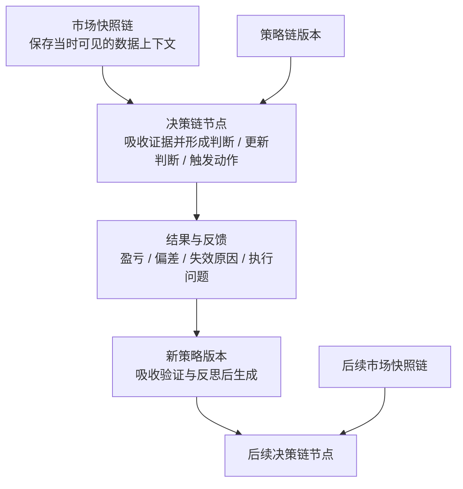
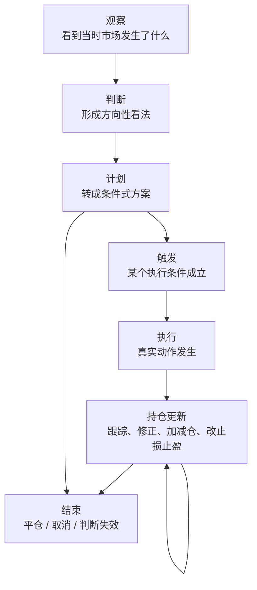

# BTC Trade Workspace

这是一个在 Codex 里直接使用的 BTC 交易工作仓库。

它现在不是产品，不是应用，也不是自动化系统。
它的第一步目标只有一个：

`先把我们想要的交易工作方式写清楚，再决定要不要继续长出更多结构。`

## Product Vision

我们希望在这个仓库里，逐步形成一套稳定的加密货币交易协作方式。

它当前最基础的形态，不是一个独立产品，而是一个围绕 Codex 运行、持续参与判断、更新和复盘的加密货币投资搭子。

第一阶段最核心的目标是：

- 在 Codex 里直接对话
- 稳定地产出有依据的投资判断
- 让建议可以被后续跟踪、更新和复盘

这个仓库当前最重要的不是“功能齐不齐”，而是先把下面几件事讲清楚：

1. 我们到底希望 Codex 怎样参与一笔交易决策
2. 最小可用的 skill 集合应该解决什么问题
3. 建议、跟踪、更新、复盘这些动作分别什么时候发生

## Core Product Shape

这个产品更像一个长期协作的投资搭子，而不是单次给结论的信号机。

它至少应该具备这些基础特征：

- 能日常对话，不需要用户每次重新描述上下文
- 能围绕市场、策略、风险给出一致风格的回答
- 能把“看市场 -> 出建议 -> 后续跟踪 -> 复盘”视为一条连续链路
- 能保留多个并行判断，而不是强行压成单一路径
- 能在后续复盘时回看每次建议是如何基于当时上下文产生和演变的

## Current Direction

当前采用极简模式：

- 先不为未来能力预建复杂结构
- 先不把未确定的 schema、模块、链路当成既定事实
- 先把 `README.md` 迭代到足够清楚
- 再基于 README 收敛最小 skill 设计
- 最后再决定是否需要 records、templates 或更细的模块化

## Evidence Grounding

当前 vision 里，还值得补上一条很基础但关键的约束：

`这个投资搭子不应该只输出结论，还应该尽量说明“哪些证据真正进入了这次判断”，以及“哪些相反证据当时存在，但没有改变主判断”。`

原因不是为了把系统做复杂，而是为了把下面三件事分清楚：

- 市场快照回答“当时世界长什么样”
- 决策链回答“当时最后怎么做”
- 证据约束回答“为什么是这些信息进入了判断，而不是别的信息”

如果缺这一层，后续复盘时就很容易把“当时看到的一切”直接等同于“当时真正依赖的依据”，最后很难区分：

- 是当时根本没看到关键线索
- 还是看到了，但权重给错了
- 还是看到了反向证据，却没有足够重视

所以从 vision 上看，一次正式的判断或计划，至少应该尽量保留三类内容：

- 支撑主判断的关键证据
- 与主判断冲突、但暂时没有推翻它的反向证据
- 为什么在那个时点，更愿意相信前者而不是后者

这件事当前先停留在产品原则层，不提前展开成独立 schema、目录或固定模块。

## Catalyst Orientation

当前 vision 里，还缺一条同样基础但很值得补上的要求：

`一次正式的判断或计划，不应该只回答“现在怎么看、现在怎么做”，还应该尽量回答“接下来要等什么催化剂，看到什么变化时必须重新判断”。`

这不是为了把产品做成提醒系统，而是为了让“建议 -> 跟踪 -> 更新”真正连起来。

如果缺这一层，后续跟踪就很容易退化成被动观察，最后很难区分：

- 是关键催化剂一直没有发生，所以原计划本来就还没到验证时点
- 还是关键催化剂已经反向发生，但我们没有及时更新判断
- 还是中间出现了新变量，却没人知道它算不算必须重看的信号

所以从 vision 上看，一次正式的判断或计划，至少应该尽量补上三类内容：

- 接下来最值得盯住的关键催化剂或观察点
- 什么新的价格、事件、链上或情绪变化会触发再判断
- 如果这些催化剂迟迟不来、提前落空，原计划应该如何降级、延后或取消

这样一来：

- 判断回答“现在更相信什么”
- 证据回答“为什么此刻这样判断”
- 催化剂约束回答“接下来靠什么推进、验证或推翻这个判断”

这件事当前也只停留在产品原则层，不提前展开成提醒机制、日历模块或固定 workflow 细节。

## Action Threshold

当前 vision 里，还值得补上一条同样基础、但对避免行动偏置很关键的约束：

`这个投资搭子不应该因为形成了方向判断，就默认要给出动作；它还应该尽量区分“有观点”和“值得出手”，并把观望 / 不做视为正式、有效的结论。`

这不是为了把产品做成交易纪律教练，而是为了避免整个协作过程被“只要分析了，就最好给个单子”的冲动带偏。

如果缺这一层，后续跟踪和复盘就很容易出现几种典型混淆：

- 当时其实只有方向判断，没有达到可执行 setup，却被硬压成动作建议
- 一次本来正确的耐心等待，事后会被误看成“错过机会”
- 一次失败交易，到底是判断错了，还是只是过早出手了，很难拆开

所以从 vision 上看，一次正式的判断或计划，至少应该尽量保留三类区分：

- 当前更偏向什么方向，但为什么此刻仍然选择观望或不做
- 哪些执行前提、价格位置或市场结构还没有成熟
- 什么变化会让这次“继续等”升级为正式计划，或者直接让原判断失效

这样一来：

- 判断回答“现在更相信什么”
- 催化剂回答“接下来该盯什么变化”
- 动作阈值回答“为什么现在还不该动，以及什么时候才值得动”

这件事当前也只停留在产品原则层，不提前展开成打分表、纪律模块或固定 checklist 模板。

## Portfolio Budget Awareness

当前 vision 里，还需要一条更上层、但当前只停留在原则层的约束：

`这个投资搭子不应该把每一笔正式计划都当成彼此独立、默认可以同时执行的机会，而应该尽量站在同一份资金 / 风险预算的视角，回答“这笔机会值不值得占用组合资源”。`

这不是为了把产品做成组合优化器，而是为了避免整个协作过程停留在“单笔都说得通”，却始终没人回答“合在一起是否仍然合理”。

这里要收紧的一点是：它不是单次判断内部必须展开的新模块，而是多个计划并行出现时，上层协作视角必须补看的一层。

如果缺这一层，后续跟踪和复盘就很容易出现几种典型混淆：

- 多个单笔判断各自都成立，但叠在一起后把资金、方向暴露或同类风险压得过重
- 一次结果变差，到底是这笔判断本身错了，还是只是当时给它分配了过多额度，很难拆开
- 新机会出现时，很难判断应该并行加开、替换旧计划，还是继续空着预算等待更好的 setup

所以从 vision 上看，它更像单笔判断之上的一层组合视角，最少只需要回答三件事：

- 这次计划是否值得占用当前有限的资金、仓位或风险预算
- 它和当前已有计划 / 持仓之间，是增加同向暴露、形成对冲，还是在争抢同一份额度
- 如果后面出现质量更高、赔率更好或相关性更低的机会，原计划在什么条件下应该缩小、让位、合并或取消

这件事当前也只停留在产品原则层，不提前展开成组合优化器、固定仓位公式或独立资金管理模块。

## Time-Horizon Anchoring

当前 vision 里，还值得补上一条同样基础、但非常容易被混淆的约束：

`一次正式的判断或计划，不应该脱离时间尺度存在，而应该尽量说明“这个判断主要属于哪个持有周期 / 观察周期”，以及“更高或更低时间尺度在这次判断里扮演什么角色”。`

这不是为了把产品做成多周期分析引擎，而是为了避免同一个市场对象上的不同判断被错误地揉成一团。

如果缺这一层，后续跟踪和复盘就很容易出现几种典型混淆：

- 同一个标的上的短期回调判断，与中期看多判断，看起来像互相冲突，其实只是活在不同时间尺度里
- 某个催化剂本来只影响短期节奏，却被误当成推翻中长期判断的证据
- 一次结果变差，到底是执行时点选错了，还是更高层的判断本身错了，很难拆开

所以从 vision 上看，一次正式的判断或计划，至少应该尽量保留三类内容：

- 这次判断主要对应哪个持有周期或观察周期
- 预计应该在多长的观察窗口里被验证、修正或失效
- 更高和更低时间尺度里的哪些信息只是背景，哪些真正参与了这次动作判断

这样一来：

- 证据回答“为什么此刻这样判断”
- 催化剂回答“接下来靠什么验证或推翻”
- 时间尺度锚定回答“这次判断到底活在哪个时钟里”

这件事当前也只停留在产品原则层，不提前展开成固定 timeframe 枚举、独立模块或分析面板。

## Process-Outcome Separation

当前 vision 里，还值得补上一条很容易被忽略、但对复盘质量非常关键的原则：

`一次结束、复盘或策略反思，不应该把“结果好坏”直接等同于“决策质量高低”，而应该尽量把判断质量、执行质量和最终结果拆开来看。`

这不是为了把产品做成心理分析系统，而是为了避免整个闭环最后退化成只看盈亏的结果主义。

如果缺这一层，后续复盘就很容易出现几种典型误判：

- 一次赚钱的交易其实是低质量决策，只是被行情奖励了
- 一次亏损的交易其实是高质量决策，只是被短期波动惩罚了
- 一次结果变差，到底来自判断错误、执行偏差，还是市场噪音，很难分开

所以从 vision 上看，一次结束或复盘，至少应该尽量保留三类区分：

- 这次判断在当时上下文下是否成立
- 这次执行是否遵守了原计划和风险边界
- 最终结果里哪些来自判断与执行，哪些更像市场随机性或时点运气

这样一来：

- 结果回答“最后发生了什么”
- 复盘回答“这次做得怎么样”
- 过程-结果分离回答“下次应该改判断、改执行，还是先不要被一次结果带偏”

这件事当前也只停留在产品原则层，不提前展开成评分卡、纪律模块或固定复盘模板。

## Capability Roadmap

当前只把能力分成两个层次，不在这里重复定义判断标准或记录内容。

第一层是必须先做稳的基础协作能力：

- 在 Codex 里直接对话并进入交易讨论
- 能协调最小 skill 集合完成一次判断
- 输出以建议为中心，而不是停留在信息搬运

第二层是再逐步补上的闭环能力：

- 把判断绑定到当时真实使用的市场上下文
- 跟踪一条判断如何演化为计划、更新或结束
- 让复盘与策略迭代回到历史判断链路本身

## Skill Direction

skill 设计还没有定稿。

当前只确定两条原则：

- skill 必须最小、单一职责、彼此独立
- 在 README 和 workflow 没定稳之前，不预先铺开 skill 结构

也就是说：

- 现在先不把 skill 文件写成既定制度
- 先把我们到底需要几个 skill、各自做什么讨论清楚
- 再落成最小实现

但从 vision 来看，skill 大致会服务于几类能力：

- 市场信息获取
- 数据清洗与整理
- 交易分析与建议生成
- 建议记录与后续跟踪
- 复盘与策略迭代

这里现在只是方向，不是固定目录或固定模块表。

## Multi-Chain Direction

后续如果要把交易建议、市场快照、交易执行和策略演化沉淀下来，重点不是先定义 schema，而是先收敛最小关系。

## Three-Chain Minimal Model

当前先只回答一件事，不回答“文件怎么放”或“字段怎么设计”：

`决策链、市场快照链、策略链最少应该如何互相连接，才足以支撑建议、复盘和迭代。`

### 1. 决策链引用市场快照

每一个重要决策节点，都应该能够指向它形成时所依据的市场快照。

最少需要满足：

- 一个决策节点可以关联一个或多个市场快照
- 这些快照必须代表“当时可见”的上下文，而不是事后回填的数据
- 后续复盘时，应该优先回看这个决策节点绑定的快照，而不是直接重跑最新市场数据

也就是说：

- 决策链回答“当时怎么想的”
- 市场快照链回答“当时看到了什么”

### 2. 决策链引用策略版本

每一个正式决策，最好都能说明自己主要受哪个策略版本影响。

最少需要满足：

- 一个决策节点可以明确挂靠某个策略版本
- 同一策略版本可以影响多个决策节点
- 如果某次判断并不是由正式策略驱动，也应该允许它先作为非策略化判断存在

也就是说：

- 决策链回答“这次具体怎么做”
- 策略链回答“这次判断背后的方法论来自哪里”

### 3. 策略链反向引用历史决策

新策略的诞生，不应该只是“写一个新版本”，而应该尽量说明它是在回应哪些历史问题。

最少需要满足：

- 一个新策略版本可以关联一个或多个历史决策节点
- 这些被关联的历史决策，通常是失败案例、低质量案例，或者暴露明显缺陷的案例
- 一个失败决策也可以同时影响多个后续策略分支

也就是说：

- 决策失败不只是结果记录
- 决策失败还是策略进化的输入

### 4. 决策链自身允许分叉和合并

决策链本身不能假设永远只有一条直线。

最少需要满足：

- 同一观察时点可以产生多个并行判断
- 后续某个判断可以继续分叉
- 多个判断在后续也可以收敛为一个执行方案
- 最终执行的动作，只是整条决策链中的某个节点结果，不等于整条链本身

这意味着我们记录的核心不是“最终答案”，而是“判断如何演化成最终动作”。

### 5. 策略链自身也允许分叉和继承

策略升级不一定是覆盖式替换，更可能像 git 一样继续演化。

最少需要满足：

- 新策略版本可以从旧策略版本派生
- 一个策略版本可以继续分叉成多个方向
- 某些策略分支后续可以合并成新的统一版本
- 策略链要能表达“继承了什么”和“修正了什么”

### 6. 三条链的最小闭环

如果只保留最关键的关系，那么最小闭环应该是：

这里的闭环只围绕三条主链展开。
证据筛选属于决策链内部动作，验证与反思属于策略更新前的处理过程，这一节先不把它们单列成新链。

1. 市场快照为某个决策节点提供当时上下文
2. 决策节点在某个策略版本影响下产生
3. 决策后续产生结果和反馈
4. 部分失败或偏差被策略链吸收，生成新策略版本
5. 新策略版本再影响后续新的决策节点

这就是一个最小可复盘、可迭代、可减少 hindsight bias 的闭环。

最小闭环示意图如下：

如果把这张图说成一句话，就是：

`策略影响决策，市场快照进入决策，决策产生结果，结果经过验证与反思后推动策略更新，更新后的策略再进入下一轮决策。`

### 7. 当前先不固定的东西

在这个阶段，我们先只固定关系，不固定下面这些实现细节：

- 一条链是否对应一个文件、一个目录，还是一个数据库表
- 快照是全文存储、摘要存储，还是引用外部原始数据
- 决策节点和交易执行节点是否拆开
- 策略版本是否需要独立 metadata
- 分叉和合并到底用什么字段表达

先把关系想清楚，比提前定 schema 更重要。

## Decision Chain Minimal Nodes

如果接下来要继续细化，那么最值得先收敛的不是 schema，而是决策链内部最少有哪些节点类型。

当前建议先收敛成 7 类最小节点：

1. `观察`
2. `判断`
3. `计划`
4. `触发`
5. `执行`
6. `持仓更新`
7. `结束`

它们的意义不是为了把流程写死，而是为了让后面无论是对话、记录、复盘还是策略迭代，都能在同一套语言下进行。

最小流转图如下：

这里有两个刻意保留的特点：

- `计划` 可以不经过 `执行` 直接进入 `结束`
- `持仓更新` 可以多次循环，直到这条链路结束

这两点能覆盖很多真实情况：

- 计划写了，但没有触发
- 计划触发后执行了，但后续多次调整
- 中途判断失效，整条链提前结束

### 1. 观察

观察节点用于承接一次新的市场上下文。

它最少应该回答：

- 这次我在看什么市场对象
- 当时出现了什么值得关注的现象
- 这次观察绑定了哪些市场快照

它的重点不是下结论，而是把“当时看到的东西”固定下来。

### 2. 判断

判断节点用于在观察基础上形成方向性看法。

它最少应该回答：

- 当前更偏多、偏空，还是观望
- 形成这个判断的主要依据是什么
- 哪些前提一旦失效，这个判断就不成立

它的重点不是下单，而是形成一个明确、可被后续修正的立场。

### 3. 计划

计划节点用于把判断转成条件式行动方案。

它最少应该回答：

- 什么条件满足时才行动
- 预计怎么开仓或不做
- 风险边界是什么
- 计划中的止损、止盈、仓位、加减仓条件是什么

它的重点是把模糊判断压缩成可执行结构。

### 4. 触发

触发节点用于说明为什么从计划进入动作。

它最少应该回答：

- 计划中的哪个条件已经成立
- 是什么事件让当前时刻变成执行时点
- 这次触发和原计划相比，有没有偏差

它的重点是防止“事后感觉差不多就做了”。

### 5. 执行

执行节点用于记录真实发生的动作。

它最少应该回答：

- 实际做了什么动作
- 动作是在什么价位、什么仓位条件下发生的
- 这次执行和计划是否一致

它的重点是把“想法”与“真实动作”分开。

### 6. 持仓更新

持仓更新节点用于记录执行之后的持续跟踪和修正。

它最少应该回答：

- 当前仓位状态发生了什么变化
- 是否加仓、减仓、移动止损、调整止盈
- 这次更新是因为市场变化、执行问题，还是原判断变化

它的重点是承认交易不是一次性动作，而是一个持续管理过程。

### 7. 结束

结束节点用于关闭这条决策链当前阶段。

它最少应该回答：

- 这条链是怎么结束的
- 是平仓、取消计划，还是判断失效
- 最终结果是什么
- 哪些信息值得进入复盘

它的重点不是只记录盈亏，而是给后续复盘留下明确出口。

### 两个横切动作

除了上面 7 类主节点，我们还需要记住两个横切动作：

- `复盘`
- `反思入策`

它们不一定要作为主流程节点存在，但必须能和这条决策链挂上关系。

`复盘` 负责回看整条决策链。

`反思入策` 负责把复盘结果送入策略链，推动后续策略版本更新。

## Deliberate Non-Expansion

到这里为止，当前阶段的 vision 已经够用了。

现在先停在三条主关系和 7 类最小决策节点，不继续往下展开。

这意味着当前先不在 README 里提前固定：

- 额外的新链路
- 决策节点的子类型
- 更细的验证机制
- 风险、纪律、执行质量、组合约束的独立结构

这些内容以后可能都值得出现，但那应该发生在我们真的发现最小闭环不够用之后。

在那之前，这个仓库只需要先回答三件事：

1. Codex 如何参与一笔交易判断
2. 一次判断如何走到建议、跟踪和结束
3. 复盘如何尽量基于当时上下文，而不是事后想象

## A Bigger End-State

如果把最终愿景说得更完整一点，这个系统未来不只是：

- 给建议
- 记建议
- 复盘建议

而是要逐步变成一个能处理下面完整循环的投资搭子：

1. 收集当时上下文
2. 组织证据
3. 形成判断
4. 生成计划
5. 触发并执行
6. 结束并复盘
7. 反思失败与成功
8. 生成、验证、更新策略
9. 用新策略进入下一轮决策

这条完整循环，才更接近这个产品最终想成为的样子。

## Skill Mapping

如果要把上面的链路真正落到 Codex 工作方式里，下一步就不是继续加抽象层，而是把主闭环映射成最小 skill 集合。

这里的目标不是一次性设计很多 skill，而是先回答：

`为了让这个投资搭子从聊天走到可复盘的建议，MVP 最少需要哪些 skill。`

## Skill Convergence

当前在 skill 层先只收敛三件事，不继续往下定：

- 哪几类动作必须先被 Codex 稳定完成
- 哪些能力可以先放在同一个最小 skill 里
- 什么时候真的出现痛点，才值得把它拆开

换句话说，下一步要回答的是：

- 最小闭环至少需要覆盖市场观察、判断与计划、链路记录、结束后复盘
- 这些能力是否应该由 2 个、3 个还是更多 skill 承担，当前先不写死
- skill 名称、边界、调用顺序，等 README 主闭环跑顺之后再定

现在故意不提前固定：

- skill 的数量
- 每个 skill 的正式命名
- 节点到 skill 的一一映射表
- 固定 build order

因为这些内容一旦现在写得太具体，就很容易把“当前 product vision”误读成“已经确定的实现结构”。

## MVP Definition

如果暂时不从 skill 数量出发，而是从产品闭环出发，那么最小可用状态应该是：

- 用户可以直接聊天问市场
- Codex 能基于证据给出结构化判断和条件式计划
- 这次判断能被记录成一条基本决策链
- 结束后能对这条链做一次基础复盘
- 复盘结果能生成一条候选策略更新意见

只要这 5 件事能稳定发生，这个产品就已经不是普通对话助手，而是一个真正开始成形的投资搭子。

### 决策链

决策链用于记录一笔判断是如何形成、如何变化、如何结束的。

- 同一时点可能出现多个不同建议，像分叉一样并行存在
- 后续建议可以在已有判断上继续 update
- 不同分支的建议可以合并，也可以独立演化
- 一笔交易从初始建议到最终平仓，整个过程都能追溯
- 中途的加仓、减仓、修改止损止盈，都应该留下演变关系

决策链落盘时，不应该只保存结论，还应该尽量保存这次判断当时依赖的市场快照。

这样做的目的不是为了囤数据，而是为了让未来复盘时尽量站回当时：

- 当时看到了什么
- 当时没看到什么
- 为什么在那个时间点会得出那个判断
- 后来证明哪里错了，哪里只是市场没按预期发展

### 市场快照链

市场快照不是附属品，而是决策链的重要上下文。

如果未来要分析过去的决策，就不能默认直接拿今天重新拉的数据去解释昨天的判断。

所以我们很可能需要按日期和决策时点保存快照，用来尽量隔离未来数据干扰。

### 策略链

策略链不是凭空写出来的，而应该尽量从历史决策链中生长出来。

它至少应该能表达这些关系：

- 某个策略版本影响了哪些决策
- 哪些失败决策暴露了策略的缺陷
- 后续的新策略是针对哪些失败或偏差做出的修正
- 一个策略版本后来如何继续分叉、合并或更新

也就是说，策略链和决策链不是平行无关的两套记录，而是相互引用、相互解释的。

如果这个方向成立，那么它最终应该支持回看以下链路：

1. 某次市场观察如何生成初始建议
2. 当时的市场快照是什么
3. 初始建议后续如何被修正、分叉或合并
4. 哪个版本的建议最终触发了下单
5. 持单过程中有哪些调整
6. 最终如何平仓，以及盈亏结果如何
7. 这次结果后续如何反馈到策略反思和策略升级里

这个多链方向也会反过来服务策略迭代：

- 我们可以分析某个策略版本产生了哪些建议
- 可以分析某个失败决策到底是执行问题、判断问题，还是策略问题
- 可以分析策略修改后建议质量有没有变化
- 可以把某个新策略明确关联到若干历史失败决策
- 可以更方便地做复盘，而不是只看最终盈亏

但在当前阶段，这仍然只是 vision，暂时不把它提前写死成具体文件结构、字段模型或长期制度。

## Daily Workflow

我们希望 Codex 以后按这个顺序协作：

1. 用户提出市场或交易问题
2. 先验证最新市场数据和上下文
3. 给出 market brief
4. 再给交易判断和条件式计划
5. 明确风险边界、失效条件和后续观察点
6. 只有用户明确说“记录 / 落盘 / 保存 / 复盘”时，才考虑是否需要写仓库

## What We Are Not Doing Yet

这些事情现在都还没有决定，不应该先做重：

- 复杂 architecture
- 过早固定 module map
- 过早固定 records schema
- 过早固定多链记录的数据结构
- 过早固定策略版本管理模型
- 为未来可能用到的能力预建目录
- 在 workflow 未定前先铺开 skills

## Editing Principle

接下来的迭代顺序以这个 README 为准：

1. 先反复把 vision 说清楚
2. 再把 AGENTS 收紧成最小 memory
3. 再决定最小 skill 集合以及各自职责
4. 再决定决策链、市场快照链、策略链之间的关系
5. 最后才决定记录模型和更细结构

## Current Status

可以把当前仓库理解为：

- vision 正在收敛
- workflow 正在收敛
- skill boundary 正在收敛
- records 方向已经出现，但还不应过早定型
- architecture 暂时都不应继续膨胀
