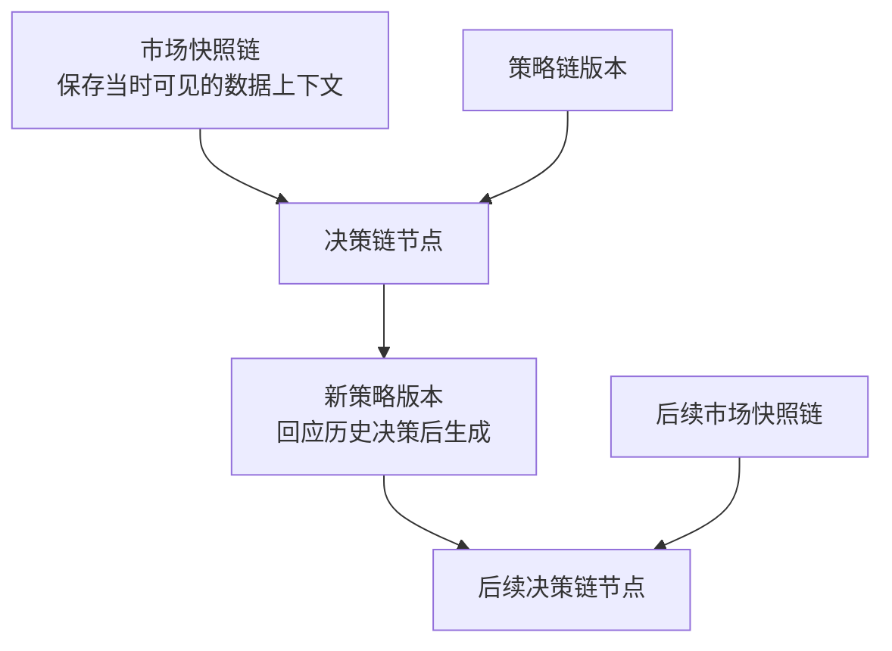
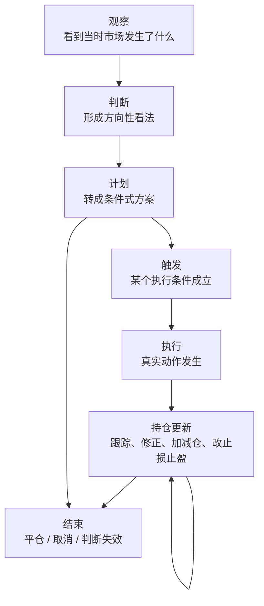

# BTC Trade Workspace

这是一个在 Codex 里直接使用的 BTC 交易工作仓库。

它现在不是产品，不是应用，也不是自动化系统。
它的第一步目标只有一个：

`先把我们想要的交易工作方式写清楚，再决定要不要继续长出更多结构。`

## Product Vision

我们希望在这个仓库里，逐步形成一套稳定的加密货币交易协作方式。

它当前最基础的形态，是一个围绕 Codex 运行、持续参与判断、更新和复盘的加密货币投资搭子。

第一阶段最核心的目标是：

- 在 Codex 里直接对话
- 稳定地产出有依据的投资判断
- 让建议可以被后续跟踪、更新和复盘

## Core Product Shape

这个产品更像一个长期协作的投资搭子，而不是单次给结论的信号机。

它至少应该具备这些基础特征：

- 能日常对话，不需要用户每次重新描述上下文
- 能围绕市场、策略、风险给出一致风格的回答
- 能把“看市场 -> 出建议 -> 后续跟踪 -> 复盘”视为一条连续链路
- 能保留多个并行判断，而不是强行压成单一路径
- 能在后续复盘时回看每次建议是如何基于当时上下文产生和演变的

## Current Direction

当前采用极简模式：

- 先不为未来能力预建复杂结构
- 先不把未确定的 schema、模块、链路当成既定事实
- 先把 `README.md` 迭代到足够清楚
- 再基于 README 收敛最小 skill 设计
- 最后再决定是否需要 records、templates 或更细的模块化

当前 README 先只集中收敛三件事：

1. 我们到底希望 Codex 怎样参与一笔交易决策
2. 最小可用的 skill 集合应该解决什么问题
3. 建议、跟踪、更新、复盘这些动作分别什么时候发生

下面这些补充约束，都属于正式判断应具备的原则边界。
当前先统一停留在 vision 层，不提前展开成独立 schema、模块或 workflow。

## Formal Judgment Boundaries

下面这些约束都属于正式判断的边界，不是新的链路、schema 或 workflow。
这里先只回答：一次正式判断还需要额外分清哪些维度，才不至于在跟踪和复盘时把不同问题混在一起。

### Evidence Grounding

正式判断不只要给结论，还要尽量区分：哪些证据真正进入了判断，哪些反向证据当时存在但没有改变主判断，以及为什么在那个时点更愿意相信前者。
否则复盘时，很容易把“当时看到的一切”误当成“当时真正依赖的依据”。

### Catalyst Orientation

正式判断不只回答现在怎么看，还要尽量说明接下来在等什么催化剂、什么变化会触发重看，以及如果这些变化迟迟不来或提前落空，原判断应如何降级、延后或取消。
否则“建议 -> 跟踪 -> 更新”很容易退化成被动观察。

### Action Threshold

形成方向判断，不等于默认要给出动作。
正式判断应尽量区分“有观点”和“值得出手”，并把观望 / 不做视为正式、有效的结论，同时说明还缺哪些执行前提，以及什么变化会把继续等待升级为正式计划，或者直接让原判断失效。

### Portfolio Budget Awareness

这不是单次判断内部的新模块，而是多个计划并行出现时必须补看的一层上层视角。
正式计划应尽量回答：它是否值得占用当前有限的资金、仓位或风险预算；它和已有计划 / 持仓之间是什么关系；以及当更高质量机会出现时，它在什么条件下应该缩小、让位、合并或取消。

### Time-Horizon Anchoring

正式判断不应该脱离时间尺度存在，而应尽量说明它主要属于哪个持有周期 / 观察周期、预计在多长窗口里被验证或失效，以及更高和更低时间尺度里的哪些信息只是背景、哪些真正参与了这次判断。
否则不同时间尺度上的看法很容易被错误地揉成一团。

### Process-Outcome Separation

一次结束、复盘或策略反思，不应把结果好坏直接等同于决策质量高低，而应尽量把判断质量、执行质量和最终结果拆开来看。
至少要分开回答：这次判断在当时上下文下是否成立，这次执行是否遵守了原计划和风险边界，以及最终结果里哪些来自判断与执行、哪些更像市场随机性或时点运气。

## Capability Roadmap

当前 roadmap 只保留一个递进关系，不在这里重复定义判断标准或记录内容：

- 先做稳基础协作：在 Codex 里直接进入交易讨论，协调最小 skill，稳定产出可跟踪的建议
- 再补闭环能力：把建议绑定回当时上下文，并让更新、结束、复盘与策略迭代回到同一条历史判断链

## Skill Direction

skill 设计还没有定稿。

当前只确定两条原则：

- skill 必须最小、单一职责、彼此独立
- 在 README 主闭环没定稳之前，不预先写死 skill 的数量、命名、边界和调用顺序

从 vision 来看，skill 只需要先覆盖几类能力方向：

- 市场信息获取
- 数据清洗与整理
- 交易分析与建议生成
- 建议记录与后续跟踪
- 复盘与策略迭代

这里现在只保留方向，不展开映射表，也不提前落成固定结构。

## Three-Chain Minimal Model

后续如果要把交易建议、市场快照、交易执行和策略演化沉淀下来，这一节先只固定三条主链之间的最小关系，用来支撑建议、复盘和迭代；不展开决策链内部节点，也不讨论实现形式。

这里当前只回答一件事：

`决策链、市场快照链、策略链最少应该如何连接，才足以支撑建议、复盘和迭代。`

### 1. 市场快照进入决策链

每一个重要决策节点，都应该能够指向它形成时所依据的市场快照。

最少需要满足：

- 一个决策节点可以关联一个或多个市场快照
- 这些快照必须代表“当时可见”的上下文，而不是事后回填的数据
- 后续复盘时，应该优先回看这个决策节点绑定的快照，而不是直接重跑最新市场数据

这层关系只回答两件事：

- 市场快照链回答“当时看到了什么”
- 决策链回答“这些上下文后来如何进入判断”

### 2. 策略链影响决策链

每一个正式决策，最好都能说明自己主要受哪个策略版本影响。

最少需要满足：

- 一个决策节点可以明确挂靠某个策略版本
- 同一策略版本可以影响多个决策节点
- 如果某次判断并不是由正式策略驱动，也应该允许它先作为非策略化判断存在

这层关系只回答两件事：

- 策略链回答“这次判断主要受哪套方法影响”
- 决策链回答“这套方法后来落成了什么判断或计划”

### 3. 历史决策进入策略更新

新策略的诞生，不应该只是“写一个新版本”，而应该尽量说明它是在回应哪些历史问题。

最少需要满足：

- 一个新策略版本可以关联一个或多个历史决策节点
- 这些被关联的历史决策，通常是失败案例、低质量案例，或者暴露明显缺陷的案例
- 一个失败决策也可以同时影响多个后续策略分支

这层关系要表达的是：历史决策不只是结果记录，也可以成为策略进化的输入。

### 4. 决策链允许分叉和收敛

决策链本身不能假设永远只有一条直线。

最少需要满足：

- 同一观察时点可以产生多个并行判断
- 后续某个判断可以继续分叉
- 多个判断在后续也可以收敛为一个执行方案
- 最终执行的动作，只是整条决策链中的某个节点结果，不等于整条链本身

这层关系强调的不是“最后给了什么答案”，而是“判断如何演化成最终动作”。

### 5. 策略链允许继承、分叉和合并

策略升级不一定是覆盖式替换，更可能像 git 一样继续演化。

最少需要满足：

- 新策略版本可以从旧策略版本派生
- 一个策略版本可以继续分叉成多个方向
- 某些策略分支后续可以合并成新的统一版本
- 策略链要能表达“继承了什么”和“修正了什么”

### 6. 三条链的最小闭环

如果只保留最关键的关系，那么这里的闭环只表达三条主链如何互相连接。

证据筛选、执行结果、验证与反思都仍属于链内过程；这一节不把它们单列成新的主链关系。

1. 市场快照链为某个决策节点提供当时上下文
2. 决策节点可以明确挂靠某个策略版本
3. 历史决策节点可以反向进入策略更新，生成新策略版本
4. 新策略版本再影响后续新的决策节点

这就是一个最小可复盘、可迭代、可减少 hindsight bias 的闭环。

最小闭环示意图如下：

如果把这张图说成一句话，就是：

`市场快照进入决策，策略影响决策，历史决策再回流策略更新，更新后的策略继续影响后续决策。`

到这里为止，这一节只回答三条主链如何连接，不回答文件、schema、字段或存储形式如何落地。

## Decision Chain Minimal Nodes

如果接下来要继续细化，那么最值得先收敛的不是 schema，而是决策链内部最少有哪些节点类型。

当前先只固定 7 类最小节点，作为后续对话、记录、跟踪、复盘和策略迭代共享的一套最小语言：

1. `观察`
2. `判断`
3. `计划`
4. `触发`
5. `执行`
6. `持仓更新`
7. `结束`

这些节点只回答“判断演化到了哪一类状态”，不单独规定实现形式，也不把实际流程预设成永远线性。

最小流转图如下：

这张图只表达常见演化方向：`观察 -> 判断 -> 计划 -> 触发 -> 执行 -> 持仓更新 -> 结束`。

其中 `计划` 可以直接进入 `结束`，`持仓更新` 可以反复出现；因此这里定义的是最小节点语言，而不是一张必须按顺序执行的固定流程图。

### 1. 观察

观察节点用于承接一次新的市场上下文。

它最少应该回答：

- 这次我在看什么市场对象
- 当时出现了什么值得关注的现象
- 这次观察绑定了哪些市场快照

它的重点不是下结论，而是把“当时看到的东西”固定下来。

### 2. 判断

判断节点用于在观察基础上形成方向性看法。

它最少应该回答：

- 当前更偏多、偏空，还是观望
- 形成这个判断的主要依据是什么
- 哪些前提一旦失效，这个判断就不成立

它的重点不是下单，而是形成一个明确、可被后续修正的立场。

### 3. 计划

计划节点用于把判断转成条件式行动方案。

它最少应该回答：

- 什么条件满足时才行动
- 预计怎么开仓或不做
- 风险边界是什么
- 计划中的止损、止盈、仓位、加减仓条件是什么

它的重点是把模糊判断压缩成可执行结构。

### 4. 触发

触发节点用于说明为什么从计划进入动作。

它最少应该回答：

- 计划中的哪个条件已经成立
- 是什么事件让当前时刻变成执行时点
- 这次触发和原计划相比，有没有偏差

它的重点是防止“事后感觉差不多就做了”。

### 5. 执行

执行节点用于记录真实发生的动作。

它最少应该回答：

- 实际做了什么动作
- 动作是在什么价位、什么仓位条件下发生的
- 这次执行和计划是否一致

它的重点是把“想法”与“真实动作”分开。

### 6. 持仓更新

持仓更新节点用于记录执行之后的持续跟踪和修正。

它最少应该回答：

- 当前仓位状态发生了什么变化
- 是否加仓、减仓、移动止损、调整止盈
- 这次更新是因为市场变化、执行问题，还是原判断变化

它的重点是承认交易不是一次性动作，而是一个持续管理过程。

### 7. 结束

结束节点用于关闭这条决策链当前阶段。

它最少应该回答：

- 这条链是怎么结束的
- 是平仓、取消计划，还是判断失效
- 最终结果是什么
- 哪些信息值得进入复盘

它的重点不是只记录盈亏，而是给后续复盘留下明确出口。

### 两个横切动作

除了上面 7 类主节点，我们还需要记住两个横切动作：

- `复盘`
- `反思入策`

它们不一定要作为主流程节点存在，但必须能和这条决策链挂上关系。

`复盘` 负责回看整条决策链。

`反思入策` 负责把复盘结果送入策略链，推动后续策略版本更新。

## Deliberate Non-Expansion

到这里为止，当前阶段的 vision 已经够用了。

现在先停在三条主关系和 7 类最小决策节点，不继续往下展开。

这意味着当前先不在 README 里提前固定：

- 额外的新链路
- 决策节点的子类型
- 更细的验证机制
- 风险、纪律、执行质量、组合约束的独立结构

这些内容以后可能都值得出现，但那应该发生在我们真的发现最小闭环不够用之后。

在那之前，这个仓库只需要先回答三件事：

1. Codex 如何参与一笔交易判断
2. 一次判断如何走到建议、跟踪和结束
3. 复盘如何尽量基于当时上下文，而不是事后想象

## MVP Definition

如果暂时不从 skill 数量出发，而是从产品闭环出发，那么最小可用状态应该是：

- 用户可以直接聊天问市场
- Codex 能基于证据给出结构化判断和条件式计划
- 这次判断能被记录成一条基本决策链
- 结束后能对这条链做一次基础复盘
- 复盘结果能生成一条候选策略更新意见

只要这 5 件事能稳定发生，这个产品就已经不是普通对话助手，而是一个真正开始成形的投资搭子。

这里不再重复展开决策链、市场快照链、策略链的定义。
MVP 只要求前面已经收敛出的最小关系和最小节点能真正跑通，而不是在这里继续补充另一套解释。

## Default Interaction Rhythm

这一节只定义默认协作节奏，不把它写成固定 workflow。

- 用户先提出市场或交易问题
- Codex 先确认当时市场上下文，再给结构化判断、条件式计划、风险边界和后续观察点
- 是否写入仓库，仍只在用户明确要求记录、保存或复盘时才发生

## What We Are Not Doing Yet

这些事情现在都还没有决定，不应该先做重：

- 复杂 architecture
- 过早固定 module map
- 过早固定 records schema
- 过早固定多链记录的数据结构
- 过早固定策略版本管理模型
- 为未来可能用到的能力预建目录
- 在 workflow 未定前先铺开 skills

## Editing Principle

接下来的 README 迭代先只做一件事：继续把 product vision 说清楚。

在最小闭环已经自洽之前，不提前把 skill、records、策略版本或 architecture 写成固定结构。

## Current Status

可以把当前仓库理解为：

- vision 正在收敛
- workflow 正在收敛
- skill boundary 正在收敛
- records 方向已经出现，但还不应过早定型
- architecture 暂时都不应继续膨胀
