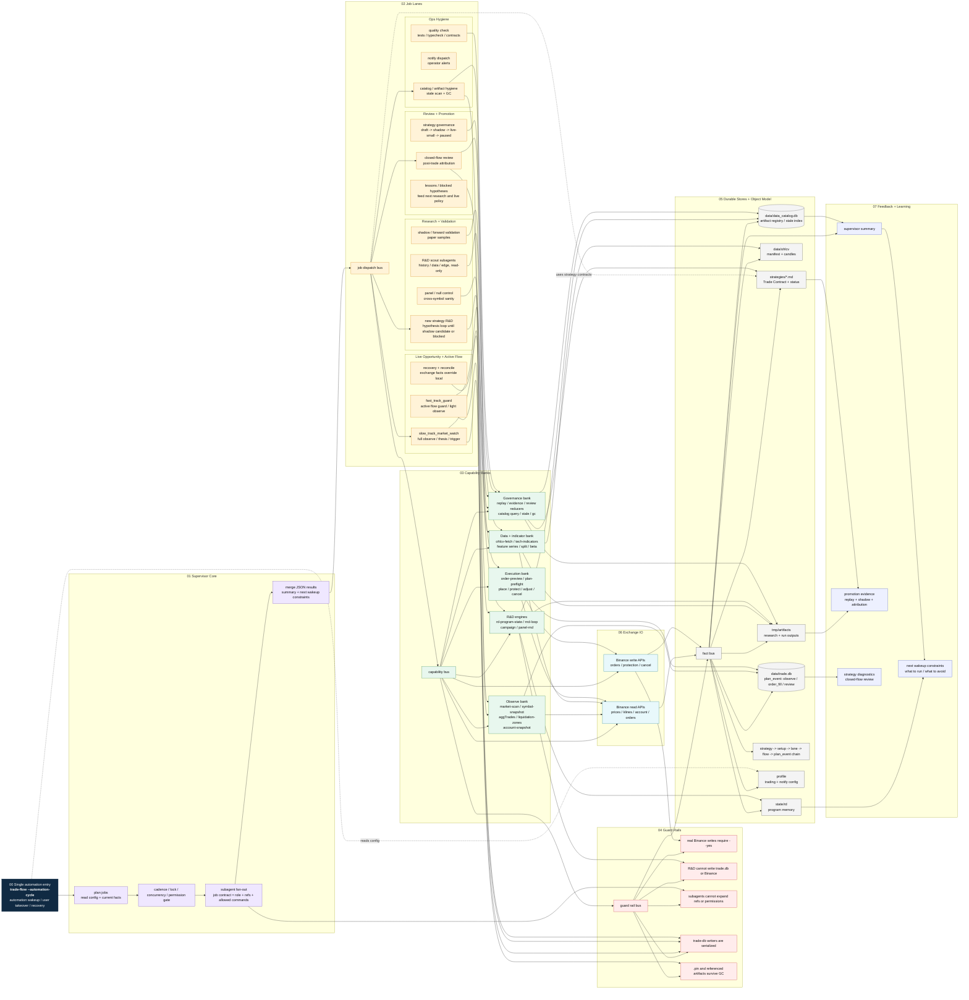

# Crypto Trade Workspace

agent-native 加密交易工作仓库。目标是让 agent 在可审计事实、权限边界、执行契约、交易所回读和研究记忆之上，推进 Binance USDM 4H+ swing 的观察、研发、验证、执行、恢复和复盘。

先看图，再看表。README 只保留一张全局结构图；细节契约看 `docs/`。

## 1. 全局架构


```mermaid
flowchart LR
  ENTRY["00 Single automation entry<br/><b>trade-flow --automation-cycle</b><br/>automation wakeup / user takeover / recovery"]

  subgraph C1["01 Supervisor Core"]
    direction TB
    PLAN["plan jobs<br/>read config + current facts"]
    GATE["cadence / lock / concurrency / permission gate"]
    FANOUT["subagent fan-out<br/>job contract = role + refs + allowed commands"]
    MERGE["merge JSON results<br/>summary + next wakeup constraints"]
    PLAN --> GATE --> FANOUT --> MERGE
  end

  subgraph C2["02 Job Lanes"]
    direction TB
    JOB_BUS["job dispatch bus"]

    subgraph LIVE["Live Opportunity + Active Flow"]
      direction TB
      SLOW["slow_track_market_watch<br/>full observe / thesis / trigger"]
      FAST["fast_track_guard<br/>active flow guard / light observe"]
      RECON["recovery + reconcile<br/>exchange facts override local"]
    end
    subgraph RND["Research + Validation"]
      direction TB
      RD["new strategy R&D<br/>hypothesis loop until shadow candidate or blocked"]
      SCOUT["R&D scout subagents<br/>history / data / edge, read-only"]
      SHADOW["shadow / forward validation<br/>paper samples"]
      PANEL["panel / null control<br/>cross-symbol sanity"]
    end
    subgraph REVIEW_LANE["Review + Promotion"]
      direction TB
      REVIEW["closed-flow review<br/>post-trade attribution"]
      PROMOTE["strategy governance<br/>draft -> shadow -> live-small -> paused"]
      LESSONS["lessons / blocked hypotheses<br/>feed next research and live policy"]
    end
    subgraph OPS["Ops Hygiene"]
      direction TB
      CATALOG["catalog / artifact hygiene<br/>stale scan + GC"]
      NOTIFY["notify dispatch<br/>operator alerts"]
      QUALITY["quality check<br/>tests / typecheck / contracts"]
    end

    JOB_BUS --> SLOW
    JOB_BUS --> RD
    JOB_BUS --> REVIEW
    JOB_BUS --> CATALOG
  end

  subgraph C3["03 Capability Banks"]
    direction TB
    CAP_BUS["capability bus"]
    OBSERVE["Observe bank<br/>market-scan / symbol-snapshot<br/>aggTrades / liquidation-zones<br/>account-snapshot"]
    DATA["Data + indicator bank<br/>ohlcv-fetch / tech-indicators<br/>feature series / split / beta"]
    RDENG["R&D engines<br/>rd-program-state / rnd-loop<br/>campaign / panel-rnd"]
    EXECUTE["Execution bank<br/>order-preview / plan-preflight<br/>place / protect / adjust / cancel"]
    GOVERN["Governance bank<br/>replay / evidence / review reducers<br/>catalog query / stale / gc"]
    CAP_BUS --> OBSERVE
    CAP_BUS --> DATA
    CAP_BUS --> RDENG
    CAP_BUS --> EXECUTE
    CAP_BUS --> GOVERN
  end

  subgraph C4["04 Guard Rails"]
    direction TB
    GUARD_BUS["guard rail bus"]
    WRITE_GATE["real Binance writes require --yes"]
    RD_WALL["R&D cannot write trade.db or Binance"]
    SUB_WALL["subagents cannot expand refs or permissions"]
    SERIAL["trade-db writers are serialized"]
    PIN[".pin and referenced artifacts survive GC"]
    GUARD_BUS --> WRITE_GATE
    GUARD_BUS --> RD_WALL
    GUARD_BUS --> SUB_WALL
    GUARD_BUS --> SERIAL
    GUARD_BUS --> PIN
  end

  subgraph C5["05 Durable Stores + Object Model"]
    direction TB
    STORE_BUS["fact bus"]
    TRADEDB[("data/trade.db<br/>plan_event: observe / order_fill / review")]
    CATDB[("data/data_catalog.db<br/>artifact registry / stale index")]
    OHLCV["data/ohlcv<br/>manifest + candles"]
    ART["tmp/artifacts<br/>research + run outputs"]
    RDSTATE["state/rd<br/>program memory"]
    STRAT["strategies/*.md<br/>Trade Contract + status"]
    OBJECTS["strategy -> setup -> lane -> flow -> plan_event chain"]
    PROFILE["profile<br/>trading + notify config"]
    STORE_BUS --> TRADEDB
    STORE_BUS --> CATDB
    STORE_BUS --> OHLCV
    STORE_BUS --> ART
    STORE_BUS --> RDSTATE
    STORE_BUS --> STRAT
    STORE_BUS --> OBJECTS
    STORE_BUS --> PROFILE
  end

  subgraph C6["06 Exchange IO"]
    direction TB
    READ["Binance read APIs<br/>prices / klines / account / orders"]
    WRITE["Binance write APIs<br/>orders / protection / cancel"]
  end

  subgraph C7["07 Feedback + Learning"]
    direction TB
    SUMMARY["supervisor summary"]
    EVIDENCE["promotion evidence<br/>replay + shadow + attribution"]
    DIAG["strategy diagnostics<br/>closed-flow review"]
    NEXT["next wakeup constraints<br/>what to run / what to avoid"]
  end

  ENTRY --> PLAN
  MERGE --> JOB_BUS
  JOB_BUS --> CAP_BUS
  CAP_BUS --> GUARD_BUS
  GUARD_BUS --> STORE_BUS
  CAP_BUS --> READ
  CAP_BUS --> WRITE
  READ --> STORE_BUS
  WRITE --> STORE_BUS
  STORE_BUS --> SUMMARY

  ENTRY -. "reads config" .-> PROFILE
  JOB_BUS -. "uses strategy contracts" .-> STRAT

  SLOW --> OBSERVE
  FAST --> EXECUTE
  RECON --> OBSERVE
  RD --> RDENG
  SCOUT --> DATA
  SHADOW --> DATA
  PANEL --> RDENG
  REVIEW --> GOVERN
  PROMOTE --> GOVERN
  CATALOG --> GOVERN
  QUALITY --> GOVERN

  OBSERVE --> READ
  DATA --> READ
  EXECUTE --> READ
  EXECUTE --> WRITE

  OBSERVE --> TRADEDB
  EXECUTE --> TRADEDB
  DATA --> OHLCV
  DATA --> ART
  RDENG --> RDSTATE
  RDENG --> CATDB
  RDENG --> ART
  GOVERN --> STRAT
  GOVERN --> CATDB
  GOVERN --> ART

  WRITE --> WRITE_GATE
  RDENG --> RD_WALL
  FANOUT --> SUB_WALL
  SLOW --> SERIAL
  FAST --> SERIAL
  REVIEW --> SERIAL
  CATALOG --> PIN

  TRADEDB --> DIAG
  CATDB --> SUMMARY
  ART --> EVIDENCE
  RDSTATE --> NEXT
  STRAT --> EVIDENCE
  SUMMARY --> NEXT

  classDef entry fill:#102a43,stroke:#102a43,color:#fff;
  classDef core fill:#efe7ff,stroke:#7a55c7,color:#111;
  classDef lane fill:#fff3d8,stroke:#d9902f,color:#111;
  classDef cap fill:#e8f7ee,stroke:#45925b,color:#111;
  classDef guard fill:#ffecec,stroke:#cc4b4b,color:#111;
  classDef store fill:#f4f4f4,stroke:#686868,color:#111;
  classDef io fill:#e8f8fb,stroke:#358b9a,color:#111;
  classDef fb fill:#edf0ff,stroke:#5968c9,color:#111;
  class ENTRY entry;
  class PLAN,GATE,FANOUT,MERGE core;
  class JOB_BUS,SLOW,FAST,RECON,RD,SCOUT,SHADOW,PANEL,REVIEW,PROMOTE,LESSONS,CATALOG,NOTIFY,QUALITY lane;
  class CAP_BUS,OBSERVE,DATA,RDENG,EXECUTE,GOVERN cap;
  class GUARD_BUS,WRITE_GATE,RD_WALL,SUB_WALL,SERIAL,PIN guard;
  class STORE_BUS,TRADEDB,CATDB,OHLCV,ART,RDSTATE,STRAT,OBJECTS,PROFILE store;
  class READ,WRITE io;
  class SUMMARY,EVIDENCE,DIAG,NEXT fb;
```

一句话：外部只有一个长期入口；入口只生成任务图和权限边界；具体工作交给隔离 subagent；长期事实必须落到 DB、artifact、catalog、strategy 文件或 R&D state。

## 2. 两条主链

在线链只处理真实机会和交易事实；研究链只处理 edge 发现、验证和准入。研究链不能直接写 `trade.db`，也不能触发 Binance 写接口。

## 3. 单入口怎么分发

固定执行顺序：

```text
1. serial_trade_db_guard
   -> fast guard 先恢复 / 防御 active flow

2. parallel_isolated_work
   -> slow / R&D / tracker / catalog 可并行
   -> 只有 slow 可能进入 trade-db 写区

3. serial_review_closeout
   -> 若有新闭合 flow，再串行 review
```

## 4. 数据怎么存

事实优先级：

```text
Binance exchange facts
  > trade.db event stream
  > strategy evidence / catalog / artifact
  > rd_program_state / automation memory
  > natural-language summary
```

## 5. 核心对象关系

同一 lane 同时最多一个 active flow。新理由、新结构、新加一段都并回当前 active flow，不并行开多个风险拥有者。

## 6. 慢轨和快轨怎么交互

| 维度 | 慢轨 | 快轨 |
| --- | --- | --- |
| 角色 | 战略层：thesis、方向、风险、action intent | orchestrator only：执行守护、防御补救、轻量对账 |
| observe | full observe | light observe，继承慢轨 thesis / risk / intent |
| 动作 | 全集，经 preflight | 白名单：撤单、同步保护、no_action、慢轨 trigger 授权动作 |
| 判断 | 可做 setup / thesis 判断 | 不做质性市场判断 |

## 7. 在线交易 Flow

真钱执行写口：

| 动作 | Skill |
| --- | --- |
| 主单开仓 / 加仓 | `binance-order-place` |
| 止损 / 止盈 / trailing | `binance-position-protect` |
| 减仓 / 全平 | `binance-position-adjust` |
| 撤单 | `binance-order-cancel` |

任何新增风险动作都必须有 fresh facts、stop / invalidation / risk budget、preflight、execution contract 和 reconcile。

## 8. Recovery / Reconcile Flow

交易所事实覆盖本地乐观状态。无法可靠归属的订单 / 仓位差异必须停，不继续执行。

## 9. R&D 学习飞轮

高阶入口：

```bash
bun .agents/skills/trade-flow/scripts/main.ts --rd-supervisor-run --state ./state/rd/program.json --json '{"max_iterations":10}'
```

低阶入口：

| 命令 | 作用 |
| --- | --- |
| `--rd-program-state` | init / read / update / plan_next durable learning memory |
| `--strategy-rnd-loop` | 一轮 batch + artifact + catalog ledger |
| `--strategy-rnd-campaign` | 多 hypothesis discovery + non-overlapping validation |
| `--strategy-data-split` | 切 discovery / validation / locked_holdout |
| `--strategy-panel-rnd` | 跨资产广度和 null control |

`rd_program_state` 是 research memory，不是 strategy evidence。

## 10. Strategy 升格状态机

升格规则：

- `draft` 只能研究。
- `shadow` 可记录影子动作，不提交 Binance。
- `live-small` 才能小资金实盘。
- `paused` 只允许观察和减风险。
- `strategy-promote` 默认 dry-run；改 status 必须显式 `--yes`。

## 11. Catalog / Artifact Hygiene

`.pin`、被引用资产、durable store 必须保留。普通 artifact GC 是文件扫描式；catalog GC 是 catalog-aware。

## 12. 模块速查

| 层 | 路径 / skill | 作用 |
| --- | --- | --- |
| 产品契约 | `docs/` | vision、PRD、架构、技术契约、检查契约 |
| 主流程 | `.agents/skills/trade-flow/` | event stream、automation、R&D、replay、review、promotion、reconcile |
| 市场观察 | `binance-market-scan` / `binance-symbol-snapshot` / `binance-aggtrades-fetch` / `binance-liquidation-zones` | 候选、单标的事实、成交材料、清算区 |
| 账户恢复 | `binance-account-snapshot` | 余额、持仓、挂单、保护单、订单历史 |
| 数据与指标 | `ohlcv-fetch` / `tech-indicators` | OHLCV、manifest、feature series、BTC beta |
| 执行 | `binance-order-preview` / `plan-preflight` / order skills | preview、hard guards、下单、保护、减仓、撤单 |
| 策略资产 | `strategies/` | strategy policy + `## Trade Contract` |
| 运行数据 | `data/` / `tmp/` | DB、catalog、OHLCV、artifact、cache |
| 配置 | `profile/` | trading config、通知配置；凭证来自环境变量 |

## 13. Master / Subagent 信息交换

禁止：

- 不通过口头总结传递长期事实。
- 不让 subagent 自行扩大权限。
- 不让 R&D subagent 写 `trade.db` 或触发 Binance。
- 不让交易 subagent 把 research artifact 当成 execution fact。

## 14. 常用入口

```bash
# 仓库级检查
scripts/quality-check.sh

# trade-flow help
bun .agents/skills/trade-flow/scripts/main.ts --help

# 初始化在线事件库
bun .agents/skills/trade-flow/scripts/main.ts --db ./data/trade.db --init

# 生成单入口 supervisor plan
bun .agents/skills/trade-flow/scripts/main.ts --db ./data/trade.db --automation-cycle --json '{"slow_interval_minutes":240,"rd_program_state_path":"./state/rd/program.json"}'

# 初始化并运行 R&D supervisor
bun .agents/skills/trade-flow/scripts/main.ts --rd-program-state --state ./state/rd/program.json --json '{"action":"init","objective":"find a shadow-eligible 4H swing strategy"}'
bun .agents/skills/trade-flow/scripts/main.ts --rd-supervisor-run --state ./state/rd/program.json --json '{"max_iterations":10}'
```

## 15. 安全边界

- 真实 Binance 写操作必须显式带 `--yes`。
- 写操作前必须完成 preview / preflight / execution contract。
- dry-run、preview、replay、calibration、R&D 默认不触发真实下单。
- 凭证不写入仓库；API key、通知 token、chat id 等只从环境变量读取。
- Automation memory 路径统一用 `scripts/automation-memory-path.sh <automation-id>` 解析。
- Python 命令统一用 `scripts/resolve-python.sh` 解析，不假设 `python` 存在。
- 交易所事实和 reconcile 失败可以覆盖本地状态。

## 16. 文档导航

- [docs/vision.md](docs/vision.md)：为什么做
- [docs/prd.md](docs/prd.md)：做什么、边界和产品口径
- [docs/design-architecture.md](docs/design-architecture.md)：单入口、双轨、subagent、数据模型和调度设计
- [docs/tech-spec.md](docs/tech-spec.md)：实现口径和 schema
- [docs/trading-config.md](docs/trading-config.md)：统一交易配置与 runtime policy
- [docs/check-contract.md](docs/check-contract.md)：改动后的最小检查
- [docs/code-quality.md](docs/code-quality.md)：质量与品位线
- [docs/user-story.md](docs/user-story.md)：用户场景
- [docs/chat-history.md](docs/chat-history.md)：高价值决策素材

## 17. 当前状态

已经具备：

- Binance USDM observe / account recovery / execution skills
- trade-flow event stream、dry-run、shadow、live-small、reconcile
- single automation entry + supervisor plan + subagent fan-out 契约
- slow / fast 双轨口径
- replay、strategy evidence、review、promotion gate
- R&D campaign、panel、calibration、learning memory、autonomous R&D supervisor loop
- artifact catalog、GC、quality check、通知 fallback

仍保持克制：

- 不做交易 SaaS / UI / 多账户 / 跨交易所
- 不做无界策略搜索
- 不把 R&D artifact 当交易事实
- 不把单段漂亮回测直接升实盘
- 不让快轨 LLM 做不可复现的质性市场判断
