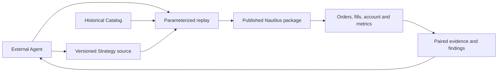

# Current Architecture

External Agents research source material, propose hypotheses, edit versioned native Nautilus `Strategy` source, run a local replay and inspect its evidence. A strategy is a first class artifact. The repository keeps strategy code, necessary data adapters, reproducible parameters and research records. The published Nautilus package owns matching, orders, risk, execution, portfolio and account calculations.

R1 replays 37 contracts in one native 100,000 USDT margin account to expose capital competition within the strategy. Each independent strategy binds to its own fixed-capital native account. If several trading logics must share that capital, implement them as one composite Nautilus `Strategy` entry with one versioned source package and one account. Its source may be split into modules while allocation, orders and exits are coordinated inside the Strategy and replayed together. For per-component attribution, the composite Strategy records a component identity with its orders and research evidence; native account equity remains the combined result. There is no external position ledger or parallel portfolio service.

The only replay entry, `strategies/r1/run_portfolio.py`, uses the published `BacktestNode` pinned to `nautilus_trader==2.0.0rc3`. Nautilus loads funding directly from the existing Catalog and performs settlement; the repository no longer contains a funding decoder. Existing MARK bars are converted locally into a derived native `MarkPriceUpdate` Catalog and verified event by event on reuse. Input receipts and funding coverage are checked before replay. The annual 37-instrument shared-account H18a/H19a results and 16 tested combinations covering all signal families and staged exits matched the former native runner; two combinations retain their pre-existing order-integrity failures and are not qualified results. See the [paired replay](plans/nautilus-upstream-poc.md). Current instrument assumptions do not prove precise historical contract terms.

A thin RD MCP may be added if durable tasks and evidence indexing become necessary. The current proof of concept uses Nautilus Python APIs and local scripts directly. Live trading is a separate future delivery requiring user authorization.
