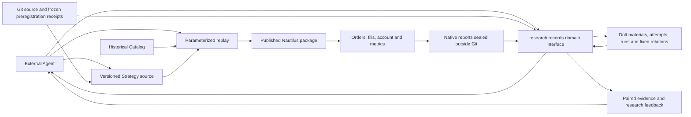

# Current Architecture

External Agents research source material, propose hypotheses, edit versioned native Nautilus `Strategy` source, run a local replay and inspect its evidence. A strategy is a first class artifact. Git keeps strategy code, necessary data adapters, reproducible parameters, frozen preregistration receipts and source evidence. Dolt owns research metadata, material revisions and their relationships. The published Nautilus package owns matching, orders, risk, execution, portfolio and account calculations.

R1 replays 37 contracts in one native 100,000 USDT margin account to expose capital competition within the strategy. Each independent strategy binds to its own fixed-capital native account. If several trading logics must share that capital, implement them as one composite Nautilus `Strategy` entry with one versioned source package and one account. Its source may be split into modules while allocation, orders and exits are coordinated inside the Strategy and replayed together. For per-component attribution, the composite Strategy records a component identity with its orders and research evidence; native account equity remains the combined result. There is no external position ledger or parallel portfolio service.

`research.records` is the research domain interface for Agents. The existing `find/show/compare/validate` commands read attempts and runs from one fixed Dolt commit; material queries also read versioned objects and relationships. Dolt is the single metadata writer. Existing Git JSON is a read-only historical import available through explicit `--backend git`; missing configuration or an unavailable backend raises an error rather than falling back to files. The SQL SDK and Dolt adapter handle storage, atomic publication, version conflicts and durable operation receipts. Existing domain code owns hypothesis parents, component reuse boundaries, legal economic controls and evidence validation. There is no separate research scheduler, notebook desktop or HTTP workbench.

Automatic material organization preserves original text, byte hashes, Git commit/path and section locations. Explicit links and structured references become relations between fixed revisions. Similar titles or an ID mentioned in prose do not establish correction, support or inheritance. Ambiguous semantics enter a review queue for an Agent to assess against evidence. Typed identities such as `material:<path>` and `attempt:<id>` distinguish a document section from an experiment number. Old commits preserve the evidence available then. Append-only revisions are a publication protocol, not a claim that a SQL administrator cannot alter the data. Import does not backdate registration: historical records remain retrospective, and [F01](plans/r1-factorial-line-cancel-result.zh.md) retains its original preregistration and four-cell evidence.

Archival custody and knowledge admission have separate boundaries. Exploratory scripts, debug output and derived reports default to `/tmp`. Git maintains Strategy source, shared execution/acceptance tools, tests and one frozen preregistration JSON receipt. A formal experiment retains a compact intent, exposure, observation and stop decision, including useful negative evidence. Agents publish `retention_decision` with a claim, scope, decision value, limitations and fixed evidence; the API validates contracts and references rather than scientific value. Default material retrieval reads research decisions and explicitly admitted claims, excluding hashes, large raw payloads and administrative receipts. Historical source needs `--include-archive`. Corrections retain fixed endpoints, narrow scope and the original experimental facts.

One-off generators and local dependencies necessary for a retained conclusion are frozen in an external recipe with the dependency lock, accessible exact input identities, parameters, command and verification receipt. Hashes alone do not make a result reconstructable. Catalog inputs are shared once; verified derived output is a cache. Irrecoverable sources or costly results need an explicit retention reason. Existing cited seals retain their original contract until a replacement is verified and a retention decision published. Historical scripts, attempt/run copies and reports are outside the current product worktree, located by the fixed Git archive in `research/records/history.json`; this is source retrieval, not a metadata backend fallback or automatic knowledge admission.

An inventory's original review queue stays immutable. Agents use `material review status/prepare/apply` to bind each original occurrence to the inventory revision and source commit, retaining decisions, proof and their scope. Preparation freezes a JSON plan outside Git and `/tmp`; application publishes proof, fixed relations and per-item decisions in one Dolt transaction. A version conflict requires a fresh read and preparation. Current reference projections follow the latest decision while older resolutions remain historical. Supplemental evidence records its later custody. Reviewing a source interpretation does not automatically revise economic conclusions or strategy qualification.

A new hypothesis still commits a frozen Git preregistration receipt before publishing its Dolt attempt. Subsequent decisions and new run registrations write only to Dolt. Native custody still runs R1 from frozen source and verifies inputs and reports. Dolt run records reference external sealed reports by hash rather than duplicating native account facts in a second trading ledger. Original sources, Catalog inputs and retained small native evidence keep their existing ownership and paths. See the [record operations](../research/records/README.md) and [material-management review](plans/rd-material-management-review.zh.md) for the contract and product findings.

The only replay entry, `strategies/r1/run_portfolio.py`, uses the published `BacktestNode` pinned to `nautilus_trader==2.0.0rc3`. Nautilus loads funding directly from the existing Catalog and performs settlement; the repository no longer contains a funding decoder. Existing MARK bars are converted locally into a derived native `MarkPriceUpdate` Catalog and verified event by event on reuse. Input receipts and funding coverage are checked before replay. The annual 37-instrument shared-account H18a/H19a results and 16 tested combinations covering all signal families and staged exits matched the former native runner; two combinations retain their pre-existing order-integrity failures and are not qualified results. See the [paired replay](plans/nautilus-upstream-poc.md). Current instrument assumptions do not prove precise historical contract terms.

Dolt integration covers existing research records and material storage; it does not restructure Strategy code, data adapters or native replay. The default organization is one handwritten entry file for an independent logical strategy, with shared capabilities and complex logic split only when there is a clear maintenance benefit. Current R1 source remains organized in its existing modules; this material migration does not claim a completed single-file strategy conversion.

Database history and native reports have separate backup and recovery chains. A second local directory does not prove recovery across independent failure domains. Further acceptance includes recovery on another host, Agent retrieval and decision-quality experiments, and bounded relationship queries and cost measurements over 1,000/10,000 materials. Structural extraction and byte verification do not prove general semantic recall or long-term research accuracy. Nautilus continues to own trading facts. Live trading is a separate future delivery requiring user authorization and acceptance of its boundaries.
