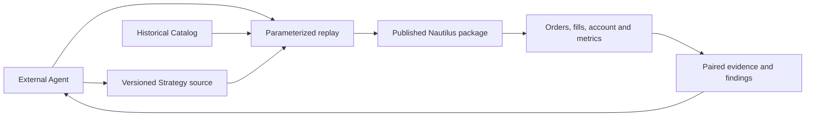

# Current Architecture

External Agents research source material, propose hypotheses, edit versioned native Nautilus `Strategy` source, run a local replay and inspect its evidence. A strategy is a first class artifact. The repository keeps strategy code, necessary data adapters, reproducible parameters and research records. The published Nautilus package owns matching, orders, risk, execution, portfolio and account calculations.

R1 replays 37 contracts in one native 100,000 USDT margin account to expose capital competition within the strategy. Each independent strategy binds to its own fixed-capital native account. If several trading logics must share that capital, implement them as one composite Nautilus `Strategy` entry with one versioned source package and one account. Its source may be split into modules while allocation, orders and exits are coordinated inside the Strategy and replayed together. For per-component attribution, the composite Strategy records a component identity with its orders and research evidence; native account equity remains the combined result. There is no external position ledger or parallel portfolio service.

The runnable slice is `strategies/r1/run_portfolio.py`, with Nautilus pinned to `2.0.0rc3`. It reads LAST and MARK bars, funding and instrument assumptions, then emits native orders, fills, positions, account and metrics. The repository-owned `funding_catalog.py` only decodes the legacy funding Parquet rows to native `FundingRateUpdate` objects for `BacktestEngine.add_data()`; Nautilus handles settlement. This is an adapter for the current manual `BacktestEngine.add_data()` runner, not a funding settlement engine. Pinned rc3 lacks `ParquetDataCatalog.query_funding_rate_updates()` in Python and its generic query returns no rows from this legacy directory. However, the same rc3 `BacktestNode` accepts `BacktestDataConfig(data_type="FundingRateUpdate")` and loaded the matching event count from an existing BTC catalog in a short read-only probe. The runner can potentially switch to this native loading path without re-downloading data or upgrading Nautilus. Remove the adapter only after the full 37-instrument shared-account replay matches orders, fills, funding and equity. See the [paired replay](plans/nautilus-upstream-poc.md) for version and result evidence. The current instrument assumptions do not prove precise historical contract terms.

A thin RD MCP may be added if durable tasks and evidence indexing become necessary. The current proof of concept uses Nautilus Python APIs and local scripts directly. Live trading is a separate future delivery requiring user authorization.
