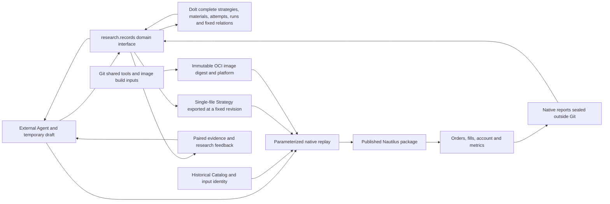

# Current Architecture

## Product form

External Agents research source material, propose hypotheses, edit versioned native Nautilus `Strategy` source, run a local replay and inspect its evidence. A strategy is a first class artifact. Dolt stores each complete single-file strategy, its revisions and fixed derivation relations, together with research registrations, decisions, evidence originals and relationships. Agents develop drafts in temporary directories and export a fixed Dolt revision for execution. Git maintains the Agent rules and skills, shared tools, image build inputs, tests and historical evidence. An immutable OCI image supplies Python, Nautilus, native replay and audit code. The published Nautilus package owns matching, orders, risk, execution, portfolio and account calculations.

The product has four layers, distinguished by where each guarantee comes from:

| Layer | Content | Location | Guarantee |
|---|---|---|---|
| 0 Always-on rules | User authority boundaries, when to write product code, no parallel engine, which skill to use when, paired replay for behavior-preserving changes | Root `AGENTS.md`, loaded automatically by most sessions | Guidance only; observed by layer-3 adversarial cases |
| 1 Skills | Method and exact commands for a research round (`research-round`); native report statistics (`nautilus-report-analysis`); loaded on demand | `.agents/skills/` | Guidance only; observed by layer-3 with/without-skill comparisons |
| 2 Contracts and execution | Dolt publication API refusals, digest-pinned OCI image, published Nautilus | In place: `research/records`, `backtest/r1`, the image | Content-addressed identities make tampering detectable, not impossible; refusals prevent mistakes |
| 3 Evaluation | Skill case replay, ledger process audit, provenance audit | Regression cases in `.agents/skills/*/evals/`; held-out cases and answer keys in a private directory outside Git | Runs from a location the evaluated session does not control |

Layer 2 is not an unbypassable boundary. On this single-user host the Agent runs as the same operating-system user as Dolt, the artifact root and Docker, so it can edit host code, write SQL directly, assemble a seal before registration or build its own image. Code guarantees two things. Dolt commits, source SHA-256, image manifest digests and seal manifest hashes are content-addressed identities, so changes after registration are detectable. Refusals on the normal API path prevent mistakes: pending-first preregistration, start-time binding, paired comparability, and `independent` only for a run whose trade window starts after its confirmation registration. Commits outside the API and out-of-order dates need the layer-3 provenance audit; a new record forged in API form, or a pair run on the same self-built image, is not currently detectable. Only a separate custodial operating-system user would harden layer 2; that waits until the first `independent` conclusion or a conclusion that must rely on layer 2. See the [skill product-form audit](plans/skill-product-form-audit.zh.md).

R1 replays 37 contracts in one native 100,000 USDT margin account to expose capital competition within the strategy. Each independent strategy binds to its own fixed-capital native account. If several trading logics must share that capital, implement them as one composite Nautilus `Strategy` with one versioned source file and one account. That file contains the complete trading rules while genuinely shared runtime and data capabilities remain dependencies. Allocation, orders and exits are replayed together. For per-component attribution, the composite Strategy records a component identity with its orders and research evidence; native account equity remains the combined result. There is no external position ledger or parallel portfolio service.

`research.records` is the research domain interface for Agents. The existing `find/show/compare/validate` commands read attempts and runs from one fixed Dolt commit; evidence materials are read at fixed revisions too. `strategy publish/list/show/lineage/export` reuse the same object and relationship store, preserving exact UTF-8 source bytes and SHA-256. Dolt is the only complete-strategy, registration and metadata writer. Git holds no experiment JSON receipts and is not a metadata backend. Missing configuration or an unavailable backend raises an error. The SQL SDK and Dolt adapter handle storage, atomic publication, version conflicts and durable operation receipts. Existing domain code owns hypothesis parents, component reuse boundaries, legal economic controls and evidence validation. There is no separate research scheduler, notebook desktop or HTTP workbench. `artifacts report` prints a run's closed-position PnL split only when it reconciles to the audited native economics; `compare --analysis` adds those readings for both runs and a paired interval for the preregistered primary response after the formal compare passes. Neither writes Dolt or a seal, keeps a second ledger, or prints more than 32 KiB. Agents compute descriptive statistics themselves from the verified seal, following the `nautilus-report-analysis` skill.

The ledger contract is also the Agent's feedback channel. `contract` describes the fields, publication can be dry-run on the same path, and a refusal returns a stable error code, field path, required fact, repair actions and the actual write status. A new v3 registration stores a small independent set of facts: purpose, selection family, preregistered primary response, known exposure and fixed decision basis; budget and stopping rules stay in the plan. `show/compare` validate only the selected evidence graph and `validate` checks the whole store; brief reads are limited to 32 KiB of UTF-8, and event detail and original bytes expand through fixed references. Complete fields and tool checks bound the facts that can be processed; the value of a research explanation is still judged by review and downstream tasks.

Decision evidence originals (readers, results, conclusions) are published by `material retain` as content-addressed `review_evidence:SHA256` materials and cited from `decision.basis.evidence_refs`; `material show` reads them at fixed revisions and `material restore` checks the stored hash before writing a new file. Attempts, runs and strategies are written only through their publication commands: the store adapter refuses a write from a caller that does not name its publication API, and refuses publication while the Dolt working set has uncommitted SQL changes. This stops a script from bypassing a contract by mistake; it does not stop the same user from editing SQL directly.

Strategy drafts, exploratory scripts, debug output and derived reports default to `/tmp`. Git maintains shared execution/acceptance tools, image build inputs, tests and necessary historical evidence. Initial research contracts and registration receipts live only in Dolt; publication payloads are temporary. A formal experiment retains a compact intent, exposure, observation and stop decision, including useful negative evidence. `find --text` searches the readable text of research decisions, not hashes or raw payloads.

One-off generators and local dependencies necessary for a retained conclusion are frozen in a recipe with the dependency lock, accessible exact input identities, parameters, command and verification receipt. The recipe and verification originals are retained with `material retain` as Dolt materials cited from the decision, recoverable to a chosen location. Custody does not execute reconstruction or retain the image, inputs and dependencies referenced inside the recipe. Hashes alone do not make a result reconstructable. Catalog inputs are shared once; verified derived output is a cache. Irrecoverable sources or costly results need an explicit retention reason. Existing cited seals retain their original contract until a replacement is verified and recorded in the decision. Historical scripts, attempt/run copies and reports are outside the current product worktree, located by the fixed Git archive in `research/records/history.json`; this is source retrieval, not a metadata backend fallback or a current conclusion.

The trial ledger was backed up locally and reset on 2026-10-09; the active ledger restarted empty and new registrations use v3. Archived trial records keep their decisions and relationships as v2 retrospective observations. Their material imports, import reviews and knowledge admissions are no longer read or written by current code; recover the archive into a separate ledger and run the records CLI from Git commit `9794ed307` to read them.

New hypotheses publish directly to Dolt from temporary payloads. The first revision must be `pending/pending`; one publication returns the initial ID, revision and actual commit. Question, mechanism, hypothesis, scope/plan, parents and code parent are frozen under one attempt ID; changed intent requires a new experiment. Later revisions only update decisions, evidence and realized comparison indexes. Native replay binds the initial registration, exact `strategy_binding`, OCI manifest digest, platform, resolved configuration and input identity before starting. New runs require no product Git commit or source closure. Image preflight observes Python, Nautilus, the dependency lock and shared runner/auditor byte identities; replay and audit execute in that same image. Seals without a valid start-time binding cannot acquire a registration later, and old Git registration has no compatibility entry. Dolt runs reference external sealed reports by hash; Nautilus continues to own orders, fills and accounts. A confirmation run can be registered as `independent` only when it executes the exact strategy binding of its confirmation attempt's first registration and its trade window starts after that registration's Dolt commit time. The [`research-round` skill](../.agents/skills/research-round/SKILL.md) gives the operating steps; the [record guide](../research/records/README.md) covers store configuration, access, retention and recovery.

## Current runnable slice

The only replay entry, `python -m backtest.r1.run_portfolio`, uses the published `BacktestNode` pinned to `nautilus_trader==2.0.0rc3`. The current `r1-native-v2` contract loads complete source from a fixed Dolt revision. Each source owns its signals, sizing, native orders, exits, configuration constraints and diagnostics; the shared entry transports configuration, prepares inputs and reads native facts. Daily warmup requires explicit configuration. Historical `r1-native-v1` bindings remain readable and execute in their original fixed image. Nautilus loads funding directly from the existing Catalog and performs settlement. `backtest/r1/native_node.py` converts existing MARK bars into a derived native `MarkPriceUpdate` Catalog and verifies every event on reuse. `backtest/r1/replay_inputs.py` checks input receipts and funding coverage. The previous annual 37-instrument shared-account H18a/H19a results and 16 tested combinations covering all signal families and staged exits matched the former native runner; two combinations retain their pre-existing order-integrity failures. See `backtest/r1/README.md` for usage and the [paired replay](plans/nautilus-upstream-poc.md) for historical evidence. Historical receipts preserve their original source identity.

The pinned `nautilus_trader==2.0.0rc3` is the version whose orders and economics were paired on the same data, parameters and shared account; an upgrade must recheck native order integrity and the annual pairing. Current contract metadata comes from the rule assumptions saved during research and does not prove precise historical daily contract terms. Historical research data stays in the external Catalog and is not copied into Git. Research scripts and exposed annual results can serve mechanism diagnosis; confirming a new candidate needs independent preregistered rules, pairing and out-of-sample or multiple-attempt handling.

## Extension boundaries

Strategy version management reuses existing Dolt objects, append-only revisions and fixed relations. Each independent strategy has one complete source file. A revision retains its strategy ID; a derived strategy gets a new ID, fixed parent revision and explicit difference. The migration demonstration published 26 strategy identities and 27 source revisions, all checked for exact export and lineage; five representative samples and the annual 37-instrument H19a replay had native paired validation, and the rest had source-management checks only. Shared replay, validation and acceptance tools live in `backtest/r1/` and the fixed image; product Git receives no new strategy drafts. Frozen historical commits and seals keep their original identities.

The migration demonstration's RD, strategy and ledger data were disposable samples for discovering framework needs. They were backed up locally and removed from the active ledger on 2026-10-09, and research since then publishes source and preregistrations into a fresh ledger. The active ledger holds real research records: clearing, resetting or rewriting it requires explicit user authority. Missing historical data may be marked without expanding recovery work. A formal attempt/run still defines the source, image, input and evidence retention it needs.

Full replay recovery needs accessible and verified Dolt source/registration history, exact OCI image bytes, canonical inputs and sealed reports. Restoring reports only proves report-byte recovery. An image digest needs a recoverable registry or image archive. See the [migration record](plans/dolt-strategy-oci-migration.zh.md) for the first migration's custody locations, contract and remaining boundaries; historical local addresses are not product dependency paths. Database history and native reports still have separate backup and recovery chains. A second local directory does not prove recovery across independent failure domains. Further acceptance includes recovery on another host, Agent retrieval and decision-quality experiments, and bounded relationship queries and cost measurements over 1,000/10,000 materials. Byte verification does not prove general semantic recall or long-term research accuracy. Nautilus continues to own trading facts. Live trading is a separate future delivery requiring user authorization and acceptance of its boundaries.
