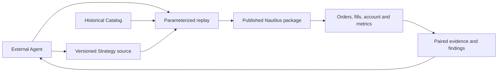

# Current Architecture

External Agents research source material, propose hypotheses, edit versioned native Nautilus `Strategy` source, run a local replay and inspect its evidence. A strategy is a first class artifact. The repository keeps strategy code, necessary data adapters, reproducible parameters and research records. The published Nautilus package owns matching, orders, risk, execution, portfolio and account calculations.

R1 replays 37 contracts in one native 100,000 USDT margin account to expose capital competition within the strategy. Each independent strategy binds to its own fixed-capital native account. If several trading logics must share that capital, implement them as one composite Nautilus `Strategy` entry with one versioned source package and one account. Its source may be split into modules while allocation, orders and exits are coordinated inside the Strategy and replayed together. For per-component attribution, the composite Strategy records a component identity with its orders and research evidence; native account equity remains the combined result. There is no external position ledger or parallel portfolio service.

The current main entry is `strategies/r1/run_portfolio.py`, with Nautilus pinned to `2.0.0rc3`. Its `funding_catalog.py` adapter decodes legacy Parquet rows before passing native `FundingRateUpdate` objects to `BacktestEngine`; Nautilus performs settlement. Although rc3 has no direct Python `ParquetDataCatalog.query_funding_rate_updates()` method, `BacktestNode` loads funding from the same existing Catalog. The `run_portfolio_node.py` proof matched the H18a and H19a annual 37-instrument shared-account replays across orders, fills, positions, funding adjustments, account rows, return series and metrics. This route needs no funding redownload or funding decoder. Existing MARK data is stored as bars, so the Node proof derives a native `MarkPriceUpdate` Catalog from those downloaded bars. The old runner and its decoder remain until its other research variants and report contract move to the Node entry. See the [paired replay](plans/nautilus-upstream-poc.md) for evidence. Current instrument assumptions do not prove precise historical contract terms.

A thin RD MCP may be added if durable tasks and evidence indexing become necessary. The current proof of concept uses Nautilus Python APIs and local scripts directly. Live trading is a separate future delivery requiring user authorization.
