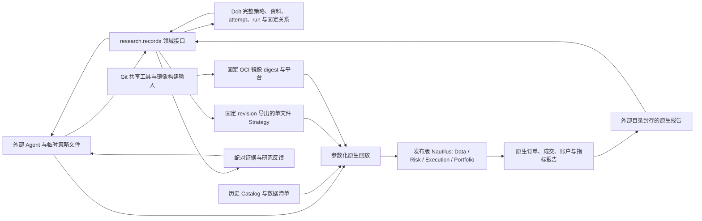

# Trade 当前架构

## 产品形态

外部 Agent 直接研究市场资料、提出假设、编辑版本化 Nautilus `Strategy` 源码、调用本地回放入口并阅读证据。策略是第一等公民。Dolt 保存每个策略的完整单文件源码、版本与固定衍生关系，以及研究登记、决定、证据原文与关系。Agent 在临时目录开发，发表后从固定 Dolt revision 导出执行文件。Git 维护 Agent 规则与 skill、共享工具、镜像构建输入、测试和历史证据；固定 OCI 镜像提供 Python、Nautilus、原生回放与审计环境。撮合、风控执行、订单生命周期、组合与账户计算由发布版 Nautilus 提供。

产品分四层，按保证从哪里来区分：

| 层 | 内容 | 位置 | 保证来自 |
|---|---|---|---|
| 0 常驻规则 | 用户授权边界、何时写产品代码、不另造引擎、何时用哪个 skill、行为不变的改动先做配对重放 | 根 `AGENTS.md`，多数会话自动加载 | 只是提示；由第 3 层的对抗用例观察 |
| 1 skill | 一轮研究的方法与确切命令（`research-round`），原生报告统计规则（`nautilus-report-analysis`），视频取证与笔记（`video-evidence`），按需加载 | `.agents/skills/` | 只是提示；由第 3 层的有/无 skill 对照观察 |
| 2 契约与执行 | Dolt 发表 API 的拒绝、固定 digest 的 OCI 镜像、发布版 Nautilus、视频证据包检查器 | 原地：`research/records`、`backtest/r1`、镜像、`services/video-evidence` | 内容寻址身份让篡改可被发现，但不能阻止；拒绝只防误操作 |
| 3 评估 | skill 案例重放、台账过程审计、溯源审计 | 回归用例在 `.agents/skills/*/evals/`；留出用例与答案键放 Git 外的私有目录 | 由不受被测会话控制的位置执行 |

第 2 层不是无法绕过的边界。本机只有一个用户，Agent 与 Dolt、artifact 根目录和 Docker 同属一个操作系统用户，能改宿主代码、直接写 SQL、在登记前拼装 seal 或自建镜像。代码保证两件事：Dolt commit、源码 SHA-256、镜像 manifest digest 与 seal manifest 哈希是内容寻址身份，登记后的改动可被发现；正常 API 路径上的拒绝防止误操作，包括先 pending 的预登记、启动时绑定、配对可比性，以及 `independent` 只给交易窗口晚于确认登记的运行。非 API 提交和日期倒序要靠第 3 层的溯源审计发现；以 API 形态伪造的新记录、双方用同一自建镜像的配对，目前都发现不了。只有独立的托管系统用户能让第 2 层变硬，等出现第一个 `independent` 结论或必须依赖第 2 层的结论时再做，见 [skill 产品形态审计](plans/skill-product-form-audit.zh.md)。视频证据包检查器 `services/video-evidence/check_bundle.py` 只读、不导入仓库代码，从媒体字节重算哈希、帧、裁剪与 ASR 输入，并核对引用；Agent 能改本地副本，所以只有审阅者从 `origin/main` 运行、`checker_git_blob` 一致的那次检查算数，见[视频取证改造](plans/video-evidence-refactor.zh.md)。

R1 当前的 37 个合约在**同一个**初始 100,000 USDT 的原生保证金账户内回放，才能观察同一策略的资金占用与跨币竞争。独立策略各绑定一个固定金额的原生账户。需要多个交易逻辑共同分配这笔资金时，将它们实现为**一个组合 Strategy**：一个版本化策略文件，在同一原生账户内做分配、下单与退出，并整体回测。策略文件包含完整交易规则；真正通用的运行与数据能力通过依赖复用。若需要逐子逻辑归因，组合 Strategy 应在自身订单与研究证据里保留子逻辑标识；原生账户净值仍以整个组合为准。当前不增加外置仓位账本或组合服务。

`research.records` 是 Agent 使用的研究领域接口，现有 `find/show/compare/validate` 从同一个固定 Dolt commit 读取 attempt/run；证据材料也按固定 revision 读取。`strategy publish/list/show/lineage/export` 复用同一个对象与关系存储，源码按精确 UTF-8 字节保存并校验 SHA-256。Dolt 是完整策略、登记及元数据唯一写主；Git 不保存实验 JSON 凭证，也不作为元数据后端。缺少配置或后端不可用会报错。SQL SDK 和 Dolt 适配器只负责存取、原子发表、版本冲突及持久操作回执；假设父关系、组件复用边界、合法经济对照与证据校验留在现有领域代码中。没有另建研究调度器、笔记桌面或 HTTP 工作台。`artifacts report` 只在闭仓盈亏拆分与审计后的原生经济事实对账一致时才输出它；`compare --analysis` 在正式配对通过后追加双方的这些读数与预登记主响应的配对区间。两者不写 Dolt 或封存，不另建账本，输出有 32 KiB 上限。描述统计由 Agent 依 `nautilus-report-analysis` skill 从核验后的封存自行计算。

台账契约也是 Agent 的反馈入口：`contract` 提供字段说明，发表前可沿同一路径 `--dry-run`，拒绝返回稳定错误码、字段位置、事实要求、修复动作与真实写入状态。新登记 v3 保存少量独立的用途、选择家族、事前主响应、已知暴露和固定决策依据；预算、停止规则等仍使用现有 plan。`show/compare` 仅校验选中证据图，`validate` 执行全库检查；简要读取有 32 KiB UTF-8 上限，事件明细和原文字节按固定引用展开。字段完整和工具校验保证可处理的事实边界，研究解释的价值仍由审阅与实际下游任务验收。

决定依据的原文（reader、结果、结论）由 `material retain` 发表为内容寻址的 `review_evidence:SHA256` 材料，决定在 `decision.basis.evidence_refs` 中引用；`material show` 按固定 revision 读取，`material restore` 校验哈希后写出新文件。attempt、run 与策略只能经各自的发表命令写入：存储适配器拒绝未声明发表接口的写入，也拒绝在 Dolt 工作集有未提交 SQL 改动时发表。这防止脚本误绕契约，不防止同一用户直接改 SQL。

策略草稿、探索脚本、调试输出和可派生报告默认在 `/tmp`；Git 维护共享运行/验收能力、镜像构建输入、测试与必要历史证据；事前约定和登记回执只存 Dolt，提交载荷是临时文件。正式实验保留小型意图、暴露范围、实际观察和停止决定，失败不自动成为无用资料。`find --text` 在研究决策的可读文本中检索，不检索哈希与原始载荷。

长期结论依赖的一次性生成器及其本地依赖冻结在复建配方中，绑定环境锁、可访问的精确输入、参数、命令和验证回执；配方及验证原件用 `material retain` 保管为 Dolt 材料并从决定中引用，可恢复到新位置。原件保管不等于执行过复建，配方引用的镜像、输入与依赖仍需实际保管；只存哈希不代表可以复建。Catalog 输入共享保存一次，已验证可复建的完整结果作为缓存，无法复建的来源或重建成本有明确收益的结果才按理由持久化。既有封存证据在验证替代并记入决定前保持原合同。历史脚本、attempt/run 文件副本和报告已撤出产品工作树，由 `research/records/history.json` 固定 Git 原文位置；这不是元数据后端回退，也不把历史归档当作当前结论。

试用台账已于 2026-10-09 在本机备份后重置，现役台账从空库开始，新登记都用 v3。归档台账中的旧试跑记录按 v2 回顾记录保存结论和关系；其中的物料导入、导入审阅和知识准入记录不再由现行代码读写，需要时把归档恢复到独立台账，用 Git commit `9794ed307` 的记录 CLI 读取。

新假设从临时载荷直接发表到 Dolt，首次必须是 `pending/pending`，一次发表返回初始 ID、revision 与真实 commit。研究问题、机制、假设、范围/计划、父关系及代码父版本在同一 attempt 内冻结；改变意图须建立新实验，后续只修订决策、证据及实际对照索引。原生回放在启动前绑定初始登记、完整 `strategy_binding`、OCI 镜像 manifest digest、平台、解析后的配置及输入身份。新运行不要求产品 Git commit 或源码闭包；镜像预检观察其 Python、Nautilus、依赖锁及共享运行/审计字节身份，并在同一镜像内执行回放与审计。没有有效启动绑定的旧封存报告不能补登记，旧 Git 登记不提供兼容入口。Dolt run 以哈希引用外部封存报告，Nautilus 继续拥有订单、成交和账户事实。确认运行只有在执行确认 attempt 首次登记的同一策略绑定、且交易窗口晚于该登记的 Dolt 提交时间时，才能登记为 `independent`。操作步骤见 [`research-round` skill](../.agents/skills/research-round/SKILL.md)；存储配置、访问保留与恢复见[研究记录指南](../research/records/README.md)。

## 当前可运行切片

唯一回放入口 `python -m backtest.r1.run_portfolio` 以原生 `BacktestNode` 回放现有 LAST K 线、资金费率和合约假设，并输出逐币与账户报告。当前 `r1-native-v2` 从固定 Dolt revision 加载完整策略；策略文件负责信号、仓位、下单、退出、配置约束及自身诊断，共享入口只传输配置、准备数据并读取原生事实。日线预热按明确配置加载。旧 `r1-native-v1` 来源绑定仍可读取，并由原固定镜像执行。资金费率直接从现有 Catalog 加载，由 Nautilus 结算。已有 MARK 数据存为 K 线，`backtest/r1/native_node.py` 将其收盘价写成原生 `MarkPriceUpdate` 派生 Catalog，复用时逐事件核对时间与价格。`backtest/r1/replay_inputs.py` 校验数据回执及资金费结算覆盖。此前 H18a/H19a 全年 37 币共享账户回放，以及覆盖全部信号族和分段退出的 16 组测试组合，已与原生旧入口做配对；其中两组保留原有订单完整性失败。运行方式和历史证据见 `backtest/r1/README.md` 与 `docs/plans/nautilus-upstream-poc.zh.md`。

固定版本为 `nautilus_trader==2.0.0rc3`。这是在同一数据、同一参数、同一共享账户上通过订单与经济结果配对的版本；升级前必须重新检查原生订单完整性及全年配对。当前合约元数据来自研究时保存的现行规则假设，不能据此声称历史逐日合约条款精确。历史研究数据留在外部 Catalog，不复制进 Git。研究脚本与已暴露年度结果可用于机制诊断；新候选的确认需独立的事前规则、配对与样本外/多重尝试处理。

## 扩展边界

策略版本管理复用现有 Dolt 对象、追加 revision 与固定关系。一个独立策略对应一个完整源码文件；同一策略的新版本使用同一个 ID，衍生策略使用新 ID 并指向父策略的固定 revision，注明差异。迁移演示曾发表 26 个策略身份、27 个源码版本，均完成精确导出与谱系校验；五个代表样本和 H19a 全年 37 币完成原生配对，其余样本只验证了源码管理。公共回放、数据校验和验收工具归 `backtest/r1/` 与固定镜像，产品 Git 不新增策略草稿。旧冻结提交与封存证据按原身份解释。

迁移演示的 RD、策略与台账数据是用于发现框架需求的试用样本，已于 2026-10-09 在本机备份后从现役台账移除；此后的研究在空台账中重新发表源码与预登记。现役台账承载真实研究记录，清空、重置或改写它需要用户明确授权。历史缺失允许标记后继续，不扩大恢复工作。正式研究所需的源码、镜像、输入和证据保留合同仍由具体 attempt/run 明确。

完整回放恢复需要 Dolt 源码/登记历史、精确 OCI 镜像字节、规范输入和封存报告四部分可访问并分别验证。报告恢复只证明报告字节可读，不能证明能重新回放；单独保存镜像 digest 也不能替代镜像归档或可恢复的 registry。首次迁移的保管位置、合同与剩余边界见[迁移记录](plans/dolt-strategy-oci-migration.zh.md)，其中历史本机地址不作为产品依赖路径。数据库历史备份与原生报告备份仍有各自恢复链；本机第二目录恢复不代表独立故障域灾备。后续需要异机恢复验收、Agent 检索和决策效益试验，以及 1,000/10,000 条资料下的有界关系读取与成本测量。原文字节校验不证明一般语义召回或长期研发准确度。Nautilus 继续负责交易事实；实盘连接是后续独立交付，须另行取得用户授权并验收边界。
