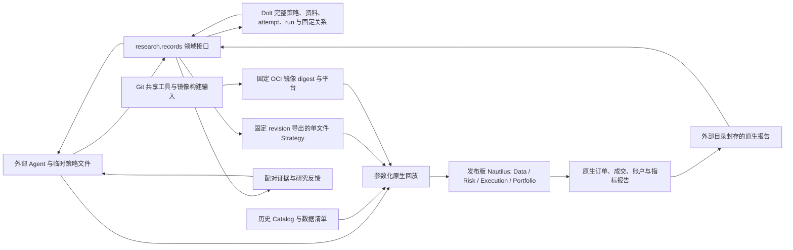

# Trade 当前架构

## 产品形态

外部 Agent 直接研究市场资料、提出假设、编辑版本化 Nautilus `Strategy` 源码、调用本地回放入口并阅读证据。策略是第一等公民。Dolt 保存每个策略的完整单文件源码、版本与固定衍生关系，以及初始研究约定、登记回执、资料版本与关系。Agent 在临时目录开发，发表后从固定 Dolt revision 导出执行文件。Git 维护共享工具、镜像构建输入、测试和历史证据；固定 OCI 镜像提供 Python、Nautilus、原生回放与审计环境。撮合、风控执行、订单生命周期、组合与账户计算由发布版 Nautilus 提供。

R1 当前的 37 个合约在**同一个**初始 100,000 USDT 的原生保证金账户内回放，才能观察同一策略的资金占用与跨币竞争。独立策略各绑定一个固定金额的原生账户。需要多个交易逻辑共同分配这笔资金时，将它们实现为**一个组合 Strategy**：一个版本化策略文件，在同一原生账户内做分配、下单与退出，并整体回测。策略文件包含完整交易规则；真正通用的运行与数据能力通过依赖复用。若需要逐子逻辑归因，组合 Strategy 应在自身订单与研究证据里保留子逻辑标识；原生账户净值仍以整个组合为准。当前不增加外置仓位账本或组合服务。

`research.records` 是 Agent 使用的研究领域接口，现有 `find/show/compare/validate` 从同一个固定 Dolt commit 读取 attempt/run；资料查询也读取版本化对象与关系。`strategy publish/list/show/lineage/export` 复用同一个对象与关系存储，源码按精确 UTF-8 字节保存并校验 SHA-256。Dolt 是完整策略、登记及元数据唯一写主；Git 不保存实验 JSON 凭证，也不作为元数据后端。缺少配置或后端不可用会报错。SQL SDK 和 Dolt 适配器只负责存取、原子发表、版本冲突及持久操作回执；假设父关系、组件复用边界、合法经济对照与证据校验留在现有领域代码中。没有另建研究调度器、笔记桌面或 HTTP 工作台。

自动资料整理保存原文、字节哈希、Git commit/path 和片段定位，把明示链接与结构化引用接成固定 revision 关系；标题相似或文本中出现编号不自动证明纠错、支持或继承。含糊语义进入待审列表，由 Agent 按证据发表关系。`material:<path>` 与 `attempt:<id>` 等类型化身份区分资料段落和实验编号；读取旧 commit 可以保留当时的依据。Dolt 中追加 revision 是发表协议，不能据此声称拥有 SQL 管理权限者无法修改数据。资料导入仅保存原文，不能创建 attempt/run 或倒填事前身份；既有试跑记录按 v2 回顾记录保存结论和关系。

资料保管与研究知识准入分别处理。策略草稿、探索脚本、调试输出和可派生报告默认在 `/tmp`；Git 维护共享运行/验收能力、镜像构建输入、测试与必要历史证据；事前约定和登记回执只存 Dolt，提交载荷是临时文件。正式实验保留小型意图、暴露范围、实际观察和停止决定，失败不自动成为无用资料。Dolt 的 `retention_decision` 由 Agent 明确陈述结论、适用范围、决策收益、未知项及固定证据；发布接口校验合同与引用，不能替 Agent 证明科学价值。默认资料检索只读研究决策和已准入的结论，排除哈希、原始大载荷及管理收据；旧资料须显式 `--include-archive` 展开。来源纠正显示固定端点与窄适用范围，保留当时的实验事实。

长期结论依赖的一次性生成器及其本地依赖冻结在外置复建配方中，绑定环境锁、可访问的精确输入、参数、命令和验证回执；只存哈希不代表可以复建。Catalog 输入共享保存一次，已验证可复建的完整结果作为缓存，无法复建的来源或重建成本有明确收益的结果才按理由持久化。既有封存证据在验证替代和发表保留决定前保持原合同。历史脚本、attempt/run 文件副本和报告已撤出产品工作树，由 `research/records/history.json` 固定 Git 原文位置；这不是元数据后端回退，也不将历史归档自动接纳为当前知识。

导入 inventory 的原待审队列保持不变。Agent 通过 `material review status/prepare/apply` 复核：固定 inventory ID/revision 与原 source commit，按每次原 occurrence 保存决定、证据与适用范围；prepare 在 Git 和 `/tmp` 之外冻结 JSON 计划，apply 将 proof、固定端点关系及逐项 `review_decision` 在本机 Dolt 同事务发表。版本冲突先重读并重新准备，不自动覆盖。当前引用投影采用最新决定的有效解析，旧解析与旧依据保留历史；补采资料记录后续来源和 custody，不能冒充原快照已有证据。来源解释由 Agent 负责，复核不会自动改写实验经济结论或策略资格。

新假设从临时载荷直接发表到 Dolt，首次必须是 `pending/pending`，一次发表返回初始 ID、revision 与真实 commit。研究问题、机制、假设、范围/计划、父关系及代码父版本在同一 attempt 内冻结；改变意图须建立新实验，后续只修订决策、证据及实际对照索引。原生回放在启动前绑定初始登记、完整 `strategy_binding`、OCI 镜像 manifest digest、平台、解析后的配置及输入身份。新运行不要求产品 Git commit 或源码闭包；镜像预检观察其 Python、Nautilus、依赖锁及共享运行/审计字节身份，并在同一镜像内执行回放与审计。没有有效启动绑定的旧封存报告不能补登记，旧 Git 登记不提供兼容入口。Dolt run 以哈希引用外部封存报告，Nautilus 继续拥有订单、成交和账户事实。详见[记录操作](../research/records/README.md)。

## 当前可运行切片

唯一回放入口 `python -m backtest.r1.run_portfolio` 以原生 `BacktestNode` 回放现有 LAST K 线、资金费率和合约假设，并输出逐币与账户报告。当前 `r1-native-v2` 从固定 Dolt revision 加载完整策略；策略文件负责信号、仓位、下单、退出、配置约束及自身诊断，共享入口只传输配置、准备数据并读取原生事实。日线预热按明确配置加载。旧 `r1-native-v1` 来源绑定仍可读取，并由原固定镜像执行。资金费率直接从现有 Catalog 加载，由 Nautilus 结算。已有 MARK 数据存为 K 线，`backtest/r1/native_node.py` 将其收盘价写成原生 `MarkPriceUpdate` 派生 Catalog，复用时逐事件核对时间与价格。`backtest/r1/replay_inputs.py` 校验数据回执及资金费结算覆盖。此前 H18a/H19a 全年 37 币共享账户回放，以及覆盖全部信号族和分段退出的 16 组测试组合，已与原生旧入口做配对；其中两组保留原有订单完整性失败。运行方式和历史证据见 `backtest/r1/README.md` 与 `docs/plans/nautilus-upstream-poc.zh.md`。

固定版本为 `nautilus_trader==2.0.0rc3`。这是在同一数据、同一参数、同一共享账户上通过订单与经济结果配对的版本；升级前必须重新检查原生订单完整性及全年配对。当前合约元数据来自研究时保存的现行规则假设，不能据此声称历史逐日合约条款精确。历史研究数据留在外部 Catalog，不复制进 Git。研究脚本与已暴露年度结果可用于机制诊断；新候选的确认需独立的事前规则、配对与样本外/多重尝试处理。

## 扩展边界

策略版本管理复用现有 Dolt 对象、追加 revision 与固定关系。一个独立策略对应一个完整源码文件；同一策略的新版本使用同一个 ID，衍生策略使用新 ID 并指向父策略的固定 revision，注明差异。当前试用样本已发表 26 个策略身份、27 个源码版本，均完成精确导出与谱系校验；五个代表样本和 H19a 全年 37 币完成原生配对，其余样本仅验证源码管理。公共回放、数据校验和验收工具归 `backtest/r1/` 与固定镜像，产品 Git 不新增策略草稿。旧冻结提交与封存证据按原身份解释。

本轮 RD、策略与台账数据用于通过真实研发产物发现框架需求，属于可清空的试用数据；历史缺失允许标记后继续，不扩大恢复工作。台账设计迭代结束后，按选定的清空时点重新开展 RD。当前迁移和配对验证共享能力，不把试用数据的保留或策略资格作为产品完成条件。正式研究所需的源码、镜像、输入和证据保留合同仍由具体 attempt/run 明确。

完整回放恢复需要 Dolt 源码/登记历史、精确 OCI 镜像字节、规范输入和封存报告四部分可访问并分别验证。报告恢复只证明报告字节可读，不能证明能重新回放；单独保存镜像 digest 也不能替代镜像归档或可恢复的 registry。首次迁移的本机外置目录是 `/Users/vx/.local/share/trade/strategy-migration/20261009`，不作为产品依赖路径。迁移合同与剩余边界见[迁移记录](plans/dolt-strategy-oci-migration.zh.md)。数据库历史备份与原生报告备份仍有各自恢复链；本机第二目录恢复不代表独立故障域灾备。后续需要异机恢复验收、Agent 检索和决策效益试验，以及 1,000/10,000 条资料下的有界关系读取与成本测量。自动整理的结构与原文字节校验也不证明一般语义召回或长期研发准确度。Nautilus 继续负责交易事实；实盘连接是后续独立交付，须另行取得用户授权并验收边界。
