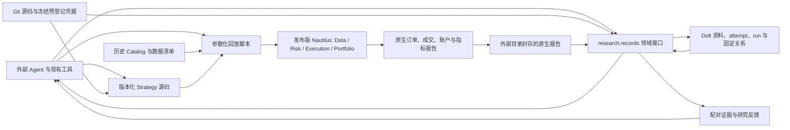

# Trade 当前架构

## 产品形态

外部 Agent 直接研究市场资料、提出假设、编辑版本化 Nautilus `Strategy` 源码、调用本地回放入口并阅读证据。策略是第一等公民。Git 保留策略、必要的数据格式适配、可复现运行参数、冻结预登记凭据及来源证据；Dolt 持有研究元数据、资料版本与关系。撮合、风控执行、订单生命周期、组合与账户计算由发布版 Nautilus 提供。

R1 当前的 37 个合约在**同一个**初始 100,000 USDT 的原生保证金账户内回放，才能观察同一策略的资金占用与跨币竞争。独立策略各绑定一个固定金额的原生账户。需要多个交易逻辑共同分配这笔资金时，将它们实现为**一个组合 Strategy**：一个版本化策略入口及其源码包，在同一原生账户内做分配、下单与退出，并整体回测。源码可按子逻辑拆文件，但对外仍是一个策略版本和一个账户。若需要逐子逻辑归因，组合 Strategy 应在自身订单与研究证据里保留子逻辑标识；原生账户净值仍以整个组合为准。当前不增加外置仓位账本或组合服务。

`research.records` 是 Agent 使用的研究领域接口，现有 `find/show/compare/validate` 从同一个固定 Dolt commit 读取 attempt/run；资料查询也读取版本化对象与关系。Dolt 是元数据唯一写主，Git 中既有 JSON 作为只读历史，显式 `--backend git` 可核对该历史；缺少配置或后端不可用会报错，不静默退回文件。SQL SDK 和 Dolt 适配器只负责存取、原子发表、版本冲突及持久操作回执；假设父关系、组件复用边界、合法经济对照与证据校验留在现有领域代码中。没有另建研究调度器、笔记桌面或 HTTP 工作台。

自动资料整理保存原文、字节哈希、Git commit/path 和片段定位，把明示链接与结构化引用接成固定 revision 关系；标题相似或文本中出现编号不自动证明纠错、支持或继承。含糊语义进入待审列表，由 Agent 按证据发表关系。`material:<path>` 与 `attempt:<id>` 等类型化身份区分资料段落和实验编号；读取旧 commit 可以保留当时的依据。Dolt 中追加 revision 是发表协议，不能据此声称拥有 SQL 管理权限者无法修改数据。资料导入不倒填事前身份：历史记录仍是事后转录，[F01](plans/r1-factorial-line-cancel-result.zh.md)保留其原预登记及四格事实。

资料保管与研究知识准入分别处理。探索脚本、调试输出和可派生报告默认在 `/tmp`；Git 仅维护策略、共享运行/验收能力、测试与一个冻结的事前 JSON 凭证。正式实验保留小型意图、暴露范围、实际观察和停止决定，失败不自动成为无用资料。Dolt 的 `retention_decision` 由 Agent 明确陈述结论、适用范围、决策收益、未知项及固定证据；发布接口校验合同与引用，不能替 Agent 证明科学价值。默认资料检索只读研究决策和已准入的结论，排除哈希、原始大载荷及管理收据；旧资料须显式 `--include-archive` 展开。来源纠正显示固定端点与窄适用范围，保留当时的实验事实。

长期结论依赖的一次性生成器及其本地依赖冻结在外置复建配方中，绑定环境锁、可访问的精确输入、参数、命令和验证回执；只存哈希不代表可以复建。Catalog 输入共享保存一次，已验证可复建的完整结果作为缓存，无法复建的来源或重建成本有明确收益的结果才按理由持久化。既有封存证据在验证替代和发表保留决定前保持原合同。历史脚本、attempt/run 文件副本和报告已撤出产品工作树，由 `research/records/history.json` 固定 Git 原文位置；这不是元数据后端回退，也不将历史归档自动接纳为当前知识。

导入 inventory 的原待审队列保持不变。Agent 通过 `material review status/prepare/apply` 复核：固定 inventory ID/revision 与原 source commit，按每次原 occurrence 保存决定、证据与适用范围；prepare 在 Git 和 `/tmp` 之外冻结 JSON 计划，apply 将 proof、固定端点关系及逐项 `review_decision` 在本机 Dolt 同事务发表。版本冲突先重读并重新准备，不自动覆盖。当前引用投影采用最新决定的有效解析，旧解析与旧依据保留历史；补采资料记录后续来源和 custody，不能冒充原快照已有证据。来源解释由 Agent 负责，复核不会自动改写实验经济结论或策略资格。

新假设仍先提交冻结的 Git 预登记凭据，再发表 Dolt attempt；结果、下一步及新的 run 登记只写 Dolt。原生封存命令继续从冻结源码运行 R1、核对输入及报告，Dolt run 以哈希引用外部封存目录，不把账户事实复制成第二本交易账。原始来源、Catalog 与既有小型原生证据路径保留各自职责。操作与恢复边界见[记录命令](../research/records/README.md)；资料管理发现见[评审记录](plans/rd-material-management-review.zh.md)。

## 当前可运行切片

唯一回放入口 `strategies/r1/run_portfolio.py` 以原生 `BacktestNode` 回放现有 LAST K 线、资金费率和合约假设，并输出原有逐币与账户报告。资金费率直接从现有 Catalog 加载，由 Nautilus 结算；仓库不再保留资金费解码器。已有 MARK 数据存为 K 线，`native_node.py` 将其收盘价写成原生 `MarkPriceUpdate` 派生 Catalog，复用时逐事件核对时间与价格。`replay_inputs.py` 校验数据回执及资金费结算覆盖。H18a/H19a 全年 37 币共享账户回放，以及覆盖全部信号族和分段退出的 16 组测试组合，均已与原生旧入口做配对；其中两组原本就因订单完整性失败而不构成合格策略结果。运行方式和配对回执见 `strategies/r1/README.md` 与 `docs/plans/nautilus-upstream-poc.zh.md`。

固定版本为 `nautilus_trader==2.0.0rc3`。这是在同一数据、同一参数、同一共享账户上通过订单与经济结果配对的版本；升级前必须重新检查原生订单完整性及全年配对。当前合约元数据来自研究时保存的现行规则假设，不能据此声称历史逐日合约条款精确。历史研究数据留在外部 Catalog，不复制进 Git。研究脚本与已暴露年度结果可用于机制诊断；新候选的确认需独立的事前规则、配对与样本外/多重尝试处理。

## 扩展边界

Dolt 接入限于现有研究记录和资料存取，不重构 Strategy、数据适配或原生回放。默认一个独立逻辑策略保留一个手写入口文件；真实共享能力和有明确维护收益的复杂逻辑可以模块化。当前 R1 源码仍按现有模块组织，本轮资料迁移不宣称已完成单文件策略改造。

数据库历史备份与原生报告备份是两条恢复链；本机第二目录恢复不代表独立故障域灾备。后续需要异机恢复验收、Agent 检索和决策效益试验，以及 1,000/10,000 条资料下的有界关系读取与成本测量。自动整理的结构与原文字节校验也不证明一般语义召回或长期研发准确度。Nautilus 继续负责交易事实；实盘连接是后续独立交付，须另行取得用户授权并验收边界。
