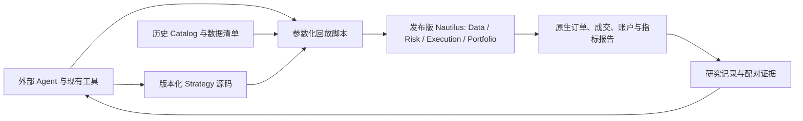

# Trade 当前架构

## 产品形态

外部 Agent 直接研究市场资料、提出假设、编辑版本化 Nautilus `Strategy` 源码、调用本地回放入口并阅读证据。策略是第一等公民。仓库只保留策略、必要的数据格式适配、可复现运行参数与研究记录；撮合、风控执行、订单生命周期、组合与账户计算由发布版 Nautilus 提供。

R1 当前的 37 个合约在**同一个**初始 100,000 USDT 的原生保证金账户内回放，才能观察同一策略的资金占用与跨币竞争。独立策略各绑定一个固定金额的原生账户。需要多个交易逻辑共同分配这笔资金时，将它们实现为**一个组合 Strategy**：一个版本化策略入口及其源码包，在同一原生账户内做分配、下单与退出，并整体回测。源码可按子逻辑拆文件，但对外仍是一个策略版本和一个账户。若需要逐子逻辑归因，组合 Strategy 应在自身订单与研究证据里保留子逻辑标识；原生账户净值仍以整个组合为准。当前不增加外置仓位账本或组合服务。

## 当前可运行切片

`strategies/r1/run_portfolio.py` 读取现有 LAST/MARK K 线、资金费率和合约假设，调用原生 `BacktestEngine`，输出订单、成交、仓位、账户与指标报告。仓库自写的 `funding_catalog.py` 只是旧数据格式适配器：用 PyArrow 读取现有资金费率 Parquet 行，转成 Nautilus 原生 `FundingRateUpdate` 并交给 `BacktestEngine.add_data()`；资金费结算仍由 Nautilus 执行。仅重新同步旧数据不能移除它：锁定的 rc3 Catalog 没有资金费率专用读写入口，现有资金费率目录经通用 `query()` 也读不到；只有换成经验证可直接提供原生资金费率输入的版本或数据入口，并通过配对回放，才可移除适配器。`compare.py` 对冻结的本地引擎结果与发布版结果做配对检查。运行方式和数据路径见 `strategies/r1/README.md`；已验证的 H18a/H19a 全年 37 币结果见 `docs/plans/nautilus-upstream-poc.zh.md`。

固定版本为 `nautilus_trader==2.0.0rc3`。这是在同一数据、同一参数、同一共享账户上通过订单与经济结果配对的版本；升级前必须重新检查原生订单完整性及全年配对。当前合约元数据来自研究时保存的现行规则假设，不能据此声称历史逐日合约条款精确。历史研究数据留在外部 Catalog，不复制进 Git。研究脚本与已暴露年度结果可用于机制诊断；新候选的确认需独立的事前规则、配对与样本外/多重尝试处理。

## 扩展边界

需要 durable 任务与证据索引时，可增加一层很薄的 RD MCP，向 Agent 暴露显式参数操作和结果引用；当前 POC 没有实现该服务。Nautilus 的 Python API 与本地脚本已足够执行当前研究。Nautilus 官方 MCP 是否存在及其能力尚未作为本仓库运行依赖。数据库只在文件证据的检索、并发或审计需求成立时引入，不承担第二份交易账本。实盘连接是后续独立交付，必须另行获得用户授权并验收边界。
