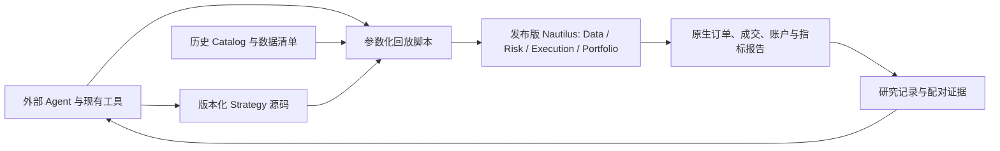

# Trade 当前架构

## 产品形态

外部 Agent 直接研究市场资料、提出假设、编辑版本化 Nautilus `Strategy` 源码、调用本地回放入口并阅读证据。策略是第一等公民。仓库只保留策略、必要的数据格式适配、可复现运行参数与研究记录；撮合、风控执行、订单生命周期、组合与账户计算由发布版 Nautilus 提供。

R1 当前的 37 个合约在**同一个**初始 100,000 USDT 的原生保证金账户内回放，才能观察同一策略的资金占用与跨币竞争。未来每个独立策略绑定一个固定金额账户，分别回放与运行。若要合并策略层面的资金分配，先明确组合决策规则并用原生账户回测；当前不增加外置仓位账本或组合服务。

## 当前可运行切片

`strategies/r1/run_portfolio.py` 读取现有 LAST/MARK K 线、资金费率和合约假设，调用原生 `BacktestEngine`，输出订单、成交、仓位、账户与指标报告。`funding_catalog.py` 将旧研究 Parquet 行解码成原生 `FundingRateUpdate`；资金结算仍由 Nautilus 执行。`compare.py` 对冻结的本地引擎结果与发布版结果做配对检查。运行方式和数据路径见 `strategies/r1/README.md`；已验证的 H18a/H19a 全年 37 币结果见 `docs/plans/nautilus-upstream-poc.zh.md`。

固定版本为 `nautilus_trader==2.0.0rc3`。这是在同一数据、同一参数、同一共享账户上通过订单与经济结果配对的版本；升级前必须重新检查原生订单完整性及全年配对。当前合约元数据来自研究时保存的现行规则假设，不能据此声称历史逐日合约条款精确。历史研究数据留在外部 Catalog，不复制进 Git。研究脚本与已暴露年度结果可用于机制诊断；新候选的确认需独立的事前规则、配对与样本外/多重尝试处理。

## 扩展边界

需要 durable 任务与证据索引时，可增加一层很薄的 RD MCP，向 Agent 暴露显式参数操作和结果引用；当前 POC 没有实现该服务。Nautilus 的 Python API 与本地脚本已足够执行当前研究。Nautilus 官方 MCP 是否存在及其能力尚未作为本仓库运行依赖。数据库只在文件证据的检索、并发或审计需求成立时引入，不承担第二份交易账本。实盘连接是后续独立交付，必须另行获得用户授权并验收边界。
