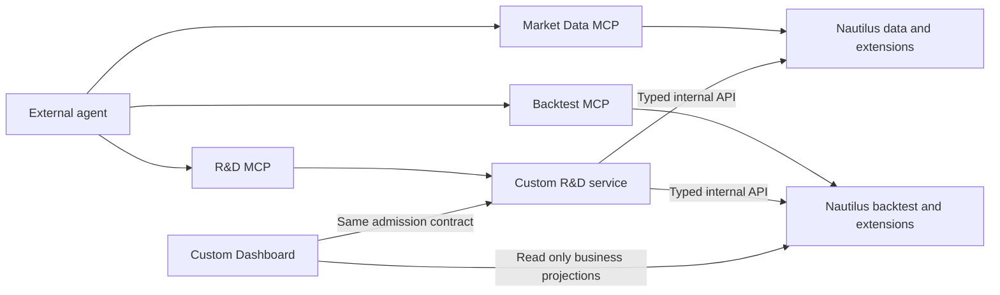

# Service architecture

## Service topology

External agents connect independently to data, backtest and research MCPs. MCP is the protocol edge; services own
jobs and facts. R&D calls data/backtest through typed internal APIs, not nested MCP sessions. Data and backtest
extend existing Nautilus components without copying computation, matching, orders or accounts into parallel
engines. The custom Dashboard consumes the same service contracts.

## Responsibilities and facts

| Responsibility              | Foundation and facts                                                                                        | Consumption                                                                           |
| --------------------------- | ----------------------------------------------------------------------------------------------------------- | ------------------------------------------------------------------------------------- |
| Market Data                 | Native clients, engine, aggregation and storage; PIT custody, revisions and coverage extensions             | MCP discovery/preparation; verified data references for backtest                      |
| Backtest                    | Native engine, orders, matching, accounts, funding and analytics; jobs, input binding and report extensions | MCP submission/query; same operation through internal R&D calls                       |
| R&D                         | Custom intake, registration, JSON authoring, Artifacts, trial ledgers and iteration decisions               | External agent directs research; service completes deterministic steps                |
| Qualification               | Independent protected protocol, eligibility and forward decisions                                           | Selected candidates only; bounded public conclusions to research                      |
| Trading node                | Native LiveNode, RiskEngine, ExecutionEngine and thin trust layer per Capacity Scope                        | Paper/Live not admitted; qualification, governance, risk and recovery contracts apply |
| Portfolio and Governance    | Native measurement with attribution/evidence projections; separate authority and capital envelopes          | No second account; facts and permissions remain distinct                              |
| Dashboard and Observability | Custom UI, read projections, telemetry and alerts                                                           | No second workflow or business authority                                              |

Data, backtest and research are independently buildable, deployable and verifiable. `Owner` means responsibility,
storage and permission, not a mandatory independent service. Native cache retains order, fill, position and account
facts; product extensions append only their assigned custody, authorization, research and recovery records.

## Calls and trust

Strictly verify identity, scope, parameters and capabilities at external boundaries. Internal calls use typed values
and downward dependencies, without lower services rereading upper databases or rebuilding all authority at each
layer. Protected caches, database privileges, real-money and unknown-effect boundaries still apply independently.
Services own job state, recovery and terminal outcomes. MCP, Dashboard and Event Rail submit, query or convey
committed wakes.

## Architecture contracts

Every mutable business fact has one Owner. R&D contains Research and Develop. Product Edge admits requests;
Strategy Factory spans R&D, Backtest and Qualification; Observability projects and notifies.
[Event Rail](./event-rail/) broadcasts committed events and never approves, selects, retries or recovers effects.

[Architecture rules](../guide/architecture-rules/) define identity, authority, protection, native trading node and
recovery. [Capability adoption](./capability-adoption/) maps native components to minimum integration; each
[Owner](../owners/) defines its writer. The global Flow is a responsibility projection: ten business Owners,
three visible boundaries and one non-authoritative Event Rail channel, with at most five modules per group.
The service diagram neither changes these responsibilities nor proves integration/deployment. A new Owner requires
an independent fact authority that cannot fit an existing responsibility.
