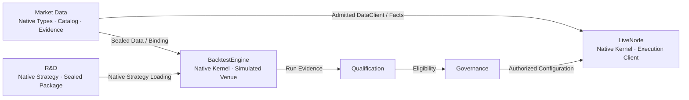
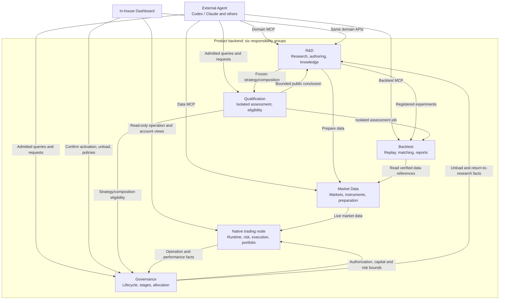
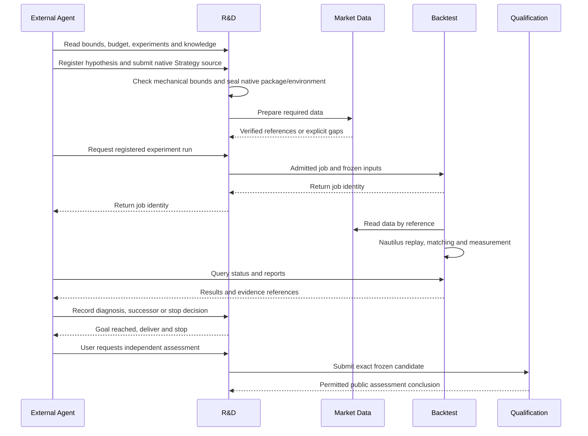
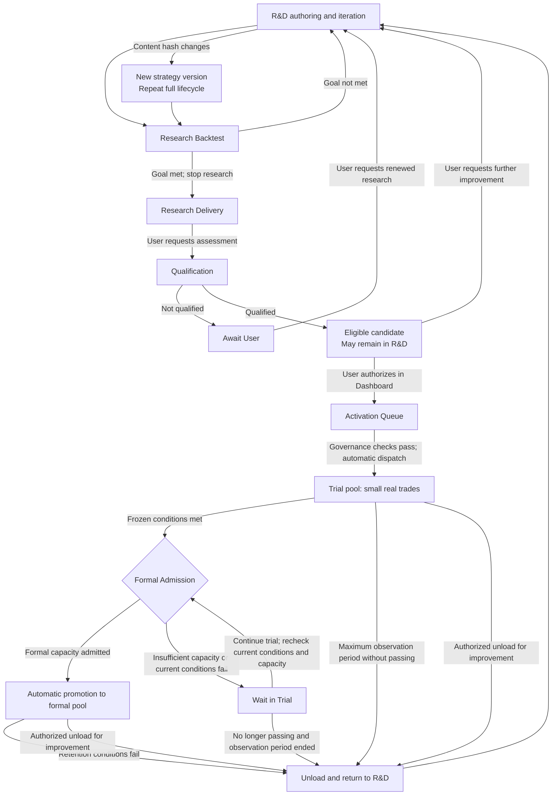
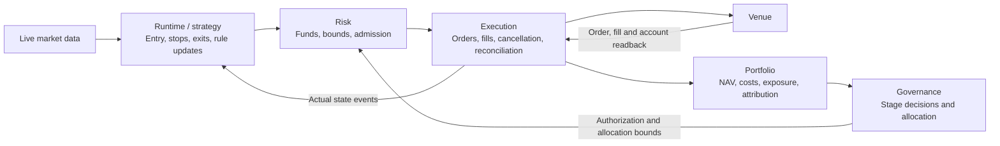

# Service architecture

## Product purpose and core user goals

The product helps users and external Agents develop trading ideas into strategies and investment portfolios,
validate them, operate them under account governance, and accumulate reusable research knowledge. Strategies and
portfolios are both core research and operation objects; a portfolio is more than a statistical report aggregate.
Data preparation, queries and backtests have independent MCP target entrances without requiring activation. Current use is limited to operations whose catalog status and exact admission/readback conditions are satisfied.

The current target consumer is one individual user assisted by one external Agent. Multiple strategies, instruments
and portfolios serve that user's research and account operation, without requiring a shared multi-user platform or
concurrent Agent collaboration. Persist research state and evidence so a replacement Agent can continue the same
research; no model vendor or conversation owns the research record. Shared hosting, tenant billing and multi-user
collaboration are outside the current product requirements.

The user initiates research by speaking directly to the external Agent, which starts and advances work through
MCP. Dashboard is read-only for research progress, evidence and results: it neither initiates, pauses, resumes
or terminates research, nor dispatches or controls the external Agent on the user's computer. Research
instructions remain in the user/Agent conversation and admitted service requests go through MCP. Dashboard
separately provides approved Governance controls for activation confirmation, policy configuration and
strategy operation. The six backend responsibilities and web Dashboard are server-hosted by default.

The user's local Agent calls domain MCP and the browser displays server views; local startup remains available
for development. Closing the user's computer or exhausting Agent usage does not stop already admitted
data/backtest tasks or authorized strategy operation on an available server. New hypothesis selection and
research orchestration wait for the Agent to resume. Persistent product jobs and records remain outside any
one Agent conversation; a replacement Agent resolves original job identities and pending outcomes before
continuing, without submitting duplicate work.

Binance is the target trading venue. Research and operate multiple instruments, strategies and portfolios over
products actually available on Binance. The complete target includes crypto spot and derivatives and Binance
products referencing equities, commodities and indices; deliver derivatives first and spot later. Binance USDT
perpetual point-in-time data remains the first end-to-end acceptance baseline, not the entire instrument scope.
Multiple asset categories do not imply multiple brokers or traditional futures platforms; those integrations are
not current product goals.

Binance's [TradFi product description](https://www.binance.com/en/academy/articles/tradfi-assets-you-can-trade-on-binance-futures)
identifies perpetual contracts providing equity, commodity and index exposure, rather than direct ownership of
stocks, fund shares or physical commodities. Data, replay and operation follow actual instrument/contract
specifications. A shared venue does not establish shared available margin across all products. Accommodate later
Binance products without requiring premature implementation outside delivery scope; a Nautilus capability alone
does not establish a connected product path.

| User goal                                                                | Complete outcome                                                                                                                                                              |
| ------------------------------------------------------------------------ | ----------------------------------------------------------------------------------------------------------------------------------------------------------------------------- |
| Understand markets and discover instruments                              | Traceable market data, preparation and opportunity discovery on request                                                                                                       |
| Develop a strategy, including multiple instruments and dynamic selection | Reproducible strategy versions, continuous holdings, costs and NAV, and evidence for successor iterations                                                                     |
| Develop an investment portfolio of independently running strategies      | Joint replay on one account timeline, measuring capital competition, overlapping exposure, costs, account return/drawdown and member contributions                            |
| Improve a portfolio                                                      | Research strategy selection, capital allocation and membership/version changes under user objectives, preserving continuous account state and traceable configuration         |
| Operate and improve strategies and portfolios                            | Trials confirmed by the user, promotion on frozen conditions, operation management, improvement after unloading and recovery; reusable research evidence and factor knowledge |

Investment portfolios are also autonomous research objects. Given user objectives for return and risk,
research scope and resource bounds, external Agents may research strategy selection, capital allocation and
composition improvements within the approved boundaries. The product supplies joint replay, independent
validation and traceable evidence. It supports both evaluating a user-specified composition and
searching/comparing portfolio candidates. Research success alone does not modify a running account. For
already running strategies, the Agent may request Governance to adopt an assessed successor composition
version within prior user-approved change bounds.

Governance checks exact version/scope coverage, current authority, capacity, account/risk facts and native
readiness before applying it; outside those bounds, obtain user confirmation first. New strategy versions
still require Dashboard confirmation for first trial entry. Research approval alone is not operational change
authority. Composition research compares return, drawdown, volatility and Sharpe trade-offs, allowing lower
returns for evidenced improvement in risk-adjusted performance. It need not outperform every member on return,
nor does diversification guarantee lower drawdown or higher Sharpe.

Preregister comparison objectives and return/risk constraints; do not subtract changes in unlike metrics or
revise pass conditions after observing outcomes.

Qualification assesses the complete strategy. Return and hedging rules may share one strategy, such as spot-long,
perpetual-short funding carry. Legs do not individually obtain eligibility, trial/formal stages or account allocation;
the complete strategy must independently demonstrate economic advantage. Composition members each hold valid
complete-strategy eligibility before joint assessment; there is no composition-only eligibility for independently
ineligible strategies. Composition research seeks evidenced risk-return improvements with reduced risk-strategy
sizing as an applicable baseline; explanations or NAV curves cannot substitute for eligibility.

A strategy trading several instruments and independent strategies sharing an account are distinct user stories.
A multi-strategy portfolio backtest replays capital and execution interactions on their shared account; concatenated
independent return curves cannot replace it. Individual member qualification does not qualify their joint operation.
Eligibility applies to the assessed composition definition and explicit applicability scope; composition changes
cannot silently reuse mismatched evidence.

Research and validation cover strategies and portfolios; trial, promotion, unloading and return to research are
managed separately for each member strategy. A composition owns its joint-operation definition, eligibility and
capital-configuration constraints, not an additional stage requiring every member to promote or unload together. Qualified candidates may continue research without
activation; portfolio research creates no trading authority. Nautilus supplies the data, replay and account-operation
foundation; product extensions integrate research, independent assessment and governance, with service boundaries below.

Core acceptance covers R-1 entry/exit research, B3 dynamic selection, multi-strategy shared-account replay,
composition membership/allocation changes, on-demand discovery, factor-knowledge reuse, trial-to-formal operation
and improvement after unloading. Demonstrate both strategy and portfolio user routes; a single-strategy report cannot
replace composition evidence, and an architecture diagram cannot establish implementation completion.

## Milestones and delivery iterations

The complete architecture defines final responsibilities; delivery advances through usable user journeys rather
than filling all six service groups horizontally. Detail only the capabilities and handoffs required by each
version's acceptance story. Later capabilities retain their target boundaries without premature modules, routes
or separate processes. Reuse existing implementation; version scope neither deletes existing capabilities nor
replaces per-slice implementation admission or production-effect authority.

| Version | Usable outcome                                                                                                    | Scope status                                |
| ------- | ----------------------------------------------------------------------------------------------------------------- | ------------------------------------------- |
| V0.1    | An external Agent completes R-1 data preparation, strategy sealing, native replay and report readback through MCP | Scope confirmed; delivery awaits acceptance |
| V0.2    | Comparable experiments, diagnosis/iteration records, research takeover and reusable knowledge                     | Scope confirmed; delivery awaits acceptance |
| V0.3    | One strategy: independent qualification, confirmed trial, automatic promotion, formal operation and exit/recovery | Scope confirmed; delivery awaits acceptance |
| V0.4    | Joint research/validation/operation of account compositions, member entry/exit and whole account allocation       | Scope confirmed; delivery awaits acceptance |
| V0.5    | B3 dynamic selection and on demand market discovery across research and governed operation                        | Scope confirmed; delivery awaits acceptance |
| V0.6    | Binance spot/perpetual carry and other admitted multiple leg strategy shapes                                      | Scope confirmed; delivery awaits acceptance |

### V0.1 - Usable R-1 data and backtest journey

Deliver a repeatable server-side journey: the external Agent submits versioned native strategy source package; the minimal R&D path seals
the Artifact and experiment inputs; Market Data prepares validated point-in-time Binance USDT perpetual history;
Backtest runs native Nautilus replay; and the Agent resolves job status, fills, account results and reports by
original task identity. Within frozen bounds, Agents may continue modifying strategies, submitting new experiments
and comparing results themselves, retaining exact versions and separate evidence for each round. V0.1 does not
require complete research management, project-level handover or knowledge reuse; those delivery guarantees belong
to V0.2. Hypotheses, diagnosis and iteration decisions always belong to the Agent. The delivery endpoint is the Agent reading complete results through MCP and
explaining them to the user; a Dashboard backtest-report page is not a V0.1 acceptance requirement. Dashboard research
views remain read-only.

- Accept [R-1u and R-1s](../scenarios/research.md#r-1-resting-entries-and-staged-exits): resting limits/cancellation,
  stops, frozen targets, staged exits and protection updates use one native execution semantics. State the exact
  data scope and execution capabilities before each implementation slice begins. R-1 is an acceptance story, not a
  strategy whitelist. Agents may freely author native strategies using supported V0.1 data and execution capabilities;
  strategy names or fixed templates do not limit research. Report named gaps for disconnected capabilities, without
  claiming every native capability is available.
  Strategies use a project-managed fixed versioned runtime. Agents can inspect the environment and available
  libraries; the project supplies missing libraries through environment updates. V0.1 does not install different
  dependencies or build independent environments per strategy. Packages bind exact runtime versions; updates do not
  overwrite prior bindings.
- V0.1 accepts multiple independent replay submissions and executes them sequentially through the service queue,
  with at most one replay executing at a time. Parallel execution is not a first-version requirement. Each task retains
  separate frozen inputs, identity, status and results; queuing chooses neither parameters nor new experiments.
- Start with explicit initial funds, no positions and no pending orders. All backtests exclude deposits/withdrawals
  during execution; importing existing positions/orders is outside
  V0.1. Warmup establishes indicators and computational strategy state without orders, fills or trading-account changes
  such as funding charges. Trading begins only inside the execution interval.
- Support one strategy trading a user-chosen instrument list frozen before the run. Replay capital usage, orders and
  positions on one shared-account timeline, reporting aggregate equity, drawdown and individual trades; concatenated
  independent instrument curves cannot substitute. Primary maximum drawdown uses one-minute sampled account equity;
  daily closing drawdown is separate. Include unrealized PnL and incurred costs without claiming every intraminute
  extreme is captured. Agents can retrieve the same minute account-equity sequence in bounded batches by exact
  run identity and interval for drawdown/recovery or other host analysis, rather than only summaries or daily
  curves. Add no equity ledger or host-chart custody. Multi-strategy shared-account compositions remain a V0.4 delivery.
- The Agent prepares or reuses initial data, then submits replay with an available exact data reference. Preparation
  and replay each durably execute admitted tasks. Completing preparation does not create an unsubmitted replay on
  behalf of a disconnected Agent; an existing valid reference can be used directly.
  Partial preparation failure retains admitted data. After resolving original task status, the Agent prepares only
  missing inputs through linked tasks. Submit replay only when all frozen requirements are satisfied; failure does
  not silently remove instruments or shorten the interval.
  V0.1 exposes no MCP operation for actively cancelling preparation or replay jobs. Admitted work executes within
  resource bounds until completion or failure; status and results remain queryable.
- Use Binance historical data prepared and managed by Market Data. External CSV/GZ import remains a later delivery
  capability and is not required for V0.1 acceptance. Agents may consult existing research files; those files cannot
  be passed directly to replay as admitted market data.
- Bind data, funding, fees, slippage, margin and terminal open-position valuation. Apply the agreed ambiguity
  policy; missing inputs cannot produce an invented complete result. Use historical mark prices for perpetual
  unrealized PnL and terminal equity; execution still uses trading market data. Missing or invalid mark prices
  produce explicit gaps without silently falling back to trade prices. The first acceptance need not cover every
  market, dynamic selection, multiple legs or every native execution capability.
- Provide bounded reads of admitted ordinary research market data, with traceable versions and recorded read scope.
  Agents may inspect bars, calculate indicators and propose rules using their own scripts; the product adds no analysis
  engine. Protected samples remain inaccessible through this path, and formal replay still executes native strategies.
  Approve and freeze research/protected scope before initial research reads; Market Data enforces partitions and
  accounting, while R&D links scope and exposures. Full Qualification stays in V0.3; seen data cannot be relabeled unseen.
  Insufficient unseen protected data still permits preparation, replay and iteration within approved research scope;
  retain the eligibility evidence gap explicitly. The gap prevents qualification, not research.
- V0.1 readback includes orders, fills, rejections, account facts and bounded strategy diagnostic logs. Reuse
  Nautilus logging; Agents author necessary messages and interpret them. Logs bind run identity and do not
  substitute for authoritative fill or account evidence.
- Bar replay uses one-minute market data for matching; strategies obtain larger derived bars through native
  Nautilus subscriptions, without a duplicate timeframe form or local precision switching. Run dates, warmup and
  non-bar economic inputs remain explicit. Existing package, run configuration and data references retain minute
  versions, native aggregation settings and runtime identity without a separate configuration system.
- Retain a minimal research project with the user goal, approved scope and resource bounds, linking strategy
  versions, experiments, tasks and results. Agents can iterate within the same project and attach queryable
  hypotheses, explanations and next steps to experiments. R&D uses a fixed structure for project/experiment
  ownership, exact evidence references, author, time and correction links; prose requires no diagnosis template.
  V0.1 does not require complete V0.2 project-level handover, knowledge reuse or a research-management interface.
- Input sealing, complete trial counting, resource bounds, durable jobs and same-identity restart readback ship
  with the journey. Deferring the complete R&D loop does not remove them. Agent disconnection does not cancel
  admitted work; resolve unknown outcomes before submitting another uncorrelated run.
  Same-identity recovery means task/result readback, not checkpoint continuation of replay state. Read existing complete
  results directly. After confirming interruption, the Agent may submit a new full run with the same frozen inputs
  linked to the original record. Retain the original attempt and resource usage; account for rerun resources.
- Deliver the minimal R&D/Market Data/Backtest handoffs without completing every Qualification, Governance or
  live trading-node product interface first. Replay reports establish neither independent eligibility, economic
  advantage nor trading permission.
- Performance acceptance follows the research R-1 extension scale: approximately 50 instruments over five years,
  with one strategy on a shared account timeline. The prototype 17 majors plus 36 extensions provide scale evidence.
  Freeze actual perpetual instruments, intervals, point-in-time validity, warmup, minute trading data, historical
  marks and economic inputs. Do not fabricate coverage before listing/after delisting or inherit local minute precision.
  Measure initial preparation, cache reuse, input loading, native replay, statistics and readback separately,
  recording hardware, elapsed time, peak memory and resource usage. Small examples do not prove this scale usable;
  promise no second-level response before measurement. Resource overruns fail explicitly without truncated data
  presented as complete returns.
- Completion requires actual MCP preparation, sealing, execution and readback, with success, named refusal and
  recovery evidence, plus passing affected ordered Owner chains on Linux CI. Source entrypoints, local tests or
  architecture diagrams do not substitute for delivery acceptance.

Split V0.1 into sequential reviewable vertical slices using existing producers and native components. The six version outcomes are confirmed. Before developing each later version, freeze its concrete slices and acceptance against that outcome; later-version work is not the current implementation checklist, and unmeasured dates are not delivery commitments.

### V0.2 - Research efficiency and sustained iteration

Build a sustainable external-Agent research journey on V0.1 replay. The user provides objectives and frozen
bounds; the Agent registers hypotheses/comparisons, submits supported strategy variants, reads comparable
results and proposes diagnosis and successor/stop decisions. R&D validates and persists exact experiments,
evidence lineage and iteration decisions. Model judgments remain external; the server neither embeds a research
model nor wakes local Agent conversations.

The V0.2 comparison interface is the external Agent. MCP exposes complete permitted results and exact experiment
references; the Agent uses host tools to plot, calculate comparisons and explain differences, then records
conclusions and evidence in R&D. Dashboard displays progress and results. A dedicated experiment selector,
side-by-side metrics and overlaid equity comparison interface is a later delivery, not a V0.2 acceptance gate.

- Compare supported R-1 entry/filter/exit variants against bound data, capital and execution baselines and retain
  the complete variant census. Positive estimates, negative outcomes, insufficient samples, execution defects and
  unknown outcomes remain distinct. Pass-criteria changes still require prior user approval.
  Host-side exploratory analyses such as pattern statistics are also queryable, retaining hypotheses, test
  descriptions, conclusion summaries, existing evidence references and limitations. Reusable conclusions enter
  Knowledge without retaining charts or other non-strategy intermediate files. Preserve external execution
  provenance and evidence status without impersonating product replay or adding a server analysis engine or
  exploratory-output storage capability.
- V0.1 recovers a task's status/result. V0.2 lets a replacement Agent resolve project objectives, frozen bounds,
  completed experiments, the latest committed decisions and pending tasks, continuing from evidence rather than
  reconstructing old chats. Agents push source and unfinished drafts to the user-designated Git repository;
  R&D records exact repository, commit, paths and next steps. The product retains the immutable executed package.
  Unpushed local edits are outside the cross-host takeover guarantee.
- Register factor/rule knowledge and applicability from permitted research evidence, retrieve it across the same user's research projects with source/applicability preserved and reference it
  in new experiments. Preserve negative evidence; knowledge does not transfer qualification or replace new
  strategy replay. Protected data and private qualification diagnoses enter neither knowledge nor prompts.
- Resource bounds, complete trial/data-exposure ledgers and same-identity recovery remain in existing owners.
  Knowledge, diagnosis and takeover stay within R&D, without another optimizer, knowledge service, scan scheduler
  or Agent host.
- Acceptance follows consecutive R-1 comparisons and one Agent takeover: reproducible comparisons, decisions
  bound to exact results, no duplicate execution of unknown jobs, and recorded knowledge retrieved/referenced in
  another experiment. No edge means continued research or a frozen-rule stop, never trading authority.

Improve research efficiency for the supported strategy shapes without implementing every market or grammar
first. Account compositions, dynamic selection, spot/multiple legs and real trials enter through later milestones.
Each version exposes its supported scope and gaps while retaining existing usable capabilities.

### V0.3 - Complete operating lifecycle of one strategy

Connect one supported complete strategy from research to server-hosted real trial. On user request, Qualification admits the
selected frozen candidate and independently evaluates isolated protected evidence. The user confirms the exact
version, trial conditions, capital and operational authority in Dashboard. Governance checks current eligibility
and account conditions; the native trading node executes the authorized strategy. Frozen trial conditions trigger
automatic promotion into the formal pool, followed by formal operation under retention/exit rules. Neither a
research pass nor Dashboard confirmation alone proves operation; stage changes require Governance decision and
node-application evidence.

- Deliver one running strategy in a dedicated account without requiring multiple independent strategies,
  composition assessment, member waiting queues or every market product first. Deliver both pool policies, frozen
  condition checks, automatic promotion and formal exit in this release. Promotion changes neither strategy hash
  nor signal-strategy identity.
- Native Runtime, Risk, Execution and Portfolio handle signals, capital/order constraints, actual fills and
  account attribution using the admitted replay strategy semantics. Do not create another execution, risk or
  account engine. Differences, refusals and unknown outcomes remain inspectable; replay return is not live return.
- Show authorization versus node application, orders/fills, fees, funding, exposure and performance. Support
  stopping new entries, cancelling unfilled entry orders and protecting existing positions through exit. Actual
  residual capital/risk remains accounted for; restart recovery neither duplicates orders nor drops protection.
- Acceptance covers continuous qualification, trial confirmation, satisfied/unsatisfied conditions, automatic
  promotion, formal operation and return to R&D. Include user unloading of a valid strategy for improvement,
  protection of filled positions and same-identity recovery. A failed trial cannot enter formal operation. Real execution acceptance requires separate explicit account
  effect authority; this milestone document grants no production deployment, trading credentials or order effects.

### V0.4 - Account compositions of multiple strategies

Extend V0.3 operation to research, independently validate and run multiple complete strategies in one account.
Start with supported strategy shapes and fixed instrument scope, without requiring B3 dynamic selection or
spot/multiple legs first. R&D seals a separate composition configuration; Backtest replays the shared account;
Qualification independently validates the composition/exit plans; Governance adopts approved configurations;
and the native trading node accounts for actual trading.

- Replay shared time, capital competition, reservations, refusals, fees, risk and member contributions, without
  concatenating independent NAV curves. Preregister comparison goals; failed selection stays in R&D. Member
  eligibility and whole-account composition eligibility remain separate requirements.
- One effective configuration per account covers running trial/formal members and residual-position protection
  after exit. Member lifecycles remain independent. Check actual usage before shrinking quotas; insufficient
  capacity waits for admission rather than forcing existing members out for a newcomer.
- Deliver composition-version iteration and entry/exit plans within assessed states. An Agent may request
  Governance to adopt a successor for running members within prior user-approved bounds; new strategy trial
  entry still requires Dashboard confirmation. Assess uncovered changes without blocking existing protection.
- Acceptance begins with two supported complete strategies and covers joint replay/eligibility/operation,
  capacity waiting, unloading a member with protected exit, recovery and version switches. The sample guarantees
  neither profitability nor composition superiority. Validate dynamic-member stories when B3 arrives; fixed-scope
  acceptance does not establish completed B3 support.

### V0.5 - B3 dynamic selection and on demand discovery

Extend delivered research/operation to frozen point-in-time instrument changes and Agent-requested market
discovery. Market Data supplies historical membership, availability and ranking inputs; native strategy semantics
apply selection and position-disposition rules. Backtest preserves a continuous account, while Qualification and
Governance retain exact-version and applicability constraints.

- Accept comparable fixed/dynamic member replay, historical listings/delistings and order/position handling after
  changes, without monthly NAV resets, hindsight selection or today's members substituted for history. Adding B3
  to an existing account composition requires matching whole-account and transition assessment.
- On demand discovery reuses direct Market Data queries and native Backtest replay for stateful evaluation; R&D retains references as needed, returning completed/excluded/
  missing scope and traceable signals. It borrows no mutable live-instance state and creates no deployment proposal
  or trading authority. Add no scheduled Scanner; running strategies continue consuming real-time market inputs.
- Connect historical replay, read-only discovery and authorized strategy operation with consistent frozen
  definitions and availability semantics. Changes to authored selection rules still require qualification and the
  strategy lifecycle rather than inheriting another strategy's eligibility.

### V0.6 - Spot and perpetual strategies with multiple legs

Connect Binance spot to the delivered research/composition/governance journey, first accepting spot-long/
perpetual-short funding carry as one complete strategy. Extend native instruments, data, account/venue clients
and strategy-order mappings instead of another matching, risk or account system.

- Both legs share one complete strategy Artifact, hash, eligibility and lifecycle. Assess total net return,
  costs, risk and capital usage without requiring independent leg profitability or separate composition members.
- Distinguish funding settlement from historically available signals and use actual product fees, margin, capital
  and account scopes. A shared venue does not prove shared collateral. Retain partial fills, failed legs and
  unhedged exposure rather than inventing atomic paired fills.
- Accept historical replay, isolated qualification, confirmed trial and authorized operation, including frozen
  disposition and recovery after a leg failure. Preserve promotion, unloading and account-composition constraints.
  Add other complex leg shapes only for concrete stories with native integration evidence.

### Design and development order

The six outcomes and their order are confirmed; complete targets remain distinct from current version scope.
Detail only V0.1 user flows, necessary capabilities, interfaces and native integration points now. V0.2-V0.6
retain responsibilities, input/output boundaries and acceptance stories until their implementation phase
approaches. Split every version into reviewable vertical slices, verify existing capabilities and actual gaps,
then close producer/consumer handoffs. Building an entire horizontal module layer is not a delivered user
outcome.

Reuse existing functionality; when a later capability is necessary for the current slice, admit only the
measured minimal dependency rather than pulling the whole future version forward as general infrastructure.

R-1 data/window/order fidelity primarily accepts V0.1; comparison/takeover/knowledge accepts V0.2; qualification
and operation accepts V0.3; shared-account composition/allocation accepts V0.4; B3/discovery accepts V0.5; funding
signals and multiple-leg carry accepts V0.6. Further patterns, macro events, non-trading mechanism statistics and
source formats enter existing responsibilities incrementally for concrete research needs. They are not first-release
prerequisites, and this roadmap does not claim support for every original research mechanism.

Complete each release with actual service requests/readback, scenario/recovery evidence and passing affected ordered
Owner chains on Linux CI. A local build is not delivery proof. Outcomes and ordering are fixed, not unmeasured dates.

## Design boundaries and reading

### Blueprint scope and reading

The product extends current Nautilus data, backtest and trading components and integrates custom R&D.
Added responsibilities cover research, isolated qualification, lifecycle/allocation policy and data/run custody, exposed through MCP and Dashboard.
The six groups below do not prescribe engine, container or process counts; composition follows native kernels, permission isolation and consumer evidence.
Notifications, databases and observability own no market or account facts. See [Capability adoption](./capability-adoption/) for integration points.

This page defines the complete target blueprint and current entrances, not implementation completion.
Trial and formal stages both trade real money; their pools and lifecycle stages differ. Real trading,
protected deployment and new Dashboard slices require their own implementation and effect admission.

### Agent first and minimal deterministic services

External Agents own work requiring judgment and adaptation. The product implements capabilities that must execute
consistently, persist durably or enforce constraints. This principle applies to all six responsibility groups and
release stages. New code must serve a concrete deterministic need in a user story: reuse Nautilus, then existing
services. Research that an Agent can complete with available tools does not justify another backend module.

#### Parameters and tools

- Agents choose hypotheses, strategy source, experiment parameters, comparison methods and next actions;
  services execute explicit requests and return facts and references.
- Expose typed parameters for deterministic operations, validate support and record actual values. Research
  parameters need no prior configuration-table admission. Add no platform registry, preset library or decision
  state machine solely for parameter search, research methods or metric preferences. Agents may use existing
  host tools or author analysis scripts for exploratory computation. Determinism alone does not require a new
  product service; extend existing operations only for a demonstrated shared-execution, custody, performance
  or permission need.
- Models, costs, windows and execution policies affecting economic conclusions require explicit choices or
  references to already explicit frozen configuration. Expand and seal any adopted native defaults; a changed
  default must not silently change a result.
- Necessary configuration has a specific purpose: frozen request copies reproduce runs, and user-approved
  policies constrain authorized operation. Confirmed Dashboard trial-condition templates remain governance
  policy rather than templates for research methods.
- Organize tools around clear tasks, avoiding overlapping responsibilities and wrappers for every underlying API.
  Preparation or replay may combine necessary deterministic steps; Agents choose research order and branches.
  MCP does not expose arbitrary execution across Owner, protected-data or trading-authority boundaries.
- Return bounded summaries, job identities and exact result references, with detail retrieved on demand.
  Report actionable input gaps and actual failures; do not require Agents to infer defaults, read full datasets
  or reinterpret service failures as scientific conclusions.

#### Responsibilities in user stories

| User story                      | Agent owns                                                                        | Deterministic services own                                                                        |
| ------------------------------- | --------------------------------------------------------------------------------- | ------------------------------------------------------------------------------------------------- |
| R-1 parameter iteration         | Propose parameter sets, submit experiments, compare results and choose successors | Seal each input, queue/execute native replay within budget, preserve reports                      |
| Factor and statistical research | Choose methods, interpret positive/negative evidence and distill knowledge        | Supply permitted data and existing native statistics; retain sources, method versions and results |
| On demand discovery             | Supply filters and interpret opportunities                                        | Execute supported frozen filters/native rules; return coverage, results and gaps                  |
| Replacement Agent takeover      | Read records and choose how to continue                                           | Persist projects, unresolved jobs, experiments and evidence; recover original identities          |
| Trial and promotion             | Propose candidates or improvements within authority                               | Enforce approved qualification, stage conditions, allocation and account constraints              |

Deterministic computation, bulk reads, task queues, idempotent recovery, resource limits, protected isolation and
unattended trading remain program responsibilities. Deployed native Strategies, Risk, Execution and Portfolio
continue without waiting for an online Agent to decide each trade. Verify complete user stories through actual
calls, results and recovery; do not prescribe the Agent's call sequence, wording or research path.

Official foundations: Anthropic's [Building effective agents](https://www.anthropic.com/engineering/building-effective-agents)
recommends simple composable patterns; [Writing tools for agents](https://www.anthropic.com/engineering/writing-tools-for-agents)
emphasizes a small distinct toolset, actionable errors and realistic task evaluations;
[Context engineering](https://www.anthropic.com/engineering/effective-context-engineering-for-ai-agents)
supports retrieving context on demand through lightweight references.
[MCP Tools](https://modelcontextprotocol.io/specification/2025-11-25/server/tools) defines input/output schemas and
structured results. The Trade responsibilities above are product design derived from its user stories, not a
trading architecture mandated by those sources.

## Service design

### Interactive homepage blueprint

The homepage opens with six service groups, external Agents and Dashboard. Connections explain domain MCP/API
entrances and handoffs, not process counts inferred from Owners, tools or internal capabilities. Selecting a service
expands its internal flow, API capabilities and design chapter; selecting a connection explains its handoff.
Stories are research iteration, R-1 replay, on-demand discovery, trial promotion, improvement after unloading and
failure recovery. Unrelated services/handoffs are deemphasized while relevant steps remain readable; Overview
restores the full topology. Both locales share one structure.

The homepage and this page define the correct target, without old interfaces, historical Scanner or Paper/Live
categories organizing the blueprint. Compatibility/migration belongs to development tasks, not a history view.
Update diagram copy, flows and documentation links together; diagrams prove neither delivery nor real-effect authority.

### Internal service responsibilities

#### Native foundation and service composition

Every Backtest version uses frozen initial funds without deposits, withdrawals or other external capital additions
or removals during replay. Native paths replay trading PnL, costs, funding and internal account allocation.
Live transfers belong to Execution reconciliation, Portfolio separation of capital flows from trading returns,
and Governance allocation updates; Backtest does not reconstruct that chain.

The six groups describe product responsibilities, not six independent execution systems. Composition starts with
the native kernel: `BacktestEngine` and `LiveNode` each contain DataEngine, cache, clock/msgbus, Trader/Strategy,
RiskEngine, ExecutionEngine and Portfolio. Backtest uses simulated venues; trading nodes use admitted venue clients.
Do not extract DataEngine to route every bar through remote MCP or reproduce capital/order engines for Backtest.

Market Data owns sources, canonical data, catalog, preparation and evidence, supplying admitted inputs and client
configuration. Each node's DataEngine handles consumption, subscriptions and derivation; it is not another data
department. Compose native ports inside that kernel or use a proven typed DataClient bridge. Native msgbus is not a
cross-service protocol. Remote live bridges still require ordering, continuity, backpressure and reconnect evidence.
Exploration, protected assessment and real operation reuse component code with isolated clocks, caches, permissions and state.

The current kernel registers a thread-local msgbus; constructing multiple engines does not establish concurrent
same-thread kernel isolation. Task isolation covers native bus/thread context; use separate worker processes until
proven. One indivisible real account is accounted for by one node. Trial/formal pools are Governance logical quotas,
not separate nodes or native accounts.

Each kernel retains native data, risk, execution and account paths; service handoffs do not duplicate these
components. [Capability adoption](./capability-adoption/) governs formats, entry points and refusals, and subsequent
chapters expand that integration relationship.

Homepage node titles use short English names; localized explanations, APIs and design links remain in node details.
Each service frame shows its secondary responsibilities rather than one summary node. These are internal functional
boundaries, not additional services, processes or access to another department's private database. Components describe
who owns a responsibility; flow steps describe task order. A flow step does not by itself justify a new component.

| Service       | Secondary nodes                                         | Responsibility boundary                                                                           |
| ------------- | ------------------------------------------------------- | ------------------------------------------------------------------------------------------------- |
| Market Data   | Sources · Instruments · Catalog · Preparation · Streams | Sources, instruments, custody, preparation and delivery; no strategy signals                      |
| R&D           | Projects · Authoring · Experiments · Knowledge          | Research facts, authoring, experiments, decisions and knowledge; no matching or trading authority |
| Backtest      | Admission · Replay · Results · Reports                  | Extend Nautilus replay; reports derive from sealed results without another fill or account engine |
| Qualification | Intake · Protocol · Assessment · Eligibility            | Isolated evidence and eligibility; Assessment calls Backtest without a separate engine            |
| Governance    | Policy · Lifecycle · Allocation                         | Frozen policies, stages and allocation; no direct order management                                |
| Trading Node  | Runtime · Risk · Execution · Portfolio                  | Four native responsibilities share one node and retain their respective write authority           |

### Shared-account composition assessment

The product operates a dedicated Binance trading account: product-managed strategies own all trading orders
and positions. User deposits and withdrawals remain supported; manual trading coexistence is outside this
product route. Unexpected orders, positions or ownership gaps are reconciliation/recovery events, not another
strategy or permission to infer ownership. Account facts still include actual exposure while custody is resolved.

Independent strategies must pass a shared-account composition assessment before running together. Individual
eligibility establishes evidence for that strategy version, not for the composition. Adding independently
produced NAV curves is not a composition backtest. This applies to joint trial and formal operation and
preserves the Dashboard user confirmation required for initial trial entry. Qualification independently
validates joint operation and frozen exit plans on protected data not exposed to research. It uses the same
Backtest service with isolated inputs and outputs; research-selected joint runs and member passes do not
replace that evidence.

Exposure lineage must account for member research and composition search. Missing independent evidence cannot
grant eligibility, and research receives only permitted binary feedback.

R&D freezes the composition: exact member strategy hashes and Artifact references, initial account state,
trial/formal pool policy, equal-allocation rule, account risk limits, data interval, costs and execution
configuration. Each trading account has one effective composition configuration covering all running
strategies across trial and formal pools, with exit plans that account for protected residual positions after
unload. There are no independently operated AB/CD subgroups. R&D may research any candidate subset, but
adopting it into an account requires assessment covering the resulting whole-account composition and its
transitions.

A subset pass does not authorize joint operation with additional account members.

R&D owns the separate, versioned composition configuration with its own content hash, referencing exact member
Artifacts and approved policy versions. It includes joint-operation and member-exit plans; it is not embedded in
member strategies or authored again by Governance. Changing that definition creates a successor composition
version without changing member hashes. Qualification binds independent eligibility to that version; Governance
records approved active bindings and applies covered transitions without modifying the frozen definition.
A multi-instrument strategy, a paired trade and several independent strategies are distinct input shapes.

| Service       | Composition handoff                                                                                                                                       |
| ------------- | --------------------------------------------------------------------------------------------------------------------------------------------------------- |
| R&D           | Retain Agent experiments, comparison goals and selections; seal members, configuration and evidence                                                       |
| Market Data   | Prepare validated inputs for all members, preserve their windows, PIT availability and coverage, reuse compatible data                                    |
| Backtest      | Run all members in one Nautilus backtest system with a shared account, continuous clock, native execution and portfolio accounting                        |
| Qualification | Assess the composition through isolated Backtest; bind eligibility to its exact definition, protocol and evidence while preserving binary public feedback |
| Governance    | Check member and composition eligibility, valid user authority, current capacity and account facts before authorizing joint operation                     |
| Trading Node  | Apply authorized members and configuration, share risk/execution/account accounting, provide account performance and attribution to each strategy         |

**R-1 + B3 acceptance story.** After each version qualifies, register their joint operation and prepare each member's
actual historical inputs. Replay on one account timeline. Simultaneous entries must make reservations, margin,
fees, rejections and execution order affect subsequent positions and NAV. Report account net return/drawdown and
per-strategy contributions. A failed composition stays in R&D; individual passes cannot authorize joint operation.
A pass still requires Dashboard trial confirmation before Governance can authorize operation subject to all other gates.

Before a new member joins, freeze and validate the joint-operation rules and ordinary member-exit plans. Cover
both-running, either-member-running and the transition where an unloaded member still has protected residual
positions. Plans bind member versions, allocation rules and assessed capital/risk bounds. Qualification
provides explicit coverage evidence; Governance checks it with current facts and applies approved covered
transitions without repeating assessment on every occurrence. Outside that scope, reassess before admitting
new risk. An unchanged formula alone establishes no coverage; unexpected members, policy changes or
unsupported states cannot reuse mismatched evidence.

Joint entry must meet preregistered comparison goals; an exit plan must meet its frozen continuation
constraints, not outperform the intact combination. Detailed normative contracts remain to be completed.
Stopping, cancelling entry orders and maintaining existing position protection do not wait for a new
composition assessment; residual exposure still counts against shared account risk.

Allocation dynamically applies approved pool proportions and running-instance counts to current account net
equity. Exchange free margin constrains execution rather than defining the allocation base. Before admitting a
new member, require every affected member's positions, valid orders and unsettled reservations to fit
successor limits. Otherwise queue admission in Governance while retaining effective membership and allocation;
unstarted waiting members receive no target-pool running allocation. Recheck current eligibility, authority,
capacity and usage before admitting the successor allocation and starting the member. Do not force reductions
to admit it. Strategies keep no private balance.

Risk retains instance and shared account bounds; equity compression remains subject to existing overcommitment
rules.

Equal allocation remains the pool default. R&D may research fractional Kelly as an optional sizing/capital policy,
first comparing it against a fixed-risk baseline. Only an independently assessed exact policy version approved by the
user may govern operation. Measure loss risk, notional size and margin usage separately; Kelly output is not directly
a margin percentage. Unequal strategy allocation also requires complete shared-account assessment including
correlation; independent Kelly estimates cannot be concatenated. All policies retain allocation, account risk,
assessment-scope and queued member-entry constraints. No Kelly service is introduced.

Per-trade sizing supports fixed margin and fixed planned-stop-risk proportions with no default. New research
or operation configurations explicitly select a template and parameters. Reuse binds a frozen configuration
with an explicit selection; strategy type, previous selections and server defaults cannot supply it. Missing
selection blocks admission. Bind templates and parameters to replay/operation configuration. Deployment
assessment replays the complete account policy context, including pool allocation, sizing, Risk
reservations/rejections and queued entry, not signals alone.

Reuse policy logic within the native kernel with historical inputs and simulated adapters replacing external
endpoints. Real trials record and explain model-versus-execution differences.

Native multi-strategy registration is a foundation. The current single-`strategy_id` replay entry and single-Artifact
eligibility binding do not complete this story. Extend composition inputs, native wiring, result attribution and
eligibility references without another service, matching engine or account ledger.

### Service topology

MCP and API entrances share Product Edge admission responsibilities; they do not require a new gateway process.
Internal calls use typed APIs, not nested MCP sessions; services do not reread another Owner's private database to
reconstruct authority. Source services send committed wakes and consumers read back facts. The bus owns no business
terminal state, recovery or approval.

### Responsibilities and facts

| Logical service group | Independent capability sets                                                                                                                                                      | Outputs and sole responsibility                                                                                             |
| --------------------- | -------------------------------------------------------------------------------------------------------------------------------------------------------------------------------- | --------------------------------------------------------------------------------------------------------------------------- |
| Market Data           | Instruments/economic terms; source admission and historical/live acquisition; file imports; PIT revisions, coverage and quality; native storage/aggregation and preparation jobs | Verified data references, gaps, revisions, availability times, preparation receipts and market read ledger                  |
| Backtest              | Frozen inputs/configuration; native event replay/matching; cost/funding/margin models; portfolio and trade reports; durable jobs/recovery                                        | Native run, order/fill and simulated account evidence, results and reports; no research or promotion decision               |
| R&D                   | Sources/knowledge; projects and frozen bounds; preregistration and trial/resource census; native Strategy authoring/Artifacts; diagnosis, successors, stops and takeover         | Intents, Artifacts, experiment admission, immutable lineage and Iteration Decisions; no market or trading effects           |
| Qualification         | Independent candidate intake; protected protocols/partitions; eligibility assessment/revocation; bounded verdicts; isolated simulated forward evidence                           | Eligibility and protected facts; research receives only permitted conclusions, never values, reasons or internal categories |
| Governance control    | Current strategy bindings within lifecycle facts; trial/formal stages and frozen conditions; pool ratios/equal allocations; lifecycle authority                                  | Governance decisions and capital envelopes; never activates Runtime                                                         |
| Native trading node   | Runtime signals; Risk admission/reservations; Execution orders/fills/reconciliation/recovery; Portfolio measurement/attribution                                                  | Actual trading/account facts in one native node, with distinct Owner write authority and no second account/order book       |

#### Independent use and dependencies

- Market Data independently supplies instruments, preparation jobs and coverage. Market-value reads still enforce protected partitions and exposure accounting.
- Backtest consumes sealed Artifacts, admitted runs and verified data references without agent-driven internal orchestration. Exploratory and protected tasks share native semantics while credentials, read rights, caches, outputs and task spaces remain isolated.
- R&D independently registers, authors, reads knowledge and supports takeover; experiments depend on data/backtest. External Agents make model-based judgments; R&D contains no research model.
- Qualification needs no resident research Agent. It evaluates frozen candidates under preregistered protocols without iterating or activating them.
- Governance consumes eligibility, performance, matches and incident facts for lifecycle decisions.
- Each Capacity Scope has one native in-process trading node, including runtime, risk, execution, cache and portfolio. It does not depend on an R&D conversation or duplicate a complete capital pool. Missing authorization or freshness restricts new risk under existing contracts.

Capability sets have independent inputs, outputs and verification; they need not become microservices.
The target retains nine Owners: Market Data, R&D, Backtest, Qualification, Governance, Runtime, Risk, Execution and Portfolio.
Strategy Factory is a cross-service value flow; Product Edge is admission; Observability is projection/notification.
None adds a second authority for these business facts. The canonical contract projection retains legacy Scanner
identities for existing receipts; those are not a tenth target department.

### Minimal structure and dependency direction

Only independent fact authority, isolation or lifecycle requirements create responsibility boundaries. A feature
name does not automatically create a module, service or MCP process. Domain/product extensions depend on typed
values and ports, not Dashboard, MCP transport, database connection details or Agent sessions. Composition connects
native modules, storage and transports without remote data fetching or research orchestration in matching callbacks.

| Retained boundary               | Research story                                                                | What merging would lose                                            |
| ------------------------------- | ----------------------------------------------------------------------------- | ------------------------------------------------------------------ |
| Data versus replay              | Shared custody supports many experiments and independent preparation/coverage | Separate data revision/acquisition and run‑result lifecycles       |
| Replay versus R&D               | Native replay supplies evidence for many hypotheses; Agents decide successors | Evidence/decision separation and independently usable Backtest MCP |
| R&D versus Qualification        | Iterators cannot read validation/final detail                                 | One‑way separation of protected rights, caches and public feedback |
| Qualification versus governance | Qualification does not prove allocation, deployment or promotion              | Evidence/authority separation                                      |
| Governance versus native node   | Capital/lifecycle decisions do not prove application, fills or account facts  | Separate decision/application/effect readback and recovery         |

Agents perform attribution, calibration, statistical diagnosis and portfolio research; R&D retains their records. Backtest supplies native reports/trade cards; Market Data supplies membership timelines, macro/OI/funding and coverage while Agent/strategy owns selection rules. Read-only
market scans belong to R&D; Governance evaluates frozen deployment conditions directly without a separate
Scanner department. Simple filters reuse Market Data queries and Agent host tools; stateful evaluation reuses native Backtest replay.
R&D retains research references without a new scanning engine or observation Host.
Subrules within a composite Artifact create neither departments nor independent account allocations; only
actual running strategy instances count in Governance pool division.

No extra Orchestrator, Factor Service, Universe Service, Gatekeeper Agent Service, Forward Engine or account
ledger enters this blueprint without an independent user result. Optional simulated Forward Record reuses
Backtest, not a promotion stage or a second executor. A database instance may host Owner schemas/roles, but
departments exchange typed public operations or published facts, never query private tables, perform
cross-schema joins to reconstruct state or write another Owner's records. Acceptance must demonstrate database
permission isolation.

## MCP and API entrances

### MCP capability catalog

MCP names identify domain tool catalogs, not new services or Owners. Agents connect to admitted catalogs for their
missions. MCP, Dashboard and internal API paths enforce the same budget, eligibility, protected-data and unknown-result
rules. Detailed parameters/refusals belong to Owners and [Product Edge](./product-edge/#target---external-agent-tool-surface);
this table assigns responsibility rather than inventing published wire APIs.

| Catalog              | Service ownership                                         | Agent work                                                                               | Current and target boundary                                                                                                      |
| -------------------- | --------------------------------------------------------- | ---------------------------------------------------------------------------------------- | -------------------------------------------------------------------------------------------------------------------------------- |
| `market-data`        | Market Data                                               | Discover, describe, admit, prepare, inspect coverage and read bounded values             | Dedicated stdio adapter exists; value reads are partition gated, while imports and full target preparation require acceptance    |
| backtest             | Backtest, with exploratory admission from R&D             | Submit runs, inspect status, reports and run lists                                       | Dedicated stdio adapter currently forwards to R&D `/v1/backtests`; no proof of independent Backtest deployment or complete `R-1` |
| `strategy-authoring` | R&D authoring                                             | Current statement validation, create/get/list/revise/archive; native packages are target | Dedicated stdio adapter exists; narrow authoring is not full R&D, and native packages need separate integration acceptance       |
| research             | R&D research                                              | Admit projects/bounds, preregister families, inspect experiments/decisions and take over | Complete catalog is target; existing Source/Composer actions do not prove full integration                                       |
| knowledge            | R&D knowledge                                             | Find reusable factors/patterns, applicability, evidence and review conditions            | Target; no protected values stored                                                                                               |
| qualification        | Qualification                                             | Submit candidates and inspect allowed assessment/eligibility conclusions                 | Target; record‑only Forward Record is optional simulation evidence, not real trading trial evidence                              |
| governance           | Governance                                                | Read governance state, select trial/capital policies and resolve lifecycle requests      | Target; effects need approved policy/authorization, and automatic promotion creates no new trading permission                    |
| scan                 | Market Data queries; native replay when state is required | Agent host analysis and optional registered replay results                               | Target; results grant no eligibility, deployment or trading authority                                                            |
| portfolio            | Native node Portfolio                                     | Read account, NAV, performance, exposure and capacity                                    | Target read‑only catalog; no allocation or order writes                                                                          |
| operations           | Runtime/risk/execution/observability read surface         | Read instances, readiness, orders/fills, drift and alerts                                | Target read‑only catalog; no arbitrary trading, kill switch or recovery writes                                                   |

The compatibility Dashboard `/api/mcp` retains five bounded tools for Source/Research, Composer, Replay custody and operations
readback. It adapts the same Owner operations, rather than forming a seventh research service or replacing the whole
target catalog. Its research submission tools are not the target Dashboard research route; research uses external Agents and domain MCP, while run/log reads remain read-only. Standalone `video-note` is an external source-acquisition helper: the Agent reads notes and submits
source references to R&D; product services neither invoke it nor grant it product stores or trading credentials.
Windmill is not a deployment dependency; historical wire identifiers retain only their original record meaning.

### Backend services and API capability inventory

This is the six-group product interface inventory. MCP tools, Dashboard and internal typed APIs invoke the same
domain capabilities; catalog count is not process count. Current source routes and target operations are separate.
TARGET names describe responsibilities, not released URLs/schemas. Deployment, features, consumers, authority and
effects still require their own acceptance; registered routes do not establish delivery.

#### Services and entrances

| Backend service     | External entrances                                         | Internal consumers                       | Durable state and dependencies                                                                   |
| ------------------- | ---------------------------------------------------------- | ---------------------------------------- | ------------------------------------------------------------------------------------------------ |
| Market Data         | `market-data` MCP, Dashboard data views                    | R&D, Backtest, native node               | Source/instrument/custody/read ledgers; native storage and clients                               |
| Backtest            | backtest MCP, Dashboard replay/reports                     | R&D, isolated Qualification              | Jobs/runs/reports; Nautilus engine and admitted inputs                                           |
| R&D                 | `strategy-authoring`, research, knowledge, scan; Dashboard | Qualification/Governance receive outputs | Projects/strategies/experiments/knowledge; data and replay services                              |
| Qualification       | qualification catalog, bounded status views                | R&D, Governance                          | Private protocols/assessments/eligibility; isolated replay/data                                  |
| Governance          | governance catalog, Dashboard confirmation/control         | Native node, R&D                         | Current lifecycle bindings/stages/policy/allocation/authorization; eligibility/performance facts |
| Native trading node | Read only portfolio/operations, Dashboard views            | Governance, authorized control consumers | Native Runtime/Risk/Execution/Portfolio facts; live data and venue interfaces                    |

Current domain HTTP routers share the `strategy-factory-rd-owner-api` composition root. This does not grant R&D
other Owners' write authority or prove separately deployed target services. Dashboard, stdio MCP and the build
sandbox are clients/adapters/support processes, not business departments.

#### Registered independent MCP product routes

Source: tool/request mappings in `services/{market-data,strategy-authoring,backtest}-mcp/src/lib.rs`.
These are all 18 tools across those three MCPs, excluding internal Owner receipts and sealed acceptance endpoints.

| Service/tool               | Current HTTP mapping                                    | Input and output                                                                         | Boundary                                                                                  |
| -------------------------- | ------------------------------------------------------- | ---------------------------------------------------------------------------------------- | ----------------------------------------------------------------------------------------- |
| Data `list_instruments`    | GET `/v1/market-data/instruments`                       | Admitted catalog                                                                         | Latest discovery, not historical execution input                                          |
| Data `describe_instrument` | GET `/v1/market-data/instruments/{instrument}`          | Instrument and terms versions                                                            | Unknown instrument refused                                                                |
| Data `admit_instrument`    | POST `/v1/market-data/binance-perpetual-admissions`     | symbol → admission result                                                                | Bounded current set, no trading authority                                                 |
| Data `backfill`            | POST `/v1/market-data/backfill-jobs`                    | Instrument, execution timeframe, half open window → job_id                               | Current synchronous request; timeframe/range/source gates apply                           |
| Data `job_status`          | GET `/v1/market-data/backfill-jobs/{job_id}`            | History and terminal outcome                                                             | Unknown job refused; unresolved is not failed                                             |
| Data `coverage`            | GET `/v1/market-data/instruments/{instrument}/coverage` | Custodied intervals per timeframe                                                        | No market values                                                                          |
| Data `get_bars`            | POST `/v1/market-data/bars`                             | Instrument, execution timeframe, window → bounded bars                                   | Currently refuses values while protected partitions are undefined                         |
| Data `get_funding`         | POST `/v1/market-data/funding`                          | Instrument/window → bounded settled rows                                                 | Same protection/read accounting gates                                                     |
| Authoring `validate`       | POST `/v1/strategies/validate`                          | spec → validation                                                                        | No write; narrow support is not full `R-1`                                                |
| Authoring `create`         | POST `/v1/strategies`                                   | spec → content strategy_id                                                               | Same content/same identity; no eligibility                                                |
| Authoring `get`            | GET `/v1/strategies/{strategy_id}`                      | Exact spec and record                                                                    | No Artifact execution authority                                                           |
| Authoring `list`           | GET `/v1/strategies`                                    | include_archived, limit → records                                                        | Native catalog read                                                                       |
| Authoring `revise`         | POST `/v1/strategies/{strategy_id}/revisions`           | predecessor/spec → successor                                                             | Original spec retained                                                                    |
| Authoring `archive`        | POST `/v1/strategies/{strategy_id}/archive`             | Archival result                                                                          | Does not close real positions                                                             |
| Replay `run`               | POST `/v1/backtests`                                    | run_id, strategy_id, instrument, execution timeframe, half open window → recorded result | Equal run_id/meaning replays; changed meaning conflicts; current execution occurs in call |
| Replay `status`            | GET `/v1/backtests/{run_id}`                            | Recorded request and answer                                                              | Not the complete target async state machine                                               |
| Replay `report`            | GET `/v1/backtests/{run_id}/report`                     | Report or no result refusal                                                              | Reports create no qualification                                                           |
| Replay `list`              | GET `/v1/backtests`                                     | limit → runs                                                                             | Actual name is `list`, not unreleased `list_runs`                                         |

Current authoring accepts single-threshold statements and `research.strategy-authoring.v1` JSON. Current replay has
no `dataset_ref` or `cost_profile` fields; target bindings cannot silently enter released tools. Exact schemas are
those advertised by tools and checked by Owners. Unsupported/malformed tools, unavailable authority and named domain
refusals remain failures; adapters cannot turn them into success or autonomously retry business mutations.

#### Target domain APIs

Names below describe target capabilities and their producers/consumers. Wire versions must be frozen within Owner
slices. No arbitrary SQL/scripts, cross-private-store reads or direct Agent order APIs are exposed.

| Service           | API capability                                   | Input → output                                                              | Caller and writer                                                                         |
| ----------------- | ------------------------------------------------ | --------------------------------------------------------------------------- | ----------------------------------------------------------------------------------------- |
| Market Data       | Source/instrument describe/admit                 | scope/source → versions, admission or gaps                                  | Authorized external requests; data Owner writes                                           |
| Market Data       | External import                                  | Content reference and market/clock declarations → validation/job/custody    | Same admission as other sources                                                           |
| Market Data       | Historical preparation/job readback              | Frozen needs/budget → job/progress/input references                         | R&D or admitted direct consumers; durable service work                                    |
| Market Data       | Coverage/exact resolution                        | scope/cut/needs → coverage/gaps/bindings                                    | Internal consumers; descriptions do not mint facts                                        |
| Market Data       | Bounded market/economic reads                    | principal/scope/cut → bounded values/provenance                             | Same transaction protection and read accounting                                           |
| Market Data       | Corrections/membership/calendars                 | Frozen rules/historical cut → versioned facts                               | Executes data rules, not optimal strategy selection                                       |
| Market Data       | Native live subscriptions/status                 | scope/type/config → stream/continuity evidence                              | Native node consumes directly, not Agent polling                                          |
| Backtest          | Admit frozen run                                 | Artifact, trial admission, data/model configuration → job/run               | Exploratory R&D admission; isolated protected jobs                                        |
| Backtest          | Status/results/reports/deterministic differences | Run identities/comparable baselines → results/diagnostics                   | No protected details to researchers                                                       |
| Backtest          | Cancellation/unknown resolution                  | Original job/attempt → native terminal or unresolved                        | Cancellation request does not prove cancellation                                          |
| Backtest          | Input/configuration successor replay             | New frozen inputs/configuration and predecessor → run/lineage               | No independent research/input/criteria changes                                            |
| R&D               | Projects/bounds/principals/readback              | Approved scope → project/budget/authority                                   | External models; R&D facts                                                                |
| R&D               | Sources/hypotheses/families/preregistration      | Predictions/controls/targets/predecessors → frozen Intent/census            | Preregister before inspecting results; never retrospectively certify a plan               |
| R&D               | Host exploratory analysis records/readback       | Test description/conclusion/existing references/limits → exploration record | External provenance; no intermediate files or impersonated preregistration/native results |
| R&D               | Native package/version/environment/sealing       | Source/parameters/dependencies/requirements → package/Artifact              | Native Strategy integration; existing tools do not prove delivery                         |
| R&D               | Trial/resource/exposure admission                | Experiment/needs → admitted request/job correlation                         | Atomic project budget; all attempts retained                                              |
| R&D               | Diagnosis/iteration/stop/selection               | Result/proposals/census → Decision or Selection                             | Agent scientific decisions; checked references and authority                              |
| R&D               | Knowledge recording/retrieval/review             | Conclusion/evidence/scope/optional code references → entries/successors     | Retrieval across projects of the same user; no inherited eligibility; retain old records  |
| R&D               | Discovery references/takeover                    | Query/replay references or project → research/takeover records              | No trades, activation proposals or scan schedules                                         |
| Qualification     | Candidate admission/status                       | Separate Selection/Candidate → admission/bounded status                     | Private protected details                                                                 |
| Qualification     | Assessment/eligibility/revocation                | Frozen protocol/evidence → eligibility or binary public negative result     | No deployment, allocation or research mechanism closure                                   |
| Qualification     | Optional record only forward jobs                | Frozen simulation plan → jobs/permitted status                              | Reuses Backtest; no extra engine or mandatory stage                                       |
| Governance        | Eligible catalog/stages/policy reads             | Identity/scope → eligibility/lifecycle views                                | Eligibility is not activation                                                             |
| Governance        | Trial confirmation/lifecycle requests            | Version, user confirmation, frozen policy → decision receipt                | Manual initial trial; separate effect authority                                           |
| Governance        | Condition templates/two pool policy              | Approved template parameters/ratios → frozen version                        | Finite templates; undefined parameters/thresholds still block implementation              |
| Governance        | Evaluation/promotion/unload                      | Versioned performance/risk → stage/allocation decision                      | Automatic frozen condition promotion; residual risk survives unload                       |
| Native Runtime    | Authorized application/readback                  | Authorized generation → application receipt/status                          | Internal control port; external operations is read only                                   |
| Native Risk       | Intent admission/reservation/fences              | Intent/allocation/account facts → risk result                               | Internal native path, no Agent budget write port                                          |
| Native Execution  | Orders/reconciliation/recovery                   | Admitted intent/recovery authority → venue/order/fill/account facts         | Exclusive credentials and venue effects                                                   |
| Native Portfolio  | Account/exposure/performance/capacity            | Fact cut/scope → versioned measurement                                      | External read only, no allocation/orders                                                  |
| Native Operations | Readiness/instances/orders/fills/drift/alerts    | Identity/scope → exact status or unavailable                                | No arbitrary execution, recovery writes or kill switch                                    |

Existing R&D HTTP handoffs additionally cover Source/Research, Composer, Artifact and Replay issuance; see the
[R&D maturity ledger](../owners/rd/#implementation-status-ledger) and
`strategy_factory_rd_owner_api/src/server.rs::owner_state_routes`. These are feature/deployment-dependent Owner
flows, not additional services or dozens of steps Agents must orchestrate. Complete product APIs ship after their
end-to-end slice closes; historical wire contracts, native internal ports and sealed acceptance retain their meanings.

## Data and state management

| Data or state                                                                        | Authority                                                      | Cross‑service handoff                                                                      |
| ------------------------------------------------------------------------------------ | -------------------------------------------------------------- | ------------------------------------------------------------------------------------------ |
| Market/instrument/economic terms, revisions, PIT availability and coverage           | Market Data extending native storage/catalog                   | Verified references and named gaps; Agents do not shuttle bulk market data                 |
| Projects, bounds, families, resource/trial census, Artifacts and iteration decisions | Durable R&D records; immutable Artifacts                       | Request identities, versions, content references and Owner receipts                        |
| Replay state, consumed inputs, results and reports                                   | Backtest jobs and native simulator facts                       | Recoverable job/run identities and result references; protected output uses isolated reads |
| Protected protocols, assessment details, eligibility and revocation                  | Qualification private store/permission domain                  | Allowed eligibility projections and opaque references only                                 |
| Stages, membership, conditions, policies, authority and capital envelopes            | Governance                                                     | Effective cut, generation and explicit authority, never trading credentials                |
| Actual orders/fills/positions/accounts/reconciliation                                | Native node; Execution exclusively owns venue effects/readback | Native facts and read projections, no parallel account ledger                              |
| NAV, costs, capital flows, performance and attribution                               | Portfolio from native facts and valuation inputs               | Versioned measurement evidence, never self‑assigned Governance allocation                  |
| UI, logs, operation runs, delivery and alerts                                        | Rebuildable projections, operation RunStore and outbox         | Locate/display/wake only; no proof of business success or recovery                         |

PostgreSQL roles, schemas, functions and permissions preserve Owner separation; sharing an instance grants no private
cross-read/write. Shared native code or images do not combine protected data, credentials or write authority. Native
cache owns orders, positions and accounts; added allocation/research records express policy or attribution, not a
second advancing engine. Retain input revisions, frozen versions and historical evidence. New data or Artifacts
create successors, never overwrite completed runs.

## How Agents and services complete work

### Research to backtest

1. The user approves theme, risk tolerance, data scope and spend bounds. R&D admits the project; one replaceable external Agent resumes the same product budget and census; its host limits model usage separately.
2. The Agent selects sources, proposes a mechanism and falsifier, and preregisters families/experiments with R&D. Direct market reads enter Market Data's exposure ledger.
3. The Agent submits versioned native strategy source package. R&D checks mechanical conditions and seals the Artifact, delegating preparation requirements to Market Data internally.
4. The Agent makes one identified backtest request. R&D admits research; Backtest owns the job, resolves data references and runs native replay.
5. The Agent queries job/run status, results and reports. R&D admits diagnosed successors, stops or selection decisions; losing, failed and unknown attempts remain counted.
6. Candidates still short of research goals may iterate within approved bounds. Selected frozen candidates receive independent Qualification assessment only on user request; research completion alone submits no assessment. A failed assessment after research has stopped records the permitted conclusion and waits for a new user instruction, without automatic research restart. Protected details never return to research.

### Qualified backtest to real trial and formal operation

1. Meeting the frozen research goal ends iteration and delivers the candidate. Frozen backtest criteria must pass before trial entry. User authorization in Dashboard binds the exact candidate and frozen trial/pool policy, then queues the activation request in Governance. Current checks precede automatic dispatch; qualification alone never activates it. Further improvement requires a new user instruction. Concrete condition templates and exposed parameters remain to be frozen.
2. Governance decides stage, effective membership, allocation and authorization. Only Runtime application receipts prove actual operation, not UI success or request submission.
3. Runtime produces signals under shared strategy semantics; Risk admits against allocation, actual account funds and exposure; Execution uses native mechanisms to execute, record and reconcile.
4. Portfolio produces real net-return, sample and risk measurements; Governance automatically promotes on frozen conditions. Trial and formal pools divide equally among their own running instances.
   If formal capacity is unavailable, continue under current trial policy and count trial membership without formal allocation. Before actual promotion, recheck frozen conditions against current trial evidence; only a current pass permits the joint pool transition and application readback.
5. Trial expiry while current promotion conditions fail, or failed formal retention, unloads the strategy and returns it to R&D. Stop new entries and cancel entry orders; native residual management retains original position protections. Unload returns strategy budget immediately while actual margin still constrains new account orders.
6. R&D canonical strategy content hash identifies the version independently of research/run IDs. The user may unload a valid strategy for improvement; an Agent may also request this within prior frozen approval, with Governance admitting and applying it. Unloading invents no economic failure or qualification revocation; no automatic reactivation follows. Changed successors requalify and receive new user-confirmed trials without inherited stage authority. Qualification, governance, application, risk and execution facts cannot substitute for one another.

Condition choices/thresholds, formal retention conditions and normative wire contracts
remain unresolved. These block corresponding runtime implementation, not the service boundaries on this page.
The [research scenario](../scenarios/research/#qualified-backtests-real-trading-trials-and-promotion) contains full business rules.

### Responsibility handoffs in the trading node

The four responsibilities share one native trading node while retaining separate write authority; they do not require four services. Strategies express trading rules, Risk admits new exposure, Execution owns execution and reconciliation, and Portfolio measures actual performance. Governance in this diagram is the external control service; existing position protection and execution recovery remain on native paths.

### Unattended work, takeover and unknown results

The user may use host timers to wake an external Agent for next-round judgments; this host option is not a product scheduler or research admission prerequisite. Service schedulers drive admitted data, replay and
authorized lifecycle work. MCP/chat closure does not terminate jobs. A new Agent resumes from project bounds, resource
commitments, trial/read census, Artifacts, jobs and iteration receipts rather than guessing from a prior conversation.
Same-identity/same-meaning recovery rejoins the same job; separate experiments with identical parameters still count.

Timeouts, response loss and restart are not failures: read back the original identity before making duplicate jobs or
releasing unknown commitments. The service Owner produces its job terminal state; economic conclusions and research
next actions belong to their business Owners. Unknown execution enters existing recovery fences; reconciliation cannot
revive old trading authority. Durable readback recovers missed notifications; bus delivery never proves fact commit.

See the [20 research story replays](../scenarios/research/#research-story-replay-and-capability-gaps) for source mapping, outcomes and failure paths.

## Architecture contracts and development slices

Start each development task at one handoff above. Name producer, consumer, input version, fact writer, normal result,
named refusal, unknown handling and restart readback. Delivery follows the six milestones above: R-1 replay, research efficiency, single-strategy lifecycle, account composition, B3 discovery and finally spot/perpetual carry. Story coverage does not make later stories prerequisites for earlier versions. R-1 orders, partial fills, staged exits and ambiguity resolution extend native replay; changing
membership or preparing execution data does not move a matching engine into strategy code.

Accept narrow current entrances, target protocols and whole journeys separately. MCP/type/native API source or a
local green test proves no target service deployment. Equal pool allocation is a new target policy; sealed priority
ranking/capped allocation retain their old version meaning, rather than being reinterpreted to implement the new
policy. Open project, dynamic membership, native signal aggregation, funding-signal availability and promotion-stage
contracts need versioned Owner slices before their consumers are developed.

[Product Edge](./product-edge/) defines tools/admission; [capability adoption](./capability-adoption/) defines native
reuse; [Owner contracts](../owners/) define exact writers/refusals; [architecture rules](../guide/architecture-rules/)
define protection, authority and recovery; [Agent implementation](../guide/agent-implementation/) defines development
verification. The blueprint claims no implementation and replaces none of those contracts.
