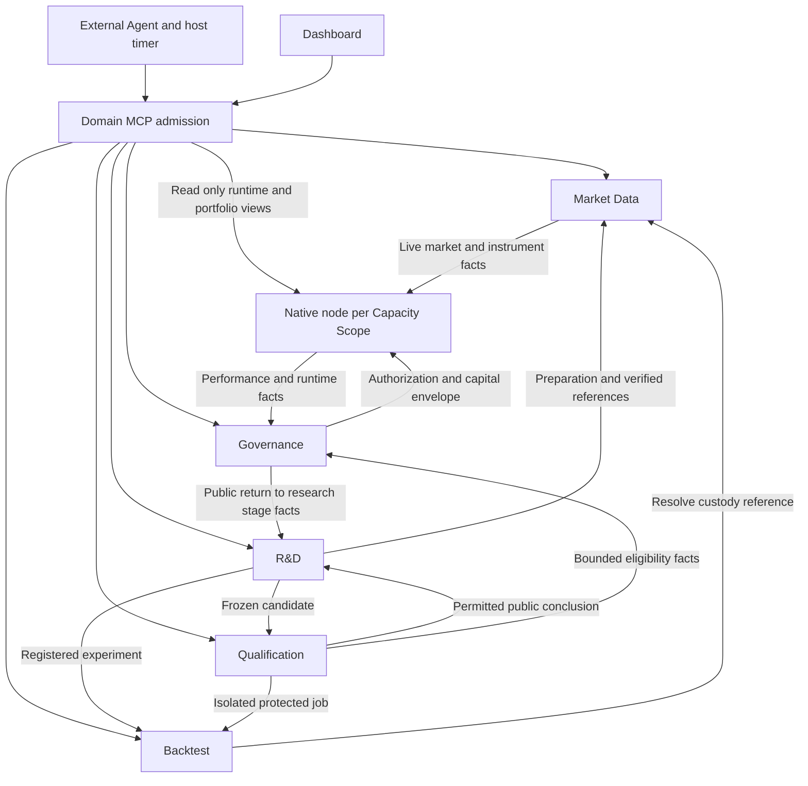

# Service architecture

## Blueprint scope and reading

The product has six logical backend service groups: Market Data, Backtest, R&D, Qualification, the Governance
control service and the native trading node. Dashboard is the first-party client and Product Edge; Event Rail,
databases and observability are supporting infrastructure. Six groups define capability, dependency and permission
boundaries, not six mandatory containers or processes. Physical packaging follows isolation, native-node constraints
and consumer evidence, rather than Owner or MCP counts.

This page defines the complete target blueprint and current entry points, not implementation completion. Data and
backtest extend retained Nautilus modules; R&D is custom. Trading also reuses the native node without a parallel
engine. Trial and formal stages both trade real money; their pools and lifecycle stages differ. Real trading,
protected deployment and new Dashboard slices require their own implementation and effect admission.

## Service topology

Edge denotes admission shared by domain entrances, not a mandatory new gateway process or one replacement MCP.
Internal calls use typed APIs, not nested MCP sessions; services do not reread another Owner's private database to
reconstruct authority. Event Rail conveys committed wakes and consumers read back facts. The bus owns no business
terminal state, recovery or approval.

## Responsibilities and facts

| Logical service group | Independent capability sets                                                                                                                                                      | Outputs and sole responsibility                                                                                             |
| --------------------- | -------------------------------------------------------------------------------------------------------------------------------------------------------------------------------- | --------------------------------------------------------------------------------------------------------------------------- |
| Market Data           | Instruments/economic terms; source admission and historical/live acquisition; file imports; PIT revisions, coverage and quality; native storage/aggregation and preparation jobs | Verified data references, gaps, revisions, availability times, preparation receipts and market read ledger                  |
| Backtest              | Frozen inputs/configuration; native event replay/matching; cost/funding/margin models; portfolio and trade reports; durable jobs/recovery                                        | Native run, order/fill and simulated account evidence, results and reports; no research or promotion decision               |
| R&D                   | Sources/knowledge; projects and frozen bounds; preregistration and trial/resource census; JSON authoring/Artifacts; diagnosis, successors, stops and takeover                    | Intents, Artifacts, experiment admission, immutable lineage and Iteration Decisions; no market or trading effects           |
| Qualification         | Independent candidate intake; protected protocols/partitions; eligibility assessment/revocation; bounded verdicts; isolated simulated forward evidence                           | Eligibility and protected facts; research receives only permitted conclusions, never values, reasons or internal categories |
| Governance control    | Registry; trial/formal stages and frozen conditions; pool ratios/equal allocations; lifecycle authority                                                                          | Governance decisions and capital envelopes; never activates Runtime                                                         |
| Native trading node   | Runtime signals; Risk admission/reservations; Execution orders/fills/reconciliation/recovery; Portfolio measurement/attribution                                                  | Actual trading/account facts in one native node, with distinct Owner write authority and no second account/order book       |

### Independent use and dependencies

- Market Data independently supplies instruments, preparation jobs and coverage. Market-value reads still enforce protected partitions and exposure accounting.
- Backtest consumes sealed Artifacts, admitted runs and verified data references without agent-driven internal orchestration. Exploratory and protected tasks share native semantics while credentials, read rights, caches, outputs and task spaces remain isolated.
- R&D independently registers, authors, reads knowledge and supports takeover; experiments depend on data/backtest. External Agents make model-based judgments; R&D contains no research model.
- Qualification needs no resident research Agent. It evaluates frozen candidates under preregistered protocols without iterating or activating them.
- Governance consumes eligibility, performance, matches and incident facts for lifecycle decisions.
- Each Capacity Scope has one native in-process trading node, including runtime, risk, execution, cache and portfolio. It does not depend on an R&D conversation or duplicate a complete capital pool. Missing authorization or freshness restricts new risk under existing contracts.

Capability sets have independent inputs, outputs and verification; they need not become microservices.
The target retains nine Owners: Market Data, R&D, Backtest, Qualification, Governance, Runtime, Risk, Execution and Portfolio.
Strategy Factory is a cross-service value flow; Product Edge is admission; Observability is projection/notification.
None adds a second authority for these business facts. The canonical contract projection retains legacy Scanner
identities for existing receipts; those are not a tenth target department.

## Minimal structure and dependency direction

Only independent fact authority, isolation or lifecycle requirements create responsibility boundaries. A feature
name does not automatically create a module, service or MCP process. Domain/product extensions depend on typed
values and ports, not Dashboard, MCP transport, database connection details or Agent sessions. Composition connects
native modules, storage and transports without remote data fetching or research orchestration in matching callbacks.

| Retained boundary               | Research story                                                                | What merging would lose                                            |
| ------------------------------- | ----------------------------------------------------------------------------- | ------------------------------------------------------------------ |
| Data versus replay              | Shared custody supports many experiments and independent preparation/coverage | Separate data revision/acquisition and run‑result lifecycles       |
| Replay versus R&D               | Native replay supplies evidence for many hypotheses; Agents decide successors | Evidence/decision separation and independently usable Backtest MCP |
| R&D versus Qualification        | Iterators cannot read validation/final detail                                 | One‑way separation of protected rights, caches and public feedback |
| Qualification versus governance | Qualification does not prove allocation, deployment or promotion              | Evidence/authority separation                                      |
| Governance versus native node   | Capital/lifecycle decisions do not prove application, fills or account facts  | Separate decision/application/effect readback and recovery         |

Knowledge, factor attribution and prediction calibration stay in R&D; diagnostics, trade cards and portfolio research
stay in Backtest reports; membership, macro/OI/funding and coverage stay in Market Data. Read-only market scans belong to R&D; Governance evaluates frozen deployment conditions directly without a separate
Scanner department. Discovery reuses compiled signal evaluation rather than creating a new scanning engine.
Subrules within a composite Artifact create neither departments nor independent account allocations; only actual
running strategy instances count in Governance pool division. No extra Orchestrator, Factor Service, Universe Service,
Gatekeeper Agent Service, Forward Engine or account ledger enters this blueprint without an independent user result.
Optional simulated Forward Record reuses Backtest, not a promotion stage or a second executor.
A database instance may host Owner schemas/roles, but departments exchange typed public operations or published facts,
never query private tables, perform cross-schema joins to reconstruct state or write another Owner's records.
Acceptance must demonstrate database permission isolation.

## MCP capability catalog

MCP names identify domain tool catalogs, not new services or Owners. Agents connect to admitted catalogs for their
missions. MCP, Dashboard and internal API paths enforce the same budget, eligibility, protected-data and unknown-result
rules. Detailed parameters/refusals belong to Owners and [Product Edge](./product-edge/#target---external-agent-tool-surface);
this table assigns responsibility rather than inventing published wire APIs.

| Catalog              | Service ownership                                 | Agent work                                                                               | Current and target boundary                                                                                                    |
| -------------------- | ------------------------------------------------- | ---------------------------------------------------------------------------------------- | ------------------------------------------------------------------------------------------------------------------------------ |
| `market-data`        | Market Data                                       | Discover, describe, admit, prepare, inspect coverage and read bounded values             | Dedicated stdio adapter exists; value reads are partition gated, while imports and full target preparation require acceptance  |
| backtest             | Backtest, with exploratory admission from R&D     | Submit runs, inspect status, reports and run lists                                       | Dedicated stdio adapter currently forwards to R&D `/v1/backtests`; no proof of independent Backtest deployment or complete R-1 |
| `strategy-authoring` | R&D authoring                                     | Validate, create, retrieve, revise and archive JSON strategy versions                    | Dedicated stdio adapter exists; narrow authoring is not full R&D, and complex semantics need versioned extensions              |
| research             | R&D research                                      | Admit projects/bounds, preregister families, inspect experiments/decisions and take over | Complete catalog is target; existing Source/Composer actions do not prove full integration                                     |
| knowledge            | R&D knowledge                                     | Find reusable factors/patterns, applicability, evidence and review conditions            | Target; no protected values stored                                                                                             |
| qualification        | Qualification                                     | Submit candidates and inspect allowed assessment/eligibility conclusions                 | Target; record‑only Forward Record is optional simulation evidence, not real trading trial evidence                            |
| governance           | Governance                                        | Read governance state, select trial/capital policies and resolve lifecycle requests      | Target; effects need approved policy/authorization, and automatic promotion creates no new trading permission                  |
| scan                 | R&D read‑only discovery                           | On‑demand discovery and results                                                          | Target; results grant no eligibility, deployment or trading authority                                                          |
| portfolio            | Native node Portfolio                             | Read account, NAV, performance, exposure and capacity                                    | Target read‑only catalog; no allocation or order writes                                                                        |
| operations           | Runtime/risk/execution/observability read surface | Read instances, readiness, orders/fills, drift and alerts                                | Target read‑only catalog; no arbitrary trading, kill switch or recovery writes                                                 |

Dashboard `/api/mcp` currently has five bounded tools for Source/Research, Composer, Replay custody and operations
readback. It adapts the same Owner operations, rather than forming a seventh research service or replacing the whole
target catalog. Standalone `video-note` is an external source-acquisition helper: the Agent reads notes and submits
source references to R&D; product services neither invoke it nor grant it product stores or trading credentials.
Windmill is not a deployment dependency; historical wire identifiers retain only their original record meaning.

## Data and state management

| Data or state                                                                        | Authority                                                      | Cross‑service handoff                                                                      |
| ------------------------------------------------------------------------------------ | -------------------------------------------------------------- | ------------------------------------------------------------------------------------------ |
| Market/instrument/economic terms, revisions, PIT availability and coverage           | Market Data extending native storage/catalog                   | Verified references and named gaps; Agents do not shuttle bulk market data                 |
| Projects, bounds, families, resource/trial census, Artifacts and iteration decisions | Durable R&D records; immutable Artifacts                       | Request identities, versions, content references and Owner receipts                        |
| Replay state, consumed inputs, results and reports                                   | Backtest jobs and native simulator facts                       | Recoverable job/run identities and result references; protected output uses isolated reads |
| Protected protocols, assessment details, eligibility and revocation                  | Qualification private store/permission domain                  | Allowed eligibility projections and opaque references only                                 |
| Stages, membership, conditions, policies, authority and capital envelopes            | Governance                                                     | Effective cut, generation and explicit authority, never trading credentials                |
| Actual orders/fills/positions/accounts/reconciliation                                | Native node; Execution exclusively owns venue effects/readback | Native facts and read projections, no parallel account ledger                              |
| NAV, costs, capital flows, performance and attribution                               | Portfolio from native facts and valuation inputs               | Versioned measurement evidence, never self‑assigned Governance allocation                  |
| UI, logs, operation runs, delivery and alerts                                        | Rebuildable projections, operation RunStore and outbox         | Locate/display/wake only; no proof of business success or recovery                         |

PostgreSQL roles, schemas, functions and permissions preserve Owner separation; sharing an instance grants no private
cross-read/write. Shared native code or images do not combine protected data, credentials or write authority. Native
cache owns orders, positions and accounts; added allocation/research records express policy or attribution, not a
second advancing engine. Retain input revisions, frozen versions and historical evidence. New data or Artifacts
create successors, never overwrite completed runs.

## How Agents and services complete work

### Research to backtest

1. The user approves theme, risk tolerance, data scope and spend bounds. R&D admits the project; concurrent Agents share product budget/census, with separate host model budgets.
2. The Agent selects sources, proposes a mechanism and falsifier, and preregisters families/experiments with R&D. Direct market reads enter Market Data's exposure ledger.
3. The Agent submits versioned JSON. R&D validates, compiles and seals the Artifact, delegating preparation requirements to Market Data internally.
4. The Agent makes one identified backtest request. R&D admits research; Backtest owns the job, resolves data references and runs native replay.
5. The Agent queries job/run status, results and reports. R&D admits diagnosed successors, stops or selection decisions; losing, failed and unknown attempts remain counted.
6. Nonqualified candidates stay in R&D. Selected frozen candidates receive independent Qualification assessment; protected details never return to the same research loop.

### Qualified backtest to real trial and formal operation

1. Frozen backtest criteria must pass before trial entry. The user confirms the exact candidate and frozen trial/pool policy in Dashboard; qualification alone never activates it. A qualified candidate may stay in R&D for improvement; the condition choice set remains undefined.
2. Governance decides stage, effective membership, allocation and authorization. Only Runtime application receipts prove actual operation, not UI success or request submission.
3. Runtime produces signals under shared strategy semantics; Risk admits against allocation, actual account funds and exposure; Execution uses native mechanisms to execute, record and reconcile.
4. Portfolio produces real net-return, sample and risk measurements; Governance automatically promotes on frozen conditions. Trial and formal pools divide equally among their own running instances.
5. Trial expiry without passing or failed formal retention unloads the strategy and returns it to R&D. Stop new entries and cancel entry orders; native residual management retains original position protections. Unload returns strategy budget immediately while actual margin still constrains new account orders.
6. R&D canonical strategy content hash identifies the version independently of research/run IDs. The user may unload a valid strategy for R&D improvement without inventing economic failure or revoking its qualification; no automatic reactivation follows. Changed successors requalify and receive new user-confirmed trials without inherited stage authority. Qualification, governance, application, risk and execution facts cannot substitute for one another.

Condition choices/thresholds, formal retention conditions and normative wire contracts
remain unresolved. These block corresponding runtime implementation, not the service boundaries on this page.
The [research scenario](../scenarios/research/#qualified-backtests-real-trading-trials-and-promotion) contains full business rules.

### Unattended work, takeover and unknown results

Host timers wake Agents for model-based next-round judgments. Service schedulers drive admitted data, replay and
authorized lifecycle work. MCP/chat closure does not terminate jobs. A new Agent resumes from project bounds, resource
commitments, trial/read census, Artifacts, jobs and iteration receipts rather than guessing from a prior conversation.
Same-identity/same-meaning recovery rejoins the same job; separate experiments with identical parameters still count.

Timeouts, response loss and restart are not failures: read back the original identity before making duplicate jobs or
releasing unknown commitments. The service Owner produces its job terminal state; economic conclusions and research
next actions belong to their business Owners. Unknown execution enters existing recovery fences; reconciliation cannot
revive old trading authority. Durable readback recovers missed notifications; bus delivery never proves fact commit.

See the [20 research story replays](../scenarios/research/#research-story-replay-and-capability-gaps) for source mapping, outcomes and failure paths.

## Architecture contracts and development slices

Start each development task at one handoff above. Name producer, consumer, input version, fact writer, normal result,
named refusal, unknown handling and restart readback. Acceptance starts with complete R-1 research/reporting, then
continuous dynamic B3 portfolios and carry/multi-leg funding stories, before connecting qualification, real trials
and lifecycle. R-1 orders, partial fills, staged exits and ambiguity resolution extend native replay; changing
membership or preparing finer data does not move a matching engine into strategy code.

Accept narrow current entrances, target protocols and whole journeys separately. MCP/type/native API source or a
local green test proves no target service deployment. Equal pool allocation is a new target policy; sealed priority
ranking/capped allocation retain their old version meaning, rather than being reinterpreted to implement the new
policy. Open project, dynamic membership, finer-data successor, funding-signal availability and promotion-stage
contracts need versioned Owner slices before their consumers are developed.

[Product Edge](./product-edge/) defines tools/admission; [capability adoption](./capability-adoption/) defines native
reuse; [Owner contracts](../owners/) define exact writers/refusals; [architecture rules](../guide/architecture-rules/)
define protection, authority and recovery; [Agent implementation](../guide/agent-implementation/) defines development
verification. The blueprint claims no implementation and replaces none of those contracts.
