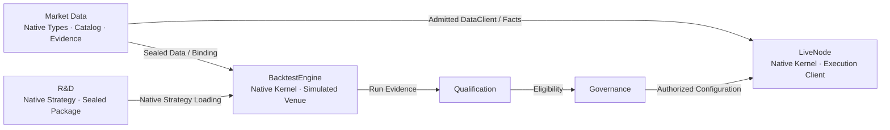
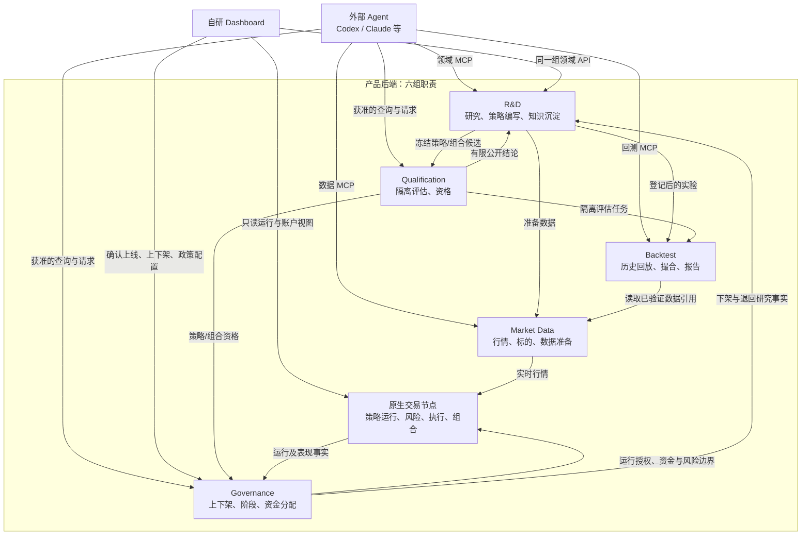
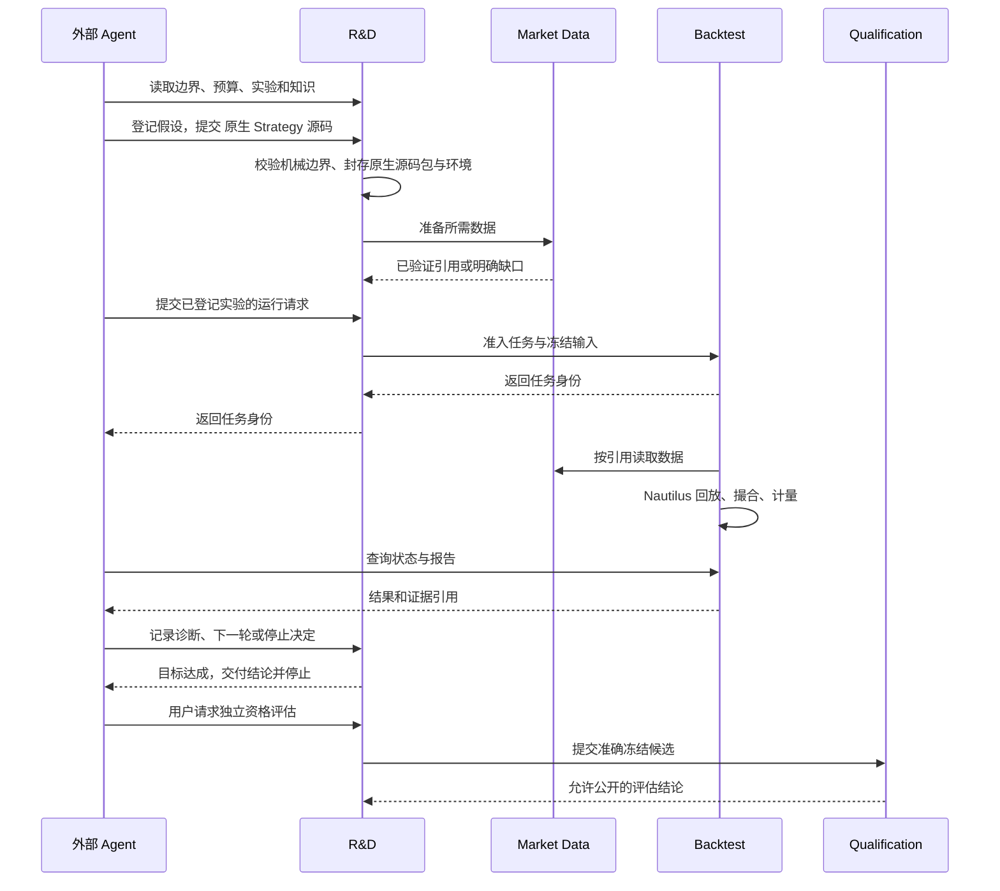
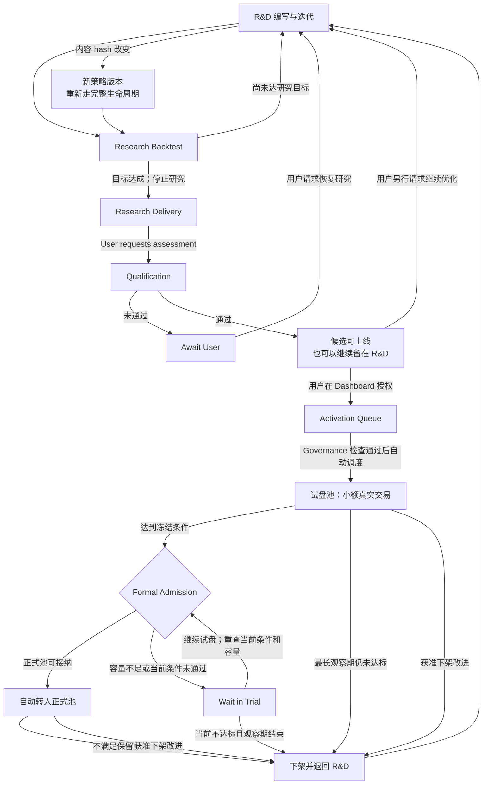
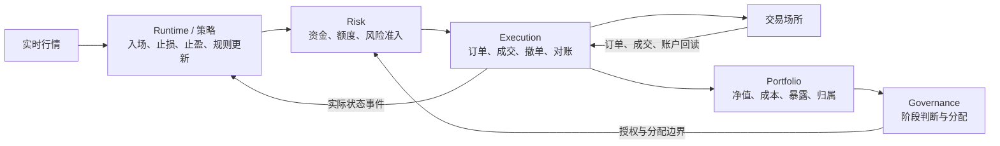

# 服务架构

## 产品定位与核心用户目标

产品帮助用户与外部 Agent，把交易想法研发成策略与投资组合，通过验证后进行受治理的账户运行，
并持续积累可复用的研究知识。单策略与投资组合都是核心研究和运行对象；投资组合不只是报告中的统计汇总。
数据准备、查询和回测的目标入口可通过 MCP 独立使用，不要求上线；当前只能使用目录中状态及准确准入/读回条件已满足的操作，接口注册不证明能力可用。

当前目标使用者是一个个人用户，由一个外部 Agent 协助研究和调用产品。多策略、多标的和投资组合
属于该用户的研究与账户运行需求，不意味着多用户共享平台或多个 Agent 同时协作。
产品保存研究状态与证据，允许更换 Agent 后继续同一研究；不把某个模型供应商或会话当作研究记录的所有者。
当前目标不要求共享托管、多租户计费或多人协作产品能力。

研究需求由用户直接向外部 Agent 提出，Agent 通过 MCP 发起和推进研究。 Dashboard 对研究进度、证据与 结果只读，不发起、暂停、恢复或终止研究，也不派发或控制用户电脑上的外部 Agent。
研究指令留在用户与 Agent 的对话中，已准入服务请求经 MCP 发出。 Dashboard 另提供已批准的 Governance 操作，包括确认上线、 政策配置和策略运行管理。 六组后台职责与 Web
Dashboard 默认部署服务器，本地 Agent 经领域 MCP 调用，浏览器查看服务端视图； 开发时仍可在本地启动。

用户电脑关闭或 Agent 额度耗尽，不停止可用服务器上已接纳的数据/回测任务和 已获授权策略运行；新的假设选择与研究编排等待 Agent 恢复。 后台任务与记录独立于会话，后继 Agent 先按原 job
身份解析在途任务与未知结果，再继续研究，不重复提交工作。

目标交易平台是币安，围绕币安实际提供的可交易产品开展多标的、多策略与投资组合研究和运行。
完整目标包括加密现货与合约，以及币安上以股票、大宗商品、指数等为标的的交易产品；先交付合约，现货后续支持。
Binance USDT 永续合约点时数据仍是首个端到端验收基线，不把首个样例限定为整个产品的标的范围。
多资产类别不意味着接入多个券商或传统期货交易平台；当前没有这类平台的产品目标。

按币安的[TradFi 产品说明](https://www.binance.com/en/academy/articles/tradfi-assets-you-can-trade-on-binance-futures)，
股票、大宗与指数等敞口可通过永续合约提供，不能将这些标的类别误记为直接持有股票、基金或实物商品。
产品按实际交易品种与合约规格处理数据、回测和运行，不因属于同一平台就假定所有产品共享可用保证金。
目标架构承接币安后续产品范围，不要求提前实现尚未进入交付范围的能力；某项 Nautilus 能力也不证明对应产品已接通。

| 用户目标                           | 完整结果                                                                                     |
| ---------------------------------- | -------------------------------------------------------------------------------------------- |
| 了解市场、寻找标的                 | 可追溯的行情、数据准备与按需机会发现                                                         |
| 研发单策略，包括多标的和动态选币   | 可重放的策略版本，连续持仓、成本与净值，以及支持后继迭代的证据                               |
| 研发多个独立策略共同运行的投资组合 | 同一账户和时间线上的联合回测，评估资金竞争、敞口重叠、成本、整体收益与回撤及逐策略贡献       |
| 改进投资组合                       | 按用户目标研究策略选择、资金分配及成员和版本变化对组合的影响，保留连续账户状态和可追溯配置   |
| 运行并持续改进策略与组合           | 用户确认试盘、冻结条件达标转正、运行管理、下架改进与恢复；研究证据和因子知识可供后续研发复用 |

投资组合也是自主研发对象。 用户给定收益与风险目标、研究范围和资源边界后，外部 Agent 可以在批准范围内 研究选择哪些策略、如何分配资金，以及怎样改进组合；产品提供联合回测、独立验证与可追溯证据。
产品既支持验证用户指定的组合，也支持寻找和比较组合候选。 研究通过本身不修改运行中的账户。 对于已运行策略，Agent 可以在用户事先批准的变更边界内，请求 Governance 采用通过评估的后继组合版本；
Governance 核验准确版本与适用范围、当前授权、额度、账户/风险事实和原生就绪后执行。 超出变更边界先由 用户确认。 新策略版本首次试盘仍须 Dashboard 确认，研究授权本身不等于运行变更授权。

组合研发比较收益、回撤、波动与夏普之间的取舍，允许以降低收益换取有证据的风险收益改善， 不要求组合收益率超过每个成员，也不保证分散必然降低回撤或提高夏普。 比较目标及收益/风险约束须运行前登记，
不将不同指标的数值变化直接相减，或按已见结果更改通过条件。

资格评估对象是完整策略。收益与对冲规则可封在同一策略内，例如现货多、永续空的资金费 carry；
各腿不分别申请资格、试盘、转正或账户额度，整体策略必须具有独立经济优势。共同运行的组合成员
均须取得完整策略自身资格，再评估联合组合；不设单独不合格策略的组合限定上线资格。
组合研发寻找有证据的风险收益改善，将缩小风险策略仓位作为适用比较基线；资格不能由研究解释或收益曲线替代。

一个策略交易多个币，与多个独立策略共享一个账户，是不同的用户场景。多策略组合回测必须在共同账户中
重放真实的资金和执行相互影响，不能拼接各策略的独立收益曲线。各成员单独合格也不代表共同运行的组合合格。
资格适用于已评估的组合定义和明确的适用范围；组合变化不能静默沿用不匹配的证据。

研究与验证覆盖策略和投资组合；试盘、转正、下架与返回研究的运行生命周期按策略成员分别管理。
组合拥有共同运行的定义、联合资格和资金配置约束，不新增一个要求全部成员同时转正或下架的组合阶段。
合格候选仍可继续研究而不上线；组合研究本身也不产生交易授权。Nautilus 提供数据、回放和账户运行基础，
产品扩展接入研究、独立评估与治理，具体服务边界在下文展开。

核心场景验收同时覆盖 R-1 的入场与退出研究、B3 的动态选币、多策略共同账户回测、组合成员和分配变化、
按需找币、因子知识复用，以及试盘到正式运行和下架改进。验收需分别证明单策略与组合用户路线可以跑通，
不能用单策略报告代替组合证据，或用架构图代替实现完成的证明。

## 里程碑与交付迭代

完整架构定义最终职责，交付按可用的用户流程推进，不按六组服务逐个铺满。每版只细化其验收故事所需的
功能与交接；未进入该版的能力保留目标边界，不提前搭建空模块、路由或独立进程。已有实现继续复用，
版本范围不代表现有能力被删除，也不代替单项实现准入或生产效果授权。

| 版本 | 用户可用结果                                                      | 范围状态                 |
| ---- | ----------------------------------------------------------------- | ------------------------ |
| V0.1 | 外部 Agent 经 MCP 完成 R-1 数据准备、策略封存、原生回测与报告回读 | 已确认范围，交付尚待验收 |
| V0.2 | 可比较实验、诊断与迭代记录、研究接管和知识复用                    | 已确认范围，交付尚待验收 |
| V0.3 | 单策略资格验证、确认试盘、自动转正、正式运行与退出恢复            | 已确认范围，交付尚待验收 |
| V0.4 | 多策略账户组合的联合研究/验证/运行、成员加入退出和整体资金分配    | 已确认范围，交付尚待验收 |
| V0.5 | B3 动态选币与按需找币，接入已有研究和受治理运行流程               | 已确认范围，交付尚待验收 |
| V0.6 | 币安现货/永续 carry 与其他已准入多腿策略形态                      | 已确认范围，交付尚待验收 |

### V0.1 - 可用的 R-1 数据与回测流程

第一版交付一个可重复使用的服务器端流程：外部 Agent 提交版本化原生策略源码包，最小 R&D 路径封存 Artifact 与
实验输入，Market Data 准备已验证的 Binance USDT 永续点时历史，Backtest 执行 Nautilus 原生回放，
Agent 按任务身份读取状态、成交、账户结果与报告。Agent 可在冻结边界内继续修改策略、提交新实验并
自行比较结果，各轮保留准确版本和独立证据。本版不要求先完成完整研究管理、项目级接管和知识复用，
这些交付保证属于 V0.2；假设、诊断与迭代始终由 Agent 决定。首版交付终点是 Agent 经 MCP
读回完整结果并向用户解释；Dashboard 回测报告页面不作为 V0.1 验收条件。Dashboard 的研究视图仍只读。

- 验收采用[R-1u 与 R-1s](../scenarios/research.zh.md#r-1-挂单与分段退出)：限价等待与撤单、止损、冻结目标、
  分段退出与保护更新由同一原生语义处理；具体数据范围和执行能力在实现切片开始前明确。
  R-1 是验收故事，不是策略白名单；Agent 可自由编写使用首版已支持数据和执行能力的原生策略，
  不按策略名称或固定模板限制研究。未接入的数据或执行能力返回具名缺口，不宣称所有原生能力已可用。
  策略使用项目统一维护的固定版本运行环境；Agent 可查询环境与可用库，缺库由项目统一扩充，
  首版不为各策略安装不同依赖或构建独立环境。策略包绑定准确环境版本，更新不覆盖旧绑定。
- 首版允许提交多个独立回测任务，按服务队列逐个执行，同时最多执行一个回测；并行执行不是首版要求。
  各任务分别保留冻结输入、身份、状态与结果，排队不替 Agent 选择参数或发起新实验。
- 首版从明确的初始资金、空仓和无挂单开始，不导入已有持仓或挂单。所有回测均不支持期间充值提现。预热只建立指标和策略计算状态，
  不产生订单、成交或资金费等交易账户变化；正式回测区间才允许交易。
- 首版支持一个策略交易用户指定并在运行前冻结的一组标的，在同一账户时间线上回放资金占用、订单与持仓，
  输出整体净值、回撤及逐笔记录；不能用各币独立回测曲线拼接替代。主最大回撤按一分钟账户净值采样计算，
  日末回撤另列，包含未实现盈亏及已发生费用，不声称捕获分钟内全部极值。Agent 可按准确运行身份与时间范围
  分批读取同源的一分钟账户净值序列，自行分析回撤/恢复及其他指标；不只返回摘要或日末曲线，
  不另建净值账本，也不要求保存宿主图表。多策略共同账户组合仍在 V0.4 交付。
- Agent 先准备或复用初始数据，取得可用的准确数据引用后再提交回测；准备与回测各自持久执行已接纳任务。
  准备完成不自动创建回测，Agent 断线后也不代其发起尚未提交的下一步；已有可用引用可直接用于回测。
  部分准备失败保留已准入数据，Agent 查清原任务状态后只补齐缺失部分；补齐任务关联原记录，
  全部冻结需求满足后才提交回测，不因失败静默减少标的或缩短区间。
  V0.1 不提供主动取消准备或回测任务的 MCP 能力；已接纳任务在资源边界内执行至完成或失败，状态与结果仍可查询。
- 首版数据入口为 Market Data 准备并托管的币安历史数据；外部 CSV/GZ 导入保留为后续交付能力，
  不作为 V0.1 验收条件。已有研究文件可供 Agent 参考，不能直接作为已准入行情交给回测。
- 数据、资金费、手续费、滑点、保证金与期末未平仓估值须有准确引用。成交歧义遵守既定政策，缺失输入
  不伪造完整结果。永续持仓的未实现盈亏和期末净值使用历史标记价估值，成交模拟仍使用成交行情；
  缺失或无效标记价明确返回缺口，不静默回退为成交价。首版验收不要求提前覆盖全部市场、动态选币、多腿或全部原生执行能力。
- 首版提供已准入普通研究行情的有界读取，返回可追溯的数据版本并记录读取范围。Agent 可用自己的脚本
  检查 K 线、计算指标和提出候选规则；产品不增加分析引擎。保护样本不通过该入口公开，正式回测仍执行原生策略。
  首次研究读取前批准并冻结研究/保护范围；Market Data 执行分区和记账，R&D 关联范围与暴露。
  首版不提前实现完整资格评估，Qualification 仍在 V0.3 接入；已见数据不能重新标为未见样本。
  缺少足够未见保护数据时，仍允许在已批准研究范围内准备、回测和迭代，明确记录资格证据缺口；缺口阻止资格通过，不阻止研究。
- 首版回读同时包含订单、成交、拒绝、账户事实和有界策略诊断日志。复用 Nautilus 日志能力，
  由 Agent 在策略里记录必要信息并解释；诊断日志绑定运行身份，不作为独立成交或账户事实的替代证据。
- K 线回测统一以一分钟行情执行撮合，策略通过 Nautilus 原生订阅获得所需的大周期聚合 K 线。
  不另填重复的周期需求表，也不执行局部精度切换；回测日期、预热范围和非 K 线经济输入仍须明确。
  策略包、运行配置和数据引用共同保存分钟版本、原生聚合设置与运行环境，不增加独立配置系统。
- 首版保留最小研究项目：保存用户目标、批准范围与资源边界，并关联策略版本、实验、任务及结果。
  Agent 可在同一项目内连续迭代，并为实验附加可查询的假设、解释和下一步说明。R&D 用固定记录结构保存
  项目/实验归属、准确证据引用、作者、时间和更正关联；正文自由组织，不要求诊断模板。
  不提前要求 V0.2 的完整接管、知识复用或研究管理界面。
- 必需的输入封存、完整试验计数、资源边界、任务持久化与原身份重启回读随流程交付，不能因完整 R&D
  循环后置而省略。断开 Agent 不取消已接纳任务，未知结果先解析，不重新提交一份无法关联的运行。
  原身份恢复指任务与结果回读，不要求回测中间状态的断点续算；已有完整结果直接读取。确认原运行已中断后，
  Agent 可用相同冻结输入提交关联原记录的新完整运行；原尝试与资源消耗保留，重跑计入资源台账。
- 首版交付最小 R&D、Market Data 与 Backtest 交接，不要求先完成 Qualification、Governance 或真实交易
  节点的全部产品接口。回测报告不宣称独立资格、经济优势或交易权限。
- 性能验收参考 research 的 R-1 扩展研究：约 50 个标的、约五年历史，一个策略在同一账户时间线回放。
  research 的 17 个主流币加 36 个扩展币提供规模依据；验收清单须冻结实际永续标的、区间、点时有效性、预热、
  一分钟成交行情、历史标记价和经济输入。上市前或退市后不伪造完整覆盖，不沿用原型的局部分钟精度。
  分开测量首次准备、缓存复用、输入加载、原生回放、统计及结果回读，记录硬件、耗时、峰值内存与资源消耗；
  不以小样例证明该规模可用，也不在测量前承诺秒级响应。资源超限明确失败，不截断数据输出貌似完整的收益。
- 完成条件是实际 MCP 请求打通准备、封存、运行与回读，正例、具名拒绝和恢复均有证据，受影响的有序
  Owner 链通过 Linux CI。源码入口、局部测试或架构图不代替交付验收。

V0.1 按该流程拆为连续可审查的纵向切片，复用既有生产者与原生组件。六版用户收益与顺序已经确认；后续版本进入开发前再按该目标冻结具体切片与验收，不作为当前实现清单，不承诺未经测量的工期。

### V0.2 - 研发效率与可持续迭代

在 V0.1 可用回测上，交付外部 Agent 可持续推进的研究流程。用户给定研究目标和冻结边界，Agent 登记
假设与比较方案，提交受支持的策略变体，读取可比较结果，提出诊断和下一轮/停止建议；R&D 核验机械边界并保存
准确的实验、证据血缘与迭代决定。模型判断仍在外部 Agent，服务器不内置研究模型或唤醒本地会话。

V0.2 的比较入口是外部 Agent：MCP 提供完整获准结果及准确实验引用，Agent 用宿主工具做图、
计算对照和解释差异，再将结论与依据保存到 R&D。Dashboard 展示进度和结果；专门的实验勾选、
并排指标与叠加净值比较界面后续交付，不作为本版验收条件。

- 实验比较覆盖已支持 R-1 变体的入场、过滤与退出对照，绑定数据、资金和执行基线，保存完整变体计数；
  正收益、负结果、样本不足、执行缺陷和未知结果不能混成同一个结论。更改通过标准仍先由用户批准。
  Agent 在宿主进行的形态统计等探索分析也可查询，保留假设、测试说明、结论摘要、已有依据引用与局限；
  可复用结论进入 Knowledge，不要求保管图表或其他非策略中间文件。明确标识外部执行及证据状态，
  不冒充产品回测，也不新增服务器分析引擎或探索产物存储能力。
- V0.1 恢复一个任务的状态与结果；V0.2 让更换后的 Agent 能恢复项目目标、冻结边界、已做实验、最近
  已提交决定和未决任务，从证据继续下一轮。源码与未完成草稿由 Agent 推送到用户指定的 Git 仓库；
  R&D 记录准确仓库、commit、路径和下一步，产品保留实际执行的不可变策略包。未推送的本地改动不属于跨宿主接管保证。
- 从公开可用研究证据登记因子/规则知识及适用范围，支持同一用户跨研究项目检索并在新实验中引用，保留来源和适用范围；负证据保留，知识引用
  不继承资格，也不替代新策略回测。保护数据与内部资格诊断不进入知识或提示词。
- 资源限额、完整试验/数据暴露台账与原身份恢复沿用既有职责；知识、诊断和接管属于同一 R&D，
  不新增优化器、知识服务、扫描调度服务或 Agent 宿主。
- 验收以连续几轮 R-1 比较与一次 Agent 接管证明：比较可重现、决定引用准确结果、未知任务不重复执行、
  已记录知识可供下一次实验检索引用。没有经济优势时继续研究或按冻结规则停止，不授予真钱权限。

本版提高已有策略形态的研发效率，不要求先实现全部市场与策略语言。账户组合、动态选币、现货/多腿
和真实试盘按后续里程碑接入；每版的受限能力与缺口明确可读，既有已可用功能继续保留。

### V0.3 - 单策略完整运行生命周期

把已支持的一个完整策略从研究接到服务器上的真实试盘。用户请求独立验证后，Qualification 接纳选定冻结候选，用隔离的
保护证据独立判断资格；用户在 Dashboard 确认准确版本、试盘条件、资金和运行授权；Governance 校验
当前资格与账户条件，原生交易节点执行获准策略。试盘满足冻结条件后自动转入正式池，正式运行按冻结的保留与退出规则管理。
研究通过与 Dashboard 确认都不单独证明已经运行，阶段变更须有 Governance 决策和节点应用证据。

- 先走通专用账户的一项运行策略，不以多个独立策略的组合评估、成员等待队列或全部市场产品为交付前提。
  同版交付两池政策、冻结条件核验、自动转正与正式运行退出；转正不改写策略 hash，不另造信号策略。
- 用原生 Runtime、Risk、Execution、Portfolio 处理信号、资金/订单约束、真实成交与账户归属；复用回测的
  已准入策略语义，不新写执行、风险或账户引擎。实际差异、拒绝与未知结果可检查，不宣称回测收益等于实盘。
- 显示授权与节点应用、订单/成交、费用、资金费、敞口和表现；支持停止新入场、撤销未成交入场单，
  已有持仓按原保护退出。残余资金/风险仍按实际事实核算，重启恢复不重复下单或丢弃保护义务。
- 验收覆盖资格、确认试盘、条件达标与未达标、自动转正、正式运行及退回 R&D 的连续交接，也覆盖用户
  主动下架有效策略改进、已成交持仓保护和原身份恢复。未通过试盘不得直接进入正式池。真实执行
  验收另需明确的钱包/账户效果授权；本里程碑文档本身不授予生产部署、交易凭据使用或下单权限。

### V0.4 - 多策略账户组合

在 V0.3 单策略运行上，交付多个完整策略共享账户的研究、独立验证与实际运行。先使用已支持的策略形态
与固定标的范围，不要求先完成 B3 动态选币或现货/多腿。R&D 封存一份独立组合配置，Backtest 重放共同
账户，Qualification 独立验证组合及退出预案，Governance 采用获准配置，原生交易节点统一核算实际交易。

- 组合回测包含共同时间线、资金竞争、预留、拒单、费用、风险和逐策略贡献，不能拼接独立净值；比较
  目标先登记，组合选择失败仍留在 R&D。成员自身资格和账户整体组合资格分别成立。
- 每个账户只有一份生效组合配置，覆盖试盘/正式池运行成员，包含成员退出后的残余持仓保护。成员
  生命周期仍独立；配额收缩前核验实际占用，不满足时等待准入，不为新成员强制处置旧成员。
- 交付组合版本迭代及允许状态内的加入/退出预案。已有运行策略的后继组合可按用户事先批准边界由 Agent
  请求 Governance 切换；新策略首次试盘仍由 Dashboard 确认，未覆盖变更先评估，不阻塞已有持仓保护。
- 验收从两项受支持的完整策略开始，证明联合回测/资格/运行、实际容量不足的等待、成员下架与保护退出，
  以及恢复和版本切换；样例不承诺策略盈利或组合一定优于成员。以后加入 B3 时再验证动态成员故事，
  不以本版固定范围验收声称完整 B3 已交付。

### V0.5 - B3 动态选币与按需找币

扩展已交付的研究和运行流程，使一个策略能按冻结的点时规则改变标的，并让 Agent 按需查询市场机会。
Market Data 提供历史成员、可得时间和排序所需输入，原生策略语义应用选币与持仓处置规则；Backtest
保留连续账户，Qualification 和 Governance 继续约束策略版本与适用范围。

- B3 验收覆盖固定与动态成员的可比回测、历史上架/退市和成员变化后的挂单/持仓处置；不按月重置
  净值，不事后挑币，不以今日成员回填历史。将 B3 加入既有账户组合时，再验证相应整体组合与转换。
- 按需找币直接复用 Market Data 查询，有状态判断复用 Backtest 原生回放，R&D 按需保存研究引用，返回完成/排除/缺口及可追溯信号；不借用
  真实实例的可变状态，不产生部署提案或交易授权，不增加定时 Scanner。运行策略仍自行消费实时行情。
- 验收连接历史回放、只读发现和获准策略运行，证明同一冻结定义与可得数据语义一致。动态选币改变
  策略编写内容时仍重新走资格与生命周期，不因加入本版而继承其他策略资格。

### V0.6 - 现货与永续多腿策略

在既有研究、组合及治理链路上接入币安现货，首先以现货多/永续空的资金费 carry 验证完整多腿策略。
扩展原生 instrument、数据、账户/场所客户端与策略订单映射，不建立第二个撮合、风险或账户系统。

- 两腿属于同一完整策略 Artifact、hash、资格与生命周期；经济性按整体净收益、成本、风险和资本占用
  评估，不要求每腿单独盈利，也不把它们建成两个独立组合成员。
- 数据区分资金费结算与历史可得信号，按各产品实际费用、保证金、资金和账户 scope 核算；同属币安
  不证明保证金共享。实际部分成交、单腿失败与未对冲敞口保留，不能虚构原子双腿成交。
- 验收从历史多腿回放到隔离资格、用户确认试盘及获准运行，并验证单腿异常后的冻结处置和恢复；沿用
  既有转正、下架与账户组合约束。其他复杂腿形态仅在有具体故事和原生接入证据时扩展。

### 设计与开发顺序

六版顺序已确认，完整目标与当前版本范围分别可读。近期内部设计只展开 V0.1 的用户流程、必要功能集、
接口和原生接入点；V0.2-V0.6 先固定职责、输入输出边界与验收故事，在对应版本进入开发前再细化。
每版拆成可审查的纵向切片，先核验已有实现与真实缺口，再补齐生产者到消费者的交接，不把整层模块
全部搭好当成阶段成果。已有功能可先复用，某项后续能力确属当前必要依赖时，只纳入最小依赖并说明证据，
不以通用基础设施为名把后续版本整体前移。

R-1 数据/窗口/订单忠实性故事主要验证 V0.1；实验比较、接管与知识故事主要验证 V0.2；资格与运行故事
验证 V0.3；共享账户组合与分配验证 V0.4；B3 和按需发现验证 V0.5；资金费信号与多腿 carry 验证 V0.6。
形态库扩充、宏观事件、非交易机制统计和更多来源，按具体研究需求增量进入已有职责；它们不作为首版
前置条件，也不因六版路线已定而宣称全部原始研究机制已经支持。

版本完成须有实际服务请求/回读、对应场景与故障恢复证据，以及受影响的有序 Owner Linux CI 验收；
局部构建不证明交付。该路线固定先后与成果，不承诺未经当前依赖测量的日期。

## 设计边界与阅读方式

### 蓝图范围与阅读方式

产品扩展当前 Nautilus 的数据、回测与交易组件，并接入自研 R&D。
新增职责包括研究、隔离资格评估、生命周期/额度政策和数据/运行托管，通过 MCP 和 Dashboard 提供入口。
六组职责不规定引擎、容器或进程数量；装配依据原生 kernel、权限隔离和消费者证据。
通知、数据库与观测设施不拥有行情或账户事实。具体接入点见[能力采用](./capability-adoption/)。

本页定义完整目标蓝图及当前入口，不把目标能力当作已实现。试盘和正式阶段都是真实交易，只是资金池与生命周期不同。
真实交易、保护评估部署及新增 Dashboard 切片仍须各自的实现和效果准入；当前文档不接通这些效果。

<a id="agent-first-and-minimal-deterministic-services" />

### Agent 优先与最小确定性服务

外部 Agent 负责需要判断和适应的工作；产品只实现必须稳定执行、持久保存或强制约束的能力。
这项原则贯穿六组服务与各版本开发。新增代码须对应具体用户故事中的确定性需要，先复用 Nautilus，
再复用已有服务能力；Agent 能通过现有工具完成的研究工作不新增后台模块。

#### 参数与工具

- Agent 选择假设、策略源码、实验参数、比较方法及下一步；服务执行明确请求，返回事实与引用。
- 确定运算开放有类型的参数入口，校验支持范围并记录实际使用值。研究参数不要求预先入配置表，
  不为参数搜索、研究方法或指标偏好新增平台专用注册表、预设库和决策状态机。
  Agent 可使用宿主已有工具或编写分析脚本完成探索性计算；计算具有确定性本身不要求新增产品服务。
  只有共享执行、托管、性能或权限边界确有需要时，才扩展现有服务的运算能力。
- 影响经济结论的模型、费用、窗口和执行政策须明确选择，或引用已经明确选择的冻结配置。
  原生默认值如被采用，必须展开并封存实际值；不能让默认值变化悄悄改变结果。
- 必要配置保留准确的作用：请求的冻结副本用于复现，用户批准的政策用于约束授权运行。
  已确认的 Dashboard 试盘条件模板仍属于治理政策，不成为研究方法模板。
- 工具按清晰任务组织，避免职责重叠和逐个包装全部底层 API。一次准备或回放可包含必要的确定步骤；
  研究顺序与分支选择留给 Agent。MCP 不开放跨越 Owner、保护数据或交易授权的任意执行入口。
- 返回有界摘要、任务身份和准确结果引用；细节按需读取。返回可修正的输入缺口与实际失败原因，
  不要求 Agent 猜默认值、读取全量数据或把服务失败重新解释成研究结论。

#### 用户故事中的分工

| 用户故事       | Agent 负责                                   | 确定性服务负责                                       |
| -------------- | -------------------------------------------- | ---------------------------------------------------- |
| R-1 参数迭代   | 提出各组参数，提交实验，比较结果并选择下一轮 | 封存每次输入，在预算内排队/执行原生回放，保存报告    |
| 因子与统计研究 | 选择检验方法、解释正负证据、提炼知识         | 提供获准数据与已有原生统计，保存来源、方法版本和结果 |
| 按需找币       | 给出过滤规则，解释机会                       | 执行受支持的冻结过滤/原生规则，返回覆盖、结果和缺口  |
| 换 Agent 接管  | 读取记录，决定继续方向                       | 保存项目、未决任务、实验和证据，按原身份恢复         |
| 策略试盘与转正 | 在授权内提出候选或改进方案                   | 执行用户批准的资格、阶段条件、额度与账户约束         |

确定计算、批量读取、任务排队、幂等恢复、资源限额、保护隔离及无人值守交易仍由程序承担。
上线后的原生策略、Risk、Execution 与 Portfolio 持续工作，不等待 Agent 在线判断每笔交易。
验证使用完整用户故事的实际调用、结果和恢复行为；不固定 Agent 的调用顺序、措辞或研究路径。

官方依据：Anthropic 的 [Building effective agents](https://www.anthropic.com/engineering/building-effective-agents)
建议从简单可组合模式开始；[Writing tools for agents](https://www.anthropic.com/engineering/writing-tools-for-agents)
强调少量职责明确的工具、有效错误与真实任务评估；
[Context engineering](https://www.anthropic.com/engineering/effective-context-engineering-for-ai-agents)
支持以轻量引用按需读取上下文。[MCP Tools](https://modelcontextprotocol.io/specification/2025-11-25/server/tools)
提供输入/输出 schema 与结构化结果。上述 Trade 分工是结合用户故事的产品设计，不是这些资料规定的交易架构。

## 服务设计

### 首页交互蓝图

文档首页默认展示六组服务、外部 Agent 和 Dashboard，连线表示领域 MCP/API 与服务交接，不能把
Owner、MCP 或内部功能数量读成部署进程数量。点击服务展开内部流程、API 能力和对应设计章节；
点击连线解释交接。场景切换按用户故事组织：研究迭代、R-1 回测、按需找币、试盘转正、下架改进和故障恢复。
不相关服务与交接降低强调，相关步骤保持可读；返回全景恢复完整拓扑。中英文共享同一结构。

首页和本页定义当前正确目标，不以旧接口、历史 Scanner 或 Paper/Live 划分组织蓝图。兼容与迁移属于开发任务，
不新增历史展示层。图的文案、流程和文档链接必须一起更新；图不证明实现完成或授权真实效果。

### 服务内部职责

#### 原生基础与服务装配

Backtest 的全部版本只使用冻结初始资金，不支持运行期间充值提现或其他外部资本注入/提取。
交易盈亏、费用、资金费及账户内部资金分配按原生链路回放。真实账户入出金由 Execution 对账、
Portfolio 区分资本流与交易收益、Governance 更新分配，不借回测服务重建该链路。

六组是产品职责视图，不是六套独立执行系统。装配从原生 kernel 出发：`BacktestEngine` 与 `LiveNode`
各自包含 DataEngine、cache、clock/msgbus、Trader/Strategy、RiskEngine、ExecutionEngine 和 Portfolio；
回测接模拟场所，交易节点接获准的场所客户端。不能将 DataEngine 抽出节点、令每根 K 绕行远程 MCP，
也不能为回测复制一套资金或订单引擎。

Market Data 管来源、标准数据、catalog、准备与数据证据，交付已准入输入与客户端配置。 节点中的 DataEngine 管消费、订阅与派生，不是第二个数据部门。 可以在该 kernel
内装配原生端口，或采用 已验证的类型化 DataClient 桥接；原生 msgbus 不等于跨服务协议。 远程实时桥接仍须证明顺序、连续性、 背压与重连，不默认已接通。 探索、保护与真实运行复用组件代码，各自隔离
clock、cache、权限及状态。 当前 kernel 注册线程内 msgbus；不能因可以创建多个 engine 对象就假定同线程并发 kernel 彼此隔离。

任务隔离须覆盖原生总线和线程上下文，未证明时使用独立 worker 进程。 同一不可分割真实账户由一个节点核算；试盘/正式两池是 Governance 的逻辑额度，不各开一个节点或原生账户。

每个 kernel 内部保留原生数据、风险、执行与账户路径；图中的服务交接不复制这些组件。
格式、入口及拒绝条件由[能力采用](./capability-adoption/)统一约束，后续章节从该接入关系展开。

首页节点标题统一使用简短英文；中文说明、API 与设计入口留在节点详情中。每个服务大框内部显示其二级职责，
不再用一条服务摘要替代内部组件。这些是服务内的功能边界，不增加服务、进程或跨部门私有数据库访问。
功能组件清单与流程步骤分别描述谁负责什么和任务按什么顺序推进，不能把每一步都新建成组件。

| 服务          | 二级节点                                                | 职责边界                                                   |
| ------------- | ------------------------------------------------------- | ---------------------------------------------------------- |
| Market Data   | Sources · Instruments · Catalog · Preparation · Streams | 来源、标的、托管、准备与交付；不定义策略信号               |
| R&D           | Projects · Authoring · Experiments · Knowledge          | 研究事实、策略编写、实验决定与知识；不撮合或授予交易权     |
| Backtest      | Admission · Replay · Results · Reports                  | 扩展 Nautilus 回放；报告源于封存结果，不新增成交或账户引擎 |
| Qualification | Intake · Protocol · Assessment · Eligibility            | 隔离证据与资格；Assessment 调用 Backtest，不自建引擎       |
| Governance    | Policy · Lifecycle · Allocation                         | 冻结政策、阶段和资金分配；不直接管理订单                   |
| Trading Node  | Runtime · Risk · Execution · Portfolio                  | 四种原生职责共用一个节点，各自保留事实写权                 |

### 共享账户的组合评估

产品使用专用币安交易账户，所有交易订单和持仓由产品管理；用户充提资金仍受支持，不以手工交易
与策略共存作为产品路线。意外订单、持仓或归属缺口进入对账与恢复，不作为另一个策略，也不凭空推定
归属。核对期间账户事实仍计入真实敞口。

多个独立策略共同运行前，必须先通过共享账户的组合评估。单策略资格只证明该版本自身符合条件，
不能替代组合资格；两个单策略的净值曲线相加也不能作为组合回测。此规则适用于试盘与正式阶段的共同运行，
不改变首次试盘仍需 Dashboard 用户确认的要求。Qualification 在未向研究侧暴露的保护数据上独立验证
共同运行与冻结退出预案，复用同一 Backtest 服务并隔离输入与输出；研究中挑选组合的联合回测和成员通过
均不能替代该证据。暴露沿革须覆盖成员研发与组合搜索，独立证据不足不能授予资格，研究侧只见允许的
二级反馈。

R&D 冻结组合方案：成员的准确策略 hash 与 Artifact 引用、账户初始状态、试盘/正式池政策、
等额分配规则、账户风险限制、数据区间、成本和执行配置。每个交易账户只有一份生效组合配置，覆盖试盘
与正式池的全部运行策略，退出预案计入下架后仍受保护的残余持仓；不设独立运行的 AB/CD 组合组。R&D
可以研究任意成员子集，但实际采用须有覆盖加入后的账户整体组合及转换过程的评估，子集通过不能授权
它与账户中的额外成员共同运行。

R&D 拥有独立、可版本化的组合配置及其内容 hash，
引用准确成员 Artifact 和已批准政策版本，并包含共同运行与成员退出预案；它不嵌入成员策略，也不由 Governance
重新编写。修改该定义产生后继组合版本，不改变成员 hash。Qualification 将独立资格绑定该版本，Governance
记录批准的运行绑定，应用已覆盖转换而不修改冻结定义。单策略多币、双腿交易与多个独立策略共同运行是不同输入形状。

| 服务          | 组合故事中的交接                                                                     |
| ------------- | ------------------------------------------------------------------------------------ |
| R&D           | 保存 Agent 的组合实验、比较目标及选择；封存成员、共同配置与证据                      |
| Market Data   | 按所有成员的需求准备已验证输入，保留各成员的窗口、点时可用性与覆盖，复用可共用的数据 |
| Backtest      | 在同一 Nautilus 回测系统中运行全部成员，使用共享账户、连续时钟、原生执行与组合核算   |
| Qualification | 调用隔离 Backtest 评估组合，资格绑定准确组合方案、协议与证据；公开反馈仍保持二级封口 |
| Governance    | 核验成员资格、组合资格、有效用户授权、当前额度与账户事实，再决定共同运行授权         |
| Trading Node  | 应用获准成员与配置，共享风险/执行/账户核算，提供账户表现与逐策略归属                 |

**R-1 + B3 验收故事。** 两个版本各自合格后，登记共同运行方案；按两个成员的真实历史需求准备数据，
在同一账户时间线上回放。两个策略同时请求入场时，资金预留、保证金、费用、拒单和执行顺序必须真实影响后续持仓与净值。
报告同时给出账户净收益/回撤和逐策略贡献；组合评估不通过时留在 R&D，不能凭各自合格启动共同运行。
通过后仍由用户在 Dashboard 确认试盘，Governance 才可在其他准入条件满足时授权。

新成员加入前须冻结并验证共同运行规则与常见成员退出预案，覆盖两个都运行、任一独立运行，以及
已下架成员仍有受保护持仓的过渡状态。预案绑定成员版本、分配规则及已评估资金/风险边界；Qualification
提供明确覆盖证据，Governance 结合当前事实按获准范围切换，不在每次已覆盖变化发生后重复评估。
超出范围时须在接纳新增风险前重评；仅公式未变不能证明覆盖，新成员、政策变化或未验证状态不能沿用
失配证据。共同运行须满足预登记比较目标；退出预案满足冻结的继续运行约束，不要求优于完整组合。
具体规范合同仍需完成。
停止、撤销入场单与维护已有持仓保护不等待新的组合评估；残余敞口仍计入共享账户风险。

分配以当前账户净权益为基数，按批准的两池比例和运行实例数动态计算额度；交易所可用保证金是实际执行的硬约束，
不是分配基数。新增成员前，所有受影响成员的持仓、有效挂单和未完成预留均须满足后继额度；
不满足则请求进入 Governance 等待准入，旧成员和旧分配保持有效，等待者不占运行额度。
条件满足后重新检查当前资格、授权、资金与占用，再统一接纳后继分配并启动新成员，不为加入强制减仓。
策略不各自维护余额。Risk 保留各实例额度及共享账户总约束；权益压缩造成的超限仍按现有规则处理。

池内等分保持默认。分数凯利可以作为 R&D 的可选仓位/资金政策研究，先与固定风险基线比较；
只有经过独立评估并由用户批准的准确政策版本才能用于运行。单笔损失风险、名义仓位和保证金占用须分别计量，
凯利输出不得直接当作保证金比例。策略间采用非等额分配还须评估完整共享账户组合及相关性，不能拼接各策略凯利值。
所有政策继续受额度、账户风险、评估适用范围与新增成员等待准入规则约束，不新建凯利服务。

单笔规模支持固定保证金比例与固定计划止损风险比例，不设默认。新建研究或运行配置必须明确选择模板与参数；
复用时绑定已有明确选择的冻结配置，不能按策略类型、上次选择或服务端默认推断。缺少选择时不准入。
模板和参数必须与回测/运行配置绑定。
部署验收重放完整的账户政策环境，包含两池分配、规模计算、Risk 预留/拒绝和等待加入，不只回放策略信号。
同一政策逻辑复用原生内核，历史输入与模拟适配器取代外部接口；真实试盘用于记录并解释模型与实际执行的偏差。

原生多策略注册是基础能力；现有单 `strategy_id` 回测入口和单 Artifact 资格绑定尚不足以完成这个故事。
实现应扩展组合输入、原生接线、结果归属及资格引用，不增加服务、第二撮合引擎或第二账户账本。

### 服务拓扑

图中的 MCP 和 API 是各领域入口，共同执行 Product Edge 准入职责；不要求新增总网关进程。
内部调用使用类型化 API，不嵌套 MCP 会话；没有服务通过读取另一个 Owner 的私有库来重建权威。
来源服务发布已提交事件的唤醒提示，订阅者回读事实；业务终态、恢复和审批不交给总线。

### 服务职责与事实来源

| 逻辑服务组          | 独立功能集                                                                                                    | 主要输出与唯一责任                                                              |
| ------------------- | ------------------------------------------------------------------------------------------------------------- | ------------------------------------------------------------------------------- |
| Market Data         | 标的与经济规格；来源接纳和历史/实时采集；外部文件导入；点时版本、覆盖与质量；原生存储/聚合及准备任务          | 已验证数据引用、覆盖/缺口、修订与可用时间、数据准备回执和行情读取台账           |
| Backtest            | 冻结输入与执行配置；原生事件回放和撮合；成本/资金费/保证金模型；组合及逐交易报告；持久任务和恢复              | 原生运行、订单/成交及模拟账户证据、结果和报告；不作研究或晋级决定               |
| R&D                 | 来源与知识；项目/主题和冻结边界；家族预登记与试验/资源台账；原生策略编写和 Artifact；诊断/后继/停止与代理接管 | 意图、工件、实验准入、不可变谱系和 Iteration Decision；不拥有行情或交易效果     |
| Qualification       | 独立候选接纳；保护协议与样本隔离；资格评估/撤销；有界公开结论；隔离的只记录模拟前向证据                       | 资格与保护事实；研究侧只见允许的结论，不见保护值、原因或内部分类                |
| Governance 控制服务 | 当前生命周期绑定；试盘/正式阶段与冻结条件；两池比例及等额分配；生命周期授权                                   | Governance 决策和资金包络；不激活 Runtime                                       |
| 原生交易节点        | Runtime 信号运行；Risk 意图准入与预留；Execution 订单/成交/对账/恢复；Portfolio 计量与归属                    | 同一原生节点内的实际交易和账户事实，各 Owner 保留独立写权；没有第二账户或订单簿 |

#### 独立使用与依赖

- Market Data 可以独立提供标的、准备任务和覆盖；返回行情值的读取仍遵守保护分区与暴露台账，不能通过独立入口绕过。
- Backtest 消费封存 Artifact、准入运行与已验证数据引用，不需要代理逐步驱动其内部链路。探索与保护任务
  使用同一原生语义，但凭据、读权限、缓存、输出与任务空间保持隔离。
- R&D 可登记、编写、读取知识和接管项目；实际实验依赖数据与回测。外部 Agent 承担模型判断，R&D 不内置研究模型。
- Qualification 不要求研发代理常驻；只处理冻结候选和预登记评估，不替代理迭代，也不激活策略。
- Governance 控制服务消费资格、表现、条件匹配与事故事实，拥有生命周期决定。
- 原生交易节点按每个 Capacity Scope 一个进程内节点组织，包含原生运行、风险、执行、cache 与组合能力。
  运行不依赖 R&D 对话；节点不能自行分配一份重复的完整资金池，失去授权或新鲜证据时按既有合同限制新增风险。

服务内的"功能集"是独立输入、输出与测试责任，不要求拆成微服务。目标保留九个业务 Owner：Market Data、R&D、
Backtest、Qualification、Governance、Runtime、Risk、Execution、Portfolio。Strategy Factory 是跨服务价值流；
Product Edge 是入口边界；Observability 是投影与通知边界，不额外拥有上述业务事实。规范契约投影为旧回执保留
Scanner 历史身份，不表示目标需要第十个部门。

### 最小结构与依赖方向

只有独立事实权威、隔离或生命周期需求才形成职责边界；功能名字不自动成为模块、服务或 MCP 进程。
领域与产品扩展依赖类型化值和端口，不依赖 Dashboard、MCP 协议、数据库连接细节或 Agent 会话。
组合入口连接原生模块、存储和传输适配器；不在原生撮合回调里加入远程取数或研发编排。

| 保留的边界           | research 故事要求                                | 合并会丢失什么                                 |
| -------------------- | ------------------------------------------------ | ---------------------------------------------- |
| 数据与回测           | 同一托管数据用于许多实验，也能独立准备/覆盖查询  | 数据版本/采集任务与运行结果的独立生命周期      |
| 回测与 R&D           | 相同原生回放为多种假设产证据，代理据结果决定后继 | 证据与研究决定的独立性，及可独立使用的回测 MCP |
| R&D 与 Qualification | 迭代者不能读取验证/最终样本详情                  | 保护权限、缓存和公开反馈的单向隔离             |
| 资格与治理           | 合格不等于资金分配、部署或晋级已发生             | 证据与授权的分离                               |
| 治理与原生节点       | 资金/生命周期决定不等于运行应用、成交或账户事实  | 决策、应用与效果的独立回读及恢复边界           |

Agent 作知识、因子归因、预测校准、统计诊断与组合研究，R&D 保存记录；Backtest 提供原生报告与交易卡；Market Data 提供成员时间线、宏观/OI/资金费与覆盖，选择规则由 Agent/策略决定；只读市场扫描留在
R&D，治理直接判定冻结上线条件，不保留独立 Scanner 部门。 普通筛选直接复用 Market Data 查询与 Agent 宿主工具；需状态暖机时复用 Backtest 原生回放，
R&D 记录研究引用，不新增扫描引擎或观察 Host。 组合 Artifact
内的子规则不是新增部门或独立账户分配成员；只有真正运行的策略实例计入治理池等分。 没有独立用户结果的新 Orchestrator、Factor Service、Universe Service、Gatekeeper
Agent Service、Forward Engine 或账户总账均不进入蓝图。

可选的模拟 Forward Record 复用 Backtest，不是额外晋级阶段或另一套执行器。 共享数据库可由一个实例承载各 Owner 的 schema/角色，但部门之间只经公开类型化接口或已发布事实交接，
不能跨查私有表、跨 schema JOIN 重建对方状态或代写对方记录。 数据库权限以实际隔离证明验收。

## MCP 与 API 入口

### MCP 能力目录

MCP 名称表示领域工具目录，不是一种新的服务或事实 Owner。代理按任务连接获准目录；同一操作从 MCP、Dashboard
或内部 API 到达时，预算、资格、保护数据和未知结果处理相同。完整参数与拒绝属于各 Owner 和
[Product Edge](./product-edge.zh.md#target---外部代理工具面)，本表定义归属，不发明新的已发布 wire API。

| 工具目录             | 服务归属                           | Agent 可完成的工作                                  | 当前与目标边界                                                                                   |
| -------------------- | ---------------------------------- | --------------------------------------------------- | ------------------------------------------------------------------------------------------------ |
| `market-data`        | Market Data                        | 标的发现、描述、接纳、准备、覆盖和有界行情读取      | 有独立 stdio 适配器；行情值读取受保护分区闸门，文件导入和完整目标数据准备仍须验收                |
| backtest             | Backtest，探索准入由 R&D 提供      | 提交运行、查询状态、读取报告和运行列表              | 有独立 stdio 适配器，当前转发 R&D `/v1/backtests`；不证明 Backtest 已独立部署或完整 `R-1` 已交付 |
| `strategy-authoring` | R&D 编写能力                       | 校验、创建、读取、修订、归档 原生 Strategy 源码版本 | 有独立 stdio 适配器；窄编写能力不等于完整 R&D，原生包接入另行验收                                |
| research             | R&D 研究能力                       | 项目/边界接纳、家族预登记、实验台账、迭代决定与接管 | 完整研究目录是目标；不能以现有 Source/Composer 入口证明全部已接通                                |
| knowledge            | R&D 知识能力                       | 检索可复用因子/形态、适用范围、证据与复核条件       | 目标；只保存允许的公开结论，不保存保护值                                                         |
| qualification        | Qualification                      | 提交候选、查询评估及允许的资格结论                  | 目标；只记录 Forward Record 是可选模拟证据，不代替真实试盘                                       |
| governance           | Governance                         | 治理状态、试盘条件/资金政策选择与生命周期请求回读   | 目标；真实效果受用户批准政策和授权约束，自动转正不等于新授予交易权限                             |
| scan                 | Market Data 查询；需状态时原生回放 | 按需找币与结果读取                                  | 目标；结果不产生资格、部署或交易权限                                                             |
| portfolio            | 原生节点中的 Portfolio             | 查询账户、净值、表现、暴露与容量                    | 目标只读目录，不写分配或订单                                                                     |
| operations           | 运行/风险/执行及观测的读面         | 查询实例、readiness、订单/成交、drift 与告警        | 目标只读目录，不提供任意交易、kill switch 或恢复写操作                                           |

兼容 Dashboard `/api/mcp` 保留五个有界工具，承接 Source/Research、Composer、Replay 请求托管与运维回读；
它是相同 Owner 操作的兼容入口，不是第七个研究服务或完整目标目录的替代品；其中研究提交工具不属于目标 Dashboard 研究路线，研究经外部 Agent 的领域 MCP 提交，运行/日志仍只读。独立 `video-note` MCP 属于外部
来源获取辅助：Agent 读取笔记后向 R&D 提交来源引用，产品服务不调用它，也不让它接触产品库或交易凭据。
Windmill 不在产品部署依赖中；历史 wire 名称只保留原记录含义。

### 后台服务清单与 API 能力目录

本节是六组服务的产品接口清单。MCP 工具、Dashboard 操作和内部类型化 API 调用同一领域能力；
工具目录数量不是部署进程数量。现有源码路由与目标操作分开列，TARGET 名称表示设计职责，不是已经发布的 URL 或 schema。
生产部署、feature、实际消费者、授权和效果仍分别验收，不能从路由注册推导上线。

#### 服务与入口

| 后台服务      | 外部入口                                                         | 内部消费者                          | 持久状态与依赖                                                            |
| ------------- | ---------------------------------------------------------------- | ----------------------------------- | ------------------------------------------------------------------------- |
| Market Data   | `market-data` MCP、Dashboard 数据视图                            | R&D、Backtest 与原生节点            | 自有来源/标的/托管/读取台账；原生数据存储与客户端                         |
| Backtest      | backtest MCP、Dashboard 回放/报告                                | R&D、隔离 Qualification             | 自有任务/运行/报告；Nautilus 引擎和已准入数据                             |
| R&D           | `strategy-authoring`、research、knowledge、scan 目录及 Dashboard | Qualification/Governance 接收其产物 | 自有项目/策略/实验/知识；数据与回测服务                                   |
| Qualification | qualification 目录、有界资格视图                                 | R&D、Governance                     | 私有保护协议/评估/资格；隔离回测与数据读取                                |
| Governance    | governance 目录、Dashboard 确认与控制                            | 原生节点、R&D                       | 自有生命周期当前绑定/阶段/政策/分配/授权；资格与表现事实                  |
| 原生交易节点  | portfolio/operations 只读目录、Dashboard 视图                    | Governance 和经授权的控制消费者     | Runtime/Risk/Execution/Portfolio 的原生状态与各自事实；实时数据和场所接口 |

当前多个领域 HTTP 路由由 `strategy-factory-rd-owner-api` 合成根装配；这不让 R&D 获得其他部门的事实写权，
也不证明各目标服务已独立部署。Dashboard、stdio MCP 和构建 sandbox 是客户端/适配器或支撑进程，不新增业务部门。

#### 已注册的独立 MCP 产品路由

以下清单来自 `services/{market-data,strategy-authoring,backtest}-mcp/src/lib.rs` 的工具与请求映射。
它列出这三个 MCP 的全部 18 个工具，不把其他内部 Owner 回执端点或密封验收路由当成公开产品 API。

| 服务/工具                  | 当前 HTTP 映射                                          | 输入与结果                                               | 边界                                             |
| -------------------------- | ------------------------------------------------------- | -------------------------------------------------------- | ------------------------------------------------ |
| 数据 `list_instruments`    | GET `/v1/market-data/instruments`                       | 已准入标的目录                                           | 最新发现，不作历史执行输入                       |
| 数据 `describe_instrument` | GET `/v1/market-data/instruments/{instrument}`          | 标的与条款版本                                           | 未知标的拒绝                                     |
| 数据 `admit_instrument`    | POST `/v1/market-data/binance-perpetual-admissions`     | symbol → 准入结果                                        | 有界现有集合；不是交易授权                       |
| 数据 `backfill`            | POST `/v1/market-data/backfill-jobs`                    | 标的、执行周期、半开窗口 → job_id                        | 当前同步请求；周期/范围/来源门槛有效             |
| 数据 `job_status`          | GET `/v1/market-data/backfill-jobs/{job_id}`            | 状态历史与终态                                           | 无任务拒绝；未知状态不等于失败                   |
| 数据 `coverage`            | GET `/v1/market-data/instruments/{instrument}/coverage` | 各周期托管区间                                           | 不返回行情值                                     |
| 数据 `get_bars`            | POST `/v1/market-data/bars`                             | 标的、执行周期、窗口 → 有界 bars                         | 当前保护分区未定义，拒绝返回行情值               |
| 数据 `get_funding`         | POST `/v1/market-data/funding`                          | 标的、窗口 → 有界结算行                                  | 同样保护拒绝与读取记账                           |
| 编写 `validate`            | POST `/v1/strategies/validate`                          | spec → 校验结果                                          | 不写入；窄语言支持不等于完整 `R-1`               |
| 编写 `create`              | POST `/v1/strategies`                                   | spec → 内容 strategy_id                                  | 同内容同身份，不创建资格                         |
| 编写 `get`                 | GET `/v1/strategies/{strategy_id}`                      | 原规格与记录                                             | 不是 Artifact 运行授权                           |
| 编写 `list`                | GET `/v1/strategies`                                    | include_archived、limit → 列表                           | 原生目录读面                                     |
| 编写 `revise`              | POST `/v1/strategies/{strategy_id}/revisions`           | predecessor、spec → 后继版本                             | 不覆盖原规格                                     |
| 编写 `archive`             | POST `/v1/strategies/{strategy_id}/archive`             | 归档结果                                                 | 归档不等于关闭已有真实持仓                       |
| 回测 `run`                 | POST `/v1/backtests`                                    | run_id、strategy_id、标的、执行周期、半开窗口 → 记录结果 | 同 run_id 同含义重放，异义冲突；当前在调用内执行 |
| 回测 `status`              | GET `/v1/backtests/{run_id}`                            | 已记录请求与回答                                         | 当前不是完整目标异步状态机                       |
| 回测 `report`              | GET `/v1/backtests/{run_id}/report`                     | 报告或无结果拒绝                                         | 报告不创建资格                                   |
| 回测 `list`                | GET `/v1/backtests`                                     | limit → 运行列表                                         | 名字是 `list`，不是未发布的 `list_runs`          |

上述编写 spec 当前接受单阈值与 `research.strategy-authoring.v1` JSON 两族。当前回测参数没有
`dataset_ref` 或 `cost_profile` 字段；这些目标绑定不能暗加进已发布工具。完整请求 schema 以工具公布内容和 Owner 校验为准。
服务公共错误包括不支持工具/格式、授权不可用和具名领域拒绝；适配器不得把它们改成成功或自行重试业务动作。

#### 目标领域 API 清单

下表定义目标操作及生产者/消费者。操作名称是说明性的能力名称，具体 wire 版本须在 Owner 切片中冻结；
不提供任意 SQL、任意脚本、跨库读取或让 Agent 直接下单的 API。

| 服务                | API 能力                                     | 输入 → 输出                                   | 调用与写权                                         |
| ------------------- | -------------------------------------------- | --------------------------------------------- | -------------------------------------------------- |
| Market Data         | 标的/来源描述与接纳                          | scope/source → 事实版本、接纳或缺口           | 外部获准请求；数据 Owner 写                        |
| Market Data         | 外部文件导入                                 | 内容引用与市场/时钟声明 → 验证、job、托管结果 | 文件必须经过同一准入                               |
| Market Data         | 历史准备/任务读回                            | 冻结需求与预算 → job、进度、输入引用          | R&D 或直接获准消费者；服务持久执行                 |
| Market Data         | 覆盖与准确输入解析                           | scope/cut/requirements → 覆盖、缺口、绑定     | 内部消费者；不由描述铸造事实                       |
| Market Data         | 有界行情/经济输入读取                        | principal/scope/cut → 有界值与来源            | 保护与读取台账同一事务                             |
| Market Data         | 修订、成员时间线、日历解析                   | 冻结规则/历史 cut → 版本化事实                | 只解释数据规则，不选策略收益最优成员               |
| Market Data         | 原生实时订阅/状态                            | scope/type/config → 数据流、连续性证据        | 原生节点直接消费；不是 Agent 轮询接口              |
| Backtest            | 接纳冻结运行                                 | Artifact、试验准入、数据/模型配置 → job/run   | 探索需 R&D 准入；保护任务隔离                      |
| Backtest            | 状态、结果、报告与确定差值                   | 运行身份及可比基线 → 准确结果/诊断            | 不提供保护任务细节给研究侧                         |
| Backtest            | 取消与未知结果解析                           | 原任务/attempt → 原生终态或未决               | 取消请求不等于已经取消                             |
| Backtest            | 输入/配置后继回放                            | 新冻结输入/配置与前驱 → 新运行及谱系          | 不自行改变研究、输入或通过标准                     |
| R&D                 | 项目/边界/主体接纳与读回                     | 用户批准范围 → 项目、额度与授权               | 模型在外部 Agent，事实在 R&D                       |
| R&D                 | 来源、假设、家族与实验预登记                 | 预测/对照/目标/前驱 → 冻结 Intent 与 census   | 预登记在看结果前完成；不追认已看结果的方案         |
| R&D                 | 宿主探索分析记录与读回                       | 测试说明/结论/已有引用/局限 → 探索记录        | 标明外部来源；不存中间文件、不冒充预登记或原生结果 |
| R&D                 | 原生源码包/版本/环境/封存                    | 源码/参数/依赖/需求 → 原生包/Artifact         | 原生 Strategy 接入；现有工具不证明已交付           |
| R&D                 | 实验接纳与资源/暴露账本                      | 试验/需求 → 准入请求与任务关联                | 项目原子预算，所有 attempt 留账                    |
| R&D                 | 诊断、迭代、停止与选择                       | Result/提案/census → Decision 或 Selection    | Agent 作研究判断；服务核验引用和授权               |
| R&D                 | 知识记录/检索/复核                           | 结论/依据/范围/可选代码引用 → 条目及后继      | 同一用户跨项目检索；复用不继承资格、旧记录保留     |
| R&D                 | 发现引用与接管读回                           | 查询/回放引用或项目身份 → 研究记录/接管事实   | 不生成交易、部署提案或扫描计划                     |
| Qualification       | 候选接纳与状态                               | 独立 Selection/Candidate → 接纳与有界状态     | 保护细节留在私有域                                 |
| Qualification       | 评估、资格与撤销事实                         | 冻结协议及证据 → 资格或二级公开负结论         | 不部署、不分配资金、不关闭研究机制                 |
| Qualification       | 可选只记录前向任务                           | 冻结模拟计划 → 任务与允许的状态               | 复用 Backtest，不新增引擎或必经阶段                |
| Governance          | 合格目录/阶段/政策读取                       | 策略身份/范围 → 资格与生命周期视图            | 资格不是激活事实                                   |
| Governance          | 试盘确认与生命周期请求                       | 准确版本、用户确认、冻结政策 → 决定回执       | 首次试盘人工确认；效果权限单独校验                 |
| Governance          | 条件模板与两池政策配置                       | 用户批准的模板参数/比例 → 冻结政策版本        | 有限模板；未定参数/阈值仍阻止对应实现              |
| Governance          | 表现评估、转正与下架                         | 版本化表现/风险证据 → 阶段/分配决定           | 达冻结条件自动转正；下架不抹掉残余风险             |
| 原生节点 Runtime    | 授权应用与状态读回                           | 授权 generation → 应用回执/状态               | 内部控制端口；MCP operations 只读                  |
| 原生节点 Risk       | 意图准入、预留与围栏                         | 策略意图、分配、账户事实 → 风险结果           | 原生内部路径，不对 Agent 开额度写口                |
| 原生节点 Execution  | 订单执行、对账与恢复                         | 已准入意图/恢复授权 → 订单、成交、账户事实    | 交易凭据与场所写只归 Execution                     |
| 原生节点 Portfolio  | 账户、暴露、表现与容量读取                   | 事实 cut 与范围 → 版本化计量                  | 外部只读，不写分配或订单                           |
| 原生节点 Operations | readiness、实例、订单/成交、drift 与告警读取 | 身份/范围 → 准确状态或不可用                  | 不开放任意执行、恢复写或 kill switch               |

R&D 当前还有 Source/Research、Composer、Artifact、Replay issuance 等版本化 HTTP 交接，
见 [R&D 状态台账](../owners/rd.zh.md#实现状态台账)和 `strategy_factory_rd_owner_api/src/server.rs::owner_state_routes`。
它们是特定编译 feature 和部署装配下的 Owner 流程入口，不是新增服务，也不是代理必须依次调用的几十个步骤。
完整产品 API 在对应端到端切片闭合后发布；历史 wire 合同、内部规范端口和密封验收入口仍保留各自含义。

## 数据与状态管理

| 数据或状态                                               | 权威位置                                | 跨服务交接                                            |
| -------------------------------------------------------- | --------------------------------------- | ----------------------------------------------------- |
| 行情、标的、经济条款、修订、PIT 可用时间与覆盖           | Market Data，扩展原生数据存储与 catalog | 已验证引用和具名缺口；Agent 不搬运全量行情            |
| 研究项目、边界、家族、资源/试验台账、Artifact 和迭代结论 | R&D 持久记录；Artifact 不可变           | 请求身份、版本、内容引用和 Owner 回执                 |
| 历史回放状态、实际消费输入、结果与报告                   | Backtest 作业及原生模拟器事实           | 可恢复 job/run 身份及终态结果引用；保护输出走隔离读面 |
| 保护协议、评估细节、资格与撤销                           | Qualification 私有存储/权限域           | 只传允许的资格投影和类型不透明引用                    |
| 阶段、成员、条件版本、政策、授权与分配包络               | Governance                              | 生效截面、generation 与明确授权，不传交易凭据         |
| 实际订单/成交/持仓/账户与对账                            | 原生节点；Execution 独占场所效果及回读  | 原生事实及只读投影，产品不维护平行账户总账            |
| 净值、费用、资金流、表现和归属计量                       | Portfolio 从原生事实与估值输入产生      | 版本化计量证据，不能自行调整 Governance 分配          |
| UI 状态、日志、运维运行、投递与告警                      | 可重建投影、运维 RunStore 与 outbox     | 仅定位/展示/唤醒，不证明业务成功或恢复完成            |

PostgreSQL 的角色、schema、函数与权限保持 Owner 分离；共用数据库实例不授予交叉私有读写。
共享原生代码或镜像不合并保护数据、凭据与写权。原生 cache 继续拥有订单、持仓与账户状态；产品新增的
分配和研究记录只表示政策或归属，不形成自行推进的第二引擎。服务保留输入修订、冻结版本与历史证据，
新数据或新 Artifact 产生后继身份，不能覆盖已完成运行。

## Agent 与服务怎样完成任务

### 研究到回测

1. 用户批准研究主题、风险容忍、数据范围与资源上限。R&D 接纳项目；一个可更换的外部 Agent 接管同一产品预算和台账，宿主单独限制模型预算。
2. Agent 选择来源、提出机制和可证伪预测，经 R&D 预登记家族与实验；直接行情读取通过 Market Data 记入暴露台账。
3. Agent 提交版本化原生策略源码包 策略。R&D 校验机械条件并封存源码包与环境，准备需求由服务内部交给 Market Data。
4. Agent 发出一次有身份的回测请求。R&D 执行研究准入，Backtest 持有运行任务，通过引用解析数据并调用原生回放。
5. Agent 按 job/run 身份查询状态、结果和报告。R&D 接纳诊断后的后继、停止或选择决定；亏损、失败和未知尝试都留在台账。
6. 研究中未达目标的候选可在批准边界内继续迭代；用户请求独立验证后，选定冻结候选才交 Qualification；研究完成不自动触发评估。研究已停止后评估未通过，只记录公开结论并等待用户新指令，不自动重启；保护详情不回流研究。

### 回测合格到真实试盘与正式运行

1. 达到冻结研究目标后停止迭代并交付。回测合格候选经用户在 Dashboard 授权准确版本、冻结试盘条件与两池政策后进入 Governance 上线队列，当前检查通过再自动调度。资格成立本身不上线；继续改进须用户新指令。条件选项尚未定。
2. Governance 决定阶段、有效成员、分配与授权；实际运行以 Runtime 应用回执为准，不以 UI 成功或治理请求提交为准。
3. Runtime 用相同策略语义产生信号；Risk 根据分配、账户真实资金与暴露准入；Execution 通过原生机制执行、记录和对账。
4. Portfolio 产生真实净收益、样本和风险计量，Governance 按冻结条件自动转正；试盘与正式池分别按运行实例数量等分。
   正式池暂不能接纳时继续按当前试盘政策运行、仍计入试盘成员，不提前占正式额度；实际转正前重新检查当前证据是否满足冻结条件，通过后统一转换两池分配并回读应用事实。
5. 试盘最长观察期结束且当前不达标，或正式策略不满足保留条件，Governance 下架并退回 R&D。停止新入场、撤入场挂单，
   剩余持仓由既有原生路径继续按原保护规则管理；卸载立即归还策略预算，实际保证金占用仍限制账户新订单。
6. 策略版本按 R&D 规范内容 hash 判断，独立于研究/运行 ID。用户可主动下架有效策略交回 R&D；Agent 也可在用户事先批准的冻结边界内请求该动作，由 Governance 校验并执行。下架不伪造经济失效或撤销资格，不自动重新上线。变更后继重新回测并由用户确认新试盘，旧阶段授权不继承。资格、治理、运行、风险和执行事实不能相互代替。

条件选项与阈值、正式保留条件及对应规范 wire 合同仍需确定；这些未决项阻止对应运行
实现，不阻止本页确定服务边界。详细业务规则见[研究场景](../scenarios/research.zh.md#回测合格真实试盘与转正)。

### 交易节点内的职责交接

四种职责位于同一原生交易节点，保持各自写权，不要求四个独立服务。策略表达交易规则，Risk 准入新增风险，Execution 管理实际执行和对账，Portfolio 计量真实表现。图中的 Governance 是节点外的控制服务；已有持仓保护和执行恢复仍沿原生路径运行。

### 无人值守、接管与未知结果

用户可选择宿主定时器唤醒 Agent 作下一轮判断；它是宿主选项，不是产品研究准入前提。服务调度器驱动已准入的数据任务、回测和已授权生命周期处理。
MCP 或聊天关闭不终止服务作业。新 Agent 从项目边界、资源承诺、试验/暴露台账、Artifact、任务和迭代回执接管，
不靠前一段聊天猜状态。同身份同含义请求恢复同一任务；不同实验即使参数相同也按各自准入计数。

网络超时、响应丢失或服务重启不等于失败：先按原身份回读，不新开重复任务或释放未知承诺。
服务任务失败产生其 Owner 的终态；经济结论与研究下一步仍由各自业务 Owner 产生。执行未知进入既有恢复围栏，
对账闭合也不能复活旧交易授权。事件通知丢失可用持久回读恢复，不能把总线投递当成事实提交。

完整来源映射和成功/失败路径见 [20 个 research 用户故事重放](../scenarios/research.zh.md#research-用户故事重放与能力缺口)。

## 架构契约与开发切片

每个开发任务从上述一条交接切片开始，点名生产者、消费者、输入版本、事实写入者、正常结果、具名拒绝、未知及重启读回。
交付按上文六个里程碑推进：R-1 回放、研发效率、单策略生命周期、账户组合、B3 与发现、现货/合约 carry。覆盖后续故事不意味着它们是早期版本的前置条件。
R-1 的挂单、部分成交、分段退出与歧义处理扩展现有原生回放；动态成员与执行数据准备不能在策略内重写撮合器。

当前窄入口、目标协议和完整产品旅程分别验收。源码中有 MCP、类型、原生 API 或绿色局部测试，不证明目标服务已部署。
两池等分是新目标政策；旧封存的优先级竞争/截断分配仍保持原版本含义，不能靠解释旧字段实现新政策。
研究项目、动态成员、原生信号聚合、资金费信号可用时间和晋级阶段等未闭合合同，按版本化切片落实到其 Owner 后才能开发消费路径。

[Product Edge](./product-edge/)定义工具与准入；[能力扩展](./capability-adoption/)定义原生复用位置；
[Owner 契约](../owners/)定义精确写权与禁止事项；[架构规则](../guide/architecture-rules/)定义保护、授权与恢复；
[Agent 实现指南](../guide/agent-implementation/)规定开发验证。蓝图不是已实现声明，也不能替代这些合同。
