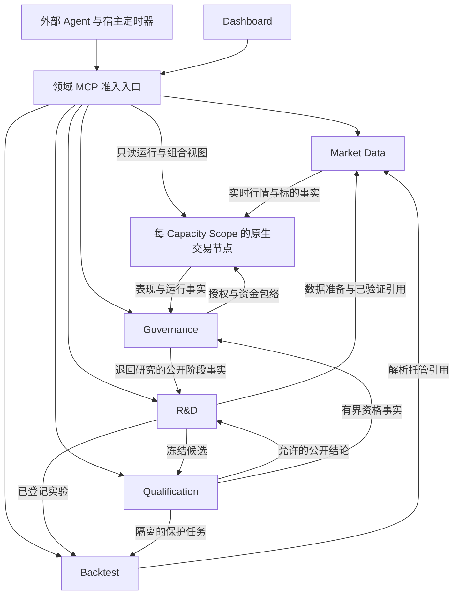

# 服务架构

## 蓝图范围与阅读方式

产品由六组逻辑后端服务组成：Market Data、Backtest、R&D、Qualification、Governance 控制服务与原生交易节点。
Dashboard 是第一方客户端与 Product Edge；Event Rail、数据库和观测设施是支撑设施。六组表示能力、依赖和权限边界，
不要求六个容器或六个独立进程。物理打包服从隔离、原生节点和实际消费者证据，不能从 Owner 或 MCP 数量推导。

本页定义完整目标蓝图及当前入口，不把目标能力当作已实现。数据和回测在保留的 Nautilus 模块上扩展，R&D 自研；
交易同样复用原生节点，不复制引擎到平行服务。试盘和正式策略阶段都是真实交易，只是资金池与生命周期阶段不同。
真实交易、保护评估部署及新增 Dashboard 切片仍须各自的实现和效果准入；当前文档不接通这些效果。

## 服务拓扑

图中的 Edge 是各领域入口共同执行的准入职责，不是必须新增的总网关进程，也不是统一取代领域 MCP。
内部调用使用类型化 API，不嵌套 MCP 会话；没有服务通过读取另一个 Owner 的私有库来重建权威。
Event Rail 传播已提交事件的唤醒提示，订阅者回读事实；业务终态、恢复和审批不交给总线。

## 服务职责与事实来源

| 逻辑服务组          | 独立功能集                                                                                                 | 主要输出与唯一责任                                                              |
| ------------------- | ---------------------------------------------------------------------------------------------------------- | ------------------------------------------------------------------------------- |
| Market Data         | 标的与经济规格；来源接纳和历史/实时采集；外部文件导入；点时版本、覆盖与质量；原生存储/聚合及准备任务       | 已验证数据引用、覆盖/缺口、修订与可用时间、数据准备回执和行情读取台账           |
| Backtest            | 冻结输入与执行配置；原生事件回放和撮合；成本/资金费/保证金模型；组合及逐交易报告；持久任务和恢复           | 原生运行、订单/成交及模拟账户证据、结果和报告；不作研究或晋级决定               |
| R&D                 | 来源与知识；项目/主题和冻结边界；家族预登记与试验/资源台账；JSON 编写和 Artifact；诊断/后继/停止与代理接管 | 意图、工件、实验准入、不可变谱系和 Iteration Decision；不拥有行情或交易效果     |
| Qualification       | 独立候选接纳；保护协议与样本隔离；资格评估/撤销；有界公开结论；隔离的只记录模拟前向证据                    | 资格与保护事实；研究侧只见允许的结论，不见保护值、原因或内部分类                |
| Governance 控制服务 | 治理注册表；试盘/正式阶段与冻结条件；两池比例及等额分配；生命周期授权                                      | Governance 决策和资金包络；不激活 Runtime                                       |
| 原生交易节点        | Runtime 信号运行；Risk 意图准入与预留；Execution 订单/成交/对账/恢复；Portfolio 计量与归属                 | 同一原生节点内的实际交易和账户事实，各 Owner 保留独立写权；没有第二账户或订单簿 |

### 独立使用与依赖

- Market Data 可以独立提供标的、准备任务和覆盖；返回行情值的读取仍遵守保护分区与暴露台账，不能通过独立入口绕过。
- Backtest 消费封存 Artifact、准入运行与已验证数据引用，不需要代理逐步驱动其内部链路。探索与保护任务
  使用同一原生语义，但凭据、读权限、缓存、输出与任务空间保持隔离。
- R&D 可登记、编写、读取知识和接管项目；实际实验依赖数据与回测。外部 Agent 承担模型判断，R&D 不内置研究模型。
- Qualification 不要求研发代理常驻；只处理冻结候选和预登记评估，不替代理迭代，也不激活策略。
- Governance 控制服务消费资格、表现、条件匹配与事故事实，拥有生命周期决定。
- 原生交易节点按每个 Capacity Scope 一个进程内节点组织，包含原生运行、风险、执行、cache 与组合能力。
  运行不依赖 R&D 对话；节点不能自行分配一份重复的完整资金池，失去授权或新鲜证据时按既有合同限制新增风险。

服务内的"功能集"是独立输入、输出与测试责任，不要求拆成微服务。目标保留九个业务 Owner：Market Data、R&D、
Backtest、Qualification、Governance、Runtime、Risk、Execution、Portfolio。Strategy Factory 是跨服务价值流；
Product Edge 是入口边界；Observability 是投影与通知边界，不额外拥有上述业务事实。规范契约投影为旧回执保留
Scanner 历史身份，不表示目标需要第十个部门。

## 最小结构与依赖方向

只有独立事实权威、隔离或生命周期需求才形成职责边界；功能名字不自动成为模块、服务或 MCP 进程。
领域与产品扩展依赖类型化值和端口，不依赖 Dashboard、MCP 协议、数据库连接细节或 Agent 会话。
组合入口连接原生模块、存储和传输适配器；不在原生撮合回调里加入远程取数或研发编排。

| 保留的边界           | research 故事要求                                | 合并会丢失什么                                 |
| -------------------- | ------------------------------------------------ | ---------------------------------------------- |
| 数据与回测           | 同一托管数据用于许多实验，也能独立准备/覆盖查询  | 数据版本/采集任务与运行结果的独立生命周期      |
| 回测与 R&D           | 相同原生回放为多种假设产证据，代理据结果决定后继 | 证据与研究决定的独立性，及可独立使用的回测 MCP |
| R&D 与 Qualification | 迭代者不能读取验证/最终样本详情                  | 保护权限、缓存和公开反馈的单向隔离             |
| 资格与治理           | 合格不等于资金分配、部署或晋级已发生             | 证据与授权的分离                               |
| 治理与原生节点       | 资金/生命周期决定不等于运行应用、成交或账户事实  | 决策、应用与效果的独立回读及恢复边界           |

知识、因子归属与预测校准留在 R&D；统计诊断、交易卡和组合研究留在 Backtest 报告；成员选择、宏观/OI/
资金费与覆盖留在 Market Data；只读市场扫描留在 R&D，治理直接判定冻结上线条件，不保留独立 Scanner 部门。
复用编译后的信号计算作研究发现，不新增扫描引擎。
组合 Artifact 内的子规则不是新增部门或独立账户分配成员；只有真正运行的策略实例计入治理池等分。
没有独立用户结果的新 Orchestrator、Factor Service、Universe Service、Gatekeeper Agent Service、Forward Engine
或账户总账均不进入蓝图。可选的模拟 Forward Record 复用 Backtest，不是额外晋级阶段或另一套执行器。
共享数据库可由一个实例承载各 Owner 的 schema/角色，但部门之间只经公开类型化接口或已发布事实交接，
不能跨查私有表、跨 schema JOIN 重建对方状态或代写对方记录。数据库权限以实际隔离证明验收。

## MCP 能力目录

MCP 名称表示领域工具目录，不是一种新的服务或事实 Owner。代理按任务连接获准目录；同一操作从 MCP、Dashboard
或内部 API 到达时，预算、资格、保护数据和未知结果处理相同。完整参数与拒绝属于各 Owner 和
[Product Edge](./product-edge.zh.md#target---外部代理工具面)，本表定义归属，不发明新的已发布 wire API。

| 工具目录             | 服务归属                      | Agent 可完成的工作                                  | 当前与目标边界                                                                                 |
| -------------------- | ----------------------------- | --------------------------------------------------- | ---------------------------------------------------------------------------------------------- |
| `market-data`        | Market Data                   | 标的发现、描述、接纳、准备、覆盖和有界行情读取      | 有独立 stdio 适配器；行情值读取受保护分区闸门，文件导入和完整目标数据准备仍须验收              |
| backtest             | Backtest，探索准入由 R&D 提供 | 提交运行、查询状态、读取报告和运行列表              | 有独立 stdio 适配器，当前转发 R&D `/v1/backtests`；不证明 Backtest 已独立部署或完整 R-1 已交付 |
| `strategy-authoring` | R&D 编写能力                  | 校验、创建、读取、修订、归档 JSON 策略版本          | 有独立 stdio 适配器；窄编写能力不等于完整 R&D，复杂语义按版本扩展                              |
| research             | R&D 研究能力                  | 项目/边界接纳、家族预登记、实验台账、迭代决定与接管 | 完整研究目录是目标；不能以现有 Source/Composer 入口证明全部已接通                              |
| knowledge            | R&D 知识能力                  | 检索可复用因子/形态、适用范围、证据与复核条件       | 目标；只保存允许的公开结论，不保存保护值                                                       |
| qualification        | Qualification                 | 提交候选、查询评估及允许的资格结论                  | 目标；只记录 Forward Record 是可选模拟证据，不代替真实试盘                                     |
| governance           | Governance                    | 治理状态、试盘条件/资金政策选择与生命周期请求回读   | 目标；真实效果受用户批准政策和授权约束，自动转正不等于新授予交易权限                           |
| scan                 | R&D 只读机会发现              | 按需找币与结果读取                                  | 目标；结果不产生资格、部署或交易权限                                                           |
| portfolio            | 原生节点中的 Portfolio        | 查询账户、净值、表现、暴露与容量                    | 目标只读目录，不写分配或订单                                                                   |
| operations           | 运行/风险/执行及观测的读面    | 查询实例、readiness、订单/成交、drift 与告警        | 目标只读目录，不提供任意交易、kill switch 或恢复写操作                                         |

当前 Dashboard `/api/mcp` 另有五个有界工具，承接 Source/Research、Composer、Replay 请求托管与运维回读；
它是相同 Owner 操作的兼容入口，不是第七个研究服务或完整目标目录的替代品。独立 `video-note` MCP 属于外部
来源获取辅助：Agent 读取笔记后向 R&D 提交来源引用，产品服务不调用它，也不让它接触产品库或交易凭据。
Windmill 不在产品部署依赖中；历史 wire 名称只保留原记录含义。

## 数据与状态管理

| 数据或状态                                               | 权威位置                                | 跨服务交接                                            |
| -------------------------------------------------------- | --------------------------------------- | ----------------------------------------------------- |
| 行情、标的、经济条款、修订、PIT 可用时间与覆盖           | Market Data，扩展原生数据存储与 catalog | 已验证引用和具名缺口；Agent 不搬运全量行情            |
| 研究项目、边界、家族、资源/试验台账、Artifact 和迭代结论 | R&D 持久记录；Artifact 不可变           | 请求身份、版本、内容引用和 Owner 回执                 |
| 历史回放状态、实际消费输入、结果与报告                   | Backtest 作业及原生模拟器事实           | 可恢复 job/run 身份及终态结果引用；保护输出走隔离读面 |
| 保护协议、评估细节、资格与撤销                           | Qualification 私有存储/权限域           | 只传允许的资格投影和类型不透明引用                    |
| 阶段、成员、条件版本、政策、授权与分配包络               | Governance                              | 生效截面、generation 与明确授权，不传交易凭据         |
| 实际订单/成交/持仓/账户与对账                            | 原生节点；Execution 独占场所效果及回读  | 原生事实及只读投影，产品不维护平行账户总账            |
| 净值、费用、资金流、表现和归属计量                       | Portfolio 从原生事实与估值输入产生      | 版本化计量证据，不能自行调整 Governance 分配          |
| UI 状态、日志、运维运行、投递与告警                      | 可重建投影、运维 RunStore 与 outbox     | 仅定位/展示/唤醒，不证明业务成功或恢复完成            |

PostgreSQL 的角色、schema、函数与权限保持 Owner 分离；共用数据库实例不授予交叉私有读写。
共享原生代码或镜像不合并保护数据、凭据与写权。原生 cache 继续拥有订单、持仓与账户状态；产品新增的
分配和研究记录只表示政策或归属，不形成自行推进的第二引擎。服务保留输入修订、冻结版本与历史证据，
新数据或新 Artifact 产生后继身份，不能覆盖已完成运行。

## Agent 与服务怎样完成任务

### 研究到回测

1. 用户批准研究主题、风险容忍、数据范围与资源上限。R&D 接纳项目；多个 Agent 共用同一产品预算和台账，宿主模型预算分别限制。
2. Agent 选择来源、提出机制和可证伪预测，经 R&D 预登记家族与实验；直接行情读取通过 Market Data 记入暴露台账。
3. Agent 提交版本化 JSON 策略。R&D 校验、编译和封存 Artifact，准备需求由服务内部交给 Market Data。
4. Agent 发出一次有身份的回测请求。R&D 执行研究准入，Backtest 持有运行任务，通过引用解析数据并调用原生回放。
5. Agent 按 job/run 身份查询状态、结果和报告。R&D 接纳诊断后的后继、停止或选择决定；亏损、失败和未知尝试都留在台账。
6. 不合格候选继续 R&D；选择后的冻结候选交 Qualification 独立评估，保护详情不回流同一研究循环。

### 回测合格到真实试盘与正式运行

1. 回测达到冻结合格标准才可进入试盘。用户在 Dashboard 选择转正条件及两池政策，试盘开始前冻结；条件选项尚未定。
2. Governance 决定阶段、有效成员、分配与授权；实际运行以 Runtime 应用回执为准，不以 UI 成功或治理请求提交为准。
3. Runtime 用相同策略语义产生信号；Risk 根据分配、账户真实资金与暴露准入；Execution 通过原生机制执行、记录和对账。
4. Portfolio 产生真实净收益、样本和风险计量，Governance 按冻结条件自动转正；试盘与正式池分别按运行实例数量等分。
5. 试盘最长观察期未达标，或正式策略不满足保留条件，Governance 下架并退回 R&D。停止新入场、撤入场挂单，
   剩余持仓由既有原生路径继续按原保护规则管理；卸载立即归还策略预算，实际保证金占用仍限制账户新订单。
6. 后继候选重新回测、重新试盘，旧结果和授权不继承。资格、治理、运行、风险和执行各有独立事实，不能相互代替。

试盘准入的自动/人工方式、条件选项与阈值、正式保留条件及对应规范 wire 合同仍需确定；这些未决项阻止对应运行
实现，不阻止本页确定服务边界。详细业务规则见[研究场景](../scenarios/research.zh.md#回测合格真实试盘与转正)。

### 无人值守、接管与未知结果

宿主定时器唤醒 Agent 做需要模型的下一轮判断；服务调度器驱动已准入的数据任务、回测和已授权生命周期处理。
MCP 或聊天关闭不终止服务作业。新 Agent 从项目边界、资源承诺、试验/暴露台账、Artifact、任务和迭代回执接管，
不靠前一段聊天猜状态。同身份同含义请求恢复同一任务；不同实验即使参数相同也按各自准入计数。

网络超时、响应丢失或服务重启不等于失败：先按原身份回读，不新开重复任务或释放未知承诺。
服务任务失败产生其 Owner 的终态；经济结论与研究下一步仍由各自业务 Owner 产生。执行未知进入既有恢复围栏，
对账闭合也不能复活旧交易授权。事件通知丢失可用持久回读恢复，不能把总线投递当成事实提交。

完整来源映射和成功/失败路径见 [20 个 research 用户故事重放](../scenarios/research.zh.md#research-用户故事重放与能力缺口)。

## 架构契约与开发切片

每个开发任务从上述一条交接切片开始，点名生产者、消费者、输入版本、事实写入者、正常结果、具名拒绝、未知及重启读回。
验收优先级是完整 R-1 研究/报告、动态 B3 连续组合、carry 多腿与资金费故事，再接通资格、真实试盘和生命周期。
R-1 的挂单、部分成交、分段退出与歧义处理扩展现有原生回放；动态成员与细数据准备不能在策略内重写撮合器。

当前窄入口、目标协议和完整产品旅程分别验收。源码中有 MCP、类型、原生 API 或绿色局部测试，不证明目标服务已部署。
两池等分是新目标政策；旧封存的优先级竞争/截断分配仍保持原版本含义，不能靠解释旧字段实现新政策。
研究项目、动态成员、局部细数据后继、资金费信号可用时间和晋级阶段等未闭合合同，按版本化切片落实到其 Owner 后才能开发消费路径。

[Product Edge](./product-edge/)定义工具与准入；[能力扩展](./capability-adoption/)定义原生复用位置；
[Owner 契约](../owners/)定义精确写权与禁止事项；[架构规则](../guide/architecture-rules/)定义保护、授权与恢复；
[Agent 实现指南](../guide/agent-implementation/)规定开发验证。蓝图不是已实现声明，也不能替代这些合同。
