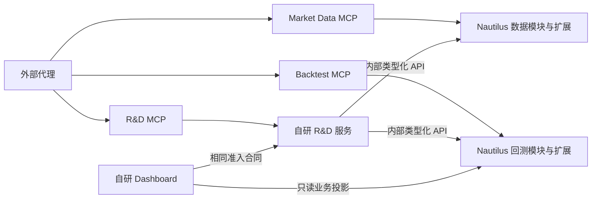

# 服务架构

## 服务拓扑

外部代理分别连接数据、回测与研究领域的 MCP。MCP 是协议入口，背后的服务持有业务任务与事实；
R&D 经内部类型化 API 调用数据与回测，不嵌套 MCP 会话。数据与回测在现有 Nautilus 组件上扩展，
不复制计算、撮合、订单或账户机制到平行引擎。自研 Dashboard 读取和控制同一服务合同。

## 服务职责与事实来源

| 职责                       | 实现基础与事实                                                                  | 消费方式                                            |
| -------------------------- | ------------------------------------------------------------------------------- | --------------------------------------------------- |
| Market Data                | 原生数据客户端、引擎、聚合与存储；扩展点时托管、来源修订与覆盖                  | MCP 提供发现/准备；回测通过已验证数据引用消费       |
| Backtest                   | 原生引擎、订单、撮合、账户、资金费与统计；扩展任务、输入绑定和产品报告          | MCP 提交与查询；R&D 内部调用同一操作                |
| R&D                        | 自研来源接纳、预登记、JSON 编写、Artifact、试验台账与迭代决定                   | 外部代理编排研究，服务完成确定性子步骤              |
| Qualification              | 独立保护协议、资格和只记录前向决定                                              | 只消费已选择候选；研究侧只见有界结论                |
| 交易节点                   | 每个 Capacity Scope 的原生 LiveNode、RiskEngine、ExecutionEngine 与薄产品信任层 | 未准入 Paper/Live；按资格、治理、风险与恢复合同扩展 |
| Portfolio 与 Governance    | 原生计量加产品归属/证据投影；独立授权与资金包络                                 | 不产生第二账户；事实与许可分离                      |
| Dashboard 与 Observability | 自研用户界面、只读投影、遥测与告警                                              | 不产生第二工作流或业务权威                          |

数据、回测与研究各自可构建、部署和验收。`Owner` 是职责、存储与权限边界，不要求每个名字成为独立服务。
原生 cache 保持订单、成交、持仓及账户事实；产品只追加其所属托管、授权、研究与恢复记录。

## 调用与信任

在外部请求边界严格验证身份、范围、参数和能力。内部调用按类型与单向依赖传值，不让下层回读上层库，
不把边界验证扩散成每层重建整套权威。保护缓存、数据库权限、真钱与未知效果边界仍独立成立。
任务服务持有状态、恢复和终态；MCP、Dashboard、Event Rail 只提交、查询或传递已提交 wake。

## 架构契约

每个可变业务事实只有一个 Owner。R&D 同时包含 Research 和 Develop；Product Edge 是请求准入边界，
Strategy Factory 是 R&D、Backtest、Qualification 价值流，Observability 是投影与通知边界。
[Event Rail](./event-rail/)只广播已提交事件，不审批、选择、重试或执行恢复。

[架构规则](../guide/architecture-rules/)定义身份、权限、保护、原生交易节点与恢复合同；
[能力扩展](./capability-adoption/)把已有组件映射到最小接入位置；各 [Owner](../owners/)定义唯一写入者。
全局 Flow 是职责投影：十个业务 Owner、三个可见边界及一个非权威 Event Rail 通道，分组内最多五个模块。
服务图不改变这套职责，也不证明当前接线或部署。新增 Owner 必须有无法放入现有职责的独立事实权威。
