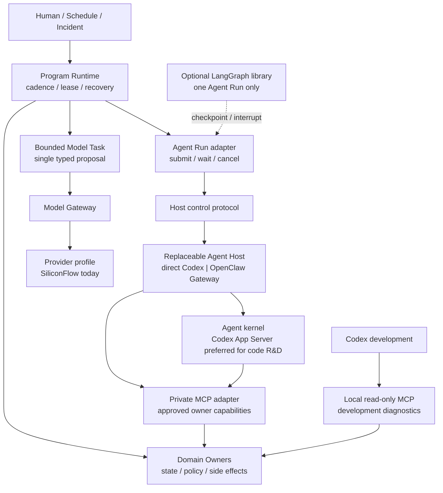

# 可替换 Agent Host Runtime 设计与迁移计划

## 1. 状态与决策

本文是 active migration：目标边界已经冻结，完整 Host / container 采用仍由后续实测决定。目标态不得冒充当前 authority；当前有效事实是：

- `program-supervisor` 常驻运行，J01–J07 与领域 owner 决定 cadence、状态和写权限。
- `ops.model-gateway` 只执行无 tool、`execution_authority=none` 的 `research_hypothesis` 结构化任务。
- `agent.mcp` 已同时提供同机 stdio 与 bearer-authenticated private HTTP profile；`ops.operator-http` 仍是 loopback-only 小型 allowlist。
- Codex 是当前开发与 Host 评测环境，不是 R&D scheduler；OpenClaw `2026.7.1` alternate Chat runtime 已完成本机 proposal-only 采用，LangGraph 未引入。
- 仓库已有 no-live Compose / OpenClaw / Agent Host / MCP fixture，但本机没有 Docker，尚无真实 Linux 容器采用证据。
- canonical Planner → Developer → owner freeze / Trial Plan → compatibility evaluation → Reviewer → Registry 已形成服务器驻留骨架。正式 Replay 经 durable single-slot queue 发布 `mechanical_replay/replay_owner` Result；Reviewer resident 只消费该 classified Result并由既有 Control Plane owner 接纳 Decision；Strategy Registry resident 再从 `accept_for_draft` owner facts、Developer source provenance 与 Replay build/runtime hashes 确定性编译授权和 policy source，经 fenced queue 把 create-if-absent Draft 与 self-hashed candidate manifest 写入独立 `trade-release-candidates`，不会修改运行镜像的 `strategies/`。统一 resident adopter 已可串行完成 Strategy candidate 的 frozen-revision worktree、完整 lint/quality/Replay audit、确定性 commit/archive 与标准 no-live source package，仍不推进 checkout、不 hot-load、不部署或交易。source bridge 跨 Ops/Research/release artifacts 重验认证链并写入 exact Forward source admission；后继 resident 从 owner facts固定 Observation Program并续租严格 post-freeze OHLCV demand，另一 resident 再把 owner-selected plan、零 gap audit、MarketDataFact 与 immutable slice 固定成 gapless candle segment chain。任意 Draft 不能直接启动 Forward，数据请求或 segment 也不能冒充 Dataset Manifest/Session/Replay authority。真实 status/spec/risk Manifest compiler、Forward Session/Result、Governance、Linux 容器采用与新 revision 部署尚未闭环。

目标采用三层执行模型，并服从 [Remote Container Runtime Integration](./remote-container-runtime-integration-plan.md) 的部署边界：



固定的是 Program、Owner、Agent Run 语义和 MCP 能力边界；Codex、OpenClaw、LangGraph 与 provider 都是可替换实现。Agent Host 不是新 domain、scheduler、store owner 或交易 authority。

### 场景支持矩阵

| 场景 | 当前 | 目标职责 |
| --- | --- | --- |
| 远程 Docker 常驻 | 有可审查 no-live Compose fixture；尚未在 Linux/Docker 采用 | Compose / container manager 只负责进程与资源，Program 负责业务 cadence |
| L2 / OHLCV / indicators | L2 已有 Rust resident；其他能力有 owner 但未统一常驻 cadence | 全部确定性运行，不依赖 Agent |
| 快慢轨 | 当前 server profile 仍为 `shadow_program` | J01/J02 快轨、J03 慢轨由 Program 调度 |
| hypothesis 生成 | Direct Model Task 与 OpenClaw Planner Agent Run 均有真实本机证据 | 简单任务保留 Direct Model Task；复杂任务交给 Planner Agent Run |
| develop / review | Developer Agent→owner compile/validate/freeze 与 Reviewer→lifecycle / Planner lesson 已实跑；大 Result 的 Reviewer 上下文已改为 hash-bound bounded summary | Codex App Server 作为代码研发 kernel 基线；可由 OpenClaw 常驻托管，Control Plane 接纳结果 |
| Replay / 策略物化 | owner 链已存在 | 继续确定性执行；Agent 只能请求和读结果 |
| retire | 当前策略状态未实现 | Governance owner 新增终止版本语义；Agent 只能提交建议 |

## 2. 为什么不自研“另一个 Codex”

成熟 Agent Host 已包含模型适配、上下文管理、tool loop、审批、流式事件、压缩和 session 生命周期。项目重写这些通用能力会扩大安全面，却不增加交易领域优势。

本项目只自有以下薄层：

1. domain-owned tool / MCP contract；
2. provider-neutral 的有界 Agent Run 语义；
3. Host adapter、policy、trace correlation 与结果验证；
4. 面向交易/R&D 的固定评测语料和采用门。

Host 的内部 transcript、checkpoint、memory 和 reasoning 只用于恢复或调试，不成为 trade、research、governance 或 artifact authority。Host 不可用时，Program 仍能独立运行。

截至 2026-07，OpenClaw 已提供 native Codex App Server runtime、Codex thread 控制和 MCP projection。因此候选不是简单三选一：

```text
Program
  -> direct Codex App Server
  or
  -> OpenClaw Gateway -> Codex App Server kernel
  or
  -> OpenClaw embedded alternate runtime
```

默认不 fork Codex。先锁定上游 binary / SDK / protocol version，使用薄 adapter 和隔离 profile；只有上游无法满足已证明的 provider、sandbox、event 或恢复合同，且补丁足够小、可持续 rebase 时才评审 narrow fork。OpenClaw 也不因内嵌 Codex 就自动获得领域 authority。

## 3. Agent Run 语义合同

先固定语义，不在本计划预先冻结 HTTP route、数据库表或框架接口。

### Request 最小语义

- 稳定 `request_id`、idempotency scope、task type 与 objective。
- repo-relative / owner-issued context refs；不把 owner DB、locked holdout 或全仓库内容直接挂载给 Host。
- allowlisted capability refs、tool-call / token / wall-clock / artifact budget。
- model/provider policy、prompt version、toolset version 与 output contract version。
- approval policy、可取消 deadline、敏感信息与日志脱敏级别。
- 只读、proposal-only 或 controlled-write 的明确 authority；默认 proposal-only。

### Lifecycle 最小语义

`submitted -> running -> waiting_approval | retryable | blocked | completed | cancelled`

实现需支持提交、状态、增量事件、审批/拒绝、取消和结果读取，但 transport 与物理存储等基础 spike 后再定。相同 request 重投不能形成多个 owner effect；Host 无法证明先前 tool call 是否完成时必须 `blocked`，不能猜测补写。

### Result 最小语义

- Host/provider/model、prompt/toolset/output-contract 版本。
- 输入 refs/hash、tool call 摘要、approval refs、usage/latency 和终态。
- 结构化 output 或 artifact ref、deterministic validation verdict。
- provider/host failure 分类；不返回 credential、原始 reasoning 或未脱敏完整上下文。

只有 owner validator 接纳结果后，proposal 才能进入既有正式入口。Agent Run 自身不写策略状态、Trial/Result、交易事件或 exchange。

## 4. 候选实现的正确位置

| 候选 | 适合 | 不适合 | 本项目结论 |
| --- | --- | --- | --- |
| Codex App Server / SDK | 仓库理解、代码修改、shell/test、MCP、thread/turn/event、审批和 structured output | 交易 scheduler、领域 owner、直接写 production workspace / DB | 策略 R&D coding kernel 与不退化质量基线；同时评测 direct container adapter |
| OpenClaw Gateway | 常驻服务、session/routing/运维、MCP 管理；可原生托管 Codex App Server，也可使用其他 runtime | 用自身 scheduler 替代 Program；把默认 shell/browser/channel/plugin 权限带入生产 | 外层 Host 候选，不再假设必须用其内建 Agent loop 替代 Codex |
| LangGraph JS | 单次复杂 Agent Run 的显式多轮图、durable checkpoint、interrupt/resume | 通用 Agent Host、J01–J07 scheduler、跨任务 R&D lifecycle、领域事实存储 | 不是默认 Host 或独立服务；只有评测证明 Host 原生 loop 不足时嵌入 Agent Run adapter |
| Direct Model Task | 单次 JSON proposal、成本低、失败面小 | 多轮探索、复杂 tool loop、人工中断 | 保留为首选窄路径，不把简单任务升级成 Agent |

Codex CLI / App Server 开源且提供 TypeScript SDK；SDK 可恢复 thread、输出流式事件并约束 structured output。Codex custom provider 可声明 base URL、wire API、认证和 headers，但 Chat Completions 路径正在淘汰，长期 profile 必须优先验证 Responses compatibility。SiliconFlow 自称 OpenAI-compatible 不足以证明 Codex Responses、tool continuation、stream、reasoning item 和错误语义兼容，仍需真实 spike。

OpenClaw custom provider / embedded runtime 仍可作为 SiliconFlow fallback 候选；OpenClaw-managed Codex profile 与 OpenClaw 自身模型 loop 必须分开记名评测，不能都简称“OpenClaw”。

## 5. 工具与代码执行

MCP 是 Host 与领域能力的北向协议，不替代内部 owner port、event bus、L2 transport 或 broker。每个 tool 仍只有一个 owner，Host adapter 不复制业务判断。

当前 `agent.mcp` 只能由同机 Host 以 stdio 启动，而且会通过固定 CLI 到达 owner。远程容器不能让 OpenClaw sidecar 挂载 owner DB 和整仓来复用这条物理路径；目标需要在 control / owner trust boundary 内增加薄的 authenticated Streamable HTTP MCP adapter，复用相同 capability registry、schema、validator 和 audit。它只监听 private container network，不成为公网 API。

Program 调用 Host 与 Agent kernel 调用 MCP 是两条不同链路：

```text
Program -- Gateway RPC: agent / wait / cancel --> OpenClaw
OpenClaw/Codex kernel -- private Streamable HTTP MCP --> capability adapter --> owner
Codex development ---- local read-only MCP --------------------------> owner
```

首个生产 profile：

- 只启用完成任务必需的 MCP tools；使用 progressive discovery，不把完整工具目录灌入上下文。
- Host 默认禁止通用 shell、任意 production 文件读写、browser、cron、subagent、channel 和动态插件。
- 不挂载 owner SQLite、Binance credential、Docker socket 或宿主机 home。
- SiliconFlow credential 只注入需要直连 provider 的 Host；MCP server 和 code sandbox 不获得该 secret。
- controlled write 继续经过独立 approval、preflight、owner idempotency 和 audit；Host approval UI 不是最终交易授权。

Developer Agent 的代码 sandbox 是策略研发采用前置条件，不是可选增强：

```text
Agent kernel
  -> isolated worktree at frozen source revision
  -> read/write strategy MD, code and tests
  -> run allowlisted repo toolchain
  -> produce patch + test evidence + artifact refs
  -> call owner MCP for data/Trial/Replay
```

Host 本身仍不挂 production repo RW；Program 为每个 Developer Run 创建隔离 worktree / container，默认无网络、无 credential、无 owner DB、无 Docker socket，限制 CPU、内存、时间和输出。依赖预装在版本化 image/cache，例外网络按任务显式授权。Run 只能返回 patch、typed submission 和 artifacts；合并、release、Trial、promotion 与 live 同步链仍由外部 owner / CI 控制。Planner / Reviewer 默认只读，不因 Developer 需要代码执行而扩大权限。

## 6. R&D 语义链与职责

Codex kernel、OpenClaw alternate runtime 或未来 Host 负责的是 Planner、Developer、Reviewer 的语义执行，不是整条策略研发状态机：

```text
J04 / Control Plane
  -> Planner Agent Run -> Proposal v2
  -> admit -> Developer Agent Run -> Contract Draft
  -> deterministic validate / freeze / Trial reservation
  -> Replay owner -> Result
  -> Reviewer Agent Run -> Review Decision
  -> Control Plane persist / revise / reject / accept
  -> Strategy Registry accept_for_draft
  -> J05 Forward
  -> Governance lifecycle decision
```

- Program 发现已有 ready work 时直接运行，不调用 Agent。
- 每个 Agent Run 只消费 Control Plane-issued context/brief 和 owner refs，返回对应 typed submission。
- Replay、Trial/Result、draft 物化和 strategy lifecycle 都由既有 owner 执行；Agent 调 MCP 只是在正式入口提交请求或读取结果。
- Reviewer 的接受不是 promotion；Governance 才能决定 `draft / shadow / live-small / paused`，目标还需补齐 `retired`。
- `retired` 是某个策略版本的终止状态；历史证据不删除，重新启用同一思想必须形成新版本和新治理决定。
- LangGraph checkpoint 若采用，只保存局部 Agent Run 的恢复状态与 owner refs，不保存或重建上述 durable lifecycle。
- family 是 Universe 中的机制身份，不等于同名代码。目标 engine 已有 family implementation 时，Contract 经 Registry 确定性物化，不要求 Agent 改 production code；只有 implementation coverage 不足或出现新机制时，才进入 capability assessment 与隔离 patch。需要 Agent 理解 MD 语义的策略必须走显式 Agent-assisted task contract，不能把读取 Markdown 当成 deterministic execution 或 Replay parity。

### 6.1 策略研发不退化合同

远程 Agent Host 必须保留当前 Codex 多轮研发能力，而不只是保留“生成一段 JSON”；这是一项 Host 能力基线，不是兼容旧交互式 R&D 调度入口：

```text
读取 Universe / strategy MD / 代码 / 历史失败
  -> 形成可证伪 hypothesis
  -> 判断只改合同、需要新数据还是需要代码
  -> 在隔离 worktree 修改 MD / implementation / tests
  -> 请求 owner 冻结数据、Trial 与 Replay
  -> 阅读 Result / artifact，诊断失败
  -> 多轮修订或明确 reject
  -> 输出可 review patch + typed submission + evidence refs
```

验收必须覆盖上下文压缩和进程重启后继续、测试失败后的自主诊断、已有 rejected mechanism 去重、代码与 MD 一致性、无效 hypothesis 主动终止，以及 patch 未通过 CI 时不进入 release。任何候选 Host 若只能产出 proposal、不能安全修改隔离代码并继续实验，就不具备 Developer 采用资格。

回测执行本身仍由确定性 Replay owner 完成。Agent 决定“测什么”、编写或修改策略实现、解释结果并发起下一轮；它不直接伪造 Fill / Result。无法完全代码化的 MD 策略分成两种证据：

- **mechanical Replay**：只执行 compiled contract + implementation，可复现，可进入既有统计 gate。
- **Agent-assisted historical evaluation**：冻结 MD semantic input、model/provider、prompt/toolset 和事实切片，对有界决策点生成 typed decisions；属于探索 / 语义一致性证据，不能冒充 mechanical Replay，也不能单独 promotion。更强证据来自冻结 policy 的 Forward / shadow。

因此远程默认路径优先评测“OpenClaw Gateway 托管 Codex App Server”，并保留 direct Codex App Server adapter 做故障回退和归因基线。不是把 Codex 对话整体搬进服务器，也不是让 LangGraph 重写 R&D。

## 7. 失败隔离与恢复

| 故障 | 必须继续 | 允许阻断 | 禁止 |
| --- | --- | --- | --- |
| Agent Host 退出 | L2、reconcile、risk、已授权确定性 job | 尚未完成的语义任务 | 让 supervisor 跟随退出 |
| provider timeout / 429 / 503 | Program 与 owner health | 对应 Agent/model task，按 budget 重试 | 无限重试或切模型后静默改变语义 |
| MCP 重启 | Program 与不依赖该 capability 的任务 | tool call，等待可确认恢复 | 猜测 tool 已失败并重复副作用 |
| Host checkpoint 损坏 | owner state 与已接纳结果 | Host session | 用 transcript 重建业务事实 |
| approval 超时 | 只读与减风险 owner 路径 | controlled action | 默认批准 |

Host 运行状态属于 ops plane。是否新增 durable store、复用 `ops_runtime.db` 还是使用 Host 自有存储，在 transport / crash-recovery spike 后决定；当前不修改 architecture manifest。

## 8. 可比评测设计

### L0 Provider capability

用同一 SiliconFlow model 验证 JSON、单/多 tool call、tool result continuation、stream、超长上下文/截断、429/503 和 malformed response。未通过即停止对应 Host 评测，不用 prompt 绕过协议缺口。

### L1 Host / kernel quality

至少比较四个记名 profile：Direct Model Task、direct Codex App Server、OpenClaw → Codex App Server、OpenClaw embedded alternate runtime。它们使用相同模型、任务输入、MCP 能力、输出合同、预算和冷启动条件；无法使用同一 provider/wire 时明确归因为 provider compatibility，不混入 Host 质量。LangGraph 只在出现明确状态机候选后加入。

固定语料来自仓库已存在的公开/脱敏事实：

- 只读 runtime/incident 解释与证据引用。
- R&D brief → hypothesis proposal → validate/queue dry path。
- strategy MD / implementation → compile / test failure → patch → Replay request → Result diagnosis → second revision。
- `manual_policy_v1` 语义决策点 → frozen Agent-assisted evaluation；不得伪装为 mechanical Replay。
- tool/provider 故障、unsupported request 与正确 abstention。
- approval、prompt injection、恶意 tool output 和上下文压缩。
- 同一 request 重放、Host/MCP kill-restart 与未确认 side effect。

不使用真实 secret、live exchange write、locked holdout 原文或人工临场帮助。

### L2 指标

| 维度 | 观察 |
| --- | --- |
| outcome | 任务完成、证据正确、输出 contract 通过、该拒绝时拒绝 |
| tool safety | tool 选择、参数 schema、越权尝试、重复 side effect |
| recovery | kill/restart、approval resume、MCP restart、compaction 后一致性 |
| efficiency | end-to-end latency、tokens、provider cost、tool round trips |
| operability | trace 关联、错误分类、版本锁定、secret/context 脱敏 |

初始评测不先编造数值阈值。先建立 Direct/Codex 基线，再为每类任务设 gate；任何 authority violation、secret 泄漏或不可确认的重复写均直接淘汰该 profile。

### L3 长时与故障注入

候选通过功能集后运行有界 soak：provider 抖动、Host 强杀重启、MCP 重启、审批跨重启、context compaction、token/rate circuit breaker、磁盘和日志上限。soak 只能使用 read/proposal-only profile；controlled write 在独立审阅后另行采用。

## 9. 主实施计划

按 `P0 → P8` 顺序连续施工；同一阶段内只有明确标注可并行的测试 / 文档步骤可以并行。每阶段结束必须执行 changed-quality、diff review、secret / workspace hygiene 与临时产物清理；跨语言、共享 contract、Replay 或基础设施改动还必须跑总质量门。失败先修复或记录为有证据的 adoption blocker，不跳过 gate。

| 阶段 | 状态 | 目标 | 阶段 gate |
| --- | --- | --- | --- |
| P0 基线与施工护栏 | active | 冻结环境、当前能力和评测输入 | 基线可重跑；不读取或打印 secret |
| P1 Agent Run 合同 | complete | provider / Host 中立的 request、event、result 与 policy | contract tests、恶意输入和 identity replay 全过 |
| P2 Provider / Codex capability | active-partial | 分离 SiliconFlow wire 能力与 Codex protocol 能力 | capability matrix 可归因；不以 prompt 掩盖协议失败 |
| P3 Direct Codex adapter | active-partial | Program 可提交、观察、取消和失败关闭有界 Codex Run | 真实 structured turn 与 daemon transport 待采用 |
| P4 MCP 与 Developer sandbox | active-partial | 私有 MCP、角色投影、每 Run 隔离 worktree、implementation-gap routing、Host patch/check 与累计 revision seeding 已落地 | 容器读隔离 / cgroup 待远程采用 |
| P5 R&D Agent 纵切 | active-partial | Planner → Developer → Replay → Reviewer → Registry → source adoption → Forward source/data admission | Registration-bound formal Replay、Reviewer resident、candidate-only Registry、frozen-revision source adopter、cross-plane source bridge、renewable post-freeze OHLCV demand 与 gapless owner-proven candle segment 已接通；正式 Dataset Manifest/真实 status-spec-risk 输入、真实模型二次修改、Forward Session/Result、Governance 与 Linux 采用待闭环 |
| P6 OpenClaw 与容器 | active-partial | OpenClaw-Codex、alternate runtime 与 no-live Compose fixture | alternate runtime/fixture 已落地；真实容器采用待外部 host |
| P7 Bake-off 与可靠性 | pending | 公平比较、故障注入、资源 / 磁盘与长时运行 | 无 authority violation；形成采用或拒绝证据 |
| P8 收敛与采用 | pending | 默认 profile、回滚、清理、文档和运行手册 | 全仓质量门通过；目标态与当前态无漂移 |

### P0 基线与施工护栏

| ID | 步骤 | 完成证据 |
| --- | --- | --- |
| P0.1 | 记录 Git dirty baseline，只选择本计划相关文件，保护既有用户改动 | scoped status / diff 可重放 |
| P0.2 | 记录 Bun、Node、Codex、Docker、OpenClaw 与平台能力；不自动安装未采用依赖 | 脱敏 capability report |
| P0.3 | 验证 `.secrets/siliconflow.env` 只作为本地进程注入且被 Git / secret scan 排除 | 权限、ignore、变量名检查通过 |
| P0.4 | 生成并保存到 `tmp/` 的 Codex App Server stable / experimental protocol schema | schema hash 与 CLI version 记录 |
| P0.5 | 冻结四个评测 profile 和仓库内脱敏任务 corpus 清单 | fixture manifest 可重复 |
| P0.6 | 为每阶段定义 changed-quality / full-quality、artifact retention 与 cleanup 命令 | 本文与工程合同一致 |
| P0.7 | 跑当前基线 contract / package tests，区分既有失败与本轮回归 | baseline report |

### P1 Agent Run 合同

| ID | 步骤 | 完成证据 |
| --- | --- | --- |
| P1.1 | 新增 `agent-run-contract` owner-neutral package；定义 request、budget、authority 与 canonical hash | compile/build round-trip tests |
| P1.2 | 定义 lifecycle event、sequence、terminal result、failure taxonomy 与 trace correlation | strict schema / ordering tests |
| P1.3 | 定义 task profile：Planner、Developer、Reviewer、read-only explanation | capability / authority matrix tests |
| P1.4 | 定义 Host adapter port：submit、events/status、steer/approve、cancel、result | fake adapter contract suite |
| P1.5 | 定义 input/output refs、artifact budget、redaction 和 raw reasoning exclusion | secret-like / path escape rejection |
| P1.6 | 定义 request replay、tool effect uncertainty 与 fail-closed 状态 | idempotency / uncertain-effect tests |
| P1.7 | 建立恶意 prompt、tool output、malformed Host event 和 budget exhaustion fixtures | negative corpus |
| P1.8 | 接入 architecture manifest / toolset 时只登记已实现 surface | drift / toolset validation |

### P2 Provider 与 Codex capability

P1 已落地 `modules/contracts/agent-run-contract`：request / event / result 均为 canonical hash 合同，四类 profile 使用 closed-world capability，输入输出只携带有 hash / bytes 的 refs，raw reasoning、额外 Host payload、secret-like 内容、绝对路径、身份漂移、事件断序、budget 超限和 uncertain-effect 自动重试全部 fail closed。`AgentHostPort` 再固定 submit / events / status / steer / approve / cancel / result，重复 submit 保持同一 request identity；当前 8 项 contract / fake-host 测试通过。该包不进入 `toolset.json`，因为它没有可执行 authority surface。

本机 P2/P3 已固定 `codex-cli 0.144.6` 与 stable generated TypeScript bundle hash `ae3056…8e2`。`agent-host-codex` 已实现 App Server client、Host port、deadline / cancel / interrupt、sanitized event、external output sink 和 ops-owned durable run registry；重复 submit 不重复启动，Developer 中断以 `tool_effect_uncertain` 关闭。真实 stdio probe 已完成 initialize / ephemeral thread 与默认 provider read-only turn；2026-07-23 的隔离临时仓库 adoption smoke 又完成一次默认 provider Developer turn，约 35 秒产生 657-byte patch、package check 与 `patch_ready`，生产仓库零修改。后继 code Run 现可从该 predecessor Result 精确重放累计 patch，但真实 provider 的第二轮修改仍未采用。SiliconFlow 因 Responses 404 仍不能驱动 Codex；daemon transport 与远程采用尚未完成，因此 P2/P3 仍为 `active-partial`。

P4 当前已复用同一 `createTradeMcpServer` registry 支持 stdio 与 bearer-authenticated stateless Streamable HTTP；HTTP 有 loopback/private bind、Host/origin、body 与 rate gate，且按四类 Agent profile 投影最小工具集。`agent-workspace-manager` 已提供 frozen-revision worktree、write-prefix / symlink / secret-data denial、固定 package check、bounded patch、container mount plan 和 active-run-aware GC。macOS 本地 worktree 不构成读隔离证据；只有 Developer container 不挂 production repo / home / owner DB / secret / Docker socket 且网络关闭后，P4 才能完成。

同日 provider / Host 分层探测进一步得到：SiliconFlow `Qwen/Qwen3.5-27B` 的 Chat JSON、SSE stream、single tool、同轮 multi-tool 与 tool-result continuation 全部通过，Responses endpoint 为 `404/unsupported_endpoint`；Direct Codex 默认 provider 的 read-only turn 完成且零 protocol error。Codex custom SiliconFlow profile 能完成 initialize / thread，但 turn 失败；强制 `wire_api="chat"` 在 config/startup 被拒绝。当前 blocker 因而是 `Codex 0.144.6 requires Responses × SiliconFlow lacks Responses`，不能归因成模型或 adapter 质量，也不通过 fork Codex 临时掩盖。OpenClaw alternate Chat runtime 仍可进入公平评测，OpenClaw-managed Codex 只有换 Responses-compatible provider 后才可与 direct Codex 同 provider 比较。

P5/P6 本机采用新增确定性证据：OpenClaw `2026.7.1` 通过最小 MCP role profile 驱动真实 Planner、Developer 与 Reviewer。两轮 experiment 均保持 owner gate 与 `no_promote → modify`，locked holdout 未打开；Reviewer 上下文已从 405 KB 高基数明细收敛为约 11 KB hash-bound summary。随后 alternate code runtime 真实通过两层烟测：embedded file-tool exact edit，以及 Gateway HTTP → immutable scope → fixed worktree → SiliconFlow Agent → no-network checker → 3 个 Host evidence refs → slot cleanup。代码补丁与 Strategy source 使用不同 Ops ledger，但由同一 resident adopter 串行复用 candidate worktree/release checker；前者重放 exact patch，后者重建 Registry manifest 指定的 frozen revision 并写入 exact MD，均重跑全仓 quality/independent Replay audit，形成确定性 commit/source archive 与标准 server package。两者都不会推进当前 checkout、hot-load 运行时策略，也没有部署或交易权限。Compose 仍只算静态 fixture；真实 Linux 容器健康/cgroup、新 source revision 实际部署与 Forward 未采用。

| ID | 步骤 | 完成证据 |
| --- | --- | --- |
| P2.1 | 扩展 Provider smoke contract：JSON、stream、单 / 多 tool call、tool continuation、错误语义 | deterministic mock tests |
| P2.2 | 使用本地 secret 运行 SiliconFlow JSON 与 function-calling smoke，不落原始响应或 key | 脱敏 capability artifact |
| P2.3 | 探测 SiliconFlow Responses compatibility；与 Chat Completions 结果分栏 | wire capability matrix |
| P2.4 | 生成 Codex App Server bindings / schema 并锁 CLI + protocol hash | version manifest |
| P2.5 | 实现本地 stdio protocol probe：initialize、thread、turn、event、interrupt | protocol integration tests |
| P2.6 | 验证 custom provider 配置、stream、tool continuation 和错误映射 | Codex-provider matrix |
| P2.7 | 若 Codex + SiliconFlow 不兼容，记录 provider blocker并继续使用可运行 baseline；不 fork | 可归因 blocker |
| P2.8 | 建立 Direct Model 与 Codex kernel 最小同题基线 | outcome / usage / latency report |

### P3 Direct Codex Agent Run adapter

| ID | 步骤 | 完成证据 |
| --- | --- | --- |
| P3.1 | 新增 orchestration-owned adapter package，不复制 Codex protocol 或领域逻辑 | package contract |
| P3.2 | 将 Agent Run request 映射为 thread / turn / output schema / MCP profile | mapping tests |
| P3.3 | 归一化 App Server events，过滤 reasoning 与未声明 payload | golden event tests |
| P3.4 | 实现 deadline、cancel、interrupt、process exit 与 malformed stream | fault tests |
| P3.5 | 实现 local run registry / recovery seam；只保存 operational refs | restart tests |
| P3.6 | 支持 stdio 基线和 Unix socket / daemon spike；不开放公网 | transport parity tests |
| P3.7 | 将 Host failure 与 provider failure 分开记账 | classification tests |
| P3.8 | 建立 CLI / toolset 的 proposal-only operator surface | allowlist / dry-run tests |
| P3.9 | kill/restart、重复 submit、cancel race 与 uncertain effect 演练 |最多一个 owner effect |

### P4 私有 MCP 与 Developer sandbox

| ID | 步骤 | 完成证据 |
| --- | --- | --- |
| P4.1 | 从现有 stdio server 提取 transport-neutral capability registry | stdio tests 零语义漂移 |
| P4.2 | 实现 loopback/private-network Streamable HTTP MCP adapter | auth / bind / body / rate tests |
| P4.3 | 复用 owner CLI、validator、idempotency 和 audit，不复制 tool 业务逻辑 | parity fixtures |
| P4.4 | 实现 task-profile tool projection 与 progressive discovery | capability leakage tests |
| P4.5 | 新增 Developer workspace manager：冻结 revision、创建 / 清理隔离 worktree | lifecycle tests |
| P4.6 | 实现路径、symlink、secret、owner DB、Docker socket和默认网络禁用检查 | escape / deny tests |
| P4.7 | 实现 allowlisted compile / unit / changed-quality runner 与资源 / 输出上限 | timeout / overflow tests |
| P4.8 | 生成 patch、source hash、test refs 与 artifact manifest；不自动 apply / merge | reproducibility tests |
| P4.9 | 验证 Planner / Reviewer 只读，Developer 权限不外溢到 Host | role boundary tests |
| P4.10 | 异常退出、残留 worktree、磁盘软线与 GC 清理 | recovery / cleanup report |

当前 code path 不再“形有神无”：`family_implementation_missing` 与 `replay_implementation_not_ready` 才获得 workspace capability；Research owner 将其映射到封闭 family/capability/state/certification 包，scope v3 绑定 1–8 个检查包并以不可变记录持久化。模块内 `developer-cycle` 仍只组合 Research 与 provider-neutral Host；server 的 semantic/code 双 Host、Ops scope 与 predecessor patch 在仓库级 `scripts/rd-developer-agent-cycle.ts` 装配，未引入 Research → Ops 反向依赖。Direct Codex fixture 已证明 predecessor Result-bound 累计二次修订；OpenClaw code profile 则只开放 `read/write/edit/apply_patch`，独立 Host 串行消费固定槽位，模型 completion 不作证据。检查在无网络、无 secret、无 owner DB 的独立进程执行，Host 比对检查前后 patch 后写 submission/diff/check refs；两个 Host 的 Compose 只挂独立 Ops 与 Agent artifact volume，不再看到 Trade/R&D/Catalog DB。真实 SiliconFlow Gateway 烟测已完成精确代码修改、检查、证据固化与清理。剩余门是 certified Replay 自动回送、patch review/apply/release、新 source revision 上的后继 reassessment，以及真实 Linux 容器/cgroup。

### P5 Planner / Developer / Replay / Reviewer 纵切

| ID | 步骤 | 完成证据 |
| --- | --- | --- |
| P5.1 | Control Plane 生成 Planner context pack 与 Agent Run request | frozen refs / hash |
| P5.2 | Planner submission 进入既有 hypothesis validator / admission | no direct state write |
| P5.3 | 生成 admitted Developer brief 与 capability assessment | parameter / data / code blocker classification |
| P5.4 | Developer 修改 MD / implementation / tests 并提交 patch | isolated patch evidence |
| P5.5 | owner 冻结 dataset、reserve Trial、执行 deterministic Replay | active-partial：Developer Data Snapshot → Registration-bound immutable bundle prepare → recovery → Attempt/Lease/Dispatch → registered Runner → atomic formal Result/classification 已闭合；status/spec/risk provider evidence → certified Manifest/Reservation compiler 待补 |
| P5.6 | 将 Result / artifact pack 返回后继 Developer Run，完成失败诊断和二次修订 | fixture complete：predecessor Result-bound seed + diagnosis ref + cumulative second patch；formal Replay 自动排队已完成，Result → Reviewer/Developer 自动唤醒待采用 |
| P5.7 | Reviewer 只消费登记 evidence，输出 typed Review Decision | owner validation |
| P5.8 | Control Plane writeback 与 Registry draft 物化沿用正式入口 | complete locally：owner-fact compiler、durable fenced queue、create-if-absent/fsync、crash recovery、candidate-only Compose；Linux adoption 待 P7 |
| P5.9 | 实现 mechanical Replay 与 Agent-assisted evaluation 的 evidence kind / gate | 禁止证据冒充 |
| P5.10 | 覆盖 reject、blocked、provider outage、patch fail CI、Host restart 与 duplicate request |完整纵切 fault suite |

### P6 OpenClaw 与远程容器

| ID | 步骤 | 完成证据 |
| --- | --- | --- |
| P6.1 | 锁定 OpenClaw 来源、版本 / image digest、license 与 native Codex runtime 配置 | dependency record |
| P6.2 | 建立 OpenClaw Gateway → Codex App Server adapter profile | direct / managed parity |
| P6.3 | 建立 OpenClaw alternate runtime 独立 profile，禁止混名 |独立 capability report |
| P6.4 | 关闭 browser、cron、channel、subagent、动态 plugin 与 production shell | effective config audit |
| P6.5 | 建立 no-live multi-stage images 和 Compose fixture；不含 secret | image / config scan |
| P6.6 | 分离 control、L2、Agent Host、Developer job volume / network / health | trust matrix tests |
| P6.7 | 验证独立启停、drain、Host state loss、MCP restart 与 owner recovery | container fault suite |
| P6.8 | 在无本地 Docker 时保留可审查 fixture；真实容器采用等待可用 runner / 远程主机 | 显式 external blocker |

P6 当前已锁 OpenClaw `2026.7.1` 与 image digest，并把 semantic Agent、code Agent、workspace Host、无网络 checker、独立 Ops/artifact/workspace/control volumes 写入 no-live overlay；配置经官方 validator 通过，Gateway code smoke 使用真实 SiliconFlow 完成。由于本机仍无 Docker，这些只关闭实现与本机 Gateway gate，不关闭 P6.7/P6.8 的 Linux 容器采用门。

### P7 Bake-off、可靠性与长时验证

| ID | 步骤 | 完成证据 |
| --- | --- | --- |
| P7.1 | 对四个 profile 使用相同 corpus、capabilities、budget 和 source revision | fair-run manifest |
| P7.2 | 比较任务完成、拒绝质量、tool 安全、成本、延迟与可恢复性 | bake-off report |
| P7.3 | 注入 provider 429/503/timeout/malformed、Host kill 与 MCP kill | failure matrix |
| P7.4 | 注入重复 submit、approval timeout、cancel race 与 uncertain tool effect | fail-closed report |
| P7.5 | 注入 context compaction / resume，验证 owner refs 与结果一致性 | continuity report |
| P7.6 | 注入磁盘 / artifact / log 上限，运行 owner-authorized GC | no protected-data loss |
| P7.7 | 运行 proposal-only 长时 soak；定期检查资源、backlog 和 state growth | bounded soak artifact |
| P7.8 | 对 controlled-write 单独审阅后运行短故障测试 | no duplicate owner effect |
| P7.9 | 根据证据决定默认 / fallback / rejected profile 与 LangGraph 是否需要 spike | adoption decision |

### P8 收敛、采用与回滚

| ID | 步骤 | 完成证据 |
| --- | --- | --- |
| P8.1 | 更新当前 runtime / architecture contracts，仅把已通过 gate 的能力标 active | doc / manifest parity |
| P8.2 | 完成 operator runbook、secret rotation、backup / restore、incident 与 rollback |演练记录 |
| P8.3 | 清理 spike、重复 adapter、未引用 fixture、临时 schema 和残留 worktree | footprint audit |
| P8.4 | 审查依赖、license、版本 pin、镜像 / lockfile 与供应链边界 | dependency audit |
| P8.5 | 跑 package、跨语言、Replay maturity、architecture drift 与全仓质量门 | zero warning / failure |
| P8.6 | 归档完成计划与一次性报告，保留当前合同和可复跑 benchmark | history / current 分层正确 |
| P8.7 | 形成下一轮仅基于真实缺口的 backlog；不自动扩大 live / promotion 权限 | adoption handoff |

P6 的真实容器运行若因本机无 Docker 且没有远程 runner 阻断，只阻断容器采用证据，不反向否定已完成的 contract、Codex/OpenClaw adapter 和 R&D 纵切。远程有限常驻前不接 J01/J02、preflight、execution、reconcile、promotion 或 locked-holdout decision；策略 `retired` 由 Governance lifecycle migration 施工，不能夹带在 Agent adapter 中。

## 10. 总体验收与回滚

采用成立需同时满足：

- 替换 Host 不修改 owner contract、store、event 或 strategy identity。
- Host/provider 全部离线时，L2、reconcile、risk 与确定性 program job 继续。
- kill/restart、重投和审批恢复最多形成一个 owner effect。
- Host 不持有 owner DB、Binance secret、scheduler、promotion 或通用宿主机权限。
- 每个结果可追到输入、版本、tool calls、预算、审批、usage 和 validator。
- Direct Model Task 仍处理简单结构化任务；Agent Host 的复杂度有实测收益。
- 完整 R&D 链中，Host 退出只阻断当前语义 submission；Trial、Result、Forward 和已接纳 lifecycle 不丢失。
- Developer 能在隔离 worktree 中完成“读代码→修改→测试→请求 Replay→读失败→再次修改”，不是一次性代码生成。
- 本机 Codex、direct App Server 与 OpenClaw-managed Codex 使用同一 capability 语义，但 transport、session 和权限可独立演进。

回滚只禁用对应 adapter/profile 或恢复前一版服务器 release，保留 Program、owner 和 MCP 合同；不恢复旧 Codex 人工研发编排，也不迁移或回写领域状态。任何候选失败只形成评测证据，不要求继续投入。

## 11. 暂不决定

- 不预定唯一默认 Host、默认模型或永久 provider。
- 不预定 Agent Run 的数据库表、HTTP route、消息 broker 或 UI。
- 不把 LangSmith 设为运行依赖；需要跨 Host observability 时先评测 OpenTelemetry 与既有 ops trace，只有明显缺口才引入外部平台。
- 不因 OpenClaw 已有渠道、cron、browser 或 subagent 就把这些能力纳入产品。
- 不因 Codex 体验最佳就复制其全部权限或把开发环境当生产控制面；也不先 fork 全部 Codex。
- 不预定 Agent Run 必须使用 LangGraph；OpenClaw 原生 session/tool loop 足够时不再增加第二套 workflow runtime。

## 12. 资料基线

以下官方资料在 `2026-07-23 CST` 核对；它们说明候选能力，不替代本仓库采用证据：

- [Codex open-source repository](https://github.com/openai/codex)、[App Server protocol](https://github.com/openai/codex/tree/main/codex-rs/app-server)、[TypeScript SDK](https://github.com/openai/codex/tree/main/sdk/typescript) 与 [custom model providers](https://developers.openai.com/codex/config-advanced)
- [OpenClaw Docker](https://docs.openclaw.ai/install/docker)、[Gateway](https://docs.openclaw.ai/gateway)、[native Codex runtime](https://github.com/openclaw/openclaw/blob/main/docs/providers/openai.md)、[MCP configuration](https://github.com/openclaw/openclaw/blob/main/docs/gateway/configuration-reference.md)、[sandboxing](https://docs.openclaw.ai/gateway/sandboxing) 与 [security](https://docs.openclaw.ai/gateway/security)
- [LangGraph persistence](https://docs.langchain.com/oss/javascript/langgraph/persistence) 与 [interrupts](https://docs.langchain.com/oss/javascript/langgraph/interrupts)
- [MCP architecture](https://modelcontextprotocol.io/docs/learn/architecture) 与 [client best practices](https://modelcontextprotocol.io/docs/develop/clients/client-best-practices)
- [SiliconFlow Chat Completions](https://docs.siliconflow.cn/en/api-reference/chat-completions/chat-completions) 与 [Function Calling](https://docs.siliconflow.cn/cn/userguide/guides/function-calling)
