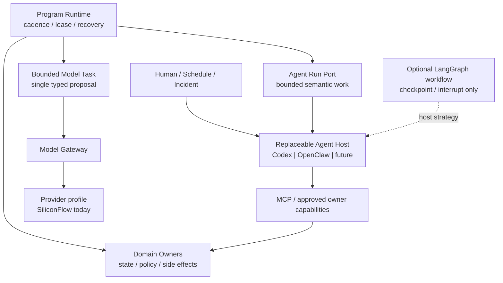

# 可替换 Agent Host Runtime 设计与迁移计划

## 1. 状态与决策

本文是 proposed 设计，不是当前 authority。当前有效事实仍是：

- `program-supervisor` 常驻运行，J01–J07 与领域 owner 决定 cadence、状态和写权限。
- `ops.model-gateway` 只执行无 tool、`execution_authority=none` 的 `research_hypothesis` 结构化任务。
- `agent.mcp` 是同机 stdio allowlist；`ops.operator-http` 是 loopback-only 小型 allowlist。
- Codex 是当前开发与人工操作环境；OpenClaw、LangGraph 尚未进入运行组合。

目标采用三层执行模型：



固定的是 Program、Owner、Agent Run 语义和 MCP 能力边界；Codex、OpenClaw、LangGraph 与 provider 都是可替换实现。Agent Host 不是新 domain、scheduler、store owner 或交易 authority。

## 2. 为什么不自研“另一个 Codex”

成熟 Agent Host 已包含模型适配、上下文管理、tool loop、审批、流式事件、压缩和 session 生命周期。项目重写这些通用能力会扩大安全面，却不增加交易领域优势。

本项目只自有以下薄层：

1. domain-owned tool / MCP contract；
2. provider-neutral 的有界 Agent Run 语义；
3. Host adapter、policy、trace correlation 与结果验证；
4. 面向交易/R&D 的固定评测语料和采用门。

Host 的内部 transcript、checkpoint、memory 和 reasoning 只用于恢复或调试，不成为 trade、research、governance 或 artifact authority。Host 不可用时，Program 仍能独立运行。

## 3. Agent Run 语义合同

先固定语义，不在本计划预先冻结 HTTP route、数据库表或框架接口。

### Request 最小语义

- 稳定 `request_id`、idempotency scope、task type 与 objective。
- repo-relative / owner-issued context refs；不把 owner DB、locked holdout 或全仓库内容直接挂载给 Host。
- allowlisted capability refs、tool-call / token / wall-clock / artifact budget。
- model/provider policy、prompt version、toolset version 与 output contract version。
- approval policy、可取消 deadline、敏感信息与日志脱敏级别。
- 只读、proposal-only 或 controlled-write 的明确 authority；默认 proposal-only。

### Lifecycle 最小语义

`submitted -> running -> waiting_approval | retryable | blocked | completed | cancelled`

实现需支持提交、状态、增量事件、审批/拒绝、取消和结果读取，但 transport 与物理存储等 P0 spike 后再定。相同 request 重投不能形成多个 owner effect；Host 无法证明先前 tool call 是否完成时必须 `blocked`，不能猜测补写。

### Result 最小语义

- Host/provider/model、prompt/toolset/output-contract 版本。
- 输入 refs/hash、tool call 摘要、approval refs、usage/latency 和终态。
- 结构化 output 或 artifact ref、deterministic validation verdict。
- provider/host failure 分类；不返回 credential、原始 reasoning 或未脱敏完整上下文。

只有 owner validator 接纳结果后，proposal 才能进入既有正式入口。Agent Run 自身不写策略状态、Trial/Result、交易事件或 exchange。

## 4. 候选实现的正确位置

| 候选 | 适合 | 不适合 | 本项目结论 |
| --- | --- | --- | --- |
| Codex App Server | 代码库理解、交互式开发、审批、MCP、thread/turn/event 集成 | 作为交易 scheduler 或 owner；依赖即将淘汰的 Chat Completions provider 绑定 | 开发体验与质量基线；先做本机 stdio adapter spike |
| OpenClaw | 常驻 Agent、OpenAI-compatible provider、自带 tool loop/session/approvals、可选渠道 | 默认开放 exec/fs/browser/cron/subagent；替代 Program 或复制 owner 工具 | 生产常驻 Host 候选；最小 sidecar、锁版本、默认零通用工具 |
| LangGraph JS | 固定多轮图、durable checkpoint、interrupt/resume、人工审批节点 | 通用 Agent Host、J01–J07 scheduler、领域事实存储 | 不是默认 Host；只有评测证明任务确需显式工作流时作为 adapter 内部策略 |
| Direct Model Task | 单次 JSON proposal、成本低、失败面小 | 多轮探索、复杂 tool loop、人工中断 | 保留为首选窄路径，不把简单任务升级成 Agent |

Codex CLI / App Server 开源且可复用协议和实现思想；本项目不 fork 其完整代码。Codex 当前 custom provider 虽支持 Chat Completions，但官方已标明该路径将移除，因此 SiliconFlow + Codex 只能通过兼容性 spike 作为阶段性基线，不能未经证明成为长期生产绑定。

OpenClaw 支持自定义 OpenAI-compatible Chat Completions provider，和当前 SiliconFlow 能力形态更接近；这只说明值得实测，不证明 tool calling、流式响应、错误语义和目标模型组合已兼容。

## 5. 工具与代码执行

MCP 是 Host 与领域能力的北向协议，不替代内部 owner port、event bus、L2 transport 或 broker。每个 tool 仍只有一个 owner，Host adapter 不复制业务判断。

首个生产 profile：

- 只启用完成任务必需的 MCP tools；使用 progressive discovery，不把完整工具目录灌入上下文。
- 禁止通用 shell、任意文件读写、browser、cron、subagent、channel 和动态插件。
- 不挂载 owner SQLite、Binance credential、Docker socket 或宿主机 home。
- SiliconFlow credential 只注入需要直连 provider 的 Host；MCP server 和 code sandbox 不获得该 secret。
- controlled write 继续经过独立 approval、preflight、owner idempotency 和 audit；Host approval UI 不是最终交易授权。

若评测证明代码执行不可替代，再增加独立 sandbox capability：

```text
Agent -> generated typed MCP stub -> isolated code sandbox
      -> host broker authorizes each capability call -> owner
```

sandbox 默认无网络、无 credential、只读最小输入，限制 CPU、内存、时间和输出；只能生成 proposal/artifact，不进入 live 同步链。禁用 code execution 时不影响普通 MCP tool loop。

## 6. 失败隔离与恢复

| 故障 | 必须继续 | 允许阻断 | 禁止 |
| --- | --- | --- | --- |
| Agent Host 退出 | L2、reconcile、risk、已授权确定性 job | 尚未完成的语义任务 | 让 supervisor 跟随退出 |
| provider timeout / 429 / 503 | Program 与 owner health | 对应 Agent/model task，按 budget 重试 | 无限重试或切模型后静默改变语义 |
| MCP 重启 | Program 与不依赖该 capability 的任务 | tool call，等待可确认恢复 | 猜测 tool 已失败并重复副作用 |
| Host checkpoint 损坏 | owner state 与已接纳结果 | Host session | 用 transcript 重建业务事实 |
| approval 超时 | 只读与减风险 owner 路径 | controlled action | 默认批准 |

Host 运行状态属于 ops plane。是否新增 durable store、复用 `ops_runtime.db` 还是使用 Host 自有存储，在 P2/P3 crash-recovery spike 后决定；当前不修改 architecture manifest。

## 7. 可比评测设计

### L0 Provider capability

用同一 SiliconFlow model 验证 JSON、单/多 tool call、tool result continuation、stream、超长上下文/截断、429/503 和 malformed response。未通过即停止对应 Host 评测，不用 prompt 绕过协议缺口。

### L1 Host quality

Codex、OpenClaw 和 Direct Model Task 使用相同模型、任务输入、MCP 能力、输出合同、预算和冷启动条件。LangGraph 只在出现明确状态机候选后加入。

固定语料来自仓库已存在的公开/脱敏事实：

- 只读 runtime/incident 解释与证据引用。
- R&D brief → hypothesis proposal → validate/queue dry path。
- tool/provider 故障、unsupported request 与正确 abstention。
- approval、prompt injection、恶意 tool output 和上下文压缩。
- 同一 request 重放、Host/MCP kill-restart 与未确认 side effect。

不使用真实 secret、live exchange write、locked holdout 原文或人工临场帮助。

### L2 指标

| 维度 | 观察 |
| --- | --- |
| outcome | 任务完成、证据正确、输出 contract 通过、该拒绝时拒绝 |
| tool safety | tool 选择、参数 schema、越权尝试、重复 side effect |
| recovery | kill/restart、approval resume、MCP restart、compaction 后一致性 |
| efficiency | end-to-end latency、tokens、provider cost、tool round trips |
| operability | trace 关联、错误分类、版本锁定、secret/context 脱敏 |

P0 不先编造数值阈值。先建立 Direct/Codex 基线，再为每类任务设 gate；任何 authority violation、secret 泄漏或不可确认的重复写均直接淘汰该 profile。

### L3 长时与故障注入

候选通过功能集后运行有界 soak：provider 抖动、Host 强杀重启、MCP 重启、审批跨重启、context compaction、token/rate circuit breaker、磁盘和日志上限。soak 只能使用 read/proposal-only profile；controlled write 在独立审阅后另行采用。

## 8. 分阶段施工顺序

| 阶段 | 交付 | 进入下一阶段的 gate |
| --- | --- | --- |
| P0 合同与语料 | Agent Run semantic types、能力 policy、脱敏 fixture、评测 runner 设计 | 不修改 owner authority；同一任务可重复 |
| P1 Provider smoke | SiliconFlow tool calling/stream/error compatibility matrix | 目标模型通过所需能力；失败可分类 |
| P2 Codex baseline | 本机 stdio App Server adapter、同一 MCP、只读/proposal-only corpus | 可追踪 thread/turn/tool/approval；无通用 shell/DB/secret |
| P3 OpenClaw sidecar | pinned image/version、custom provider、最小 tool profile、隔离 state | 与 Program 独立启停；仅 MCP；kill/restart 可恢复 |
| P4 Bake-off | 同模型/同任务质量、安全、恢复、成本报告 | 无 authority violation；结果可复现 |
| P5 采用决策 | 按 task/profile 选默认 Host 或维持 Codex 手动路径 | 人工审阅 ADR；可一键回退 |
| P6 可选 LangGraph | 仅为已证明需要 checkpoint/interrupt 的固定 workflow 实现 spike | checkpoint 不承载业务事实；无 scheduler 迁移 |
| P7 有限常驻 | 单一非 live、proposal-only job 接入 Program | soak、告警、预算、rollback 全部通过 |

P0–P4 可以并行于现有 server runtime S7 和 L2 consumer 工作，但不得改变其采用门。P7 前不接 J01/J02、preflight、execution、reconcile、promotion 或 locked-holdout decision。

## 9. 总体验收与回滚

采用成立需同时满足：

- 替换 Host 不修改 owner contract、store、event 或 strategy identity。
- Host/provider 全部离线时，L2、reconcile、risk 与确定性 program job 继续。
- kill/restart、重投和审批恢复最多形成一个 owner effect。
- Host 不持有 owner DB、Binance secret、scheduler、promotion 或通用宿主机权限。
- 每个结果可追到输入、版本、tool calls、预算、审批、usage 和 validator。
- Direct Model Task 仍处理简单结构化任务；Agent Host 的复杂度有实测收益。

回滚只禁用对应 adapter/profile，保留 Program、owner、MCP 合同和既有 Codex 人工路径；不迁移或回写领域状态。任何候选失败只形成评测证据，不要求继续投入。

## 10. 暂不决定

- 不预定唯一默认 Host、默认模型或永久 provider。
- 不预定 Agent Run 的数据库表、HTTP route、消息 broker 或 UI。
- 不把 LangSmith 设为运行依赖；需要跨 Host observability 时先评测 OpenTelemetry 与既有 ops trace，只有明显缺口才引入外部平台。
- 不因 OpenClaw 已有渠道、cron、browser 或 subagent 就把这些能力纳入产品。
- 不因 Codex 体验最佳就复制其全部权限或把开发环境当生产控制面。

## 11. 资料基线

以下官方资料在 `2026-07-23 CST` 核对；它们说明候选能力，不替代本仓库采用证据：

- [Codex open-source repository](https://github.com/openai/codex)、[App Server protocol](https://github.com/openai/codex/tree/main/codex-rs/app-server) 与 [Codex model/provider guidance](https://learn.chatgpt.com/docs/models)
- [OpenClaw Agent Runtime](https://docs.openclaw.ai/agent-runtime-architecture)、[custom providers](https://docs.openclaw.ai/gateway/config-tools)、[exec approvals](https://docs.openclaw.ai/tools/exec-approvals) 与 [MCP CLI](https://docs.openclaw.ai/cli/mcp)
- [LangGraph persistence](https://docs.langchain.com/oss/javascript/langgraph/persistence) 与 [interrupts](https://docs.langchain.com/oss/javascript/langgraph/interrupts)
- [MCP architecture](https://modelcontextprotocol.io/docs/learn/architecture) 与 [client best practices](https://modelcontextprotocol.io/docs/develop/clients/client-best-practices)
- [SiliconFlow Chat Completions](https://docs.siliconflow.cn/en/api-reference/chat-completions/chat-completions) 与 [Function Calling](https://docs.siliconflow.cn/cn/userguide/guides/function-calling)
