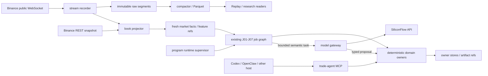

# Program-Owned Runtime Migration

## 1. 决策摘要

目标形态从 `agent-operated toolset` 演进为：

```text
program-owned runtime
  + deterministic domain owners
  + bounded LLM tasks
  + optional agent / MCP operator
```

- 程序拥有调度、采集、状态、恢复和停止权；Agent 离线不影响安全运行。
- LLM 只进入显式语义任务，输出 typed proposal；不直写 owner store，不调用 Binance write。
- MCP 继续作为北向 Agent 接口，不充当内部总线、实时 transport 或 LLM runtime。
- L2 接收、序列校验、订单簿重建、落盘和派生特征完全不依赖 LLM。
- Codex/OpenClaw/LangGraph 的 Host 选择、隔离和同条件评测由 [Agent Host Runtime plan](./agent-host-runtime-integration-plan.md) 独立承接；无论选择结果如何，本计划的 Program/Owner authority 不变。
- 本文是提案，不修改当前 [Design Architecture](../design-architecture.md)、manifest 或产品 authority；每项技术只有通过采用门才进入 active contract。

## 2. 当前基线与缺口

已有基线：

- Bun / TypeScript、Zod、SQLite owner stores 和 CLI JSON contracts 已覆盖主要业务行为。
- J01-J07 job graph、domain runtime、ops lock / health / incident 和 owner write scope 已存在。
- Research Control Plane、preflight、execution、governance 与 artifact authority 已分离。
- `trade-agent` MCP 已能受控读取和提交异步 R&D，但它依赖外部 MCP host。

尚缺：

- 已有前台常驻 `shadow_program` supervisor，但 J01-J07 尚未迁入其执行权；当前外部 Agent / automation 仍承担 domain 唤醒和部分语义编排。
- 已有受限 SiliconFlow provider port 与 hypothesis task adapter，但尚未完成真实 capability smoke、dataset parity、server secret/soak，也未进入常驻 program job。
- 已有单标的 Rust Binance WebSocket、gap/resync epoch、TL2S raw segment、可重建 book 与 owner read；多标的隔离、production process deployment、Replay consumer cutover 尚未闭合。
- `domain-bus` 只审计 envelope；它不是高吞吐 broker，也不执行 worker。
- LLM request/result、预算、脱敏与进程环境 secret 已有最小边界；持久 trace、成本评测、capability adoption 与 server secret lifecycle 尚未闭合。

P3 实施检查点（2026-07-23）：`trade-flow.program-shadow` 已建立 one-shot program-owned wakeup；`trade-flow.program-shadow-supervisor` 在其上增加前台常驻 cadence、120 秒 durable lease、10 秒 heartbeat、跨正常释放仍单调的 fencing generation、稳定时间槽 cycle identity、30 秒 lifecycle child timeout 与 `SIGINT/SIGTERM` in-flight drain。两者复用既有 job graph 和 ops store；closed-world profile 固定禁用 J01-J07、live write 与真实通知，只执行 L2 service/consumer health、control review 和 dry-run notify。真实两周期 `program-shadow-2026-07-22T16-02-36-000Z` / `...37-000Z` 均为 3/3 processor completed、7/7 domain job disabled/skipped、两条 L2 health `ok`，supervisor 与 wakeup lease 均释放；同一 60 秒槽连续重启时两层 fencing token 均由 `1→2`，第二次只返回 `skipped_terminal`。另一次真实 `SIGINT` 在完成当轮后以 `stop_reason=signal` 退出且无残留锁。外部 process manager 对全部长期进程采用 always-restart，显式 stop / bootout 仍由 manager 控制；仓库不建立 PID-file authority。故障与对照证据见下一检查点。J01-J07 尚未切换 authority，因此本文保持 `proposed`。

P3 故障与对照检查点（2026-07-23）：ops store 采用 `1000ms` SQLite busy window；持续竞争返回 typed `ops_store_busy`，不无限等待、不执行 domain command。真实 supervisor 在完成周期后被精确 `SIGKILL`，遗留 token `1`；租约到期后新进程以 token `2`、`recovered_stale=true` 接管并释放，generation history 保留而 active lock 清空。job graph 新增去除 cycle/attempt/ref 噪音的 canonical parity projection，固定比较 ticket/status/reason、domain runtime result、lifecycle processor/health、summary 与 incident/attention；真实 Agent job-graph 和 program wakeup 的 projection hash 同为 `5b130b676ddb147c982a5aca61f9775bdb587d0b84e146b9422f47ab43e40773`。P3 的 busy、crash takeover 与单轮结果对照已闭合。

P3 托管与迁移观察检查点（2026-07-23）：supervisor 新增 opt-in legacy Agent 对照，每轮把两条 job graph 的 canonical hash 与诊断 projection 作为 immutable `runtime_parity_observation` 写回同一 ops store。最初顺序执行两条路径的观察在 27 轮中得到 26 match / 1 mismatch；差异来自相隔数百毫秒的 resident-consumer health 翻转，证明 sequential live reads 不是可比输入。当前 `shared_owner_result_replay_v1` 由 program 每轮执行一次 owner command，Agent 路径独立构图并回放同一结果；command key 只去除 cycle、时间与结果 ID，命令语义漂移 fail closed。只读 owner/MCP status 保留 raw history，并将旧记录单列为 `sequential_live_reads_v1`；共享输入预检与短观察累计 `7/7 match`。模块提供 launchd `render/install/status/uninstall`，`KeepAlive` 负责重启且不产生 PID file；安装器对 macOS `Desktop/Documents/Downloads` 源码路径 fail closed，避免 TCC 造成“进程 running、业务未启动”的假健康。当前仓库位于 `Downloads`，故已回滚受阻实例；最终一小时 bounded observation 于 `2026-07-23 01:11 CST` 由 operator-owned tmux 以 fencing token `7` 从零启动。tmux 只承载本次迁移证据，不替代 production process manager。J01-J07 authority 仍未切换；待长时 verdict 与可访问源码的 process-manager 部署闭合后再进入 cutover，因此本文保持 `proposed`。

P3 一小时终态更正（2026-07-23）：上述 bounded observation 的 immutable ledger 累计 `53/53` 条 shared-input match、零 comparable mismatch，legacy sequential history 仍为 `27/28` match；但 supervisor 超过 `duration_seconds=3600` 后仍同步阻塞于 `state.flow-projector --active-flows`。operator 在确认精确父子关系与 19 分钟阻塞后终止该子进程，supervisor 以 typed script error 释放，未生成伪完成 verdict。planning owner read 已改为异步 30 秒硬截止与精确收割；真实 exclusive-lock fixture 在 deadline fail closed，3 秒 resident fixture 按 duration 退出、释放 lease、取得 `4/4` parity 且无残留子进程。P1.26 的 parity/退出缺陷据此收口；availability clean window 与 J06 canary 仍未放行。

P4 full-shadow 实施检查点（2026-07-23）：新增 closed-world `full_shadow` profile，在同一 supervisor/wakeup lease 下启用固定 J01–J07、强制 cadence due，并保留各 owner 的 active/work gate；`allow_live_writes=false`、dry-run notify、L2 owner/consumer readiness 均不可放宽。共享结果 parity 现覆盖 cycle 派生 `run_id`；干净 HEAD 双周期 fixture 为 `2/2 match`、零重复 job/incident，同槽重启 terminal skip 且 fencing token `1→2`。当前 server config 未切换，published CLI、故障注入与长时证据仍是采用门。

P3 首个 domain canary 准备（P1.27，2026-07-23）：one-shot wakeup 新增 closed-world `catalog_hygiene_canary` profile，只强制现有 owner-native J06 `catalog_hygiene_scan`，唯一允许写面为 `artifact_catalog`；其余 J01–J05/J07、live write 与真实通知继续关闭，固定命令不包含 catalog/artifact GC、`--yes` 或 caller-supplied root。该 profile 当前只完成代码与 fixture，不进入正在运行的 P1.26 soak，也未执行真实 catalog canary；只有一小时 parity、lease release 与终态审计闭合后才允许一次真实运行。

P3 L2 availability gate（P1.28，2026-07-23）：production-like immutable release 在 `02:15:28Z..02:30:30Z` 完成 696 个 watch cycle / 7,461 event，watch/snapshot failure、retry、reconnect、worker restart、resync 全部零增量；Rust owner 全窗 running、attempt/consecutive failure 零增量，RSS 稳定在约 15MB。dirty workspace 对照同窗 793 cycle / 8,563 event，1 次 typed watch failure 后自动恢复且 owner 未重启；release loopback 额外连续 24 次真实 watch 全部成功。故 availability 采用门以 production-like release clean window、owner 零 restart/incident、consumer live/fresh 终态组合判定，不把 `timed_out=true` 或可恢复瞬时错误误判为永久故障。P1.28 已闭合，允许进入一次 J06 metadata-only canary；所有 exchange live write 与真实通知继续关闭。

P3 J06 one-shot canary（P1.29，2026-07-23）：隔离预演确认 `data + tmp` 当前为约 4.1 万文件，原 30 秒 child bound 正好形成截止竞态，故 ops-only profile 保持 30 秒，domain-enabled profile 固定 90 秒。首次真实运行的 J06 owner job 成功但三个 lifecycle processor 因把 repo-relative DB 再换算为 tool-relative 路径而失败；第二次 processor 全通过，但 live L2 `.partial.*` 在枚举后 finalize/移走使 catalog fail closed。现 lifecycle DB 参数统一保留 repo-relative owner contract；catalog 明确跳过 unfinalized partial、SQLite sidecar 与 `.DS_Store`，并报告 transient/disappeared 计数。终次 cycle `program-canary-j06-20260723t025000z` 在 36.6 秒内完成：J06 扫描/写入 37,321 条、跳过 3,933 个 transient、零 disappeared，3/3 processor completed、其余 6 job disabled/skipped、零 incident，inner fencing token `89` 正常释放；`business_status=completed` 与 graph `ok=true` 明确区分“入口已执行”和“业务图成功”。全程无 GC、文件删除、exchange write 或真实通知。P1.29 已闭合。

P3 J06 resident cadence（P1.30，2026-07-23）：`catalog_hygiene_canary` 已进入同一 fenced supervisor，domain-enabled child 保持 90 秒硬截止，interval 合同上限扩至 24 小时以支持每日 reconciliation；Agent 对照只回放同一 owner result，不触发第二次扫描。真实 60 秒加速证据连续完成 `02:54` / `02:56` 两轮：`attempted=executed=2`、`failed=0`，共享输入 parity `2/2 match`、零 mismatch；每轮仅 J06 completed、其余 6 job skipped，3/3 lifecycle processor completed、零 incident，末轮 inner token `91` 与 supervisor lease 均释放。允许写面仍只有 `artifact_catalog`，`live_writes_allowed=false`、notify dry-run；60 秒仅用于迁移证据，生产建议 cadence 为每日。P1.30 已闭合。

S7 真实门复判（2026-07-23）：model gateway 的固定无参数 provider smoke 精确验证 JSON object semantic marker，只返回脱敏、`execution_authority=none` 的 typed result。首次 SiliconFlow 调用以 `provider_http_401` fail closed；credential 修正后同一探针一次完成，48 input + 16 output = 64 tokens，marker 精确匹配。R&D owner 另以真实子进程运行实际 candidate loop，在 Trial/Result 已原子提交、调用方未确认时 `SIGKILL`；重启前删除源 manifest 后仍从 Control Plane 幂等读回相同 Result，库内保持 1 个 completed Trial / 1 个 Result。该证据关闭 Darwin 本机 kill/restart 门，不替代 Linux server adoption；release gate 现强制 Darwin 增列 `linux_server_rehearsal_not_run`，不得再误报 `no_live_server_shadow`。

## 3. 不变量

1. Binance stream 与 write credential 分离；public L2 collector 永不获得交易权限。
2. Raw stream 先于 projection；任何 gap、drop、重连和 resync 都必须成为显式事实。
3. LLM 不接收 shell、数据库或 exchange write；domain owner 校验通过后才可提交 proposal。
4. 快轨 guard、preflight、quantity、order route、confirmation 和 reconcile 保持确定性。
5. Research、trade、governance、artifact、ops 继续各写各的 authority store。
6. 内部程序调用 owner port；MCP 只适配 owner port，不反向成为 owner。
7. Broker、workflow framework 和新语言不得改变现有 contract / ref / write-scope 语义。
8. Credential 只通过运行环境或 OS secret facility 注入，不进入 Git、SQLite、artifact、trace 或 prompt。

## 4. 目标拓扑



### Runtime planes

| Plane | Owns | Must not own |
| --- | --- | --- |
| Stream data | WebSocket lifecycle、raw receipt、sequence、book projection、freshness | 策略、LLM、交易权限 |
| Domain runtime | schedule、job、lease、idempotency、owner handoff、incident | 市场观点、provider prompt |
| Model gateway | provider transport、timeout、retry、budget、capability、redaction、trace | domain prompt 语义、authority write |
| Domain LLM task | context assembly、prompt/version、output schema、proposal validation | provider credential、直接 side effect |
| Agent / MCP | 人机入口、发现、审阅、显式受控提交 | 常驻采集、事实 owner、内部 event bus |

## 5. 语言政策

### 长期基线

| 语言 | 目标位置 | 结论 |
| --- | --- | --- |
| TypeScript + Bun | domain control、owner modules、MCP、LLM tasks、ops | 主语言，继续沿用 |
| Rust | 连续 stream、order book、压缩/Parquet、性能敏感纯计算 | L2 首选候选，P0 验证后决定 |
| Python | notebook、一次性研究、离线统计 | 不进入 live daemon 或交易主链 |
| Go | 现有 indicators 与 Rust bake-off 对照 | 继续维护；P0 前不扩为第二套新数据面 |

Rust 候选栈：Tokio、WebSocket client、Serde、`tracing`、Arrow/Parquet、zstd。选择理由是内存可控、单二进制、异步网络和 columnar 生态；代价是开发速度与跨语言运维复杂度。

### 系统级选择原则

“每个功能使用最合适语言”不等于逐函数自由选型。局部最快可能导致整体 contract 重复、部署单元膨胀和故障面扩大；语言选择按以下顺序评审：

1. authority 风险与可审计性；
2. workload 是 I/O control、连续 stream、CPU kernel 还是离线 batch；
3. 确定性、数值精度、内存与 tail latency 要求；
4. 必需生态是否只在某语言成熟存在；
5. crash recovery、部署和 observability 复杂度；
6. 现有 contract、测试资产和迁移风险；
7. 跨语言 serialization、versioning、复制状态和调用延迟。

语言必须拥有一个内聚运行平面，而不是零散函数。新增第四种 active runtime language 必须有不可替代的生态或经 profile 证明的收益，并形成 ADR；Shell 只做启动与检查，SQL 只表达 schema / query，二者都不承载业务编排。

### 功能级语言矩阵

| 能力 | 默认语言 | 选择依据 | 例外 / 采用门 |
| --- | --- | --- | --- |
| Runtime supervisor、J01-J07、lease、owner store、policy / governance | TypeScript / Bun | 当前 authority、Zod contract 与大规模测试资产都在 TS | 不迁入 workflow framework 或系统语言重写；先证明现有 owner port 无法满足可靠性 |
| Binance REST、账户查询、order write、reconcile | TypeScript / Bun | I/O-bound，现有 exchange / execution contract 可直接复用 | 任何 Rust 组件都不得绕过 TS execution authority |
| Public L2 WebSocket、sequence / gap、book reconstruction | Rust 候选 | 连续长跑、bounded memory、tail latency、crash-safe 数据面 | P0 Bun / Go / Rust bake-off 决定；收益不足则用 Bun |
| Private user-data WebSocket | TypeScript 起步 | 事件速率低且贴近 execution authority | 连接规模或资源证据成立后，可复用 Rust transport，但 credential 与 public collector 仍隔离 |
| Raw segment、压缩、Parquet compaction | Rust 候选 | CPU / memory / columnar hot path，适合单二进制 worker | 低数据量阶段可 Bun；不得直接写 owner SQLite |
| Market manifest、catalog、SQLite admission | TypeScript / Bun | owner write scope 与 lineage contract 已存在 | Rust / Python 只产 finalized file + typed manifest proposal |
| MCP、HTTP operator API、OpenClaw adapter | TypeScript / Bun | 与 owner ports、schema 和现有 MCP 实现同栈 | MCP 不进入内部 transport 或实时数据面 |
| SiliconFlow gateway、bounded LLM task、可选 LangGraph 子图 | TypeScript | 共享 Zod contract，避免为了 LLM 再复制一套 Python authority model | 只有 Python-only 模型依赖且无法服务化时才隔离为 worker；输出仍是 typed proposal |
| Live guard、preflight、quantity、execution route | TypeScript / Bun | 必须确定性、可审计并保持当前 authority | 禁止 LLM、Python notebook 或 Agent 成为同步依赖 |
| Replay authority、trial / campaign orchestration | TypeScript / Bun | 现有 replay contract 和回归面巨大，重写风险高 | 只把 profile 证实的纯计算 kernel 抽到 Rust，并做 fixture parity |
| 既有 technical indicators | Go | 已是内聚、无外部 Go 依赖的确定性计算模块 | 不为语言统一而重写；新增指标优先扩展同一模块或按数据平面归属评审 |
| 新的高频 L2-derived feature kernel | Rust 候选 | 与 order book 数据局部性强，减少复制和 GC 压力 | 低频、贴近 owner 语义的 feature 继续用 TS |
| 离线统计、探索、notebook、独立数值 oracle | Python | 数据科学生态和验证速度最佳 | 只读 refs、写 artifact；不持有 scheduler、risk、execution 或 owner write |
| 第三方 Python analytic adapter | Python 隔离进程 | 保留 ecosystem compatibility，不污染主 runtime | 网络采集应逐步交给 market-data owner；若升为 live authority，重做确定性 TS / Rust 内核 |
| Broker producer / consumer（若采用） | producer 随数据面，consumer 随 domain | 避免引入专用“消息语言”，使用统一 envelope | Rust collector producer、TS owner consumer；仍须 owner-side idempotency |
| Telemetry | TS / Rust OpenTelemetry | 跨进程统一 trace / metric 语义 | Python 只覆盖离线 job；telemetry 不成为 authority |

### 现有实现处置

- 保留 `tech-indicators` 的 Go 实现：它是已形成边界的纯计算模块，重写不会改善 authority，反而损失回归可信度。
- 保留 Python liquidation / microstructure adapter 作为研究参考：它不得成为 live signal authority；未来由 owner 获取数据并显式传入，减少 adapter 内部直接联网。
- 保留 Replay 中 Python `Decimal` / economic oracle：独立语言实现有助于发现 TS 自洽但错误的数值行为，不属于生产依赖。
- 不整体迁移约十五万行 TS research / replay 面。先 profile，再提取无状态、可批量、可 parity 的 kernel；编排、状态机和 verdict 继续归 owner。

### 跨语言合同

- 初始边界使用 JSON Schema / ref / immutable file / subprocess 或 Unix socket；不先上 N-API、FFI 或共享内存。
- 大数据只传 path、hash、schema version、coverage 与 row count，不在 JSON 中复制整段 L2 / Arrow payload。
- 调用方拥有 timeout、cancellation、retry 和 idempotency；被调用方不得跨边界隐式写另一 domain store。
- 错误使用稳定 code + typed detail；日志、exit code 和自然语言 stderr 不作为业务判断依据。
- 只有 IPC 被 profile 证明是瓶颈且 contract 已稳定，才评审 Arrow IPC / Flight、共享内存或 FFI。
- 引入首个 Rust crate 时，同步把 `cargo fmt --check`、`cargo check`、`cargo clippy -- -D warnings`、`cargo test` 和依赖审计接入 `scripts/quality-check.sh`；缺一项不得进入 active runtime。

### P0 语言采用门

对同一录制 depth fixture 用 Bun、Go、Rust 实现最小 recorder/projector，比较：

- sustained / burst ingest、p95/p99 processing lag；
- CPU、RSS、磁盘放大、压缩率；
- bounded queue 饱和后的显式失败行为；
- crash recovery、segment salvage、resync 时间；
- fixture 重建 hash、测试复杂度、构建与部署成本。

不预设虚构 QPS 阈值；以目标 symbol 数、Binance 100ms stream 和真实机器 soak 结果形成 ADR。Rust 默认胜出条件是可靠性或资源优势足以抵消新增语言成本，否则使用 Bun；Go 只有在显著降低运维/实现风险时胜出。

## 6. L2 数据合同

### Ingest lifecycle

```text
connect -> buffer diff -> REST snapshot -> bridge U/u
  -> enforce pu continuity -> apply absolute quantities
  -> rotate / reconnect -> resync on any gap
```

- 每个连接 / resync 形成独立 stream epoch。
- 保留 exchange event/transaction time、local receive time、`U/u/pu`、symbol、stream identity、raw payload hash。
- `pu != previous.u`、writer overflow、parse failure 或无法桥接 snapshot 时，当前 epoch 标记 incomplete；不得静默续写。
- 数量为零删除 price level；不存在 price 的删除事件合法。
- 连接 24 小时轮换、ping/pong、指数退避、订阅恢复和 forced-disconnect 测试是验收项。

### Storage tiers

| Tier | 内容 | 语义 |
| --- | --- | --- |
| hot | 内存 order book + bounded channel | 可丢进程，不可伪造连续性 |
| raw | crash-tolerant append segments + checksum | immutable、可审计、可重放 |
| manifest | epoch / segment / coverage / hash / gap refs | 由 market-data owner 接纳 |
| analytical | finalized Parquet partitions | research / Replay 高效扫描 |
| derived | spread、depth、VWAP/slippage、toxicity refs | 不等于方向信号 |

Hot path 不逐条写 SQLite，也不直接写 Parquet footer。先写可恢复 raw segment，close/hash 后原子 finalize；compactor 再生成 Parquet。SQLite 只保存 manifest、checkpoint、health 和小型 read model。P0 当前以 `TL2S v1` length-delimited + CRC32 作为候选；只有完成 kill/restart soak 与 ADR 后才冻结为 active encoding。

`market_data_store` 继续拥有 durable market metadata。Rust recorder 不直接写其物理表：只提交 finalized manifest 给 owner port。实时消费者优先读取 bounded current-book port 或 fresh derived ref，不扫描 raw 文件。

## 7. Program Runtime

### 单机先行

Program runtime 在一个常驻 supervisor 中提供：

- cadence / wakeup；
- leader lease 与 stale recovery；
- 调用现有 automation plan / job graph；
- per-job timeout、idempotency、write-scope 和 concurrency group；
- process lifecycle、health、shutdown drain、incident；
- `shadow_program` 与既有 Agent 路径的结果对照。

它不重新实现 J01-J07，也不吞并 domain owner。当前 CLI resolver 可作为过渡 port；owner-native service/API 只在真实常驻 consumer 出现后逐项增加。

### Workflow 采用门

| 候选 | 当前结论 | 采用条件 |
| --- | --- | --- |
| 现有 job graph + ops store | 基线 | 单机、固定 jobs、已有幂等与 owner state |
| LangGraph JS | 非系统调度器 | 单个 LLM task 出现多轮分支、checkpoint、人工中断；graph state 不成为业务 authority |
| Temporal | 暂不采用 | 多节点长事务、跨服务 timer/signal、部署中任务续跑无法由现有 store 可靠表达 |
| LangChain | 暂不采用 | 多 provider/tool middleware 明显减少重复代码；单次 structured completion 直接 SDK |

LangGraph 若引入，只存在于 `domain context -> typed proposal` 子图；J01-J07、trade state、Research Control Plane 不迁入 LangGraph checkpoint。

## 8. Message / Broker 策略

Raw L2 文件是采集事实，不把 broker 当唯一历史源。单机阶段使用：

```text
bounded in-process channel
  + immutable raw segment
  + owner manifest
  + ops inbox/outbox audit
```

Broker 采用门：多个独立 worker 必须同时消费、消费者需要独立 replay offset、进程解耦后必须 ack/retry/DLQ，且单机 owner port 已成为瓶颈。

| 候选 | 优先级 | 适用边界 |
| --- | --- | --- |
| NATS JetStream | 第一候选 | 单团队、较轻运维、durable consumer、replay、at-least-once |
| Kafka / Redpanda | 第二候选 | 跨节点高吞吐、多 consumer group、长期 partition retention、独立平台运维已成立 |
| Redis Streams | 不作为主干 | 临时队列可用，但不替代 raw archive / owner store |

无论 broker 类型，consumer 必须按 event id / segment offset 幂等；“exactly once”不替代 owner-side idempotency。`domain-bus` 保持 control envelope audit，不承载每条 depth delta。

## 9. Model Gateway 与硅基流动

SiliconFlow 提供 OpenAI-compatible `/v1`、Chat Completions、部分模型的 function calling 与 JSON mode。基础实现使用 OpenAI-compatible SDK 或薄 HTTP client；不把 provider 类型泄漏到 domain contract。

### 目标 Gateway owns

- `provider / model / capability` registry；
- credential lookup、endpoint、timeout、retry / backoff、rate / token budget；
- trace、usage、latency、redaction、raw response ref；
- circuit breaker 与 provider unavailable 分类。

### Domain task owns

- task type、输入 refs、最小 context、prompt/version；
- output JSON Schema / Zod contract；
- deterministic validation 与 allowed next action；
- invalid / truncated / timeout 后的 `blocked / no_action / retryable`。

建议 inference envelope：

```text
task_id + task_type + idempotency_key
input_refs + prompt_version + output_schema_version
provider_policy + token/time/cost budget
trace_id + data_classification
```

JSON mode 只保证 JSON 倾向，不保证业务 schema，也可能因 token 上限截断。权威输出必须解析、Zod 校验，并最多按受控策略重试；不得用宽松文本修补后写入 authority。

### 首个纵切

```text
research_hypothesis_brief
  -> model task: one hypothesis contract
  -> research_hypothesis_prepare
  -> research_job_submit
```

R&D 纵切无 Binance write，且已有 schema / queue / budget / holdout gate。通过后才评估 slow PLAN；J02 fast guard、preflight、execution 和 reconcile 不接 LLM。

### Secret contract

- 当前已暴露 credential 必须撤销并重新生成。
- 本地只读取 `SILICONFLOW_API_KEY`；base URL 与 model id 可进入非敏感配置。
- 仓库内便利入口固定为 ignored、mode `600` 的 `.secrets/siliconflow.env`；测试只把它加载为进程环境，不把该文件当 secret authority 或 artifact 输入。
- `.env` 即使 ignored 也不是长期 secret authority；优先 OS keychain / credential facility 或启动时临时环境。
- prompt、error、trace、incident、test fixture 不记录 key、Authorization header 或完整私有账户事实。
- 任何 LangSmith / remote telemetry 必须先做 data classification 与字段级 redaction。

## 10. Observability 与评测

- OpenTelemetry 作为跨 Bun / Rust 的 trace 和 metric contract；`cycle_id / job_id / task_id / stream_epoch` 进入 correlation metadata。
- Ops store 保留权威运行摘要；telemetry backend 只是观测投影。
- LangSmith 可用于脱敏后的 LLM trace、离线 dataset 和 prompt/model regression，不监控 raw L2，也不保存 Binance credential / private account payload。
- LLM eval 至少覆盖 schema validity、正确 tool/next-action、unsupported abstention、prompt injection、provider timeout 和成本回归。

## 11. 迁移阶段

### P0 — Contracts and bake-off

- 撤销已暴露 API key，建立 secret / redaction check。
- 冻结 L2 fixture、stream epoch / gap / manifest 最小 contract。
- 完成 Bun / Go / Rust recorder-projector bake-off 与 ADR。
- 建立 program runtime、broker、LLM framework 的 adoption gates。

退出：语言和 raw encoding 有可复跑证据；未修改 live path。

实施检查点（2026-07-22）：

- 已建立 `apps/market-data-products/l2-recorder-bakeoff`；三种实现共享 fixture/result schema，complete 与 forced-gap 的 book hash / verdict 一致。
- 已把 tracked / unignored secret scan 与 Rust fmt/check/clippy/test 接入项目质量闸。
- 当前 synthetic smoke（Apple Silicon、每样本十万次 event apply）中，Rust median 约 `1.34 µs/event / 1.8 MB RSS`，Bun 约 `2.05 µs/event / 99 MB`，Go 约 `2.25 µs/event / 12 MB`。
- 已按 Binance routed public endpoint 捕获 BTCUSDT 真实 fixture：1000-level snapshot、200 个连续 `@depth@100ms` events、约 386 KB；保留 exchange / transaction / local receive time 与 `U/u/pu`。
- 真实 fixture 每样本重建 500 次：Rust median 约 `22.5 µs/event / 5.6 MB RSS`，Bun 约 `32.4 µs/event / 183 MB`，Go 约 `43.0 µs/event / 14.2 MB`；三者 source / book hash 与 gap verdict 一致。
- 已实现 `TL2S v1` raw segment 候选：8-byte header；每帧 big-endian length + IEEE CRC32 + exact payload；file fsync、atomic rename、parent-directory fsync。
- 真实 200-frame writer 输出在三语言间字节级一致（300,217 bytes）；截断与 checksum corruption 都只接纳前 199 帧，salvaged prefix 可再次完整验证。
- durability-dominated 7-sample median 约为 Go `33.9 µs/frame`、Bun `35.2 µs/frame`、Rust `52.7 µs/frame`，样本不足以说明稳定 writer 吞吐；Rust RSS 最低约 `2.7 MB`。综合 projector / memory 证据仍支持 Rust。
- 已对 Bun / Go / Rust writer 分别执行受控 `SIGKILL`：三者在第 50 个已 fsync frame 后均留下 96,568-byte partial；Bun / Go / Rust 3×3 recovery 的 frame count、valid bytes、payload hash 完全一致，所有 salvage 再由三种实现验证为 complete。
- 单次进程故障矩阵已通过；小时级 public-stream natural soak 与采用 ADR 也已完成，Rust / TL2S P0 gate 已关闭。总迁移仍因 program runtime、consumer 与 LLM 等后续阶段保持 `proposed`。
- 已建立 Rust public-soak vertical harness：network reader 与 TL2S writer 通过 bounded channel 隔离；book levels 有硬上限；每个连接保存独立 snapshot / epoch；bridge miss、live gap、overflow 与 socket close 分型，不跨 epoch 静默续写。
- 20 秒 forced-disconnect smoke 主动每 40 条断连：138 条连续事件、7 个完整 TL2S segments、最大 queue depth `1/64`、event lag p95 `2 ms` / max `8 ms`；出现 8 次可查询 snapshot bridge miss 并自动新建 epoch，未出现 live `pu` gap 或 overflow。该 smoke 只证明机制可运行，不替代小时级 soak。
- 已增加 Bun process supervisor，但不把 book / writer 业务逻辑搬回 Bun：它只启动 Rust、采样精确 PID、受控 kill、调用跨语言 recovery 并汇总证据。
- 真实公共流连续执行 3 轮 `SIGKILL -> salvage -> restart`：每轮在第 10 个已 fsync frame 后退出 137，Bun / Go / Rust 3×3 recovery 完全一致；第四次启动正常记录 77 条事件并通过 soak verdict。观测峰值 RSS 约 `17.8 MB`、瞬时 CPU `43.4%`、queue depth `1/64`。
- BTCUSDT natural soak 连续 `3600.111s`：35,282 received / recorded、0 resync / incident、queue max `4/64`、36/36 segment 完整、RSS max约 `21.8 MiB`、CPU mean `0.144%`；gate verdict `passed`。
- 已形成 [L2 Runtime Adoption Decision](../l2-runtime-adoption-decision.md)，并建立共享 deterministic core 与独立 production-candidate service；30 秒真实竖切中 291 received / raw / applied 对齐、gRPC read ready、manifest / TL2S complete、0 partial。

### P1 — L2 recorder vertical slice

- 以 [L2 Order Book Data Plane](../../runtime/l2-order-book-data-plane.md) 作为 production owner、恢复、查询、可选 broker 与 consumer migration 合同。
- 单 symbol public depth、snapshot bridge、gap/resync、24h rotation 模拟。
- Raw segment finalize/hash、manifest owner admission、health / incident。
- Fixture replay 与在线 projector 最终 book hash 一致。

退出：长时间 soak 零静默丢包；所有不连续均可查询；无 LLM、无 broker。

### P2 — Book projector and data product

- 多 symbol isolation、fresh current-book read port。
- spread/depth/VWAP-slippage 等确定性 feature refs。
- Raw -> Parquet compactor、owner job/proposal admission、`compacted_pinned` retention 下界与 bounded reader spike 已完成；catalog/referrer、GC 与 Replay consumer cutover 未完成。

退出：执行质量 guard 只消费 fresh typed fact；研究可按 manifest 重放。

### P3 — Program runtime shadow

- 已实现：前台常驻 supervisor 调用既有 job graph；Agent 路径保持可用。
- 已实现：`shadow_program` 固定禁用 domain/live-write，具备 heartbeat、fencing、稳定槽、child timeout、terminal idempotency 与 signal drain。
- 已实现：SQLite busy typed failure、真实进程崩溃后的 stale takeover、共享 owner-result replay 的 Agent/program parity、immutable observation ledger 与只读 owner/MCP status。
- 已实现：closed-world J06 canary 已完成 one-shot 与两轮 fenced resident cadence；catalog live partial/SQLite sidecar 被排除，允许写面仅为 `artifact_catalog`。
- 已实现：immutable release、launchd no-live 部署、真实 restore、public/full-shadow soak 与 Operator resident/audit/rotation。
- 已实现：真实模型 provider 与 R&D post-commit/pre-ack `SIGKILL` 恢复后单一 Trial / Result。
- 待闭合：真实 Linux systemd / 容器 restore、restart 与 soak；通过后也只进入人工 no-live 变更评审，不自动切换 job authority。

退出：无双写、无重复 job、可停止/恢复；再逐 job 切换 authority。

### P4 — SiliconFlow model gateway

- 已实现：provider-neutral request/result contract、固定 SiliconFlow `/v1/chat/completions` profile、JSON Object capability、credential lookup、timeout、限次 transient retry、token/input/output budget、hash/identity、typed failure 与脱敏结果。
- 已实现：R&D hypothesis domain adapter 与离线 eval；有效 proposal 仍需 designer lint/data-family binding，网关和 adapter 均不写 RD state。
- 已证明：credential/provider outage、invalid envelope/usage/JSON、truncation、budget、identity/schema/authority drift 一律 fail closed，不推进 owner state。
- 已实现：固定无参数 provider smoke，要求精确 JSON semantic marker，便于 credential 更新后原样复跑。
- 已证明：credential 修正后固定真实调用一次完成，64 tokens、精确 marker、无执行 authority；provider capability smoke 已闭合。
- 待闭合：固定 dataset 的 Agent/API quality-cost-latency parity、脱敏 usage/trace 持久化、rate backoff/circuit breaker 与 server secret/soak。

退出：Agent 与 API 生成在固定 dataset 上可比较；schema/authority 失败为零。

### P5 — Agent/MCP operator convergence

- MCP 与 program runtime 调同一 owner ports；移除只为 Agent 存在的重复 glue。
- OpenClaw 仅作为可选通知/审批入口，默认只读；write tool 保留显式 approval。
- Agent 转为研发、异常诊断和人工 override，不再是常驻 scheduler。

### P6 — Scale gate

- 根据真实 consumer / replay / worker 需求决定 NATS JetStream、Kafka/Redpanda 或继续无 broker。
- 根据跨服务长流程事实决定是否引入 Temporal。
- 根据 LLM graph 复杂度决定是否引入 LangGraph；LangChain 保持可选 adapter。

## 12. 切换与回滚

采用 strangler migration：

```text
existing Agent path
  -> program shadow parity
  -> no-live-write program jobs
  -> one owner/job at a time
  -> Agent fallback retained
```

- 目录移动、行为迁移、store migration 和 authority cutover 分开提交。
- 每一阶段都有旧入口、feature flag / mode 和相同输入 parity fixture。
- 回滚只切换调用入口，不回写或删除新旧 authority facts。
- Program runtime 或 LLM 不健康时，系统降级为 `blocked / no_action / defensive-only`，不得自动扩大风险。

## 13. 完成定义

- 关闭 Codex / OpenClaw 后，stream、health、reconcile 和已授权确定性 jobs 仍运行。
- 任一 L2 时间段可回答 coverage、epoch、gap、hash、source 与派生 lineage。
- 任一 LLM 决策可回答输入 refs、prompt/model/schema、预算、输出与 owner verdict。
- LLM/API/broker/telemetry 全部失效时，交易链保守停止而不是绕过门禁。
- MCP、program runtime 和 human CLI 对同一 owner capability 不产生三套业务语义。
- 只有满足 adoption gate 的 Rust、broker、LangGraph、Temporal 或 LangSmith 才进入 active manifest / contract。

## 14. Official references

- [Binance WebSocket connection](https://developers.binance.com/en/docs/products/derivatives-trading-usds-futures/websocket-market-streams/Connect)
- [Binance local order book](https://developers.binance.com/en/docs/products/derivatives-trading-usds-futures/websocket-market-streams/How-to-manage-a-local-order-book-correctly)
- [Binance WebSocket routed endpoint migration](https://developers.binance.com/en/docs/products/derivatives-trading-usds-futures/websocket-market-streams/Important-WebSocket-Change-Notice)
- [SiliconFlow quick start](https://docs.siliconflow.com/en/userguide/quickstart)
- [SiliconFlow JSON mode](https://docs.siliconflow.com/en/userguide/guides/json-mode)
- [SiliconFlow function calling](https://docs.siliconflow.com/en/userguide/guides/function-calling)
- [LangGraph persistence](https://docs.langchain.com/oss/javascript/langgraph/persistence)
- [LangChain agents](https://docs.langchain.com/oss/javascript/langchain/agents)
- [NATS JetStream](https://docs.nats.io/nats-concepts/jetstream)
- [Apache Kafka](https://kafka.apache.org/documentation/)
- [Tokio](https://tokio.rs/tokio/tutorial)
- [Apache Arrow Rust / Parquet](https://arrow.apache.org/rust/parquet/)
- [OpenTelemetry JavaScript](https://opentelemetry.io/docs/languages/js/)
