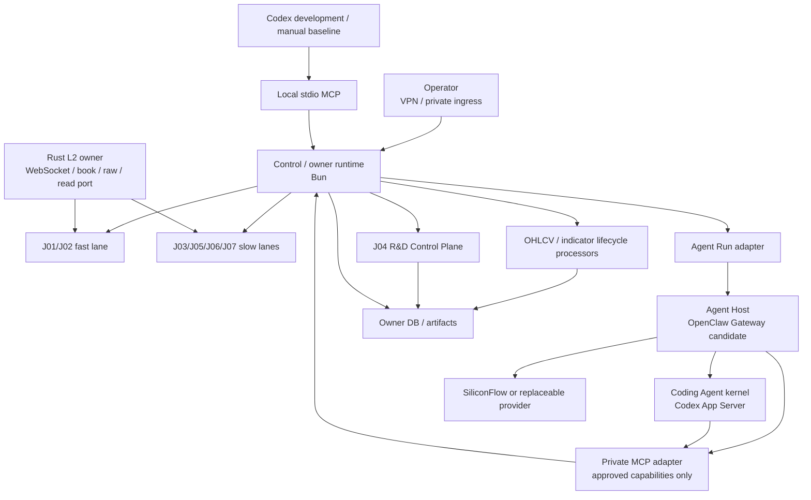

# 远程容器常驻 Runtime 设计与迁移计划

## 1. 场景结论

目标场景是：单台远程 Linux 主机以容器长期运行程序化快慢轨、策略研发与治理、L2、OHLCV 和指标流水线，并在需要语义推理时调用可替换 Agent Host。

这个目标与现有 program-owned / agent-augmented 方向一致，已开始 no-live composition 施工，但距离完整采用仍有明显缺口：

- 仓库已有 locked multi-stage `Dockerfile`、no-live Compose 与 opt-in Operator override；当前环境没有 Docker executable，尚无真实 image / container 采用证据。
- 当前 server profile 只装配三项 no-live host-native unit，control runtime 仍是 `shadow_program`。
- 当前 `agent.mcp` 只有同机 stdio；尚无跨容器、鉴权的 MCP adapter。
- 当前 R&D autonomy 只闭合单次 hypothesis model task，尚未把 Planner、Developer、Reviewer 接入常驻 Agent Host。
- 当前 L2 是 profile 固定单 symbol owner，尚无 Runtime / R&D demand reconciliation 与动态 multi-symbol lifecycle。
- Research Source 只完成 P0 合同/尖峰，尚无 cited finding → hypothesis 的 owner/MCP 纵切。
- 策略状态尚无 `retired`，OHLCV / indicator maintenance 也尚未形成正式常驻 cadence。

因此本文是 active migration，不把目标态冒充运行现状；[Server Runtime Profile](../../runtime/server-runtime-profile.md) 与 [Server Container Deployment](../../runtime/server-container-deployment.md) 共同描述当前 authority。

## 2. 目标逻辑拓扑

容器数量不等于 domain 数量。首个 profile 只按生命周期、吞吐和凭证边界分组，具体是否合并辅助进程由实现 spike 决定。

完整的后台服务、Program cadence、R&D Agent loop、MCP、数据与故障降级关系见 [Remote Server Runtime Diagram](../remote-server-runtime.mmd)。



这里有两个不同方向的协议：

1. Program → Agent Host：提交、观察、取消和等待一个 Agent Run；OpenClaw 候选使用其 Gateway WebSocket RPC。
2. Agent Host → Trade capabilities：查询或提交受控 proposal；跨容器目标为私有 Streamable HTTP MCP adapter，本机 Codex 继续使用 stdio adapter。

两条协议不可合并成“让 Agent 自己调度所有任务”。Program 仍决定何时需要语义任务，owner 仍决定结果是否接纳。

## 3. Runtime plane 与技术选择

| Plane | 目标职责 | 首选技术 | 不承担 |
| --- | --- | --- | --- |
| control / owner | cadence、lease、J01–J07、owner ports、Agent Run dispatch | TypeScript + Bun | L2 hot loop、通用 Agent loop |
| L2 hot plane | Binance public WebSocket、sequence/gap、book、raw segment、bounded reads | Rust + Tokio | 策略判断、MCP、LLM |
| indicator / feature | 复用现有确定性计算与 manifest | 现有 Go / Bun；不为统一语言重写 | owner 状态、策略 promotion |
| replay / research execution | Trial、Replay、Result、lineage | 现有 TypeScript + Bun；独立 oracle 可用 Python | Agent session 作为事实 |
| semantic Agent Host | Planner / Developer / Reviewer 的有界 tool loop | OpenClaw Gateway + native Codex App Server 优先候选；direct Codex 保留基线 | scheduler、Replay owner、策略 lifecycle |
| optional workflow | 单个 Agent Run 内的 checkpoint / interrupt | LangGraph JS library，仅在评测证明需要时 | J01–J07 或 R&D durable lifecycle |
| interactive development | 代码理解、人工迭代、质量基线 | Codex + 同一 owner capability surface | 远程生产 daemon |

首个远程 profile 不引入 Kafka、Kubernetes、LangGraph Agent Server 或自托管 LangSmith。只有跨主机、多独立 consumer、durable offset / backlog / replay 已成为真实需求时，才按 [Physical Runtime and Transport Decision](../physical-runtime-transport.md) 评审 broker；L2 当前继续使用 raw segment + bounded read port。

## 4. 程序化长期循环

| 循环 | 触发与 owner | Agent 参与 | 故障语义 |
| --- | --- | --- | --- |
| L2 ingest | Rust resident owner；Market Data 协调已接纳的 symbol 需求 | 无 | gap/resync/new epoch；不连坐 control；需求方不控制 daemon |
| OHLCV sync | program-owned lifecycle processor → Market Data owner | 无；缺数据时只接收 typed request | provider failure 不伪造 fresh |
| indicator refresh | 新数据 watermark → deterministic calculator | 无 | 旧 feature 标 stale |
| J01/J02 fast | program cadence / event | 无 | fail closed；不等待模型 |
| J03 slow | program cadence | 仅已登记的语义判断 | timeout 返回 blocked/no_action |
| J04 R&D | 长期 R&D Factory / Research Control Plane | Planner / Developer / Reviewer Agent Runs | Factory 持续选择工作；每次 Campaign/Run/Trial 有预算、身份和 owner validation |
| J05/J06/J07 | 各 owner cadence | 可做只读解释，不拥有状态迁移 | Host 离线仍运行确定性部分 |

Docker/Compose 只负责容器级 restart、health ordering 和资源限制；仓库 foreground runtime 只管理自己的 exact child、lease、业务恢复和 drain。二者不得同时重启同一 sibling 或形成无限内外层 crash loop。

## 5. R&D 与策略生命周期

目标语义链是：

```text
Long-running R&D Factory reads Control Plane
  -> deterministic ready work: execute without Agent
  -> semantic gap:
       optional cited research finding / runtime improvement request
       Planner Agent Run -> Proposal
       Control Plane admit
       Developer Agent Run -> Contract Draft
       Control Plane validate / freeze / reserve Trial
       deterministic Replay worker -> Result
       Reviewer Agent Run -> Review Decision
       Control Plane persist / revise / reject / accept
  -> Strategy Registry materializes accepted Draft
  -> J05 Forward evidence
  -> Governance decides draft / shadow / live-small / paused / retired
  -> lifecycle evidence / improvement request returns to Factory
```

Agent kernel 负责有界的多轮理解、工具调用、代码阅读 / 修改和 proposal 修订；优先评测 OpenClaw Gateway 托管 native Codex App Server，同时保留 direct Codex adapter。Developer 只能在每 Run 隔离 worktree 写 MD / code / tests；“让 Agent 跑回测”只允许解释为它调用 MCP 请求，由 Replay owner 执行并返回 Result ref。Host 不写 production repo、research DB 或 lifecycle decision。

`paused` 是可恢复的运行禁用；`retired` 是某个策略版本的终止状态，禁止再产生新 setup、forward 或 live 动作，但保留全部历史证据。恢复相同思想必须形成新版本并重新治理。该状态仍是产品缺口，不能在迁移前冒充已支持。

LangGraph 若采用，只能管理一次 Planner/Developer/Reviewer Agent Run 内部的局部多轮步骤；其 checkpoint 仅保存恢复信息和 owner refs，不能复制 Proposal、Trial、Result、Review 或策略 lifecycle authority。

Factory 长期存在不表示 Agent、Campaign 或 Trial 无界运行。局部 `budget_exhausted / blocked / candidate_found` 必须终止并保存结果；Factory 再根据并发、成本、安全 policy、数据 readiness、forward 样本和 release 状态选择下一项工作。当前 program terminal 状态尚未完成这次分层。

family 是 Strategy Universe 中的机制身份，代码只是某 engine / release 的 implementation。目标 engine 已有实现时，策略由 Registry 从 accepted Contract 确定性物化；implementation 不足或机制新增时，Agent 只能在独立 sandbox 生成 capability request 与 patch/artifact，经过 CI、人工 code review、release 和部署后再进入研究。需要语义判断的 MD policy 走显式 Agent-assisted task contract，不能把读取 Markdown 冒充代码执行；常驻 Agent 不修改运行中容器。

## 6. 容器信任与持久化

首个单主机 profile 至少保持以下逻辑隔离，物理容器数量留给 spike：

| Boundary | 可持有 | 禁止持有 |
| --- | --- | --- |
| control / owner runtime | owner DB、artifact refs、精确 owner credential | Agent 通用 exec 权限 |
| Rust L2 | public network、L2 raw volume、自己的 runtime state | LLM key、Binance private write |
| Agent Host | provider key、Host / Codex thread state、私网 MCP/RPC | owner DB、Binance key、production repo RW、宿主机 home、Docker socket |
| Developer code sandbox | 冻结 revision 的隔离 worktree、预装 toolchain/cache、临时 artifact | credential、owner DB、默认网络、production volume、Docker socket |

- owner DB / artifact、L2 raw、Agent Host state 使用分离 volume 和备份策略；Host state 丢失不能破坏领域恢复。
- MCP、Gateway RPC 与 owner ports 只放在 private container network；不映射公网端口。
- operator ingress 默认通过 VPN / SSH tunnel 或受认证反向代理；它不转发通用 MCP。
- secret 以每服务 allowlist 注入，不进入 image、Compose 文件、command line、health、artifact 或日志。
- production image 锁定版本与 digest；release、schema、profile 和 capability set 均进入可追踪 manifest。

若 OpenClaw 自身运行于 Docker，首个 profile 关闭其通用 shell/browser/cron/subagent 和 Docker sandbox orchestration；不得为获得嵌套 sandbox 把宿主机 Docker socket 挂入 Host。

## 7. 恢复与降级

| 故障 | 必须继续 | 允许阻断 |
| --- | --- | --- |
| Agent Host / provider 退出 | L2、数据维护、J01/J02、确定性 owner job | 尚未完成的语义 Agent Run |
| control runtime 重启 | L2 owner 与已落盘 raw | 新 job dispatch；恢复 lease 后继续 |
| L2 重启 / gap | control 与 R&D 非 L2 任务 | 依赖 fresh L2 的判断，直到新 epoch ready |
| MCP adapter 重启 | owner 与不依赖 Agent 的 job | tool call；未确认副作用保持 blocked |
| Host state 丢失 | owner state、已接纳 Proposal/Result/Decision | Host session；从 owner ref 重建新 run |
| disk soft watermark | owner GC / compaction、reconcile、已有 exposure 防御、已接纳证据读取 | 可延期的新候选采集、低优先级研究写入 |
| GC 后仍达 volume / disk hard limit | reconcile、减风险、可验证 stop path、incident / 引用保全 | 新增风险、非必要数据写入或研究任务 |

Compose restart 不证明业务 ready。聚合 readiness 必须分别显示 process、owner、data freshness、Agent capability 和 profile readiness。

## 8. 施工与采用顺序

1. 冻结容器不变量、private network、volume/secret matrix 和 foreground entrypoint；只做 no-live Compose fixture。
2. 复用现有 L2/control process contract，完成 stop/restart、epoch、lease、备份恢复和资源上限演练。
3. 建立 direct Codex App Server Agent Run adapter 与私有网络 MCP adapter；保留本地 stdio，不复制 tool 业务逻辑。
4. 建立 OpenClaw Gateway → native Codex runtime profile，并用同一模型、输入、能力和输出合同对比 Direct Model、direct Codex、OpenClaw-Codex 与 OpenClaw alternate runtime。
5. 先接 Planner proposal-only，再完成 Developer 隔离 worktree → patch/test → owner Replay → 失败诊断 → 二次修改纵切，最后接 Reviewer；Replay 与 Registry 始终由 owner 执行。
6. 将现有 program terminal 拆为长期 Factory 与有界 Campaign/Run/Trial，先验证空队列、局部预算耗尽、candidate handoff 和重启恢复。
7. 实现 Market Data-owned L2 demand vertical slice：慢轨候选短租约、active exposure 固定需求、readiness 和 safe release；再扩 multi-symbol 容量。
8. 完成 Research Source P1/P2 与 owner-backed MCP query，使 cited finding 可回溯进入 hypothesis，但不替代实验。
9. 将 OHLCV / indicator maintenance 纳入 program-owned cadence，验证 watermark、stale、补数和重算恢复。
10. 接通 program-owned capacity inventory 与 owner GC：先闭合 artifact 自动回收，再实现 L2 compaction、跨 consumer reference closure、retention release 和专属删除；验证 soft-watermark 自愈及 hard-line 防御链。
11. 补齐账户级候选仲裁、closed-flow 成熟度聚合、improvement request 与策略 `retired` 的 governance 合同。
12. 建立 Universe family identity 与 implementation coverage assessment、MD / compiled contract / implementation-or-Agent-policy / release binding，以及旧 active flow 兼容回收门；新增代码仍经外部 CI / review / release。
13. 运行跨容器 kill/restart、provider outage、MCP uncertainty、磁盘、误删防护和长时 soak；通过后才评审远程 no-live adoption。
14. live-small 仍按每个 job、credential 和 exchange write 独立采用，不随容器化或 Agent Host 一起授权。

## 9. 暂不决定

- 不预定最终 Compose service 数量、进程一容器一份或未来是否迁移 Kubernetes。
- 不预定 Kafka；只保留 transport adapter seam 和采用门。
- 不预定 OpenClaw 为永久默认 Host，也不预定 LangGraph 一定进入生产。
- 不新增第二套 R&D 状态机、Agent memory、通用远程 shell 或跨服务共享可写 DB。
- 不把 remote deployment 等同于 remote public API；所有控制入口默认私有。
