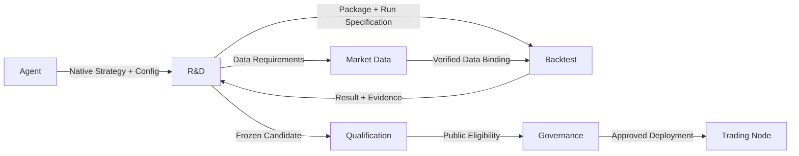

# Strategy Factory

<Callout type="info" title="Native strategy integration">

Agents write Nautilus Strategies directly. The product seals code and run conditions, reuses native backtesting and trading nodes, and introduces no parallel strategy language or execution engine.

</Callout>

## Responsibility

Strategy Factory names the value stream across R&D, Backtest and Qualification, not another service or Owner.
Agents research and author; R&D retains research objects and immutable strategy packages; Backtest executes exploratory replay; Qualification independently evaluates protected samples.
See the [service blueprint](./) for the complete boundaries.

## Native strategy route

Adopt native Strategy, subscriptions/history requests, indicators, timers, OrderFactory, execution algorithms, cache and Portfolio APIs.
Strategies express signals, order prices, protection and sizing; native components own orders, fills, positions and account facts.
Product extensions provide approved qualification, capital/risk authorization, durable tasks and evidence binding.

The target input is a native source package, usually a Python Strategy; use native Rust extensions only for a named consumer.
JSON can serialize parameters and package metadata. It is not a signal language and is not compiled into a product IR.
The JSON strategy language, BFP/Plan, source lowering, Wasm guest and custom strategy interpreter are outside the target route.
Their existing implementations are recorded in the [R&D status ledger](../owners/rd/#implementation-status-ledger); they do not require future features to extend that chain.

## Strategy package and content identity

R&D seals a content addressed Strategy Artifact containing:

- native source and imported strategy modules, entry class and parameters;
- dependency locks, Nautilus/product runtime versions and a reproducible environment reference;
- required data types, instrument rules, time resolutions and availability semantics;
- signal, protection and sizing rules inside the strategy, with applicable native interface requirements.

Changing these contents creates a new strategy hash and a complete new validation lifecycle.
Redeploying unchanged content still checks valid qualification, stage, policy and current authority.
A rerun changes neither the strategy hash nor previous trial/exposure records.

The exact historical window, data versions, initial account, fees, funding, slippage/fill/latency models, event ordering, seeds and resource ceilings belong to a separate immutable Run Specification.
Changing data or replay conditions creates a new experiment/attempt, not automatically a new strategy hash; preserve their exact relationship.
Do not promise byte identical arbitrary native floating point calculations across platforms. Bind the environment and demonstrate reproducibility with actual replay evidence.

A composition has its own content version referencing exact strategy versions, allocation policy, join/exit plans and assessed account scope.
Changing composition configuration rewrites neither member source nor member qualification.

## Data requirements and preparation

Strategies declare requirements. Market Data checks supported capabilities and available coverage, then prepares or reuses inputs.
An experiment binds actual exact inputs; declaring data does not prove it exists.

| Situation                                 | Product outcome                                                |
| ----------------------------------------- | -------------------------------------------------------------- |
| Unsupported type or source                | Explicit capability gap for Agent proposed product improvement |
| Supported capability, unprepared coverage | Preparation task and gaps; bind its completed result           |
| Verified matching coverage                | Reuse exact versions rather than duplicate downloads/storage   |
| Failed or unknown preparation             | Preserve task identity and evidence; never invent zeros        |

Reuse native DataEngine, clients, aggregation and Catalog. Strategies receive admitted native inputs, not MCP fetches from matching callbacks.
Funding, contract rules, universe membership and price basis require actual inputs and point in time semantics; OHLCV alone cannot stand in for a complete market environment.

## Orders and state semantics

Native Strategies use order commands and lifecycle events, not another product net target interpreter.
Integration must cover resting limit entries, expiration, conditional cancellation, partial fills, individual protection, staged exits and frozen target prices.
Reuse native orders, OMS and execution algorithms first; missing venue/native capabilities remain explicit extension gaps, not claims of support.

- Strategy rules determine cancellation and protection updates; native execution handles order state and fill/cancel races.
- Entries can retain independent exits; strategy and account usage remain within approved allocation and risk.
- Determinate failures such as insufficient margin terminate the command. Execution reconciles unknown network outcomes by original order identity; neither Agent nor strategy guesses by duplicating an order.
- A failed call invents no fill and changes no original target price implicitly.
- Multiple strategies and legs replay against one native account and event sequence. Internal trade attribution is distinct from venue net positions and does not create independent venue wallets.

Strategies can consume native cache/Portfolio; those APIs are not account authorization boundaries.
Neither strategy IDs nor same process Python objects establish strong isolation. Protected data, database write permissions and venue credentials remain at the services that own them; ordinary Docker ceilings prove resource limits only.
Real execution still requires Governance, Risk and Execution authority and verification. Loadable source is not proof of safe integration.

## Native replay and ambiguous fills

Backtest extends Nautilus Engine rather than copying its matcher. Native bar execution policies supply OHLC path assumptions, not evidence of actual event chronology.
See [Backtest](../owners/backtest/) and [Market Data](../owners/market-data/).

1. Market Data prepares the frozen finest declared resolution; reuse native aggregation for larger bars.
2. Backtest replays through the native Engine and records ranges requiring refinement.
3. If finer inputs are needed, request preparation after matching ends, then bind successor inputs and replay linked to the predecessor.
4. Default to a complete rerun, with no matcher network I/O, recursive input mutation, rewind or stitched fills from separate runs.

When the approved finest granularity cannot resolve order, freeze and label the conservative policy: stop first for an existing position's stop/target conflict; for unordered entry/target, do not invent a same bar target exit and retain the entered position.
Missing data is not ambiguous chronology and cannot use that fallback. Gap stops use executable prices and native fill/slippage models, not a fictitious fill at the trigger.
Keep end of run open positions and their valuation rather than forcibly closing them to improve results.

## Research and qualification boundary

Agents choose experiments, interpret results, compare candidates and iterate or stop within frozen theme, data scope, risk tolerance and budget.
R&D checks mechanical version, identity, data, budget and authority facts. It neither evaluates hypothesis value nor requires fixed diagnosis categories or a unique winner to continue research.
See [R&D](../owners/rd/) for the detailed flow.

Qualification evaluates protected samples independently under preapproved policy; seal the strategy package and evaluation configuration before execution.
R&D, Agents and research tasks cannot directly read protected inputs, internal outcomes or diagnostics.
Strategies inside the protected worker consume only the admitted native assessment stream; code access, network, logs and outputs must prevent sample/detail export to research.
Isolation for arbitrary native source remains unproven; existing Wasm verification cannot prove that integration.
Research receives only the approved binary public conclusion; private ternary status does not close the research mechanism.
Reports, errors, timing, logs and knowledge entries must not leak protected details.

Exact strategy identity, data/result frontiers, cumulative trials/exposures and independence basis require native readback from their owning services.
Callers cannot supply missing/unknown facts. Native source adoption does not reset records or automatically confer GENESIS.

## Handoffs and authority

| Handoff                                         | Sole writer                                  | Consumer receives                                               |
| ----------------------------------------------- | -------------------------------------------- | --------------------------------------------------------------- |
| Strategy package, experiment, research decision | R&D                                          | Immutable content and evidence, no trading authority            |
| Data versions, coverage, preparation results    | Market Data                                  | Authorized input references, no protected sample bypass         |
| Replay task and actual results                  | Backtest                                     | Exact run/report, no inferred qualification                     |
| Protected assessment and eligibility            | Qualification                                | Limited public eligibility and controlled governance projection |
| Deployment, stages, capital policy              | Governance                                   | Version and quota bound runtime authorization                   |
| Accounts, orders, fills                         | Respective Owners inside native Trading Node | Native facts and approved projections, no cross Owner rewrites  |

A shared database does not merge authority. Fixed Owner APIs, role permissions, sealed positive readbacks, complete lineage and transaction atomicity remain enforceable.
Package admission confers no raw cross Owner table access, protected data access or venue effect authority.

## Implementation acceptance

The source route is target design, not proof that current MCP can submit, load or execute native packages.
Each implementation slice identifies the adopted native version/API, actual integration point and smallest necessary extension; it must not add another strategy compiler.

Acceptance demonstrates together:

- repeatable native R-1 replay from the same sealed package, inputs and run conditions, producing actual terminal reports;
- named refusal of missing data, exceeded budget, protected data access and unauthorized execution;
- restart/unknown outcome resolution by the same identity, without duplicate consumption/fills or erased trial counts;
- before real admission, inability of strategy code to bypass order/account authority or access credentials/protected samples;
- passing relevant ordered Owner chains on Linux CI and a wired production consumer. Local checks and documentation diagrams are not runtime readiness.
