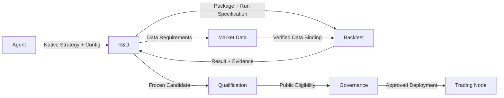

# Strategy Factory

<Callout type="info" title="原生策略接入">

Agent 直接编写 Nautilus Strategy。产品封存代码和运行条件，复用原生回测与交易节点，不建立另一种策略语言或执行引擎。

</Callout>

<a id="responsibility" />

## 职责

Strategy Factory 是 R&D、Backtest 和 Qualification 的价值流名称，不是新的服务或 Owner。
Agent 研究与编写；R&D 保存研究对象和不可变策略包；Backtest 执行探索回放；Qualification 独立评估保护样本。
完整服务边界见[服务蓝图](./)。

<a id="native-strategy-route" />

## 原生策略路线

采用 Nautilus 提供的 Strategy、数据订阅/历史请求、指标、定时器、订单工厂、执行算法、cache 和 Portfolio API。
策略表达信号、订单价格、保护与数量规则；原生组件管理订单、成交、持仓与账户事实。
产品增加用户已批准的资格、资金与风险授权、持久任务及证据绑定。

目标输入是原生策略源码包，通常使用 Python Strategy；原生 Rust 扩展只在有明确消费者时使用。
参数和包元数据可以用 JSON 序列化，但它们不是信号表达语言，也不编译成产品自定义 IR。
JSON 策略语言、BFP/Plan、源码 lowering、Wasm guest 和自定义策略解释器不属于目标路线。
已有实现的这些对象见 [R&D 实现状态](../owners/rd/#implementation-status-ledger)，不能据此要求新功能继续扩展旧链路。

<a id="strategy-package-and-content-identity" />

## 策略包与内容身份

R&D 对以下内容形成不可变、内容寻址的 Strategy Artifact：

- 原生源码及被导入的策略模块；入口类和参数；
- 依赖锁、Nautilus/产品运行版本及可重建环境引用；
- 策略所需的数据类型、标的规则、时间尺寸和可得时间语义；
- 策略内的信号、保护和数量规则，以及适用的原生接口能力声明。

改变上述内容产生新的策略 hash，按完整生命周期重新验证。相同 hash 原样重新上线，仍须检查资格、阶段、政策和当前授权是否有效。
重跑不改变策略 hash，也不清除旧试验或样本暴露记录。

某次实验的具体历史窗口、数据版本、初始账户、费用、资金费、滑点/成交/延迟模型、事件排序、随机种子和资源上限，封存在独立 Run Specification 中。
仅更换数据或回放条件不自动改变策略内容身份；必须产生新实验/attempt，保持两者准确关联。
不宣称任意原生浮点代码在不同平台逐字节一致；可重复性须绑定运行环境并以实际重放证据证明。

组合配置是独立的内容版本，引用准确策略版本、分配政策、加入/退出预案和已评估的账户范围。
修改组合配置不重写成员策略源码，也不把组合资格偷换为成员资格。

<a id="data-requirements-and-preparation" />

## 数据需求与准备

策略声明需求，Market Data 检查产品能力和可用覆盖，并准备或复用数据。
实际实验绑定准确输入，不把"声明了数据"当作"已经有数据"。

| 情况                 | 产品出口                                |
| -------------------- | --------------------------------------- |
| 数据类型或来源不支持 | 返回明确能力缺口，供 Agent 提出产品改进 |
| 能力支持、覆盖未准备 | 返回准备任务和缺口；完成后绑定结果      |
| 数据已验证且覆盖匹配 | 复用准确版本，不重复下载和存储          |
| 准备失败或结果未知   | 保留原任务身份及证据，不伪造零值        |

复用原生 DataEngine、客户端、聚合和 Catalog。策略接收已准入的原生数据，不在撮合回调中调用 MCP 获取缺失数据。
资金费、合约规则、标的成员及价格依据均须有对应输入与点时语义，不能用 OHLCV 假装完整市场数据。

<a id="orders-and-state-semantics" />

## 订单与状态语义

原生 Strategy 使用订单命令和生命周期事件，不通过产品另建净目标解释器。
产品接入必须覆盖限价挂单、有效期、条件撤单、部分成交、每笔保护、分段退出和固定目标价的研究故事。
Nautilus 的现有订单、OMS 和执行算法优先复用；场所/原生接口缺少的能力明确列为扩展缺口，不能声称已支持。

- 策略规则决定挂单何时失效、止损止盈何时变化；订单状态及成交竞争由原生执行链处理。
- 每笔入场可独立管理退出；策略与账户资金统一受获准额度和风险约束。
- 保证金不足等确定拒绝终结该命令；网络结果未知由 Execution 按原订单身份对账，不能让 Agent 或策略重复下单猜结果。
- 调用失败不虚构成交，也不隐式修改策略原目标价。
- 多策略及多腿回放使用同一原生账户与事件序列；需要区分按笔账目与交易所净持仓，不能把内部归因当作交易所拥有独立钱包。

Strategy 可以消费原生 cache/Portfolio；这些 API 本身不是账户权限边界。
产品不能依靠 strategy ID 或同进程 Python 对象实现强隔离。受保护数据、数据库写权限和真实交易凭据必须留在拥有它们的服务边界；普通 Docker 限额只证明资源限制。
需要真实交易的接入仍须通过 Governance、Risk、Execution 的授权和验证，不能以"可加载源码"证明已经安全接通。

<a id="native-replay-and-ambiguous-fills" />

## 原生回放与成交歧义

Backtest 扩展 Nautilus Engine，不复制撮合器。原生 bar 执行策略只给出 OHLC 内的执行假设，不能证明实际先后顺序。
详情见[回测设计](../owners/backtest/)及[市场数据](../owners/market-data/)。

1. Market Data 先准备冻结需求中的最小窗口数据，复用原生聚合生成较大窗口。
2. Backtest 使用原生 Engine 回放，记录需要细化的歧义范围。
3. 需要补充更细数据时，撮合结束后经 Market Data 准备，创建关联前驱的新输入和后继回放。
4. 默认完整重放，不在引擎内部访问网络、递归改写行情、回滚或拼接两次运行的成交。

到获准最细粒度仍无法判断时，使用显式冻结的保守政策并标注假设：已持仓止损/止盈冲突按止损优先；入场与目标先后未知时不能虚构当根止盈，入场后继续持仓。
缺数据不是成交歧义，不得借兜底伪造历史。跳空止损使用可执行价格和原生成交/滑点模型，不假造按触发价成交。
回测末尾保留未平仓及其估值，不默认强制平仓提高表现。

<a id="research-and-qualification-boundary" />

## 研究与资格边界

Agent 在冻结主题、数据范围、风险容忍和预算内选择实验、解释结果、比较候选并决定迭代或停止。
R&D 校验版本、身份、数据、预算与授权等机械事实，不判断假设是否有价值，不要求固定诊断类别或唯一赢家才能继续研究。
详细流程见 [R&D](../owners/rd/)。

Qualification 按预先批准的评估政策独立运行保护样本，策略包和评估配置在运行前冻结。
R&D、Agent 和研究任务不能直接读取保护输入、内部结论或诊断。
保护 worker 中的策略仅消费该评估获准的原生数据流；代码访问、网络、日志及输出必须被限制，不能把样本或细节带回研究侧。
原生任意源码的这条隔离接线尚未证明，不能沿用 Wasm 的验证结果宣布它已具备。
研究侧只得到允许的二级公开结论；内部三级状态不据此关闭研究机制。
公开资格结论不得通过报告、错误、时间、日志或知识条目泄露保护细节。

冻结策略身份、数据/结果前沿、累计试验和暴露记录及独立性依据必须由相应 Owner 原生读回。
缺失或未知不由调用者补写，也不因为改用原生源码而重置记录或自动获得 GENESIS。

## 交接与权威

| 交接                     | 唯一写入者               | 消费者可获得什么                    |
| ------------------------ | ------------------------ | ----------------------------------- |
| 策略包、实验、研究决定   | R&D                      | 不可变内容和关联证据；无交易权限    |
| 数据版本、覆盖、准备结果 | Market Data              | 获准输入引用；无保护样本旁路        |
| 回放任务与实际结果       | Backtest                 | 准确运行和报告；无资格推断          |
| 保护评估与资格           | Qualification            | 有限公开资格及受控治理投影          |
| 上下架、阶段、资金政策   | Governance               | 绑定版本和额度的运行授权            |
| 账户、订单、成交         | 原生交易节点内相应 Owner | 原生事实及获准投影，不跨 Owner 改写 |

共用数据库不合并权威。固定 Owner API、角色权限、密封正向回读、完整血缘及事务原子性仍然生效。
源码包准入不能授予跨 Owner 原始表访问、保护数据或场所效果权限。

## 实现验收

源码路线是目标设计，不代表当前 MCP 已能提交、加载或运行原生包。
实现切片先确认原生版本/API，选择实际接入点和最小扩展；不得继续增加第二套策略编译器。

验收须同时证明：

- R-1 原生策略可从同一冻结包、输入和运行条件重复回放，产出实际终态报告；
- 缺数据、超预算、保护越权和未授权执行被具名拒绝；
- 重启与未知结果按同一身份恢复，不重复消耗、成交或清除试验计数；
- 真实准入前，策略代码不能绕过账户/订单授权或读取受保护凭据和样本；
- Linux CI 中相关 Owner 有序链通过，生产入口确实装配消费端；本地测试及文档图不等于运行就绪。
