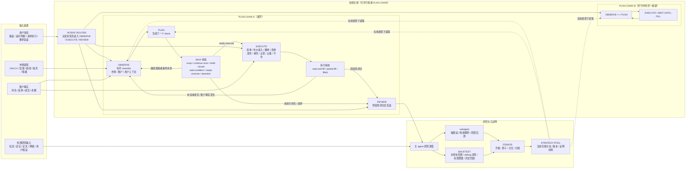

# 复杂链关系图

这张图用于帮助理解：长期使用后，系统复杂度主要来自三件事同时存在：

- 在线侧不是单线推进，而是多个 `PLAN-CHAIN` 并行，各自不断在 `OBSERVE / PLAN / EXECUTE / REVIEW` 间回返
- `WAIT-CONDITION`、`WAIT-UNTIL-FILL` 是挂在 block 或执行链上的状态，不是新的主阶段
- 复盘与外部研究不会直接混进在线主线，而是进入研究与沉淀侧，最后通过 `STRATEGY-POOL` 回接主流程

