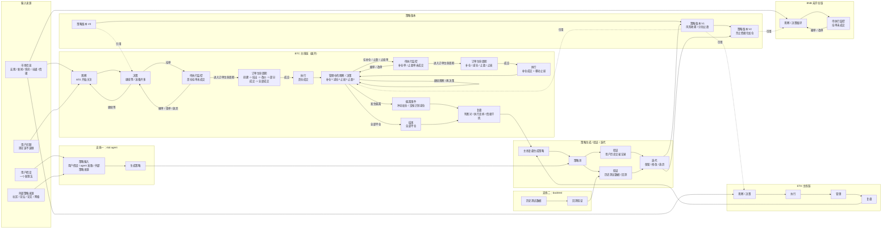

# 复杂链关系图

这张图用于帮助理解：长期使用后，系统的复杂度不只来自多条交易链并行，也来自主线里的循环状态、订单生命周期，以及主线复盘、`r&d agent`、`backtest` 一起汇入策略生成、验证、迭代。

```mermaid
flowchart LR
  subgraph INPUT["输入来源"]
    M["市场信息<br/>宏观 / 新闻 / 快讯 / 社媒 / 情绪"]
    Q["用户问题<br/>现在该不该做"]
    H["用户假设<br/>一个新想法"]
    C["外部策略来源<br/>社区 / 论坛 / 论文 / 网络"]
  end

  subgraph STRAT["策略版本"]
    SV0["策略版本 V0"]
    SV1["策略版本 V1<br/>风险收紧 / 分批止盈"]
    SV2["策略版本 V2<br/>禁止情绪化加仓"]
    SV0 --> SV1 --> SV2
  end

  subgraph BTC["BTC 主线链（展开）"]
    B1["观察<br/>4/01 开始关注"]
    B2["决策<br/>继续等 / 准备开多"]
    B3["待执行监控<br/>首仓挂单未成交"]
    B4["订单生命周期<br/>创建 -> 挂出 -> 改价 -> 部分成交 -> 全部成交"]
    B5["执行<br/>首仓成交"]
    B6["管理中的观察 / 决策<br/>补仓? 减仓? 止损? 止盈?"]
    B7["待执行监控<br/>补仓单 / 止盈单未成交"]
    B8["订单生命周期<br/>补仓 / 减仓 / 止盈 / 止损"]
    B9["执行<br/>补仓成交 + 移动止损"]
    B10["偏离事件<br/>冲动加仓 / 没按计划减仓"]
    B11["结束<br/>全部平仓"]
    B12["复盘<br/>判断对 / 执行走样 / 情绪干扰"]

    B1 --> B2
    B2 -->|继续等| B1
    B2 -->|挂单| B3
    B3 -->|撤单 / 改单 / 放弃| B2
    B3 -->|进入订单生命周期| B4
    B4 -->|成交| B5
    B5 --> B6
    B6 -->|继续观察 / 再决策| B6
    B6 -->|挂补仓 / 止盈 / 止损单| B7
    B7 -->|撤单 / 改单| B6
    B7 -->|进入订单生命周期| B8
    B8 -->|成交| B9
    B9 --> B6
    B6 -->|发生偏离| B10
    B10 --> B12
    B6 -->|全部平仓| B11 --> B12
  end

  subgraph ETH["ETH 主线链"]
    E1["观察 / 决策"]
    E2["执行"]
    E3["管理"]
    E4["复盘"]
    E1 --> E2 --> E3 --> E4
  end

  subgraph BNB["BNB 未开仓链"]
    N1["观察 / 决策循环"]
    N2["待执行监控<br/>挂单未成交"]
    N1 --> N2
    N2 -->|撤单 / 改单| N1
  end

  subgraph RD["支线一：r&d agent"]
    R1["策略输入<br/>用户假设 / agent 发散 / 外部策略来源"]
    R2["生成策略"]
    R1 --> R2
  end

  subgraph BT["支线二：backtest"]
    T1["历史测试数据"]
    T2["回测验证"]
    T1 --> T2
  end

  subgraph GVI["策略生成 / 验证 / 迭代"]
    G1["主线复盘生成策略"]
    G2["策略池"]
    V1["验证<br/>用户历史交易记录"]
    V2["验证<br/>历史测试数据 / 回测"]
    I1["迭代<br/>保留 / 修改 / 放弃"]
    G1 --> G2
    G2 --> V1
    G2 --> V2
    V1 --> I1
    V2 --> I1
  end

  M --> B1
  Q --> B1
  M --> E1
  M --> N1
  H --> R1
  C --> R1

  B12 --> G1
  E4 --> G1
  R2 --> G2
  T2 --> V2

  I1 --> SV1
  I1 --> SV2

  SV0 -.引用.-> B2
  SV1 -.引用.-> B6
  SV1 -.引用.-> E1
  SV2 -.引用.-> N1
```
