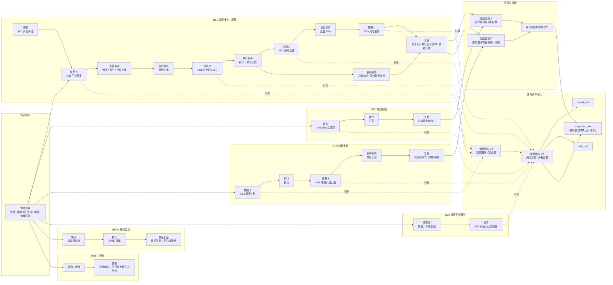

# 复杂链关系图

这张图用于帮助理解：长期使用后，系统承接的复杂度主要来自多条链并行、策略版本演化、执行事件、偏离事件与复盘回流之间的关联，而不只是单条聊天记录越来越长。

```mermaid
flowchart LR
  subgraph BG["外部输入"]
    M["市场背景<br/>宏观 / 新闻流 / 快讯 / 社媒 / 情绪环境"]
  end

  subgraph SA["策略资产演化"]
    V1["策略版本 V1<br/>趋势跟随 / 宽止损"]
    V2["策略版本 V2<br/>风险收紧 / 分批止盈"]
    SR["signal_rule"]
    RR["risk_rule"]
    CR["cognitive_rule<br/>剧烈波动时禁止手动改仓"]
    V1 --> V2
    V2 --> SR
    V2 --> RR
    V2 --> CR
  end

  subgraph BTC1["BTC 波段多链（展开）"]
    B0["观察<br/>4/01 开始关注"]
    B1["快照 A<br/>4/02 正式开多"]
    B1c["多轮沟通<br/>澄清 / 追问 / 比较方案"]
    BE1["执行事件<br/>首仓进场"]
    B2["快照 B<br/>4/04 补仓条件成立"]
    BE2["执行事件<br/>补仓 + 移动止损"]
    D1["偏离事件<br/>冲动加仓 / 没按计划减仓"]
    B3["快照 C<br/>4/07 部分止盈"]
    BE3["执行事件<br/>止盈 30%"]
    B4["快照 D<br/>4/09 风险收紧"]
    BR["复盘<br/>判断对 / 执行部分走样 / 情绪干扰"]
    B0 --> B1 --> B1c --> BE1 --> B2 --> BE2 --> B3 --> BE3 --> B4 --> BR
    BE2 --> D1
    D1 --> BR
  end

  subgraph BTC2["BTC 短线空链"]
    BS1["快照<br/>4/05 15m 反弹空"]
    BSE1["执行<br/>开空"]
    BSR["复盘<br/>与波段多链独立"]
    BS1 --> BSE1 --> BSR
  end

  subgraph ETH["ETH 波段多链"]
    E1["快照 A<br/>4/03 低吸计划"]
    EE1["执行<br/>首仓"]
    E2["快照 B<br/>4/06 未按计划止盈"]
    D2["偏离事件<br/>拖延止盈"]
    ER["复盘<br/>执行偏离大于判断问题"]
    E1 --> EE1 --> E2 --> D2 --> ER
  end

  subgraph SOL["SOL 观察到决策链"]
    S1["观察链<br/>先看，不急着做"]
    S2["快照<br/>4/08 升级为正式决策"]
    S1 --> S2
  end

  subgraph NEAR["NEAR 短线尝试"]
    N1["快照<br/>尝试性进场"]
    N2["执行<br/>小仓位试错"]
    NR["快速复盘<br/>情境不足，不升级策略"]
    N1 --> N2 --> NR
  end

  subgraph BNB["BNB 计划链"]
    BN1["观察 / 计划"]
    BN2["快照<br/>等待触发，不行动也是正式结论"]
    BN1 --> BN2
  end

  subgraph VA["验证与升级"]
    C1["候选经验 A<br/>补仓后容易放松纪律"]
    C2["候选经验 B<br/>剧烈波动时容易绕开系统"]
    U1["提议升级到策略资产"]
  end

  M --> B1
  M --> BS1
  M --> E1
  M --> S1
  M --> N1
  M --> BN1

  B1 -.引用.-> V1
  B2 -.引用.-> V1
  B3 -.引用.-> V2
  B4 -.引用.-> V2
  BS1 -.引用.-> V2
  E1 -.引用.-> V1
  E2 -.引用.-> V2
  S2 -.引用.-> V2

  BR --> C1
  BR --> C2
  ER --> C2
  BSR --> C1

  C1 --> U1
  C2 --> U1
  U1 --> CR
```
