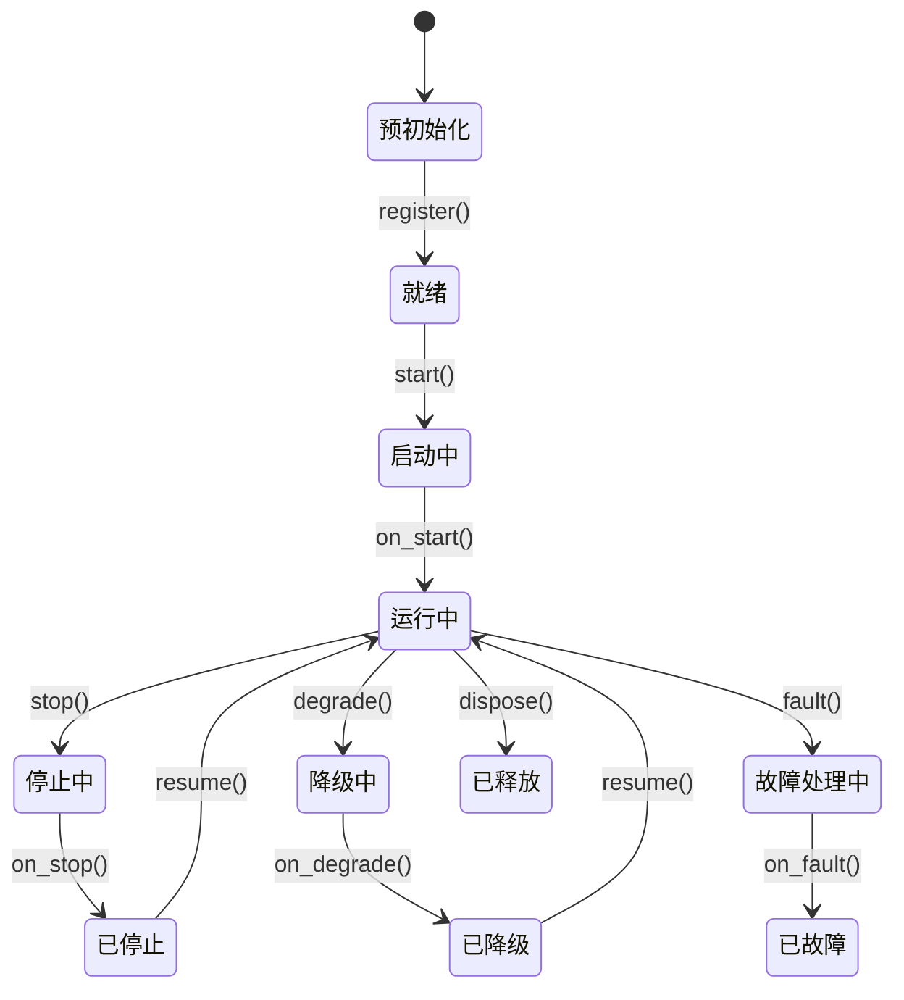

# Actor

`DataActor` 类接收数据、处理事件并管理状态。`Strategy` 类在此基础上增加订单管理能力。

**主要能力**：

- 数据订阅和请求（市场数据、自定义数据）。
- 事件处理和发布。
- 定时器和提醒。
- 缓存访问。
- 日志。

## 基本示例

Actor 通过与策略类似的模式支持配置。

```python
from collections.abc import Sequence

from vibe_trader.common import DataActor
from vibe_trader.config import DataActorConfig
from vibe_trader.model import Bar
from vibe_trader.model import BarType
from vibe_trader.model import InstrumentId


class MyActorConfig(DataActorConfig):
    def __init__(
        self,
        instrument_id: InstrumentId,
        bar_type: BarType,
        lookback_period: int = 10,
        **_kwargs,
    ) -> None:
        self.instrument_id = instrument_id
        self.bar_type = bar_type
        self.lookback_period = lookback_period


class MyActor(DataActor):
    def __init__(self, config: MyActorConfig) -> None:
        super().__init__(config)

        # Custom state variables
        self.count_of_processed_bars: int = 0

    def on_start(self) -> None:
        # Subscribe to bars matching the configured bar type
        self.subscribe_bars(self.config.bar_type)

    def on_bar(self, bar: Bar) -> None:
        self.count_of_processed_bars += 1
```

## Actor 配置与 ID

数据 Actor 可以接收 `DataActorConfig` 子类。基础配置可以包含 `actor_id`；如果提供，Actor 会使用该 ID
注册。如果省略，系统会派生一个运行时 Actor ID。

应把配置视为 Actor 的构造数据。通过 `self.config` 读取用户提供的设置，把运行时状态保存在 Actor 自身。

:::info Rust 实现
对于 Rust Actor，生成或分配的运行时 ID 位于 Actor core，不会写回 `DataActorConfig`。
这与 Python bridge 路径不同：从可导入配置创建 Python 对象时，后者可能把继承的配置字段复制到运行时状态。

Rust 作者实现 `DataActor`，并使用 `self` 上的 facade 方法。`DataActorNative` 仅供运行时接线和借用 core
状态的原生访问。只有同一二进制文件内的性能路径或内部运行时接线才应导入它。
:::

## 生命周期

Actor 在生命周期中遵循定义明确的状态机：



覆盖以下方法可以接入生命周期事件：

| 方法           | 调用时机                                   |
| -------------- | ------------------------------------------ |
| `on_start()`   | Actor 正在启动（在此处订阅数据）。         |
| `on_stop()`    | Actor 正在停止（取消定时器、清理资源）。   |
| `on_resume()`  | Actor 正在从停止状态恢复。                 |
| `on_reset()`   | 重置指标和内部状态（在回测运行之间调用）。 |
| `on_degrade()` | Actor 正在进入降级状态（部分功能可用）。   |
| `on_fault()`   | Actor 遇到故障。                           |
| `on_dispose()` | Actor 正在被销毁（最终清理）。             |

## 定时器与提醒

Actor 可以访问时钟进行调度：

```python
def on_start(self) -> None:
    # Set a recurring timer with a callback (fires every 5 seconds)
    self.clock.set_timer(
        "my_timer",
        timedelta(seconds=5),
        callback=self._on_timer,
    )

    # Set a one-time alert with a callback
    self.clock.set_time_alert(
        "my_alert",
        self.clock.utc_now() + timedelta(minutes=1),
        callback=self._on_alert,
    )


def on_stop(self) -> None:
    # Cancel timers to prevent resource leaks across stop/resume cycles
    self.clock.cancel_timer("my_timer")


def _on_timer(self, event: TimeEvent) -> None:
    self.log.info("Timer fired!")


def _on_alert(self, event: TimeEvent) -> None:
    self.log.info("Alert triggered!")
```

传递 `callback` 可把 `TimeEvent` 对象定向到自己的方法。省略 callback 时，事件会改为传递给
`on_time_event`。

## 系统访问

Actor 可以访问核心系统组件：

| 属性         | 描述                                                         |
| ------------ | ------------------------------------------------------------ |
| `self.cache` | 交易工具、订单、持仓等共享状态。                             |
| `self.clock` | 当前时间以及定时器/提醒调度。                                |
| `self.log`   | 结构化日志。                                                 |
| Signal       | 使用 `publish_signal()` 和 `subscribe_signal()` 发布与订阅。 |

Python 组件之间受支持的自定义消息传递应使用 signal。原始消息总线仍是内部运行时表面。

## 数据处理与回调

系统会根据数据是历史数据还是实时数据使用不同的回调处理器。
理解数据*请求/订阅*与其处理器之间的对应关系非常重要。

### 历史数据与实时数据

系统区分两种数据流：

1. **历史数据**（来自*请求*）：
   - 通过 `request_bars()`、`request_quotes()` 等方法获取。
   - 通过类型专用的批量处理器处理，例如 `on_historical_bars()` 和 `on_historical_quotes()`。
   - 每个响应调用一次 `on_historical_data()` 来处理自定义数据。标量 `CustomData` 以该对象到达；
     批量数据以一个列表到达，包括空列表。
   - 用于初始数据加载和历史分析。

2. **实时数据**（来自*订阅*）：
   - 通过 `subscribe_bars()`、`subscribe_quotes()` 等方法获取。
   - 通过 `on_bar()`、`on_quote()` 等专用处理器处理。
   - 用于实时数据处理。

### 回调处理器

不同数据操作映射到以下处理器：

| 操作                            | 类别 | Handler                         | 用途                           |
| ------------------------------- | ---- | ------------------------------- | ------------------------------ |
| `subscribe_data()`              | 实时 | `on_data()`                     | 实时数据更新。                 |
| `subscribe_instrument()`        | 实时 | `on_instrument()`               | 实时交易工具定义更新。         |
| `subscribe_instruments()`       | 实时 | `on_instrument()`               | 实时交易工具定义更新（场所）。 |
| `subscribe_book_deltas()`       | 实时 | `on_book_deltas()`              | 实时订单簿增量。               |
| `subscribe_book_depth10()`      | 实时 | `on_book_depth()`               | 实时订单簿深度快照。           |
| `subscribe_book_at_interval()`  | 实时 | `on_book()`                     | 按间隔生成的实时订单簿快照。   |
| `subscribe_quotes()`            | 实时 | `on_quote()`                    | 实时报价更新。                 |
| `subscribe_trades()`            | 实时 | `on_trade()`                    | 实时成交更新。                 |
| `subscribe_mark_prices()`       | 实时 | `on_mark_price()`               | 实时标记价格更新。             |
| `subscribe_index_prices()`      | 实时 | `on_index_price()`              | 实时指数价格更新。             |
| `subscribe_bars()`              | 实时 | `on_bar()`                      | 实时 K 线更新。                |
| `subscribe_funding_rates()`     | 实时 | `on_funding_rate()`             | 实时资金费率更新。             |
| `subscribe_instrument_status()` | 实时 | `on_instrument_status()`        | 实时交易工具状态更新。         |
| `subscribe_instrument_close()`  | 实时 | `on_instrument_close()`         | 实时交易工具收盘更新。         |
| `subscribe_option_greeks()`     | 实时 | `on_option_greeks()`            | 实时期权 Greeks 更新。         |
| `subscribe_option_chain()`      | 实时 | `on_option_chain()`             | 实时期权链切片快照。           |
| `request_data()`                | 历史 | `on_historical_data()`          | 历史自定义数据。               |
| `request_book_deltas()`         | 历史 | `on_historical_book_deltas()`   | 历史订单簿增量。               |
| `request_book_depth()`          | 历史 | `on_historical_book_depth()`    | 历史订单簿深度。               |
| `request_book_snapshot()`       | 历史 | `on_book()`                     | 历史订单簿快照。               |
| `request_instrument()`          | 历史 | `on_instrument()`               | 交易工具定义。                 |
| `request_instruments()`         | 历史 | `on_instrument()`               | 交易工具定义。                 |
| `request_quotes()`              | 历史 | `on_historical_quotes()`        | 历史报价。                     |
| `request_trades()`              | 历史 | `on_historical_trades()`        | 历史成交。                     |
| `request_bars()`                | 历史 | `on_historical_bars()`          | 历史 K 线。                    |
| `request_funding_rates()`       | 历史 | `on_historical_funding_rates()` | 历史资金费率。                 |

### 示例

以下示例同时演示历史和实时数据处理：

```python
from vibe_trader.common import DataActor
from vibe_trader.config import DataActorConfig
from vibe_trader.model import Bar
from vibe_trader.model import BarType
from vibe_trader.model import InstrumentId


class MyActorConfig(DataActorConfig):
    def __init__(self, instrument_id: InstrumentId, bar_type: BarType, **_kwargs) -> None:
        self.instrument_id = instrument_id
        self.bar_type = bar_type


class MyActor(DataActor):
    def __init__(self, config: MyActorConfig) -> None:
        super().__init__(config)
        self.bar_type = config.bar_type

    def on_start(self) -> None:
        # Request historical bars, which are processed by on_historical_bars()
        self.request_bars(
            bar_type=self.bar_type,
            start=None,
            end=None,
            limit=None,
            client_id=None,
            params=None,
        )

        # Subscribe to real-time data - will be processed by on_bar() handler
        self.subscribe_bars(
            bar_type=self.bar_type,
            # Many optional parameters
            client_id=None,  # ClientId, optional
            params=None,  # dict[str, Any], optional
        )

    def on_historical_bars(self, bars: Sequence[Bar]) -> None:
        for bar in bars:
            self.log.info(f"Received historical bar: {bar}")

    def on_bar(self, bar: Bar) -> None:
        # Handle real-time bar updates (from subscriptions)
        self.log.info(f"Received real-time bar: {bar}")
```

分离历史与实时 handler，可以根据上下文应用不同处理逻辑。例如：

- 使用历史数据初始化指标或建立基线指标。
- 为实盘交易决策以不同方式处理实时数据。
- 对历史和实时数据应用不同的验证或日志记录。

:::tip
调试数据流问题时，请确认查看的是数据源对应的正确 handler。如果 `on_bar()` 中没有数据，但日志中有
收到 K 线的消息，请检查 `on_historical_bars()`，因为数据可能来自请求而不是订阅。
:::

## 订单事件处理

Python `DataActor` API 不暴露订单事件 callback 或原始消息总线。应在 `Strategy` 中通过具体订单 callback
或 `on_order_event()` 处理订单事件。当其他组件需要派生值时，使用 signal 传递给数据 Actor。
callback 列表请参阅[策略：订单管理](strategies.md#order-management)。

## 相关指南

- [策略](strategies.md)--策略在 Actor 基础上增加订单管理能力。
- [数据](data/)--Actor 可以使用的数据类型和订阅。
- [消息总线](message_bus.md)--Actor 用于通信的消息系统。
