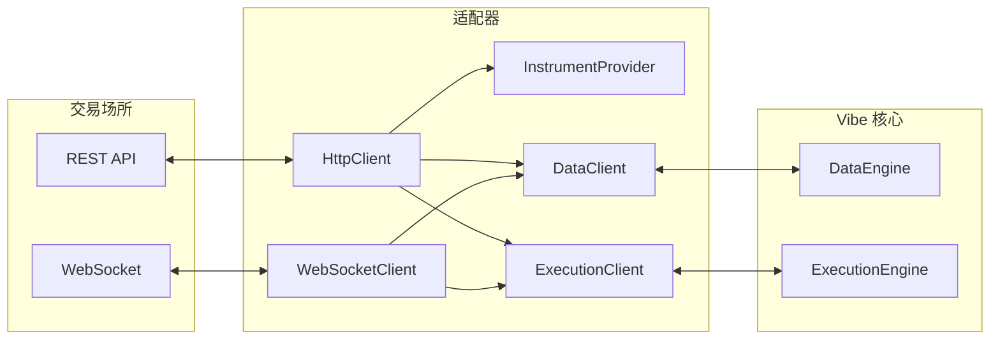

# 适配器

适配器把数据提供方和交易场所集成到 VibeTrader 中。
它们位于顶层 `adapters` 子包中。

一个适配器通常包含以下组件：



| 组件                 | 用途                           |
| -------------------- | ------------------------------ |
| `HttpClient`         | REST API 通信。                |
| `WebSocketClient`    | 实时流连接。                   |
| `InstrumentProvider` | 从场所加载并解析交易工具定义。 |
| `DataClient`         | 处理市场数据订阅和请求。       |
| `ExecutionClient`    | 处理订单提交、修改和取消。     |

## 交易工具 provider

交易工具 provider 把场所 API 响应解析为 Vibe `Instrument` 对象。

`InstrumentProvider` 服务于两个用例：

- 为研究或回测独立发现可用交易工具
- 在 `sandbox` 或 `live` [环境上下文](architecture.md#environment-contexts)中运行时加载，
  供 Actor 和策略使用

### 研究与回测

以下示例发现 Binance Futures testnet 当前的交易工具：

```python
import asyncio
import os

from vibe_trader.adapters.binance.common.enums import BinanceAccountType
from vibe_trader.adapters.binance.common.enums import BinanceEnvironment
from vibe_trader.adapters.binance import get_cached_binance_http_client
from vibe_trader.adapters.binance.futures.providers import BinanceFuturesInstrumentProvider
from vibe_trader.common.component import LiveClock


async def main():
    clock = LiveClock()

    client = get_cached_binance_http_client(
        clock=clock,
        account_type=BinanceAccountType.USDT_FUTURES,
        api_key=os.getenv("BINANCE_FUTURES_TESTNET_API_KEY"),
        api_secret=os.getenv("BINANCE_FUTURES_TESTNET_API_SECRET"),
        environment=BinanceEnvironment.TESTNET,
    )

    provider = BinanceFuturesInstrumentProvider(
        client=client,
        account_type=BinanceAccountType.USDT_FUTURES,
    )

    await provider.load_all_async()

    # Access loaded instruments
    instruments = provider.list_all()
    print(f"Loaded {len(instruments)} instruments")


if __name__ == "__main__":
    asyncio.run(main())
```

### 实盘交易

每项集成的处理方式不同。`LiveNode` 中的 `InstrumentProvider` 通常提供两种加载行为：

- 启动时加载所有交易工具：

```python
from vibe_trader.config import InstrumentProviderConfig

InstrumentProviderConfig(load_all=True)
```

- 只加载配置中指定的交易工具：

```python
InstrumentProviderConfig(load_ids=["BTCUSDT-PERP.BINANCE", "ETHUSDT-PERP.BINANCE"])
```

订阅本身不会加载交易工具。策略订阅实时数据前，应配置 provider 在启动时加载交易工具，
或显式请求交易工具并等待其进入缓存。

## 数据客户端

数据客户端处理一个场所的市场数据订阅和请求。它们连接场所 API，并把传入数据规范化为 Vibe 类型。

### 请求数据

Actor 和策略可以使用内置方法请求数据。数据通过 callback 返回：

```python
from collections.abc import Sequence
from typing import Any

from vibe_trader.model import Bar
from vibe_trader.model import BarType
from vibe_trader.model import InstrumentId
from vibe_trader.trading import Strategy


class MyStrategy(Strategy):
    def on_start(self) -> None:
        # Request an instrument definition
        self.request_instrument(InstrumentId.from_str("BTCUSDT-PERP.BINANCE"))

        # Request historical bars
        self.request_bars(BarType.from_str("BTCUSDT-PERP.BINANCE-1-HOUR-LAST-EXTERNAL"))

    def on_instrument(self, instrument: Any) -> None:
        self.log.info(f"Received instrument: {instrument.id}")

    def on_historical_bars(self, bars: Sequence[Bar]) -> None:
        self.log.info(f"Received {len(bars)} historical bars")
```

### 订阅数据

实时数据使用订阅方法：

```python
def on_start(self) -> None:
    # Assumes the instrument has already been loaded into the cache
    # Subscribe to live trade updates
    self.subscribe_trades(InstrumentId.from_str("BTCUSDT-PERP.BINANCE"))

    # Subscribe to live bars
    self.subscribe_bars(BarType.from_str("BTCUSDT-PERP.BINANCE-1-MINUTE-LAST-EXTERNAL"))


def on_trade(self, tick: TradeTick) -> None:
    self.log.info(f"Trade: {tick}")


def on_bar(self, bar: Bar) -> None:
    self.log.info(f"Bar: {bar}")
```

:::tip
有关所有可用请求和订阅方法及其对应 callback 的完整参考，请参阅 [Actor](actors.md) 文档。
:::

## 执行客户端

执行客户端处理一个场所的订单管理。它们把 Vibe 订单命令转换为场所特有的 API 调用，
并把执行报告处理为 Vibe 事件。

主要职责：

- 提交、修改和取消订单。
- 处理成交与执行报告。
- 使订单状态与场所对账。
- 处理账户和持仓更新。

`ExecutionEngine` 根据订单场所把命令路由到相应的执行客户端。
有关从策略视角进行订单管理的详情，请参阅[执行](execution.md)指南。

:::tip
有关构建自定义适配器的信息，请参阅[适配器开发者指南](../developer_guide/adapters.md)。
:::

## 相关指南

- [实盘交易](live.md)--使用适配器配置和运行实盘交易。
- [执行](execution.md)--通过适配器执行订单。
- [数据](data/)--适配器提供的市场数据。
