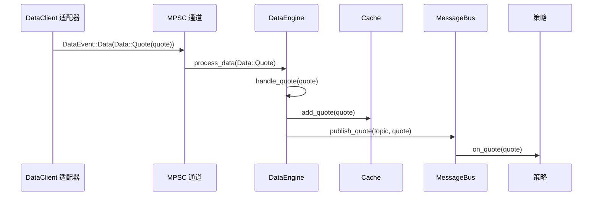
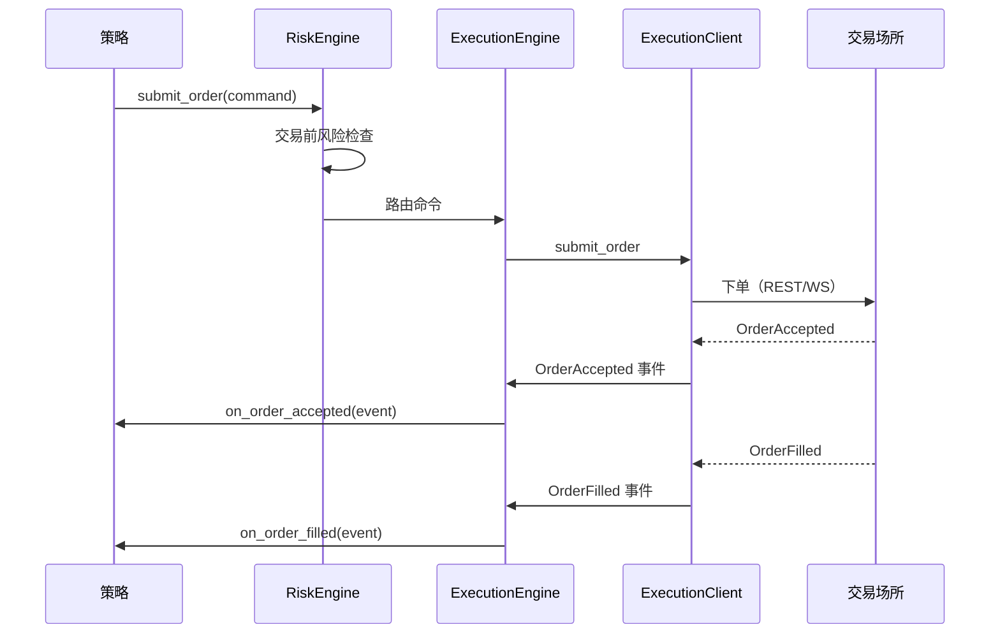
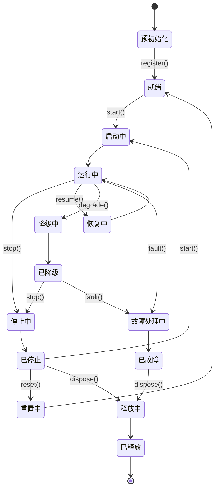
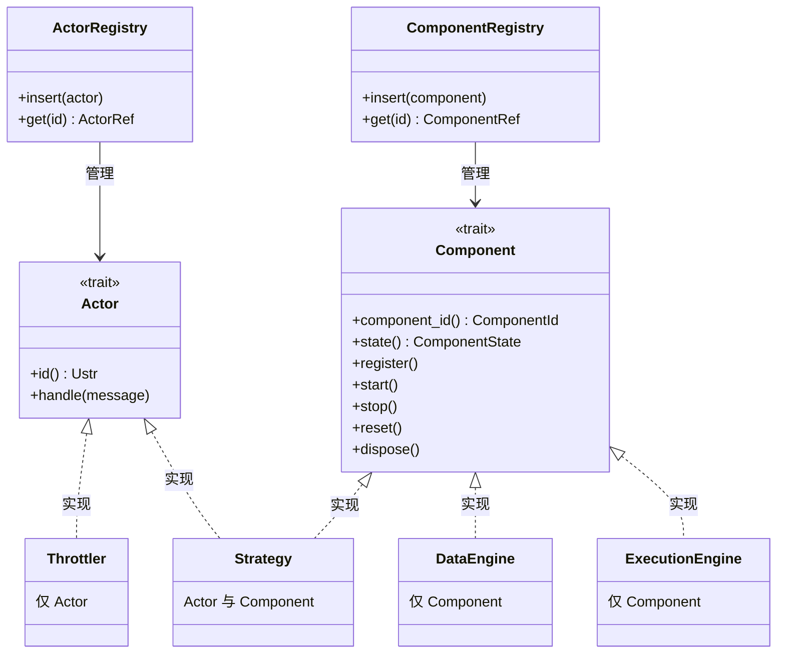
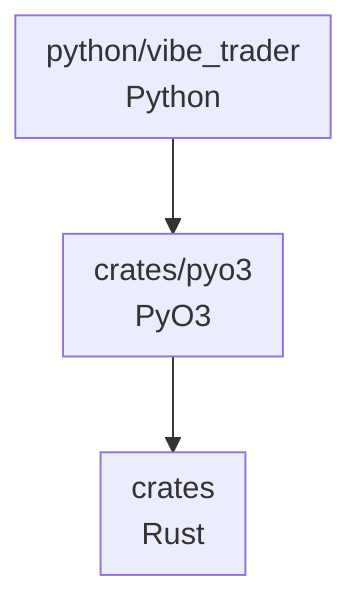
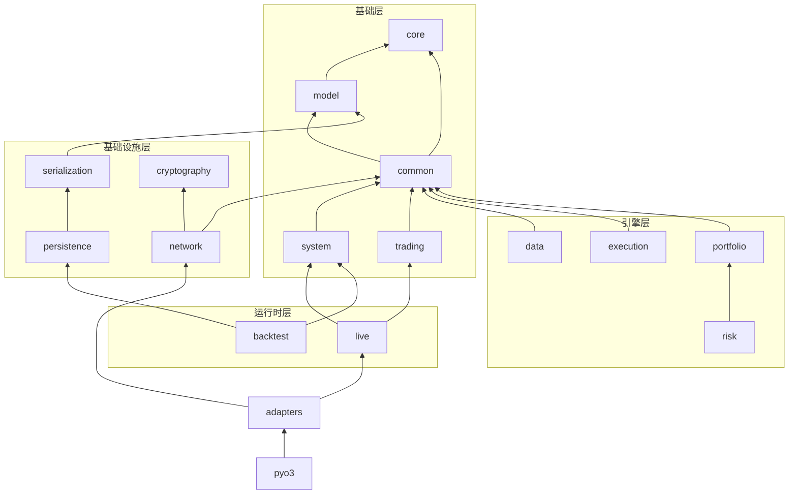

# 架构

本指南介绍 VibeTrader 的架构原则和结构：

- 设计理念和质量属性。
- 核心组件及其交互方式。
- 环境上下文（回测、沙盒、实盘）。
- 框架组织和代码结构。

:::note
在本文档中，*"Vibe 系统边界"*指单个 Vibe 节点（也称为"交易者实例"）运行时范围内的操作。
:::

## 设计理念

VibeTrader 采用的主要架构技术和设计模式包括：

- [领域驱动设计（DDD）](https://en.wikipedia.org/wiki/Domain-driven_design)
- [事件驱动架构](https://en.wikipedia.org/wiki/Event-driven_programming)
- [消息传递模式](https://en.wikipedia.org/wiki/Messaging_pattern)（发布/订阅、请求/响应、点对点）
- [端口与适配器](https://en.wikipedia.org/wiki/Hexagonal_architecture_(software))
- [仅崩溃设计](#仅崩溃设计)

这些技术有助于实现特定的架构质量属性。

### 质量属性

架构决策通常需要在相互竞争的优先事项之间权衡。以下质量属性按大致权重顺序指导设计和架构决策：

- 可靠性
- 性能
- 模块化
- 可测试性
- 可维护性
- 可部署性

### 保障驱动工程

VibeTrader 正在逐步采用高保障思维：关键代码路径应具备可执行不变量，用来验证实际行为符合业务要求。具体而言，我们会：

- 识别故障影响范围最大的组件（核心领域类型、风险和执行流程），并用自然语言明确其不变量。
- 将这些不变量编码为在 CI 中运行的可执行检查（单元测试、属性测试、模糊测试、静态断言），同时保持反馈循环轻量。
- 优先使用 Rust 内置的零成本安全机制（所有权、`Result` 接口、`panic = abort`），只在收益明确的环节引入针对性的形式化工具。
- 将"保障债务"与功能开发一并跟踪，使新集成扩展安全网，而不是绕过它。

这种方式既能维持平台的交付节奏，也能为高风险流程提供必要的额外审查。

延伸阅读：[High Assurance Rust](https://highassurance.rs/)。

### 仅崩溃设计

VibeTrader 借鉴了[仅崩溃设计](https://en.wikipedia.org/wiki/Crash-only_software)原则，尤其用于处理不可恢复故障。其核心观点是：能够在崩溃后干净恢复的系统，比同时维护独立且很少经过测试的优雅关闭路径更稳健。

关键原则：

- **统一恢复路径** - 启动和崩溃恢复共用同一条代码路径，确保该路径得到充分测试。
- **状态外置** - 配置后，关键状态应持久化到外部，以降低数据丢失风险；其持久性取决于后端存储。
- **快速重启** - 系统设计为崩溃后快速重启，以尽量缩短停机时间。
- **幂等操作** - 操作应能在重启后安全重试。
- **不可恢复错误快速失败** - 数据损坏或违反不变量时立即终止，而不是尝试在受损状态下继续运行。

:::note
系统为正常操作提供优雅关闭流程（`stop`、`dispose`），用于停止客户端、持久化状态和刷新写入器。仅崩溃理念专门适用于*不可恢复故障*，因为此时尝试优雅清理可能造成进一步损害。
:::

该设计与[快速失败策略](#数据完整性与快速失败策略)互为补充：发生不可恢复错误时，进程会立即终止。

**参考资料：**

- [Crash-Only Software](https://www.usenix.org/conference/hotos-ix/crash-only-software) - Candea 和 Fox，HotOS 2003（原始研究论文）
- [Microreboot: A technique for cheap recovery](https://www.usenix.org/events/osdi04/tech/candea.html) - Candea 等，OSDI 2004
- [The properties of crash-only software](https://brooker.co.za/blog/2012/01/22/crash-only.html) - Marc Brooker 的博客
- [Crash-only software: More than meets the eye](https://lwn.net/Articles/191059/) - LWN.net 文章
- [Recovery-Oriented Computing (ROC) Project](http://roc.cs.berkeley.edu/) - UC Berkeley/Stanford 研究项目

### 数据完整性与快速失败策略

对于交易操作，VibeTrader 将数据完整性置于可用性之上。系统对算术运算和数据处理采用严格的快速失败策略，防止静默数据损坏导致错误交易决策。

#### 快速失败原则

遇到以下情况时，系统会快速失败（panic 或返回错误）：

- 时间戳、价格或数量运算超出有效范围时发生算术溢出或下溢。
- 反序列化期间发现无效数据，包括市场数据或配置中的 NaN、Infinity 或超范围值。
- 类型转换失败，例如只允许正值的时间戳或数量出现负值。
- 解析价格、时间戳或精度值时输入格式错误。

原因如下：

在交易系统中，损坏的数据比没有数据更危险。一个错误的价格、时间戳或数量就可能在系统中连锁传播，导致：

- 持仓规模或风险计算错误。
- 订单以错误价格发出。
- 回测产生误导性结果。
- 未被察觉的财务损失。

通过在遇到无效数据时立即崩溃，VibeTrader 旨在提供：

1. **不发生静默损坏** - 快速失败策略旨在阻止无效数据传播；其效果取决于检查是否覆盖所有输入。
2. **即时反馈** - 问题在开发和测试阶段暴露，而不是到生产环境才发现。
3. **审计追踪** - 崩溃日志会明确指出无效数据的来源。
4. **确定性行为** - 在顺序和配置确定的情况下，同一无效输入应触发同一种失败；非确定性数据源可能导致不同结果。

#### 快速失败的适用范围

以下情况使用 panic：

- 程序员错误（逻辑缺陷、错误使用 API）。
- 数据违反基础不变量（负时间戳、NaN 价格）。
- 算术运算会静默产生错误结果。

以下情况使用 Result 或 Option：

- 预期中的运行时故障（网络错误、文件 I/O）。
- 业务逻辑验证（订单约束、风险限额）。
- 用户输入验证。
- 向下游 crate 公开的库 API；调用方需要显式处理错误，而不能依赖 panic 控制流程。

#### 示例情景

```rust
// CORRECT: Panics on overflow - prevents data corruption
let total_ns = timestamp1 + timestamp2; // Panics if result > u64::MAX

// CORRECT: Rejects NaN during deserialization
let price = serde_json::from_str("NaN"); // Error: "must be finite"

// CORRECT: Explicit overflow handling when needed
let total_ns = timestamp1.checked_add(timestamp2)?; // Returns Option<UnixNanos>
```

该策略贯穿核心类型（`UnixNanos`、`Price`、`Quantity` 等），帮助 VibeTrader 在生产交易中保持严格的数据正确性。

生产部署通常在发布构建中配置 `panic = abort`，确保任何 panic 都会干净终止进程，再由进程监督器或编排系统处理。这符合[仅崩溃设计](#仅崩溃设计)原则：不可恢复错误会触发立即重启，而不是让系统在可能损坏的状态下继续运行。

## 系统架构

VibeTrader 代码库既是用于组合交易系统的框架，也提供了一组可在不同[环境上下文](#环境上下文)中运行的默认系统实现。

### 核心组件

多个核心组件共同构成交易系统：

#### `VibeKernel`

负责以下工作的中央编排组件：

- 初始化和管理所有系统组件。
- 配置消息传递基础设施。
- 维护特定于环境的行为。
- 协调共享资源和生命周期管理。
- 为系统操作提供统一入口。

#### `MessageBus`

组件间通信的主干，实现：

- **发布/订阅模式**：向多个使用方广播事件和数据。
- **请求/响应通信**：用于需要确认的操作。
- **命令/事件消息传递**：触发操作并通知状态变化。
- **可选状态持久化**：使用 Redis 实现持久性和重启恢复能力。

#### `Cache`

高性能内存存储系统，用于：

- 存储金融工具、账户、订单、持仓等数据。
- 为交易组件提供高性能查询能力。
- 维护整个系统的一致状态。
- 以优化的访问模式支持读写操作。

#### `DataEngine`

在系统中处理并路由市场数据：

- 处理多种数据类型（报价、成交、K 线、订单簿、自定义数据等）。
- 根据订阅关系把数据路由给相应使用方。
- 管理数据从外部来源到内部组件的流转。

#### `ExecutionEngine`

管理订单生命周期和执行：

- 将交易命令路由到相应适配器客户端。
- 跟踪订单和持仓状态。
- 与风险管理系统协调。
- 处理交易场所返回的执行报告和成交。
- 对外部执行状态进行对账。

#### `RiskEngine`

提供风险管理：

- 交易前风险检查和验证。
- 持仓和风险敞口监控。
- 实时风险计算。
- 可配置的风险规则和限额。

### 环境上下文

VibeTrader 中的环境上下文定义所使用的数据和交易场所类型。理解这些上下文对于回测、开发和实盘交易十分重要。

可用环境包括：

- `Backtest`：历史数据和模拟交易场所。
- `Sandbox`：实时数据和模拟交易场所。
- `Live`：实时数据和实盘交易场所（模拟盘或真实账户）。

### 公共核心

平台设计尽可能让回测、沙盒和实盘交易系统共享代码。该设计在 `system` 子包中正式实现，其中的 `VibeKernel` 类提供公共的系统"内核"。

*端口与适配器*架构风格使模块化组件可以集成到核心系统中，并为用户定义或自定义组件实现提供多种扩展点。

### 数据与执行流模式

理解数据和执行如何流经系统，有助于使用本平台。

#### 数据流：一条报价 Tick 的生命周期

以下追踪展示 `QuoteTick` 从网络到策略所经过的每一步。成交和 K 线采用相同的"先缓存、后发布"路径，只是处理程序名称不同。订单簿增量和深度快照采用另一条路径（参见步骤下方的提示）。



**逐步说明：**

1. **适配器接收原始数据。** 特定于交易场所的 `DataClient`（例如 Binance、Bybit）接收 WebSocket 消息，解析后构造 `QuoteTick`。
2. **适配器发送数据事件。** 适配器通过 MPSC 通道发送 `DataEvent::Data(Data::Quote(quote))`。实盘模式使用异步无界通道；回测中则由引擎直接送入数据。
3. **DataEngine 处理事件。** 通道接收端把事件路由到 `DataEngine::process_data`，再由它分派给 `handle_quote`。
4. **Cache 存储报价。** `handle_quote` 通过 `cache.add_quote(quote)` 把报价写入 `Cache`，使任意组件都可通过 `self.cache.quote(instrument_id)` 访问。
5. **MessageBus 发布。** 引擎在根据金融工具 ID 派生的主题上发布报价（例如 `data.quotes.BINANCE.BTCUSDT-PERP`）。`MessageBus` 会找到订阅该主题的所有处理程序。
6. **触发策略处理程序。** 每个已订阅策略的 `on_quote(quote)` 都在单线程内核上运行。处理程序执行前报价已经写入缓存，因此 `self.cache.quote(instrument_id)` 会返回同一条报价。

:::tip
对于报价、成交和 K 线，"先缓存、后发布"的顺序意味着策略处理程序始终可以从缓存读取最新值。订单簿增量和深度快照则直接发布；订单簿状态通过 `BookUpdater` 订阅单独维护。
:::

#### 执行流：一个订单的生命周期

策略提交订单后，订单会流经验证和路由，再以执行事件的形式返回：



1. **策略创建命令。** 策略调用 `self.submit_order(order)`。
2. **RiskEngine 验证。** 执行交易前检查（持仓限额、名义价值限额、订单速率）。检查失败时，策略会收到 `OrderDenied`，订单不会到达交易场所。
3. **ExecutionEngine 路由。** 命令被路由到目标交易场所的 `ExecutionClient`。
4. **ExecutionClient 提交。** 适配器通过 REST 或 WebSocket 向交易场所发送订单。
5. **事件返回。** 交易场所返回确认和成交。每个事件（Accepted、Filled、Canceled、Rejected、Expired）都经 `ExecutionEngine` 返回；引擎会更新 `Cache` 中的订单状态，并把事件交给策略处理程序。成交事件还会触发持仓和投资组合更新。

#### 组件状态管理

所有组件都遵循有限状态机模式。`ComponentState` 枚举定义稳定状态和转换状态：



**稳定状态：**

- **PRE_INITIALIZED**：组件已实例化，但尚未准备好履行其职责。
- **READY**：组件已配置，可以启动。
- **RUNNING**：组件正常运行，可以履行其职责。
- **STOPPED**：组件已成功停止。
- **DEGRADED**：组件已降级，可能无法完全履行其职责。
- **FAULTED**：组件因检测到故障而关闭。
- **DISPOSED**：组件已关闭并释放全部资源。

**转换状态：**

- **STARTING**：组件正在执行 `start` 操作。
- **STOPPING**：组件正在执行 `stop` 操作。
- **RESUMING**：组件在首次启动后再次启动。
- **RESETTING**：组件正在执行 `reset` 操作。
- **DISPOSING**：组件正在执行 `dispose` 操作。
- **DEGRADING**：组件正在执行 `degrade` 操作。
- **FAULTING**：组件正在执行 `fault` 操作。

转换状态是状态转换期间短暂存在的中间状态，组件不应长时间停留其中。

#### Actor trait 与 Component trait

在 Rust 实现层面，系统区分两个互补的 trait：



**`Actor` trait** - 消息分派：

- 提供 `handle` 方法，用于接收通过参与者注册表分派的消息。
- 支持按参与者 ID 进行类型安全的查询和消息分派。
- 用于需要接收定向消息的组件（策略、限流器）。

**`Component` trait** - 生命周期管理：

- 管理状态转换（`start`、`stop`、`reset`、`dispose`）。
- 支持向系统内核注册（`register`）。
- 通过上述有限状态机跟踪组件状态。
- 供所有需要生命周期管理的系统组件使用。

:::note
所有组件都可以直接通过 `MessageBus` 发布和订阅消息，这与 `Actor` trait 无关。`Actor` trait 专门支持基于注册表的消息分派模式，即按 ID 把消息路由到特定参与者。
:::

这种区分支持：

- **仅 Actor**：没有生命周期的轻量消息处理程序（例如 `Throttler`）。
- **仅 Component**：具有生命周期、但直接使用 MessageBus 发布/订阅的系统基础设施（例如 `DataEngine`、`ExecutionEngine`）。
- **同时实现两个 trait**：既需要生命周期管理，又需要定向消息分派的交易策略。

两个 trait 分别由不同注册表管理，以支持各自的访问模式：生命周期方法按顺序调用，而消息处理程序可能在回调期间重入。

### 消息传递

为了实现模块化和松耦合，系统使用高效的 `MessageBus` 在组件之间传递消息（数据、命令和事件）。

#### 线程模型

在一个节点内，*内核*在单线程上消费和分派消息。内核涵盖：

- `MessageBus` 和参与者回调分派。
- 策略逻辑和订单管理。
- 风险引擎检查和执行协调。
- 缓存读写。

单线程核心提供确定的事件顺序，并有助于保持回测与实盘的一致性，但实盘输入和延迟仍可能导致行为差异。组件以同步方式消费消息，其模式与[参与者模型](https://en.wikipedia.org/wiki/Actor_model)*相似*。

:::note
值得关注的是 LMAX 交易所架构，它凭借单线程运行获得了屡获殊荣的性能。Martin Fowler 的[这篇文章](https://martinfowler.com/articles/lmax.html)介绍了其基于 *disruptor* 模式的架构。
:::

后台服务使用独立线程或异步运行时：

- **网络 I/O** - WebSocket 连接、REST 客户端和异步数据源。
- **持久化** - 通过多线程 Tokio 运行时执行 DataFusion 查询和数据库操作。
- **适配器** - 通过线程池执行器执行异步适配器操作。

这些服务通过 `MessageBus` 把结果传回内核。消息总线本身是线程局部的，因此每个线程都有自己的实例；跨线程通信通过通道完成，最终把事件交付给单线程核心。

## 框架组织

代码库按抽象层组织，并将内聚概念划分为逻辑子包。可以从左侧导航菜单进入各子包文档。

### 核心/底层

- `core`：整个框架使用的常量、函数和底层组件。
- `common`：用于组合框架各组件的公共部分。
- `network`：网络客户端的底层基础组件。
- `serialization`：序列化基础组件和序列化器实现。
- `model`：定义丰富的交易领域模型。

### 组件

- `accounting`：不同账户类型和账户管理机制。
- `adapters`：平台与经纪商、交易所等系统的集成适配器。
- `analysis`：交易业绩统计和分析相关组件。
- `cache`：通用缓存基础设施。
- `data`：平台的数据栈和数据工具。
- `execution`：平台的执行栈。
- `indicators`：一组高效的指标和分析器。
- `persistence`：数据存储、编目和检索，主要用于支持回测。
- `portfolio`：投资组合管理功能。
- `risk`：风险专用组件和工具。
- `trading`：交易领域专用组件和工具。

### 系统实现

- `backtest`：回测组件、回测引擎和节点实现。
- `live`：实盘引擎、客户端实现和实盘交易节点。
- `system`：`backtest`、`sandbox`、`live` [环境上下文](#环境上下文)共用的核心系统内核。

## 代码结构

代码库以 `crates/` 目录中的 Rust 实现为基础。`python/vibe_trader/` 包提供公开的 Python 接口。PyO3 将 Rust 绑定汇集到该包使用的 `_libvibe` 扩展模块中。

`vibe-core` 和 `vibe-model` crate 为原生使用方保留了可选的 C FFI。工作区中的其他 crate 使用 Rust API 或 PyO3 绑定。

### 依赖流



### Rust crate

`crates/` 目录中的 Rust 实现被组织为职责明确、依赖边界清晰的 crate。功能标志控制可选功能，例如 `streaming` 为基于目录的数据流启用持久化，`cloud` 启用云存储后端（S3、Azure、GCP）。

依赖流（箭头指向被依赖项）：



**Crate 分类：**

| 类别     | Crate                                                     | 用途                                     |
| -------- | --------------------------------------------------------- | ---------------------------------------- |
| 基础     | `core`、`model`、`common`、`system`、`trading`            | 原语、领域模型、内核、参与者与策略基类。 |
| 引擎     | `data`、`execution`、`portfolio`、`risk`                  | 核心交易引擎组件。                       |
| 基础设施 | `serialization`、`network`、`cryptography`、`persistence` | 编码、网络、签名、存储。                 |
| 运行时   | `live`、`backtest`                                        | 特定于环境的节点实现。                   |
| 外部     | `adapters/*`                                              | 交易场所和数据集成。                     |
| 绑定     | `pyo3`                                                    | Python 绑定。                            |

**功能标志：**

| 功能        | Crate                     | 效果                                              |
| ----------- | ------------------------- | ------------------------------------------------- |
| `streaming` | `data`、`system`、`live`  | 为目录数据流启用 `persistence` 依赖。             |
| `cloud`     | `persistence`             | 启用云存储后端（S3、Azure、GCP、HTTP）。          |
| `python`    | 大多数 crate              | 启用 PyO3 绑定（自动启用 `streaming`、`cloud`）。 |
| `defi`      | `common`、`model`、`data` | 启用 DeFi/区块链数据类型。                        |

:::note
从源代码构建需要 Rust。预构建的 Python wheel 在运行时不需要 Rust 工具链。
:::

### 类型安全

平台设计将软件正确性和安全性放在首位。

`crates/` 下的 Rust 代码依赖 `rustc` 编译器对安全代码的保证。任何 `unsafe` 块都是显式退出安全保证的区域，必须由我们自行维护所需不变量（参见[开发者指南](../developer_guide/rust.md)中的 Rust 章节）；整体内存安全和类型安全取决于这些不变量始终成立。

PyO3 会验证绑定参数，并将 Rust 错误转换为 Python 异常：

:::info
向带类型的 PyO3 参数传入不兼容的 Python 值时，会在 Rust 方法体运行前抛出 Python 异常。
:::

### 错误与异常

本文档力求涵盖 VibeTrader 代码可能抛出的所有异常及其触发条件。

:::warning
Python 标准库或第三方库依赖也可能抛出本文档未记录的其他异常。
:::

### 进程与线程

:::warning[每个进程一个节点]
由于存在全局单例状态，不支持在同一进程中**并发**运行多个 `LiveNode` 或 `BacktestNode` 实例：

- **回测强制停止标志** - 全局 `_FORCE_STOP` 标志由进程中的所有引擎共享。
- **日志模式和时间戳** - 日志子系统使用全局状态；回测会在静态模式和实时模式之间切换。
- **运行时单例** - 全局 Tokio 运行时、回调注册表和其他 `OnceLock` 实例均为进程级。

完全支持**顺序执行**多个节点，即依次运行，并在每次运行之间正确释放资源；测试套件也采用这种方式。

生产部署时，应在一个进程中的**单个 LiveNode** 添加多个策略。若要并行执行或隔离工作负载，应让每个节点分别运行在独立进程中。
:::

### 内存分配

事件驱动核心会高频分配和释放小对象：消息总线分派、订单事件处理和订单簿维护都会在每个事件上使用堆。默认系统分配器不擅长这种模式；性能分析显示，在订单流工作负载下，无论 Windows CRT 堆还是 glibc malloc，分配器开销都接近热循环耗时的一半。

Linux 和 Windows 上的 `vibe` CLI 与 Python wheel 使用 [mimalloc](https://github.com/microsoft/mimalloc) 进行 Rust 内存分配。macOS Python wheel 使用系统分配器，以保持与嵌入自有分配器的 Python 包兼容。视工作负载而定，回测引擎基准测试速度约提升 3% 至 44%，订单流密集路径获益最大。代价是 mimalloc 的分段缓存会使常驻内存略有增加。

一个 Rust 二进制文件只链接一个全局分配器，库本身不会强制指定分配器，因此 VibeTrader crate 保持分配器中立。直接基于这些 crate 构建时，应在自己的二进制文件中选择启用（参见 [Rust 指南](rust.md#memory-allocator)）。

## 相关指南

- [概述](overview.md) - VibeTrader 的高层介绍。
- [消息总线](message_bus.md) - 核心消息传递基础设施。
