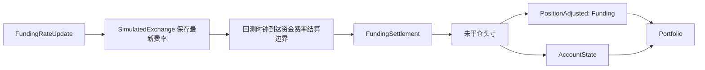

# 回测账户与保证金

回测交易场所使用模拟账户来管理余额、保证金和资金结算。完整账户模型和保证金公式请参见 [账户](../accounting.md)。

## 资金

回测根据 `FundingRateUpdate` 数据在资金费边界结算永续合约资金费。当更新携带 `next_funding_ns` 时，模拟交易所会存储最新费率，并由回测时钟在该时间戳发出一个 `FundingSettlement`。若无 `next_funding_ns`，则交易所仅在 `ts_event` 恰好落到 `interval` 边界时结算。无边界的更新仅作为策略数据保留，不会产生资金费支付。



结算会在投资组合观察到新状态之前调整未平仓持仓及其对应的账户余额。

`PositionAdjusted` 仍是持仓会计事件。正资金费率会借记多头持仓并贷记空头持仓。由此产生的调整会改变已实现盈亏，而对应账户余额的更新会记录现金变动。

## 账户

每个回测交易场所使用三种 `account_type` 值之一：`CASH`、`MARGIN` 或 `BETTING`。
低级 API 可直接接受模型类型：

```python
from vibe_trader.backtest import BacktestEngine
from vibe_trader.config import BacktestEngineConfig
from vibe_trader.model import AccountType
from vibe_trader.model import Money
from vibe_trader.model import OmsType
from vibe_trader.model import Venue

engine = BacktestEngine(BacktestEngineConfig())
engine.add_venue(
    venue=Venue("BINANCE"),
    oms_type=OmsType.NETTING,
    account_type=AccountType.CASH,
    starting_balances=[Money.from_str("10_000 USDT")],
)
```

高级 API 接受相同的枚举值，但将起始余额表示为字符串：

```python
from vibe_trader.config import BacktestVenueConfig
from vibe_trader.model import AccountType
from vibe_trader.model import BookType
from vibe_trader.model import OmsType

venue = BacktestVenueConfig(
    name="SIM",
    oms_type=OmsType.NETTING,
    account_type=AccountType.CASH,
    book_type=BookType.L1_MBP,
    starting_balances=["10_000 USDT"],
)
```

## 保证金模型

保证金账户默认使用 `LeveragedMarginModel`。当模拟应按金融工具的固定初始和维持保证金百分比预留保证金、且不按账户杠杆折减预留金额时，传递 `StandardMarginModel`。

```python
from vibe_trader.config import BacktestVenueConfig
from vibe_trader.model import AccountType
from vibe_trader.model import BookType
from vibe_trader.model import OmsType
from vibe_trader.model import StandardMarginModel

venue = BacktestVenueConfig(
    name="SIM",
    oms_type=OmsType.NETTING,
    account_type=AccountType.MARGIN,
    book_type=BookType.L1_MBP,
    starting_balances=["1_000_000 USD"],
    margin_model=StandardMarginModel(),
)
```

`BacktestVenueConfig` 可直接接受内置的 `StandardMarginModel` 和 `LeveragedMarginModel` 对象。当前高级配置不从类路径字符串加载自定义保证金模型。
