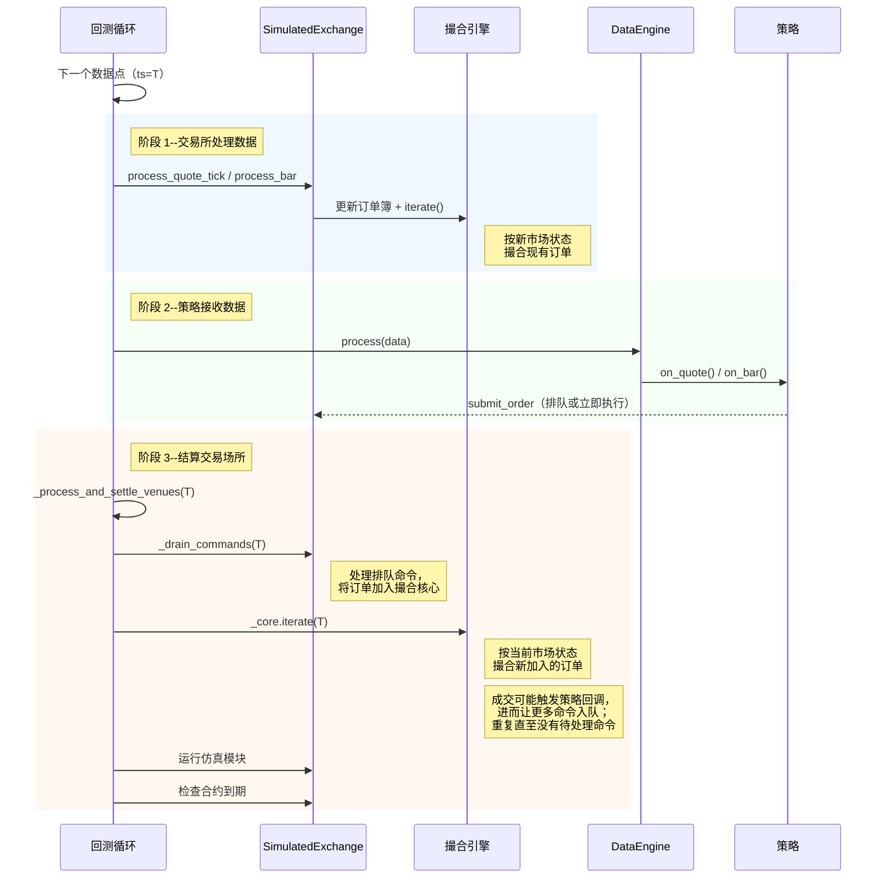

# 回测执行流程

回测循环会先于策略回调处理市场状态，然后结算在同一时间戳生成的命令。

## 数据与消息顺序

在主回测循环中，新市场数据会先用于订单执行，再由数据引擎分发给 actor 和策略。

### 主循环流程

对于每个数据点，引擎会运行三个阶段：

- **交易所处理数据。** 模拟交易所根据传入的市场数据更新订单簿，并迭代撮合引擎，
  使当前能与新市场状态匹配的已有订单成交。
- **策略接收数据。** 数据引擎通过回调（例如 `on_quote`、`on_bar`）把数据点分发给
  actor 和策略。策略可以在这些回调中提交、取消或修改订单。
- **结算交易场所。** 引擎清空所有排队的交易场所命令，然后迭代撮合引擎，使新提交的
  订单成交。该循环会一直重复到没有待处理命令为止，因此级联订单（例如从
  `on_order_filled` 提交的对冲）会在同一时间戳内完成结算。

这三个阶段保证挂单会先于新提交的订单看到传入的市场数据。

定时器事件使用相同的结算机制，但会按时间戳批处理：先执行时间戳 T 的全部回调，再为
T 结算交易场所，然后才推进到 T+1。内部聚合 K 线使用的定时器行为，请参阅
[内部 K 线聚合时机](bar-execution.md#internal-bar-aggregation-timing)。

### 命令结算

如果订单成交触发了策略回调，而回调又提交了其他订单（例如在 `on_order_filled` 中
提交止损单），这些级联命令会在同一时间戳或事件周期内结算。引擎会反复清空交易场所
命令队列以及期间新生成的命令，直到当前时间戳不再有待处理命令。模拟模块只会在所有
命令完成结算后运行一次。

配置 `LatencyModel` 后，命令会以根据模拟延迟推导出的未来时间戳进入交易场所的在途
队列。结算循环会把当前时间戳已经到期的在途命令视为待处理命令，因此零延迟或同 tick
延迟配置仍能正确结算。未来时间戳的命令则会延后，等引擎到达相应时间时再处理。

### 关闭语义

`BacktestEngine::end()` 与[回测 API 和重复运行](apis-and-runs.md#shutdown-on-error)中介绍的
`shutdown_on_error` 配置相互独立。它会调用每个策略的 `on_stop` 处理器，清空并结算其中
发出的命令（例如 `close_all_positions`、`cancel_all_orders`），然后停止各引擎。

- `on_stop` 命令使用常规的交易场所队列和延迟，不会获得高于更早在途命令的优先级。
- 如果停止前的订单先于 `on_stop` 取消命令到达交易场所，它仍可能成交。如果该成交
  改变了净敞口，稍后的只减仓平仓可能被拒绝。
- 需要确定性平仓的策略，应在停止前先进入仅退出状态，并在取消和平仓命令仍处于在途
  状态时避免提交新的开仓订单。
- 策略事件处理器不会收到由此产生的事件：策略已经处于 `Stopped` 状态，因此
  `OrderFilled` 等事件会被记录，但不会进入 `on_order_filled` 等回调。依赖成交的逻辑
  必须在 `on_stop` 返回前运行。
- 关闭时不会再次运行模拟模块。`SimulationModule::process` 在每个时间戳只运行一次；
  再次调用会重复施加外汇展期利息等副作用。
- `LatencyModel` 会把配置的延迟应用到尾部命令（即最终数据 tick 或 `on_stop` 中发出的
  命令）。关闭路径会把引擎时钟推进到最晚的在途到达时间，确保这些命令在引擎停止前
  仍能完成结算。

## 仅定时器回测

回测引擎支持只有定时器、没有市场数据的运行方式。这适用于计划任务或定时器逻辑测试。
定时器会按时间顺序触发。

## 确定性成交 ID

模拟交易所（回测执行和沙盒执行都会使用）会为每笔生成的成交发出确定性的 `TradeId`。
其格式为 `T-{hash:016x}-{count:03d}`：其中 16 个十六进制字符是
`(venue, raw_id, ts_init)` 的 FNV-1a 哈希，末尾计数器用于区分同一 `ts_init` 的多笔成交
（例如一根 K 线驱动成交中的多条腿）。

确定性成交 ID 具有以下性质：

- 跨运行确定：重放同一数据每次都会生成相同的 `TradeId`，因此下游去重和黄金输出
  比较可以保持稳定。
- 跨重置防碰撞：`ts_init` 在回测数据中固定，在实盘和沙盒中单调递增，因此
  `BacktestEngine.reset()`（或持久化订单沙盒中的内存 `IdsGenerator` 重置）不会生成
  与缓存中已有 ID 冲突的 `TradeId`。
- 长度有界：无论交易场所名称多长，哈希都能把标识符控制在 36 个字符的 `TradeId`
  上限以内。

交易场所的 `use_random_ids` 标志仍然控制 `VenueOrderId` 和 `PositionId` 的生成，但
`TradeId` 始终是确定性的，不受该标志影响。
