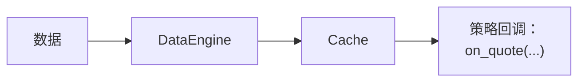

# 缓存

`Cache` 是一个中央内存数据库，存储并管理从市场数据、订单历史到自定义计算等所有交易相关数据。

缓存有多种用途：

1. **存储市场数据**：
   - 存储近期市场历史（例如订单簿、报价、交易和 K 线）。
   - 让策略能够访问当前和历史市场数据。

2. **跟踪交易数据**：
   - 维护完整的 `Order` 历史和当前执行状态。
   - 跟踪所有 `Position` 和 `Account` 信息。
   - 存储 `Instrument` 定义和 `Currency` 信息。

3. **存储自定义数据**：
   - 可以将任意用户定义的对象或数据存入 `Cache`，供之后使用。
   - 支持在不同策略之间共享数据。

## 缓存的工作方式

**内置类型**：

- 数据流经系统时，系统会自动将其加入 `Cache`。
- 在实盘环境中，引擎异步应用更新，因此从事件发生到其出现在 `Cache` 中可能会有短暂延迟。
- 对于报价、交易和 K 线，`DataEngine` 会先写入 `Cache`，再发布给订阅者，所以处理程序运行时，缓存中已经有最新值。订单簿增量和深度快照会直接发布，不会写入缓存；订单簿状态则通过 `BookUpdater` 订阅单独维护：



完整的逐步追踪请参阅
[数据流：报价 tick 的生命周期](architecture.md#data-flow-life-of-a-quote-tick)。

### 基本示例

在策略中，可以通过 `self.cache` 访问 `Cache`。以下是一个典型示例：

:::note
在 `Strategy` 类中，`self` 指策略实例。
:::

```python
def on_bar(self, bar: Bar) -> None:
    # Current bar is provided in the parameter 'bar'

    # Get historical bars from Cache
    last_bar = self.cache.bar(
        self.bar_type, index=0
    )  # Last bar (practically the same as the 'bar' parameter)
    previous_bar = self.cache.bar(self.bar_type, index=1)  # Previous bar
    third_last_bar = self.cache.bar(self.bar_type, index=2)  # Third last bar

    # Get current position information
    if self.last_position_opened_id is not None:
        position = self.cache.position(self.last_position_opened_id)
        if position.is_open:
            # Check position details
            current_pnl = position.unrealized_pnl

    # Get all open orders for our instrument
    open_orders = self.cache.orders_open(instrument_id=self.instrument_id)
```

## 配置

使用 `CacheConfig` 类配置 `Cache` 的行为和容量。可以根据[环境上下文](architecture.md#environment-contexts)，将此配置提供给 `BacktestEngine` 或 `LiveNode`。

以下是配置 `Cache` 的基本示例：

```python
from vibe_trader.config import BacktestEngineConfig
from vibe_trader.config import CacheConfig
from vibe_trader.config import LiveNodeConfig

# For backtesting
engine_config = BacktestEngineConfig(
    cache=CacheConfig(
        tick_capacity=10_000,  # Store last 10,000 ticks per instrument
        bar_capacity=5_000,  # Store last 5,000 bars per bar type
    ),
)

# For live trading
node_config = LiveNodeConfig(
    cache=CacheConfig(
        tick_capacity=10_000,
        bar_capacity=5_000,
    ),
)
```

:::tip
默认情况下，`Cache` 会为每种 K 线类型保留最近 10,000 根 K 线，并为每个金融工具保留最近 10,000 个成交 tick。
这些限制在内存用量和数据可用性之间取得了良好平衡。如果策略需要更多历史数据，可以提高这些限制。
:::

### 配置选项

`CacheConfig` 类型支持以下参数：

```rust
use vibe_common::{cache::CacheConfig, enums::SerializationEncoding};

let config = CacheConfig {
    encoding: SerializationEncoding::MsgPack,
    timestamps_as_iso8601: false,
    buffer_interval_ms: None,
    bulk_read_batch_size: None,
    use_trader_prefix: true,
    use_instance_id: false,
    flush_on_start: false,
    drop_instruments_on_reset: true,
    tick_capacity: 10_000,
    bar_capacity: 10_000,
    persist_account_events: true,
    save_market_data: false,
};
```

:::note
每种 K 线类型都有各自独立的容量。例如，同时使用 1 分钟和 5 分钟 K 线时，每种类型最多存储 `bar_capacity` 根 K 线。
达到 `bar_capacity` 后，`Cache` 会自动移除最早的数据。
:::

### 数据库配置

如果需要在系统重启后保留数据，可以配置数据库后端。
`CacheConfig` 只控制缓存行为。连接设置属于具体缓存数据库技术的配置，例如 `RedisCacheConfig` 或 `PostgresCacheConfig`。

哪些情况下适合使用持久化？

- **长期运行的系统**：如果希望数据在系统重启、升级或意外故障后仍然保留，数据库配置有助于从上次中断的位置准确恢复。
- **历史分析**：需要保留过往交易数据，以便进行详细的事后分析或审计时。
- **多节点或分布式部署**：如果多个服务或节点需要访问同一状态，持久存储有助于保证数据共享和一致。

Rust 原生调用方会构建具体的数据库配置，并使用 `CacheDatabaseFactory` trait 创建传给系统构建器的适配器：

```rust
use vibe_common::{
    cache::{CacheConfig, database::CacheDatabaseFactory},
    enums::SerializationEncoding,
};
use vibe_infrastructure::redis::cache::RedisCacheConfig;

let config = CacheConfig {
    encoding: SerializationEncoding::MsgPack,
    timestamps_as_iso8601: true,
    buffer_interval_ms: Some(100),
    ..Default::default()
};

let database = RedisCacheConfig {
    host: Some("localhost".to_string()),
    port: Some(6379),
    connection_timeout: 2,
    response_timeout: 2,
    ..Default::default()
};

let cache_database = database
    .create(trader_id, instance_id, config.clone())
    .await?;
```

对于 Rust 原生实盘节点，应在启动前接入适配器：

```rust
let node_config = LiveNodeConfig {
    trader_id,
    ..Default::default()
};
let mut node = LiveNode::build("LiveNode".to_string(), Some(node_config))?;
node.set_cache_database(cache_database)?;
node.run().await?;
```

使用默认设置 `LiveExecEngineConfig.load_cache = true` 时，节点会先恢复持久化的缓存状态并重建派生索引，然后再连接客户端或对账执行状态。设置 `CacheConfig.flush_on_start = true` 则会清空后端存储。目前 Python `LiveNode` 接口尚不支持直接注入后端存储。

## 使用缓存

### 访问市场数据

`Cache` 提供完整接口，用于访问订单簿、报价、交易和 K 线。
缓存中的所有市场数据都采用逆序索引，因此最新条目位于索引 0。

#### 访问 K 线

```python
# Get a list of all cached bars for a bar type
bars = self.cache.bars(bar_type)  # Returns list[Bar] or an empty list if no bars found

# Get the most recent bar
latest_bar = self.cache.bar(bar_type)  # Returns Bar or None if no such object exists

# Get a specific historical bar by index (0 = most recent)
second_last_bar = self.cache.bar(bar_type, index=1)  # Returns Bar or None if no such object exists

# Check if bars exist and get count
bar_count = self.cache.bar_count(
    bar_type
)  # Returns number of bars in cache for the specified bar type
has_bars = self.cache.has_bars(
    bar_type
)  # Returns bool indicating if any bars exist for the specified bar type
```

#### 报价 tick

```python
# Get quotes
quotes = self.cache.quotes(
    instrument_id
)  # Returns list[QuoteTick] or an empty list if no quotes found
latest_quote = self.cache.quote(instrument_id)  # Returns QuoteTick or None if no such object exists
second_last_quote = self.cache.quote(
    instrument_id, index=1
)  # Returns QuoteTick or None if no such object exists

# Check quote availability
quote_count = self.cache.quote_count(
    instrument_id
)  # Returns the number of quotes in cache for this instrument
has_quotes = self.cache.has_quote_ticks(
    instrument_id
)  # Returns bool indicating if any quotes exist for this instrument
```

#### 成交 tick

```python
# Get trades
trades = self.cache.trades(
    instrument_id
)  # Returns list[TradeTick] or an empty list if no trades found
latest_trade = self.cache.trade(instrument_id)  # Returns TradeTick or None if no such object exists
second_last_trade = self.cache.trade(
    instrument_id, index=1
)  # Returns TradeTick or None if no such object exists

# Check trade availability
trade_count = self.cache.trade_count(
    instrument_id
)  # Returns the number of trades in cache for this instrument
has_trades = self.cache.has_trade_ticks(
    instrument_id
)  # Returns bool indicating if any trades exist
```

#### 订单簿

```python
# Get current order book
book = self.cache.order_book(instrument_id)  # Returns OrderBook or None if no such object exists

# Check if order book exists
has_book = self.cache.has_order_book(
    instrument_id
)  # Returns bool indicating if an order book exists

# Get count of order book updates
update_count = self.cache.book_update_count(instrument_id)  # Returns the number of updates received
```

#### 访问价格

```python
from vibe_trader.model import PriceType

# Get current price by type; Returns Price or None.
price = self.cache.price(
    instrument_id=instrument_id,
    price_type=PriceType.MID,  # Options: BID, ASK, MID, LAST
)
```

#### K 线类型

```python
from vibe_trader.model import AggregationSource, PriceType

# Get all available bar types for an instrument; Returns list[BarType].
bar_types = self.cache.bar_types(
    instrument_id=instrument_id,
    price_type=PriceType.LAST,  # Options: BID, ASK, MID, LAST
    aggregation_source=AggregationSource.EXTERNAL,
)
```

#### 简单示例

```python
class MarketDataStrategy(Strategy):
    def on_start(self):
        # Subscribe to 1-minute bars
        self.bar_type = BarType.from_str(
            f"{self.instrument_id}-1-MINUTE-LAST-EXTERNAL"
        )  # example of instrument_id = "EUR/USD.FXCM"
        self.subscribe_bars(self.bar_type)

    def on_bar(self, bar: Bar) -> None:
        bars = self.cache.bars(self.bar_type)[:3]
        if len(bars) < 3:  # Wait until we have at least 3 bars
            return

        # Access last 3 bars for analysis
        current_bar = bars[0]  # Most recent bar
        prev_bar = bars[1]  # Second to last bar
        prev_prev_bar = bars[2]  # Third to last bar

        # Get latest quote and trade
        latest_quote = self.cache.quote(self.instrument_id)
        latest_trade = self.cache.trade(self.instrument_id)

        if latest_quote is not None:
            current_spread = latest_quote.ask_price - latest_quote.bid_price
            self.log.info(f"Current spread: {current_spread}")
```

### 交易对象

`Cache` 可用于访问系统中的所有交易对象，包括：

- 订单
- 持仓
- 账户
- 金融工具

#### 订单

可以通过多种方法访问和查询订单，并可按交易场所、策略、金融工具和订单方向灵活筛选。

##### 基本订单访问

```python
# Get a specific order by its client order ID
order = self.cache.order(ClientOrderId("O-123"))

# Get all orders in the system
orders = self.cache.orders()

# Get orders filtered by specific criteria
orders_for_venue = self.cache.orders(venue=venue)  # All orders for a specific venue
orders_for_strategy = self.cache.orders(
    strategy_id=strategy_id
)  # All orders for a specific strategy
orders_for_instrument = self.cache.orders(
    instrument_id=instrument_id
)  # All orders for an instrument
```

##### 订单状态查询

```python
# Get orders by their current state
open_orders = self.cache.orders_open()  # Orders currently active at the venue
closed_orders = self.cache.orders_closed()  # Orders that have completed their lifecycle
emulated_orders = self.cache.orders_emulated()  # Orders being simulated locally by the system
inflight_orders = (
    self.cache.orders_inflight()
)  # Orders submitted (or modified) to venue, but not yet confirmed
local_active_orders = (
    self.cache.orders_active_local()
)  # Orders still managed locally (initialized, emulated, or released)

# Check specific order states
exists = self.cache.order_exists(
    client_order_id
)  # Checks if an order with the given ID exists in the cache
is_open = self.cache.is_order_open(client_order_id)  # Checks if an order is currently open
is_closed = self.cache.is_order_closed(client_order_id)  # Checks if an order is closed
is_emulated = self.cache.is_order_emulated(
    client_order_id
)  # Checks if an order is being simulated locally
is_inflight = self.cache.is_order_inflight(
    client_order_id
)  # Checks if an order is submitted or modified, but not yet confirmed
is_active_local = self.cache.is_order_active_local(
    client_order_id
)  # Checks if an order is still managed locally
```

##### 订单统计

```python
# Get counts of orders in different states
open_count = self.cache.orders_open_count()  # Number of open orders
closed_count = self.cache.orders_closed_count()  # Number of closed orders
emulated_count = self.cache.orders_emulated_count()  # Number of emulated orders
inflight_count = self.cache.orders_inflight_count()  # Number of inflight orders
local_active_count = (
    self.cache.orders_active_local_count()
)  # Number of locally active orders (initialized, emulated, or released)
total_count = self.cache.orders_total_count()  # Total number of orders in the system

# Get filtered order counts
buy_orders_count = self.cache.orders_open_count(
    side=OrderSide.BUY
)  # Number of currently open BUY orders
venue_orders_count = self.cache.orders_total_count(
    venue=venue
)  # Total number of orders for a given venue
```

#### 持仓

`Cache` 会记录所有持仓，并提供多种查询方式。

##### 访问持仓

```python
# Get a specific position by its ID
position = self.cache.position(PositionId("P-123"))

# Get positions by their state
all_positions = self.cache.positions()  # All positions in the system
open_positions = self.cache.positions_open()  # All currently open positions
closed_positions = self.cache.positions_closed()  # All closed positions

# Get positions filtered by various criteria
venue_positions = self.cache.positions(venue=venue)  # Positions for a specific venue
instrument_positions = self.cache.positions(
    instrument_id=instrument_id
)  # Positions for a specific instrument
strategy_positions = self.cache.positions(
    strategy_id=strategy_id
)  # Positions for a specific strategy
long_positions = self.cache.positions(side=PositionSide.LONG)  # All long positions
```

##### 持仓状态查询

```python
# Check position states
exists = self.cache.position_exists(position_id)  # Checks if a position with the given ID exists
is_open = self.cache.is_position_open(position_id)  # Checks if a position is open
is_closed = self.cache.is_position_closed(position_id)  # Checks if a position is closed

# Get position and order relationships
orders = self.cache.orders_for_position(position_id)  # All orders related to a specific position
position = self.cache.position_for_order(
    client_order_id
)  # Find the position associated with a specific order
```

##### 持仓统计

```python
# Get position counts in different states
open_count = self.cache.positions_open_count()  # Number of currently open positions
closed_count = self.cache.positions_closed_count()  # Number of closed positions
total_count = self.cache.positions_total_count()  # Total number of positions in the system

# Get filtered position counts
long_positions_count = self.cache.positions_open_count(
    side=PositionSide.LONG
)  # Number of open long positions
instrument_positions_count = self.cache.positions_total_count(
    instrument_id=instrument_id
)  # Number of positions for a given instrument
```

#### 账户

```python
# Access account information
account = self.cache.account(account_id)  # Retrieve account by ID
account = self.cache.account_for_venue(venue)  # Retrieve account for a specific venue
account_id = self.cache.account_id(venue)  # Retrieve account ID for a venue
```

#### 金融工具和货币

##### 金融工具

```python
# Get instrument information
instrument = self.cache.instrument(instrument_id)  # Retrieve a specific instrument by its ID
all_instruments = self.cache.instruments()  # Retrieve all instruments in the cache

# Get filtered instruments
venue_instruments = self.cache.instruments(venue=venue)  # Instruments for a specific venue
instruments_by_underlying = self.cache.instruments(underlying="ES")  # Instruments by underlying

# Get instrument identifiers
instrument_ids = self.cache.instrument_ids()  # Get all instrument IDs
venue_instrument_ids = self.cache.instrument_ids(
    venue=venue
)  # Get instrument IDs for a specific venue
```

### 清理缓存数据

长期运行的会话会不断积累已关闭订单、已关闭持仓、账户事件和不再使用的金融工具。缓存提供针对单个对象和批量清理的方法，使策略和实盘交易引擎无需重启系统，也能限制内存增长。

#### 定向清理

使用以下方法移除单个实体。实体仍处于活动状态时，各方法都会拒绝清理。

- `cache.purge_order(client_order_id)`：移除订单及所有以订单为键的索引条目。跳过未结订单。
- `cache.purge_position(position_id)`：移除持仓、持仓快照及所有以持仓为键的索引条目。跳过未平仓持仓。
- `cache.purge_instrument(instrument_id)`：移除金融工具及每个按金融工具存储的映射（订单簿、报价、成交、标记价格/指数价格/资金费率价格、金融工具状态、希腊字母指标，以及引用该金融工具的 K 线）。如果任何关联订单尚未进入终态（即尚未到达已关闭状态，包括已初始化、已提交、已接受、已模拟、已释放和传输中订单），或任何关联持仓尚未关闭，则跳过清理。

```python
class HousekeepingStrategy(Strategy):
    def on_start(self) -> None:
        # Drop instruments that are no longer in the watchlist.
        for instrument_id in self.cache.instrument_ids(venue=self.venue):
            if instrument_id not in self.watchlist:
                self.cache.purge_instrument(instrument_id)
```

:::warning
`purge_instrument` 面向具有自身生命周期逻辑、能够判断何时不再需要某个金融工具的 Actor 和策略。若清理其他组件仍依赖的金融工具，查询时将找不到该金融工具，并会丢失市场数据历史。活动订阅归数据引擎所有，因此如果不再需要更新，请先取消订阅，再执行清理。
:::

#### 批量清理

使用以下方法按数据时间批量清理旧条目。它们接收当前时间戳，以及以秒为单位的缓冲期或回溯窗口。

- `cache.purge_closed_orders(ts_now, buffer_secs)`：关闭时间距当前时间超过 `buffer_secs` 秒的已关闭订单。
- `cache.purge_closed_positions(ts_now, buffer_secs)`：关闭时间距当前时间超过 `buffer_secs` 秒的已关闭持仓。
- `cache.purge_account_events(ts_now, lookback_secs)`：发生时间距当前时间超过 `lookback_secs` 秒的账户状态事件。值为 `0` 时清理所有事件。

#### 实盘交易中的自动清理

`LiveExecEngineConfig` 使用定时器调度批量清理。设置清理间隔以启用循环，并通过缓冲期或回溯窗口控制要保留的近期条目。以下默认值适用于大多数实盘会话：

```python
from vibe_trader.config import LiveExecEngineConfig

exec_engine = LiveExecEngineConfig(
    purge_closed_orders_interval_mins=15,
    purge_closed_orders_buffer_mins=60,
    purge_closed_positions_interval_mins=15,
    purge_closed_positions_buffer_mins=60,
    purge_account_events_interval_mins=15,
    purge_account_events_lookback_mins=60,
)
```

60 分钟的缓冲期既能让近期活动继续用于对账，又能削减长期累积的数据。对于高频交易会话，可以调低这些值；如果分析需要更长的历史回溯，则可以调高。完整参数说明请参阅
[配置实盘交易：内存管理](../how_to/configure_live_trading.md)。

:::note
金融工具清理没有自动循环，因为移除金融工具的适当时机取决于策略状态，而不是时间长短。请从拥有该金融工具生命周期的 Actor 或策略调用 `cache.purge_instrument`。
:::

---

### 自定义数据

除内置市场数据和交易对象外，`Cache` 也可以存储和检索自定义数据类型。
可以借此在系统组件之间（主要是 Actor 和策略）共享任意用户定义的数据。

#### 基本存储和检索

```python
# Call this code inside Strategy methods (`self` refers to Strategy)

# Store data
self.cache.add(key="my_key", value=b"some binary data")

# Retrieve data
stored_data = self.cache.get("my_key")  # Returns bytes or None
```

对于更复杂的用例，`Cache` 可以存储继承自 `vibe_trader.core.Data` 基类的自定义数据对象。

:::warning
`Cache` 并非完整数据库的替代品。对于大型数据集或复杂查询需求，请考虑使用专用数据库系统。
:::

## 最佳实践和常见问题

### 缓存与投资组合的用途

`Cache` 和 `Portfolio` 组件在 VibeTrader 中各有不同但互为补充的用途：

**缓存**：

- 维护交易系统的历史信息和当前状态。
- 本地状态变化时立即更新（例如在提交订单前初始化订单）。
- 外部事件发生时异步更新（例如订单成交时）。
- 提供交易活动和市场数据的完整历史。
- 将策略收到的每个事件保存在缓存中。

**投资组合**：

- 汇总持仓、风险敞口和账户信息。
- 提供不含历史的当前状态。

**示例**：

```python
class MyStrategy(Strategy):
    def on_position_changed(self, event: PositionEvent) -> None:
        # Use Cache when you need historical perspective
        position_history = self.cache.position_snapshots(event.position_id)

        # Use Portfolio when you need current real-time state
        current_exposure = self.portfolio.net_exposure(event.instrument_id)
```

### 缓存与策略变量

应将数据存储在 `Cache` 还是策略变量中，取决于具体需求：

**缓存存储**：

- 用于需要在策略之间共享的数据。
- 最适合需要在系统重启后保留的数据。
- 充当所有组件都能访问的中央数据库。
- 适合需要在策略重置后保留的状态。

**策略变量**：

- 用于策略特有的计算。
- 更适合临时值和中间结果。
- 访问速度更快，封装性更好。
- 最适合只有当前策略需要的数据。

**示例**：

以下示例演示如何将数据存入 `Cache`，让多个策略可以访问相同信息。

```python
import pickle


class MyStrategy(Strategy):
    def on_start(self):
        # Prepare data you want to share with other strategies
        shared_data = {
            "last_reset": self.clock.timestamp_ns(),
            "trading_enabled": True,
            # Include any other fields that you want other strategies to read
        }

        # Store it in the cache with a descriptive key
        # This way, multiple strategies can call self.cache.get("shared_strategy_info")
        # to retrieve the same data
        self.cache.add("shared_strategy_info", pickle.dumps(shared_data))
```

另一个策略可以按如下方式检索缓存中的数据：

```python
import pickle


class AnotherStrategy(Strategy):
    def on_start(self):
        # Load the shared data from the same key
        data_bytes = self.cache.get("shared_strategy_info")
        if data_bytes is not None:
            shared_data = pickle.loads(data_bytes)
            self.log.info(f"Shared data retrieved: {shared_data}")
```

## 相关指南

- [数据](data/) - 缓存中存储的数据类型。
- [策略](strategies.md) - 策略通过缓存访问市场数据和状态。
- [报告](reports.md) - 根据缓存数据生成报告。
