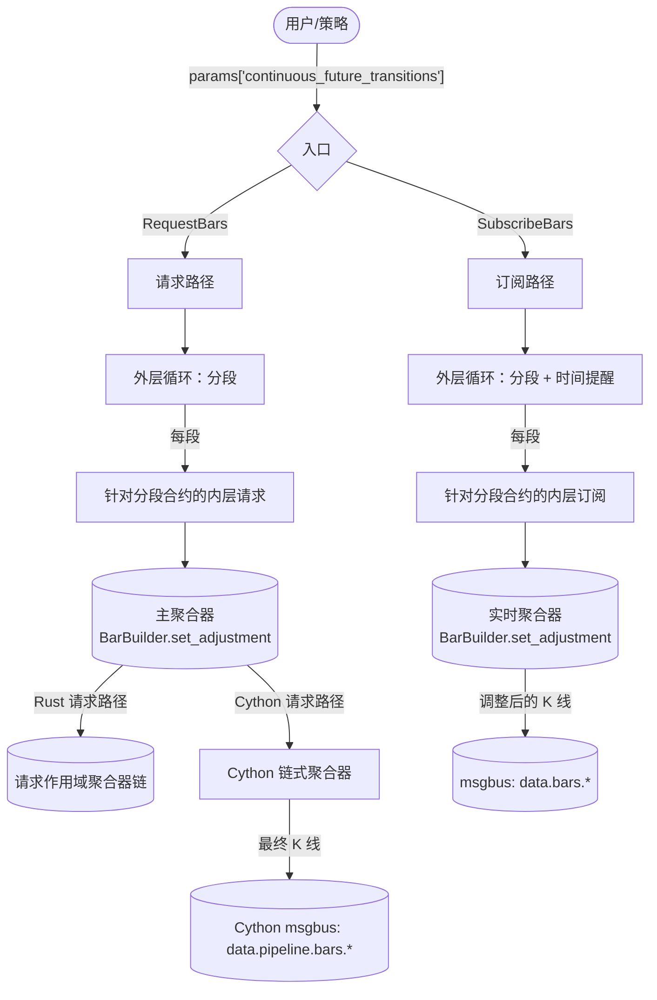
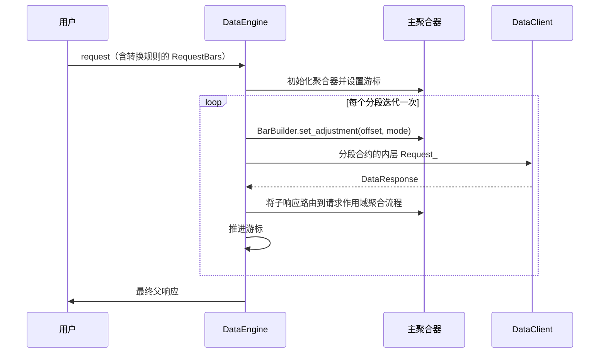
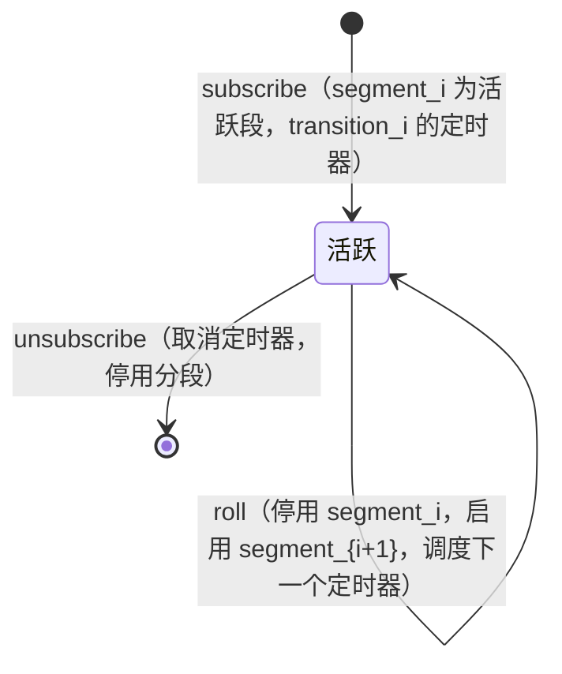
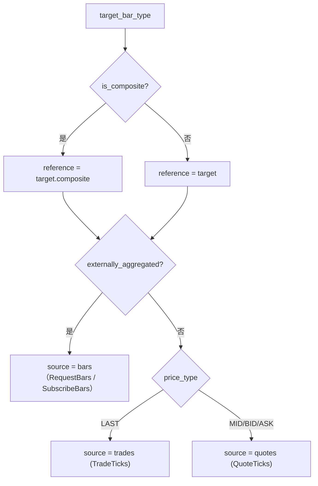
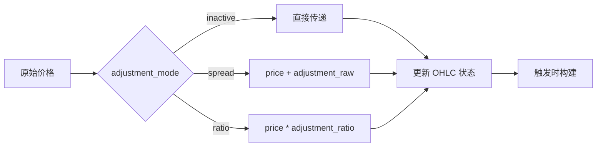

# 连续期货

连续期货是一种衍生序列，它将相继到期的期货合约拼接为一条经过调整的价格流。每个标的合约都会到期；连续序列则在转换点展期至下一个合约，并将历史价格平移到新合约的价格框架中，从而消除展期造成的跳空。

Vibe 将连续期货建模为一个目标 `BarType`，以及在请求或订阅参数中显式提供的一组展期转换。数据引擎逐段遍历各合约，计算每一段的累计价格调整，并让调整后的源数据沿常规 K 线聚合路径流转。

## 调整模式

`ContinuousFutureAdjustmentType` 由方向（向后或向前）和运算方式（差值或比率）组合而成：

| 模式              | 运算方式 | 锚定段   |
| ----------------- | -------- | -------- |
| `BACKWARD_SPREAD` | 加法     | 最新合约 |
| `FORWARD_SPREAD`  | 加法     | 首个合约 |
| `BACKWARD_RATIO`  | 乘法     | 最新合约 |
| `FORWARD_RATIO`   | 乘法     | 首个合约 |

对于共有 `N` 个转换的序列，分段 `k` 的累计调整为：

```text
BACKWARD_SPREAD: sum over i in [k, N) of (post_i - pre_i)
FORWARD_SPREAD:  sum over i in [0, k) of (pre_i - post_i)
BACKWARD_RATIO:  product over i in [k, N) of (post_i / pre_i)
FORWARD_RATIO:   product over i in [0, k) of (pre_i / post_i)
```

差值模式累计加法偏移量。比率模式累计乘法因子，并要求价格严格为正数。

## 输入

只要 `RequestBars` 请求或 `SubscribeBars` 订阅的 `params` 中包含 `continuous_future_transitions` 项，就属于连续期货请求或订阅：

```python
params = {
    "continuous_future_transitions": [
        {
            "transition_time_ns": 1773671460000000000,  # when ESH26 rolls to ESM26
            "pre_instrument_id": "ESH26.XCME",
            "post_instrument_id": "ESM26.XCME",
            "pre_price": "6001.00",  # last ESH26 price pre-roll
            "post_price": "5995.50",  # first ESM26 price post-roll
        },
        # ... more transitions ...
    ],
    "continuous_future_adjustment_mode": ContinuousFutureAdjustmentType.BACKWARD_SPREAD,
    # Optional: cap the upper end of cumulative adjustment at the transition whose
    # post_instrument_id matches (the backward-mode anchor).
    # "last_post_instrument_id": "ESM26.XCME",
    # Optional: cap the lower end of cumulative adjustment at the transition whose
    # pre_instrument_id matches (the forward-mode anchor).
    # "first_pre_instrument_id": "ESM26.XCME",
}
```

请求或命令中的 `bar_type` 是连续 K 线的**目标**类型，例如 `"ES.XCME-1-MINUTE-LAST-INTERNAL@1-MINUTE-EXTERNAL"`。根标识符（`ES.XCME`）表示连续合约根，而非真实合约。每个分段的原始源数据均来自转换列表中的真实合约。

连续目标 K 线类型必须是**内部聚合**类型。连续目标不支持外部聚合 K 线，但每个分段可以使用外部聚合 K 线作为数据源。

### 有界合约链

两个可选边界用于限制转换表中的有效范围：

- `last_post_instrument_id` 将上界限定在首个 `post_instrument_id` 与之匹配的转换。向后调整模式以此作为锚点（锚定段的累计调整为零）；向前调整模式则用它限制后续合约的累计范围。
- `first_pre_instrument_id` 将下界限定在首个 `pre_instrument_id` 与之匹配的转换。向前调整模式以此作为锚点；向后调整模式则用它限制更早合约的累计范围。

因此，调用方既可以传入覆盖范围较宽的转换表，也可以将调整后序列锚定到任一端的指定合约。

## 验证

Rust 请求路径（`crates/data/src/engine/requests.rs`）以及 Cython 请求和订阅路径（`engine.pyx::_continuous_future_validate_transitions`）会在分配任何聚合器之前验证转换参数：

- `continuous_future_adjustment_mode` 必须能解析为有效的 `ContinuousFutureAdjustmentType`。
- `continuous_future_transitions` 必须是由字典行组成的列表或元组。
- 每行必须包含非负整数 `transition_time_ns`，且转换时间必须严格递增。
- 每个 `pre_instrument_id` 和 `post_instrument_id` 都必须能解析为有效的 `InstrumentId`，其交易场所必须与目标交易场所一致。
- 合约链必须连续：第 `i` 行的 `post_instrument_id` 必须等于第 `i + 1` 行的 `pre_instrument_id`。
- 每行必须包含有限值 `pre_price` 和 `post_price`。比率模式还要求两个价格均为正数。
- 如果调用方提供 `last_post_instrument_id`，它必须能解析为 `InstrumentId`、与目标交易场所一致，并在转换列表中作为 `post_instrument_id` 出现。`first_pre_instrument_id` 同样如此。

验证失败时，Rust 请求会在分配子分段状态前返回错误。Cython 请求处理程序调用 `_abort_request`，清除已经开始建立的工作流状态；Cython 订阅路径则记录明确的错误并返回。

## 自动合成目标金融工具

连续合约根（例如 `ES.XCME`）是没有自身市场数据的合成 ID，但下游使用方（聚合器、缓存查询和序列化）仍要求缓存中存在一个 `Instrument`。验证完成后，Rust 请求路径以及 Cython 请求和订阅路径会确保目标金融工具存在：

- 如果目标 ID 已在缓存中，目标设置不会执行任何操作。调用方可以预先注册自定义连续金融工具，引擎会保留它。
- 否则，目标设置会从缓存中取得第一个分段的金融工具并克隆它，仅覆盖 `id` 和 `raw_symbol`，同时将 `activation_ns` 和 `expiration_ns` 清零为 `0`。其他所有字段（货币、精度、最小变动单位、乘数、手数、标的、费用、保证金、交易所、报价档位方案和附加信息）均沿用该分段的数据。
- 如果第一个分段尚未进入缓存，或不是 `FuturesContract`，设置过程会记录警告并返回。此时调用方必须手动注册连续金融工具。

## 架构概览



该设计包含两个入口点、一种外层循环形态（遍历分段）、两种获取分段数据的方式（历史子请求或实盘子订阅），以及一种调整机制（在每个分段边界调用 `BarBuilder.set_adjustment`）。

## 分段

**分段**是由一个真实合约负责的连续时间区间，各转换点将分段隔开。给定 `transitions[0..N)`：

- 分段 0：`transitions[0].pre_instrument_id` 对应的 `(-inf, transitions[0].time)`。
- 分段 k，其中 k 位于 `[1, N)`：`transitions[k].pre_instrument_id` 对应的 `[transitions[k-1].time, transitions[k].time)`。
- 分段 N：`transitions[N-1].post_instrument_id` 对应的 `[transitions[N-1].time, +inf)`。

请求和订阅路径返回从 `cursor_ns` 开始、上限截断至 `end_ns` 的下一个分段。

## 请求流程

请求路径相当于在 `_handle_long_request` 外再包一层：每次迭代针对一个分段的数据发起一个内部请求，内部请求的完成回调随后推进游标。



如果调用方在参数中设置 `time_range_generator` 和 `durations_seconds`，内部请求会继承它们，并自行成为长请求，将该分段的时间范围进一步拆为 N 个子级请求。连续期货的外层循环不关心内部如何分块：每个内部请求仍只向外返回一个合并响应，由该响应触发外层循环处理下一个分段。

### 链式聚合器

如果调用方设置 `bar_types = (bar_type_1, bar_type_2)` 以执行多级内部聚合，初始化过程会创建以 `parent.id` 为键的全部聚合器。Rust 请求路径先将分段源响应路由至主要连续目标，再把产出的 K 线转发给匹配的请求级下游聚合器。Cython 路径在各级之间连接流水线主题，使数据自动沿聚合链向上传递。两条路径都只对主要构建器调用 `set_adjustment`；更高层级会重新聚合已经调整的数据。

## 订阅流程

一个小型状态机通过单个待处理的时间提醒驱动每个有效订阅：



转换触发时，引擎停用当前分段（取消订阅数据源）、激活下一个分段（解析新数据源、应用新偏移量并订阅），然后为下一次转换重新设置计时器。

## 数据源解析

对于任意连续期货目标 `BarType`，提供给主要聚合器的原始数据来自**分段合约**，而不是连续 ID。目标类型的形态决定数据源类型：



## BarBuilder 调整

构建器在数据**进入时**对每次 `update(price, ...)` 和 `update_bar(bar, ...)` 调用应用调整。持续更新的 OHLC 状态始终处于调整后的统一价格框架中，因此在一根 K 线形成期间改变调整量，只会影响之后进入的价格，无需缓存未完成 K 线的部分数据。



`BarBuilder` 只需区分比率与差值，以决定执行乘法还是加法。引擎会在调用 `set_adjustment` 前，将方向信息折算到累计偏移量的符号和大小中。`reset()` 方法会为序列中的下一根 K 线清除单根 K 线的 OHLCV 状态，但会有意保留调整配置：展期远没有 K 线重置频繁，因此调整量被视为分段级状态。

## K 线形成期间的展期边界

如果展期发生在目标 K 线尚未完成时，构建器会保留当前 OHLC 状态，并只对后续更新应用新调整量。边界前的部分仍使用旧偏移量，边界后的部分使用新偏移量。这是有意采用的策略：若每次展期都重写正在形成的 OHLC，就必须按分段缓存原始输入，会增加成本；而在常见情形下，调整后的分段可以跨边界无缝构建，因此结果不会改变。

## 局限性

- 此功能要求调用方提供转换元数据。引擎不会自行发现展期、选择合约或推断展期价格，这些均由调用方负责。
- 比率调整会在热路径中经过 `float`（先执行 `price_as_f64 * ratio`，再执行 `price_new`）。对于高精度金融工具，与等价的 `Decimal` 乘法相比，舍入可能使最终原始值偏移 1 ULP。差值模式直接对 `PriceRaw`（int64/int128）进行运算，因此结果精确。
