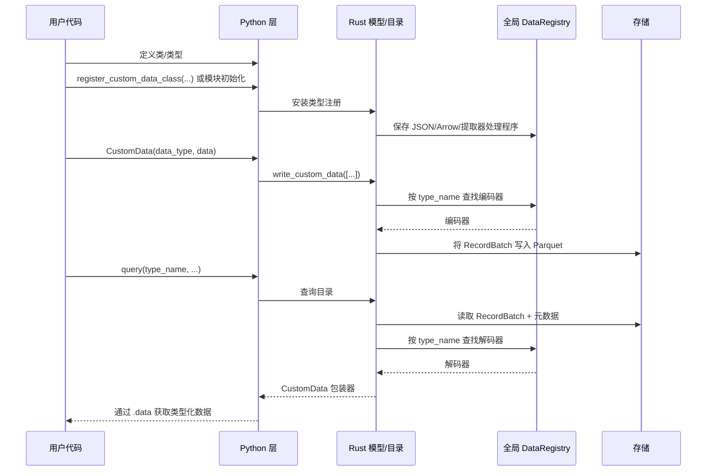
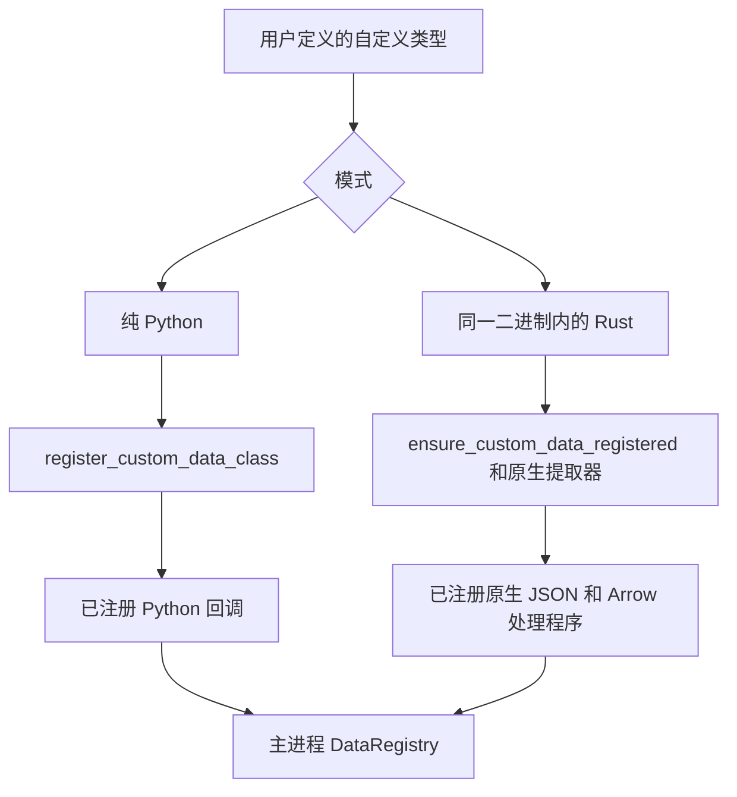
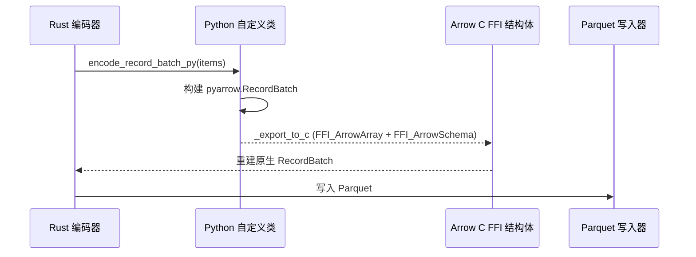

# 自定义数据

Vibe Trader 支持使用 Python 和 Rust 编写自定义数据，并让这些数据沿用平台其他数据所使用的运行时、持久化和查询流水线。

本文说明自定义数据如何：

- 在运行时注册。
- 跨越 Python/Rust 边界进行封装。
- 与 Arrow/Parquet 相互序列化。
- 通过参与者和策略进行路由。

## 目标

自定义数据架构满足以下要求：

- 用户无需编写 Rust 代码，即可使用纯 Python 定义自定义数据。
- 使用 Rust 定义的自定义数据可以采用原生 Rust JSON 和 Arrow 处理程序。
- 在 PyO3 边界保留一个统一、面向用户的 `CustomData` 包装器。
- 通过动态类型注册而非硬编码模式，支持在 `ParquetDataCatalog` 中持久化。
- 自定义数据可沿常规的数据引擎、参与者和策略订阅流程进行路由。

## 总体模型

系统支持两种编写方式：

| 方式            | 示例                                            | 注册路径                                            | 编码/解码路径             | 包装器后端                |
| --------------- | ----------------------------------------------- | --------------------------------------------------- | ------------------------- | ------------------------- |
| 纯 Python       | `@customdataclass_pyo3` 类                      | `register_custom_data_class(...)`                   | Python 回调 + Arrow C FFI | `PythonCustomDataWrapper` |
| 同一二进制 Rust | `#[custom_data]` 或 `#[custom_data(pyo3)]` 类型 | `ensure_custom_data_registered::<T>()` 和原生提取器 | 原生 Rust                 | 原生 Rust 载荷            |

两种方式最终都使用同一个外层 PyO3 `CustomData` 包装器和同一套 `DataType` 标识模型。

## 端到端流程

## 核心组件

### `DataRegistry`

`crates/model/src/data/registry.rs` 是主进程中管理自定义数据的核心运行时注册表模块。注册使用原子的 `DashMap::entry()`，以免并发执行 `register_*` 和 `ensure_*` 时发生竞态。

该模块包含多个由 `OnceLock` 初始化的 `DashMap` 单例：

- 以 `type_name` 为键的 JSON 反序列化器。
- 以 `type_name` 为键的 Arrow 模式、编码器和解码器。
- 将 Python 对象转换为 `Arc<dyn CustomDataTrait>` 的 Python 提取器。
- 为同一二进制中的类型生成 Python 提取器的 Rust 提取器工厂。

Vibe 不会把每一种类型硬编码进主二进制文件，而是在运行时根据 `DataType` 和 Parquet 元数据中保存的 `type_name` 解析相应处理程序。

### `CustomData`

外层 PyO3 `CustomData` 包装器是跨越 FFI 边界的通用容器。

构造函数签名为 `CustomData(data_type, data)`：先传入 `DataType`，再传入内部载荷。

它包含：

- 一个 `DataType`。
- 一个实现 `CustomDataTrait` 的内部自定义载荷（封装在 `Arc<dyn CustomDataTrait>` 中）。

时间戳（`ts_event`、`ts_init`）委托给内部的 `CustomDataTrait` 实现，并作为包装器属性公开。

在 Python 端，`CustomData` 提供值语义：它实现了 `__eq__` 和 `__repr__`（相等性使用 Rust 的 `PartialEq` 逻辑）。实例有意设为不可哈希，以保证相等性与内部载荷比较保持一致。

两种自定义数据方式共用这个包装器。尽管底层载荷可能是下列任一种，用户代码始终面对同一套 API：

- 由 Python 支持的包装器。
- 同一二进制中的 Rust 值。

#### `CustomData` JSON 封装结构

序列化为 JSON 时（例如用于 `to_json_bytes` / `from_json_bytes`、SQL 缓存或 Redis），`CustomData` 使用统一的规范封装结构，因此反序列化不依赖用户载荷中的字段名称：

- `type`：自定义类型名称（来自 `CustomDataTrait::type_name`）。
- `data_type`：包含 `type_name`、`metadata` 和可选 `identifier` 的对象。
- `payload`：仅包含内部载荷（即 `CustomDataTrait::to_json` 的结果解析为值）。注册的反序列化器在 `from_json` 中只接收该值，因此用户结构体可以任意命名字段（包括 `value`），不会与包装器元数据冲突。

该封装结构由 Rust `CustomData` 序列化生成，并由 `DataRegistry` 在从 JSON 反序列化自定义数据时读取。

### `DataType`

`DataType` 标识用于路由和持久化的自定义数据。

构造函数为 `DataType(type_name, metadata=None, identifier=None)`。

它包含：

- `type_name`。
- 可选的 `metadata`。
- 可选的 `identifier`（仅用于目录路径，不参与路由或相等性比较）。

相等性、哈希和主题路由仅由 `type_name` 和 `metadata` 决定。两个 `DataType` 即使标识符不同，只要类型名称和元数据相同，比较结果就相等，也会发布到同一个消息总线主题。`identifier` 只影响 `data/custom/<type_name>/<identifier...>` 下的存储路径。

自定义数据的存储和查询使用 `DataType`，而不只是简单的 Rust/Python 类名。因此，同一种逻辑类型可以使用不同的元数据或标识符存储，同时仍通过同一个已注册处理程序解码。

## 注册架构

注册机制衔接 Python 对象与 Rust trait 对象。

### 纯 Python 注册

Python 代码调用 `register_custom_data_class(MyType)` 时：

1. 该类型先在 Python 序列化层注册，以支持 JSON 和 Arrow。
2. Rust 注册一个 Python 提取器，将 Python 实例封装为 `PythonCustomDataWrapper`。
3. Rust 在 `DataRegistry` 中注册 Arrow 模式以及编码和解码回调。

这条路径灵活且便于用户使用，但 Arrow 编码和对象重建依赖 Python 回调。

### 同一二进制 Rust 注册

对于 Vibe 内部定义的 Rust 类型：

1. `#[custom_data]` 或 `#[custom_data(pyo3)]` 生成所需的 trait、JSON 和 Arrow 实现。
2. `ensure_custom_data_registered::<T>()` 将原生模式、编码器和解码器处理程序插入 `DataRegistry`。
3. 对于通过 PyO3 公开的类型，原生提取器可以把 Python 实例转换回具体的 Rust 类型，而无需使用 Python 后备包装器。

该路径的编码和解码完全在原生 Rust 中完成。

### 注册优先级

`register_custom_data_class(...)` 按以下顺序解析类型：

1. 同一二进制中的原生 Rust 注册。
2. 纯 Python 后备注册。

这一顺序能为主二进制已经原生支持的类型保留最快的可用路径。

## 包装器后端

在内部，外层 `CustomData` 包装器可以容纳不同的载荷实现。

### `PythonCustomDataWrapper`

用于纯 Python 自定义数据。

职责包括：

- 保存对 Python 对象的引用。
- 缓存 `ts_event`、`ts_init` 和 `type_name`。
- 实现 `CustomDataTrait`。
- 在持有 GIL 时调用 Python 方法，执行 JSON 和 Arrow 相关操作。

主进程没有该类型的原生 Rust 表示时，会使用这条后备路径。

### 原生同一二进制 Rust 载荷

对于编译进 Vibe 的 Rust 类型，内部载荷就是具体的 Rust 类型本身，可以直接从 `Arc<dyn CustomDataTrait>` 向下转型。

序列化和解码均不需要 Python 回调路径。

## 持久化架构

### 为什么需要动态 Arrow 注册

Rust 二进制在编译时就知道 Vibe 内置数据类型的模式和编码器，但自定义数据并非如此。因此，持久化层会使用已注册的 `type_name` 动态解析自定义数据。

### 目录写入流程

`ParquetDataCatalog` 要求以 `CustomData` 值的形式写入自定义数据。

自定义数据写入流程如下：

1. 从 `DataType` 提取 `type_name`、`metadata` 和 `identifier`。
2. 在 `DataRegistry` 中查找 Arrow 编码器。
3. 将值编码为 `RecordBatch`。
4. 附加一个包含持久化 `DataType` 的 `data_type` 列。
5. 将 `type_name` 和元数据附加到 Arrow 模式。
6. 将该批数据写入自定义数据路径下的 Parquet 文件。

路径布局为：

- `data/custom/<type_name>/<identifier...>`

标识符成为路径段之前会先规范化。

### 目录读取流程

查询时：

1. 目录读取匹配的 Parquet 文件。
2. 从模式元数据提取 `type_name`。
3. 向 `DataRegistry` 请求已注册的解码器。
4. 将 `RecordBatch` 解码为 `Vec<Data>`。
5. 使用原始 `DataType` 重建 `CustomData`。

这样，自定义数据查询时的解析过程便与写入时的注册对称。将 Feather 流转换为 Parquet 时（例如回测之后），自定义数据分支会解码各批数据，并通过 `write_custom_data_batch` 写入，从而正确地把经 Feather 写入器保存的自定义数据转换为 Parquet。

## Arrow C FFI 桥接

纯 Python 自定义数据无法直接提供原生 Rust Arrow 编码逻辑。对于这些类型，Vibe 使用 Arrow C FFI 接口在 Python 与 Rust 之间传递 `RecordBatch` 数据，无需承担序列化开销。

### 纯 Python 编码路径

对于纯 Python 类：

1. Rust 获取 GIL。
2. Rust 调用 Python 类的 `encode_record_batch_py(...)`。
3. Python 将对象转换为 `pyarrow.RecordBatch`。
4. Python 通过 `_export_to_c` 将该批数据导出到 Arrow C FFI 结构体。
5. Rust 从 FFI 结构体重建原生 `RecordBatch` 并写出。

### 纯 Python 解码路径

反向处理时：

1. Rust 将自身的 `RecordBatch` 转换为 Arrow C FFI 结构体。
2. Python 通过 `RecordBatch._import_from_c` 导入该批数据。
3. Python 调用类上的 `decode_record_batch_py(metadata, batch)`。
4. Rust 将返回的 Python 对象封装到 `PythonCustomDataWrapper` 中。

### 原生路径

同一二进制中的 Rust 自定义数据不使用 Arrow C FFI 桥接。这些类型使用在主进程中注册的原生 Rust 编码和解码处理程序。

## 查询时重建

从目录重新加载自定义数据时，具体重建方式取决于后端：

- 同一二进制中的 Rust 类型直接解码为原生 Rust 值。
- 纯 Python 类型通过已注册 Python 类的 `from_dict` 或 `from_json` 重建。

无论采用哪一种方式，调用方在 PyO3 API 边界都会收到同一个外层 `CustomData` 包装器。

## 运行时集成

自定义数据不只是持久化功能，也会参与 Vibe 的运行时路由。

相关集成包括：

- `crates/data/src/engine/mod.rs` 通过消息总线发布 `CustomData`。
- `crates/common/src/msgbus/switchboard.rs` 根据 `DataType` 派生自定义主题。
- `crates/common/src/actor/*` 将自定义数据路由到参与者订阅。
- `crates/trading/src/python/strategy.rs` 将自定义数据传递给 Python 策略的 `on_data`。
- `crates/backtest/src/engine.rs` 将 `Data::Custom` 视为由数据引擎提供的输入，而不是经交易所路由的数据。

已注册的自定义类型可以通过与其他数据系列相同的运行时接口进行持久化、查询、订阅和消费。

## SQL 缓存和数据库集成

SQL 缓存/数据库层同样支持 `CustomData`。

当前行为如下：

- PostgreSQL 将自定义数据存入 `custom` 表。
- 存储记录包含 `data_type`、`metadata`、`identifier` 和完整的 JSON 载荷。
- 读取时使用 `CustomData::from_json_bytes(...)` 重建 `CustomData`。
- Python SQL 绑定公开 `add_custom_data` 和 `load_custom_data`。
- Redis 缓存将自定义数据保存到 `custom:<ts_init_020>:<uuid>` 键下，值为完整的 `CustomData` JSON。
- Redis 的 `add_custom_data` 和 `load_custom_data` 按 `DataType`（类型名称、元数据和标识符）筛选，并返回按 `ts_init` 排序的结果；PyO3 `RedisCacheDatabase` API 会公开这些功能。

## Cython 自定义数据

Cython `@customdataclass` 系统与本架构相互独立。本文描述的是 PyO3 自定义数据系统：

- PyO3 `CustomData`。
- 动态运行时注册。
- Arrow/Parquet 持久化。
- 原生 Rust 执行路径。

## 实际影响

该架构为 Vibe 带来两个重要特性：

1. 面向只想编写 Python 的用户，提供以 Python 为先的扩展能力。
2. 面向内置或编译后的自定义类型，提供原生 Rust 性能。

最终形成的是一套具有两个后端的统一自定义数据体系，而不是彼此割裂的纯 Python 与纯 Rust 功能孤岛。
