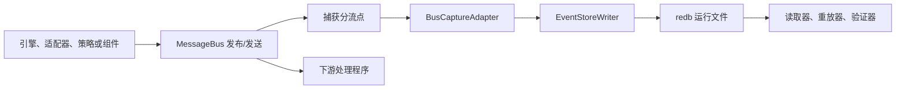
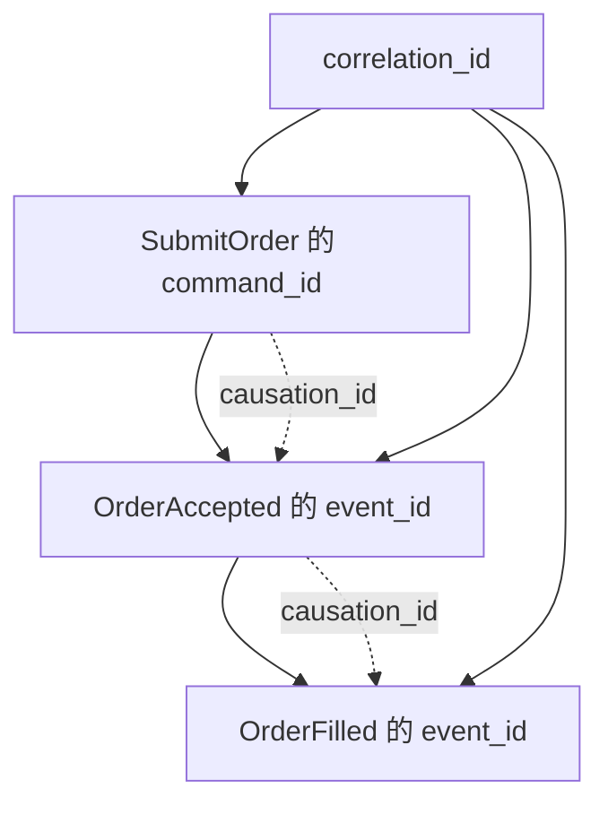
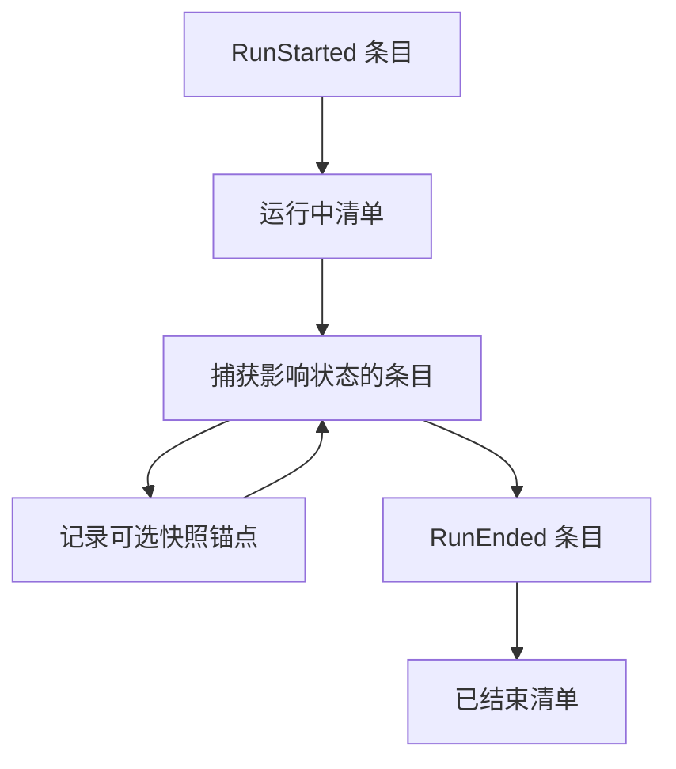
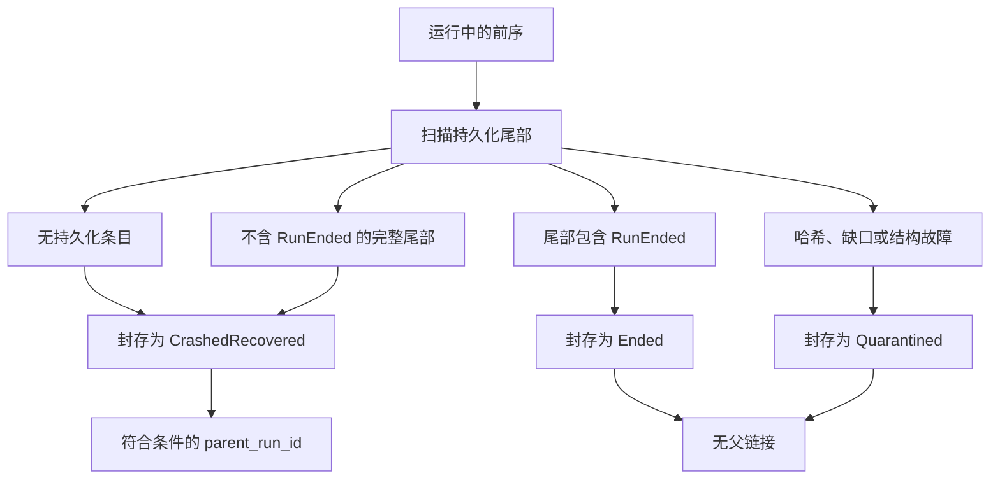
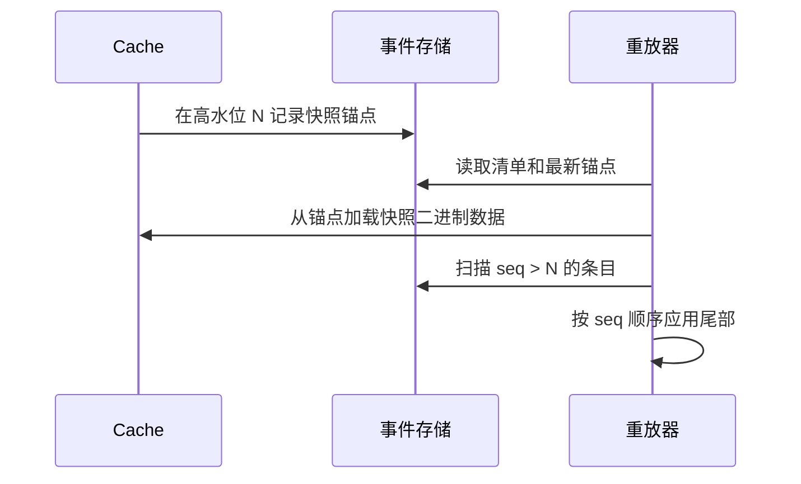

# 事件溯源

事件溯源为 VibeTrader 提供持久且有序的消息记录，这些消息会改变引擎状态。事件存储在系统边界记录消息；读取器、重放工具和验证器随后使用同一份日志还原发生过的事情并重建状态。

**核心理念**：

- 事件存储是影响状态的历史记录的持久权威。
- 缓存是直写投影，而非事实来源。
- 缓存重放通过把捕获的历史应用到缓存所有的状态来重建状态。
- 市场数据保留在数据目录中；事件存储记录影响状态的消息。
- 只有当 Vibe 把外部 I/O 捕获为命令、原始报告或其他影响状态的输入时，外部 I/O 才能重放。

:::note
事件存储捕获、重放、验证、恢复和保留规划都有针对性测试覆盖，但 API 接口仍在演进。请把本页视为设计契约，并把 [`vibe-event-store` README](https://github.com/qOeOp/trade/blob/main/crates/event_store/README.md) 和 [`vibe-event-store` crate](../../crates/event_store/) 作为 API 参考。
:::

## 为什么使用事件溯源

缓存回答"现在什么为真"，事件存储回答"Vibe 如何走到这里"。它为读取器、重放工具和验证器提供限定在单次运行内的历史，无需借助策略逻辑、交易场所查询或实盘缓存来解释过去状态。

事件存储为 Vibe 提供持久基础，用于：

- 在重放或归档前证明已封存的运行是否干净。
- 检查订单或组件意图背后的精确命令、报告和事件序列。
- 根据捕获的历史重建缓存状态，包括一个快照锚点及该运行的后续尾部。
- 沿意图追踪其后产生的引擎侧消息。
- 进程退出或写入器停止后，在下次运行开始前封存遗留运行文件。

## 术语

- **运行**：一个实例、二进制文件和配置对应的一次内核会话。
- **条目**：一条捕获消息及其重放元数据。
- `seq`：写入器在单次运行内分配的序列号，也是重放顺序。
- **高水位**：后端持久确认的最大 `seq`。
- **快照锚点**：与缓存快照一同记录的高水位。
- **标头**：随捕获消息传播的关联和因果元数据。

## 存储记录什么

事件存储记录一个交易实例、一次运行中影响状态的消息总线流量。运行始于内核启动，止于进程正常停止或崩溃。

**捕获的条目包括**：

- 提交、修改、取消等执行命令。
- 定义参与者或策略观察窗口的数据订阅命令。
- 已触发的时间事件，以及生成的订单、持仓和账户事件。
- 对账根据原始报告合成派生事件之前的原始交易场所执行报告。
- 根据这些原始报告产生的对账输出。
- 穿过总线并影响状态的请求和响应消息，或其中与审计相关的元数据。
- `RunStarted`、`RunEnded` 等运行生命周期条目。

流式市场数据观察值保留在数据目录。事件存储记录命令流、原始报告、生成事件和元数据，用于重放引擎如何对外部世界作出响应。数据响应是例外：引擎请求的每个响应都会被捕获，包括订单簿、远期价格和自定义数据响应。只有[缓存重放](#缓存重放)列出的部分响应具有重新应用到缓存状态的规则，其他响应只用于检查。

## 边界

事件存储有意保持范围狭窄：

- 不替代数据目录。
- 不提供分析或 OLAP 查询。
- 不把多个交易者实例聚合为共识日志。
- 尚未定义脱敏、静态加密或防篡改证据。

## 捕获流程

捕获发生在消息总线分派边界，因此捕获点会在下游处理程序观察消息之前看到每条影响状态的消息。



捕获从向下游处理程序供给消息的同一次分派中分支，读取器只能访问持久后端。

捕获是异步操作，不是分派的接受门。成功捕获会把条目放入写入器队列；写入器线程随后分配下一个 `seq`、提交一个批次，并在后端确认持久化后推进高水位。读取器通过不公开追加操作的接口扫描已封存或仍在运行的后端。

写入器通过有界通道接收条目。背压不会悄然丢弃已接受条目：提交阻塞超过配置的 `halt_threshold` 时，会触发停止信号。后端提交失败则不同，已排队批次会丢失：写入器触发停止信号、丢弃待处理批次并结束循环，因此这些条目永远不会持久化。

:::warning
故障即停不会中断运行。捕获点会记录失败，消息仍会到达处理程序；停止后捕获点不再记录，因此该会话余下部分不受捕获。没有运行时组件轮询停止信号来终止交易者；下次启动时的恢复扫描才会封存该运行，如果尾部干净，则标记为 `CrashedRecovered`。
:::

有些消息会合法穿过多个可见于捕获点的边界：执行引擎把订单事件发送到投资组合端点，同时在策略主题上发布同一事件；交易命令则从策略流经风险引擎再到执行引擎。同一消息的重复分派发生在一个引擎周期内，因此捕获适配器会依据最近捕获消息标识（事件 ID、命令 ID）的有界窗口去重。每条逻辑消息只生成一个条目，重放不会重复应用同一事件。

## 生命周期选项

`EventStoreConfig` 是可序列化的运行策略。进程本地构造策略位于 `EventStoreLifecycleOptions`，高级调用方通过 `EventStoreLifecycle::boot_with_options(...)` 传入。

默认情况下，生命周期会打开 `RedbBackend`，并安装默认编码器和数据标记提取器注册表。生命周期选项可以替换其中任意一项：

- 一个编码器注册表，或为每次运行构建注册表的工厂；在总线捕获点开始捕获前应用。
- 一个后端打开器，为新运行返回任意 `EventStore` 实现。
- 一个针对已配置标记类的数据标记提取器注册表工厂。

后端打开器是内存捕获的模拟安全路径。DST 测试工具或专用测试可以通过正常生命周期打开 `MemoryBackend`，保持相同的总线捕获点和写入器语义，并在封存后于进程内读取捕获条目。在 `cfg(madsim)` 下，写入器会同步提交每次送入，因此捕获的 `seq` 顺序具有确定性。使用 `MemoryBackend` 打开器时，捕获不需要 `redb` 运行文件。

## 条目模型

每个事件存储条目包含一条捕获消息及元数据：

- `seq`：单次运行中的重放顺序权威。
- `ts_init`：捕获消息的领域时间戳。
- `ts_publish`：总线接受或写入器接收时间戳。
- `topic`：总线主题或逻辑端点。
- `payload_type`：编码后的消息类型。
- `payload`：编码后的消息字节。
- `headers`：关联和因果元数据。
- `entry_hash`：对条目内容计算的规范哈希。

重放按 `seq` 排序。时间戳有助于解释运行，但不会覆盖 `seq`。

辅助索引支持按 `client_order_id` 和 `venue_order_id` 查询。出现具体检查使用方需要该查询模式时，可以增加 `correlation_id` 索引；在此之前，关联查询可扫描捕获流。

## 关联模型

目标模型使用三层标识，使读取器能够回答范围、沿袭关系和消息身份问题。

- `correlation_id`：逻辑工作流或链。
- `causation_id`：直接导致该消息的父消息。
- `command_id`、`event_id` 或 `report_id`：这条具体消息的身份。



一个 `correlation_id` 贯穿整个工作流，`causation_id` 则把每条消息链接到直接父消息。

:::warning
标头传播尚不完整，因此目前多数捕获条目的标头为空。默认编码器注册表为交易命令、数据命令和数据响应注册提取器，这些提取器会转发消息携带的内容。实际上，其中只有数据请求（提供 `request_id`）和数据响应（携带必需的 `correlation_id`）会生成非空标头：仓库内交易命令生产者构造命令时未设置 `correlation_id` 和 `causation_id`；订单、持仓、账户事件、执行报告和时间事件则完全没有提取器。请把上图视为设计契约，而不是对捕获运行实际内容的描述。
:::

标头非空时，操作人员可以回答两个常见问题：

- "显示该工作流中的所有内容"：按 `correlation_id` 筛选或扫描。
- "显示该事件为何发生"：沿 `causation_id` 回溯到直接父消息。

## 运行文件与清单

默认后端为 `redb`，每次运行在以下路径存储一个文件：

```text
<base>/<instance_id>/<run_id>.redb
```

每个运行文件包含：

- 以 `seq` 为键的条目。
- 订单标识符辅助索引。
- 运行开始时写入、运行结束时封存的清单。
- 用于缓存恢复的可选快照锚点。

清单记录运行身份和复现输入：

- 运行身份：
  - `run_id`
  - `parent_run_id`
  - `instance_id`

- 构建身份：
  - `binary_hash`
  - `schema_version`
  - `crate_versions`
  - `feature_flags`
  - `adapter_versions`

- 配置身份：
  - `config_hash`
  - `registered_components`
  - `seed`

- 生命周期状态：
  - `start_ts_init`
  - `end_ts_init`
  - `high_watermark`
  - `status`

运行状态为 `Running`、`Ended`、`CrashedRecovered` 或 `Quarantined` 之一。

## 运行生命周期



运行以 `RunStarted` 开始，以 `RunEnded` 结束；快照锚点是在清单保持 `Running` 时记录的可选位置。

- `RunStarted` 是新运行的第一个条目。同一进程重复调用 `open()` 时，会先封存当前会话，再启动新运行。
- 清单为 `Running` 时，总线捕获点记录影响状态的条目，缓存快照可以针对持久高水位记录锚点。
- 正常关闭、内核丢弃或重置/重跑封存会追加 `RunEnded`，并把清单封存为 `Ended`。
- 故障即停的会话会跳过进程内封存，由下次启动时的恢复扫描接管。停止信号只作用于触发它的运行；后续 `open()` 会重新启用新信号，因此一次停止不会破坏同一进程中的后续运行。

## 恢复封存

前序运行是同一实例下、清单仍为 `Running` 的较早运行文件。这表示之前的进程没有完成正常生命周期，或写入器在清单封存完成前停止。



启动恢复会扫描每个 `Running` 前序运行，并根据持久尾部选择最终清单状态：

| 持久尾部                   | 封存状态           | 可作为父运行 |
| -------------------------- | ------------------ | ------------ |
| 无条目                     | `CrashedRecovered` | 是           |
| 干净，但没有 `RunEnded`    | `CrashedRecovered` | 是           |
| 干净，以 `RunEnded` 结尾   | `Ended`            | 否           |
| 哈希不匹配、缺口或结构失败 | `Quarantined`      | 否           |

扫描不会因为一个运行文件损坏而让交易者无法启动。被强制终止的进程（SIGKILL、OOM kill、断电）可能留下 redb 无法以只读方式打开的文件；列举过程会回退为以可写方式打开，让 redb 在恢复继续前执行修复。仍无法打开或缺少清单的文件会记录错误后跳过，并在下次启动重试，使恢复和保留流程继续处理健康运行。

只有 `CrashedRecovered` 前序运行会成为 `parent_run_id`。配置的 `replay_from_run_id` 经验证后会覆盖恢复出的父运行。只读验证器与之分离：它可以在不修改已封存运行的情况下检查并报告 `quarantine=not-performed`。

## 重放输入

重放只遵循一条顺序规则：按 `seq` 顺序应用事件存储条目。`ts_init` 和 `ts_publish` 解释消息何时发生，但 `seq` 是持久重放顺序。

Rust 重放输入 API 将规划与执行分开：

- 仅事件存储的重放输入只返回条目。
- 与目录联接的重放输入会加入调用方选择的目录切片，用于上下文分析。

目录规划器接收显式 `CatalogSliceSelector` 值和只读 `ReplayCatalog`。除非选择器提供显式边界，否则规划过程会根据事件存储扫描解析目录时间边界、报告缺失目录切片，并保持以 `seq` 为条目顺序权威。加载返回 `ReplayInputs`：按 `seq` 排序的事件存储条目，以及按所选切片分组的目录记录。

Rust 调用方可以启用默认关闭的 `persistence` 功能，并使用 `vibe_event_store::ParquetReplayCatalog` 包装 `ParquetDataCatalog`，以规划所选目录文件和从文件名派生的时间区间。该桥接会把 `quotes`、`trades`、`bars` 加载为带类型的 `CatalogReplayRecord` 值。

:::note
持久化桥接是只读的：使用目录发现和查询 API，但**不会写入目录**。在重放为某个不支持的目录类增加带类型载荷契约前，加载该类会失败。
:::

这些 API **不会**：

- 打开实盘交易场所客户端
- 运行策略或参与者
- 重新运行对账
- 删除文件
- 重放时钟注册/取消生命周期

## 缓存重放

内核管理的重放使用 `EventStoreConfig::replay_from_run_id`。设置后，内核从已封存运行恢复缓存状态，把该运行记录为新子运行的父运行，并跳过实盘引擎、客户端、启动和交易场所对账。被隔离运行会被拒绝。重放还要求 `load_state=true`；禁用时，内核记录错误并返回，不恢复缓存也不打开子运行。

缓存重放加载器只处理状态。它恢复缓存所有的快照，按 `seq` 扫描事件存储尾部，解码支持的、影响缓存的载荷，并直接应用到 `Cache`。支持的载荷包括：

- 合成的账户、订单和持仓事件
- 捕获的订单列表
- 金融工具、报价、成交、资金费率和 K 线的完整数据响应

加载器**不会**：

- 把重放条目发布到实盘消息总线
- 运行策略或参与者代码
- 查询交易场所
- 运行对账
- 重新派生标识符
- 重新启用时钟

已触发的 `TimeEvent` 和原始交易场所报告在该路径中只用于检查；重放会应用在运行后续阶段捕获的合成订单、持仓和账户事件。

## 数据标记 sidecar

:::note
标记 sidecar 通过 `EventStoreConfig.data_markers` 选择启用，默认关闭。
:::

精确数据交付顺序不从目录时间戳推断。标记 sidecar 在消息总线分派边界记录观察到的数据，文件位于事件存储运行旁的 `<base>/<instance_id>/<run_id>.markers.redb`，且不会把完整市场数据载荷写入 `EventStoreEntry` 行。

sidecar 只支持一项审计声明：启用标记捕获时，Vibe 在该运行的总线边界按 `marker_seq` 顺序观察到数据交付，每个标记都携带足以联接回候选目录行的身份信息。它不能：

- 证明仅靠目录时间戳就能定义总线顺序。
- 在目录行缺失或改变时重建数据点。
- 证明 Vibe 观察消息之前的交易场所发送顺序。
- 说明未启用标记捕获的运行。
- 保证每条观察到的数据消息都产生标记。

sidecar 以完整性换取对交易路径的隔离，因此不继承条目写入器的背压契约。标记提交发现有界通道已满时，会丢弃标记而非阻塞调用方或停止运行，并把其序列折叠到缺口记录：后续提交刷新时记录 `Overflow`，或写入器关闭而丢弃范围仍待处理时记录 `WriterClosed`。

标记不消耗事件存储 `seq`，也不会在条目表产生缺口。每个标记都有独立单调递增的 `marker_seq`，以及 `event_seq_before`--观察到该标记前已分配的最大事件存储 `seq`。已封存运行分析器可以通过 `event_seq_before + 1` 得到标记后的下一个事件存储条目；共享同一 `event_seq_before` 的标记按 `marker_seq` 排序。事件存储 `seq` 仍是影响状态条目的重放顺序权威。

sidecar 有两种标记：

- **游标快照**（`DataCursorSnapshot`）：默认捕获模式。每个快照记录 `marker_seq`、`event_seq_before`、`ts_init`，以及自上次快照以来推进的 `StreamCursor` 条目。`StreamCursor` 携带流的 `slot`、该槽位中已见的最高 `ts_init`（`ts_init_hi`）及记录 `count`。`StreamDictEntry` 把每个 `slot` 映射到其 `data_cls`（`BookDeltas`、`BookDepth10`、`Quote`、`Trade`、`Bar`）和金融工具 `identifier`。
- **高保真标记**（`HiFiMarker`）：通过 `DataMarkerConfig.high_fidelity` 按金融工具选择启用。每个标记记录 `marker_seq`、`event_seq_before`、`slot`、`ts_event`、`ts_init`、`same_ts_ordinal`，以及根据规范带类型行字段计算的 32 字节 `record_fingerprint`。

`same_ts_ordinal` 和 `record_fingerprint` 无需存储价格、数量、大小或 MessagePack 载荷，就能消除同时间戳重复数据的歧义。如果同一键和时间戳下有两条目录行逐字节相同，sidecar 可以证明 Vibe 按特定标记顺序观察到两次交付；但目录压缩重写行顺序后，它无法指定唯一物理目录行。

标记验证会证明 `marker_seq` 序列已完整计数，其中记录的缺口也计为覆盖。应读取缺口记录以确定丢弃了什么。

稳定契约包括标记模式、选择性捕获和读取器原语、标记序列验证及目录联接规则。分析工具可基于此契约选择窗口、解释交易场所特定数据、对标记排序或聚类、展示报告并打包运行包。

禁用标记捕获时不会安装数据标记写入器。缓存重放和实盘重启都不读取该 sidecar：快照尾部重放仍按 `seq` 应用事件存储条目，实盘重启仍根据缓存所有的状态和事件存储父链接启动。

## 快照锚定恢复

缓存快照归缓存所有。事件存储只保存快照锚点：快照时的高水位、命名该快照且归缓存所有的不透明 `blob_ref`，以及该 blob 归缓存所有的 `content_hash`。



恢复会加载锚点命名的快照，再只应用锚点高水位之后的条目。

恢复情形按消息推进程度排序：

- 入队前：消息从未到达写入器，因此采用生产者重试策略。
- 入队后、提交前：传输中的批次尚未持久，因此高水位不推进。
- 提交后、快照锚定前：恢复加载之前的快照并重放尾部。
- 快照锚定后：恢复加载最新快照并重放锚点之后的条目。

:::info
实盘重启仍使用"快照加对账"。只有捕获覆盖和重放规则涵盖所有影响状态的路径后，事件存储恢复才会成为实盘重启路径。
:::

重放正确性取决于四项检查：

- 条目由不可变 `seq` 值寻址。
- 写入会拒绝乱序提交。
- 读取器检测高水位以内的缺口。
- 快照重放计划拒绝指向持久高水位之后的锚点。

## 保留规划

保留流程以整个运行文件为回收单位。事件存储提供非破坏性规划器，用于列出已封存运行清单、检查最新快照锚点状态，并返回供后续监督器或操作人员进程回收的候选运行文件。

规划器支持三种模式：

- `Full`：保留所有已封存运行，不返回回收候选。
- `Bounded { keep_last }`：保留最新的已封存运行，并至少保留一个已知良好的恢复点。
- `SnapshotAnchored`：只回收早于最新已知良好恢复点的已封存运行。

已知良好恢复点是具有有效快照锚点的已封存、非 `Quarantined` 运行，其高水位不超过运行的持久高水位。规划器会与磁盘上实际最后一个条目比较，而不是使用清单记录值，因此尾部被截断的运行无法伪装成恢复点。`Running` 运行永远不会列为已封存运行或回收候选。缺失、损坏或无效快照锚点不算恢复点；无法证明至少保留一个结构有效恢复点时，规划器不会返回候选。检查止于锚点：规划器不加载快照 blob，因此无法排除因 blob 缺失或改变而失败的恢复。

## 完整性与验证

每个条目都携带根据完整内容计算的规范哈希。读取器和验证器会重新计算哈希并报告不匹配。验证器还检查清单/高水位状态、根据条目表验证辅助索引，并报告无法解码或指向持久高水位之后的快照锚点。

:::warning
`clean` 结论只证明结构完整性，不证明可恢复性或捕获完整性：

- 验证器检查快照锚点，但从不加载或哈希其命名的 blob，因此 blob 缺失或改变的运行仍可能验证为干净，却在恢复时失败。保留规划器也只根据同样的锚点证据选择恢复点。
- 标记验证把已记录缺口计为覆盖，因此在背压下丢弃标记的运行仍可能验证为干净。
- 运行在会话中途故障即停时，只对实际捕获部分验证为干净，无法说明停止后经过的消息。

:::

运行验证采用进程隔离。这很重要，因为部分损坏的 `redb` 文件会在打开或首次读取时 panic，而发布构建使用 `panic = "abort"`。验证器在工作子进程中执行扫描，因此坏文件只会中止工作进程，而不会中止调用方。

验证已封存运行文件：

```bash
cargo run -p vibe-event-store --bin verify -- ./event_store/trader-001/1700000000-cafe0001.redb
```

干净输出如下：

```text
clean run_id=1700000000-cafe0001 status=Ended high_watermark=3 entries_scanned=3 markers=absent
```

损坏输出包含 `quarantine=not-performed`：

```text
corrupt run_id=1700000000-cafe0001 status=Ended high_watermark=3 entries_scanned=3 findings=1 marker_findings=0 markers=absent quarantine=not-performed
- hash mismatch at seq 2
```

`markers=` 字段报告 sidecar 扫描结果。运行文件旁不存在 `<run_id>.markers.redb` 时为 `absent`；成功读取 sidecar 时为 `clean` 或 `corrupt`，并附带扫描到的快照、高保真标记、缺口和字典计数；sidecar 存在但无法打开或扫描时为 `error`。

退出码：

- `0`：运行干净。
- `1`：运行有损坏发现，或工作进程中止或超时。
- `2`：验证器无法打开请求文件或针对它运行。

为大型已封存运行增加工作进程超时：

```bash
env VIBE_EVENT_STORE_VERIFY_TIMEOUT_SECS=120 \
    cargo run -p vibe-event-store --bin verify -- ./event_store/trader-001/1700000000-cafe0001.redb
```

从 Rust 读取已封存运行：

```rust
use vibe_event_store::{EventStoreReader, RedbBackend, ScanDirection};

fn inspect_run() -> Result<(), Box<dyn std::error::Error>> {
    let backend =
        RedbBackend::open_sealed_file("./event_store/trader-001/1700000000-cafe0001.redb")?;
    let reader = EventStoreReader::new(backend);
    let high_watermark = reader.high_watermark()?;

    for entry in reader.scan_range(1, high_watermark, ScanDirection::Forward) {
        let entry = entry?;
        println!("{} {}", entry.seq, entry.topic);
    }

    Ok(())
}
```

:::note
验证器会报告损坏，但不修改运行文件。隔离属于操作人员或监督器策略。
:::

## 验证覆盖

事件存储测试套件固定了当前 alpha 接口中关键的正确性保证：

- 默认编码器注册表覆盖已审计、影响状态的捕获接口。
- 已触发的 `TimeEvent` 经 `TimeEventHandler::run` 命中已安装的事件存储捕获点。
- 写入器在有界背压下停止，而不是丢弃已接受条目。
- 条目哈希验证可以发现字节级载荷损坏。
- 进程隔离验证会把被截断或尾部为零的运行文件报告为损坏。
- 对生成的捕获事件流进行缓存重放，会重建出与实盘缓存相同的可观察账户、订单和持仓状态。
- 同一订单事件跨多个总线边界分派时只捕获一次。
- 无法解码或指向持久高水位之后的快照锚点会成为验证器发现，而不是验证为干净。
- 与目录联接的重放输入规划覆盖所选切片、缺失切片、时间边界和事件存储 `seq` 顺序。
- 崩溃恢复会根据持久尾部把 `Running` 前序运行封存为 `Ended`、`CrashedRecovered` 或 `Quarantined`，且只有 `CrashedRecovered` 运行成为父运行。
- 启动恢复会修复硬崩溃运行文件并跳过不可读文件，而不是让扫描失败。

## 与 DST 的关系

事件存储与[确定性模拟测试](dst.md)（DST）解决重放的不同部分。

- 事件存储提供捕获的输入历史。
- DST 控制调度、时间、带种子随机性和范围内其他非确定性。

两者结合后，可以在确定性模拟范围内复现一次运行的引擎行为。清单会把识别该运行的输入与捕获日志一起记录：`seed`、`binary_hash`、`config_hash`、`schema_version`。

在 `cfg(madsim)` 下，写入器会同步提交，而不是生成写入器线程。模拟测试工具通过生命周期选项提供 `MemoryBackend` 打开器时，捕获留在进程内且不需要 `redb` 文件。该高级选项路径之外，Redb 仍是默认持久后端。

除非 Vibe 捕获相关原始输入并经确定性接口路由，否则适配器网络 I/O 仍不属于逐位一致重放范围。
