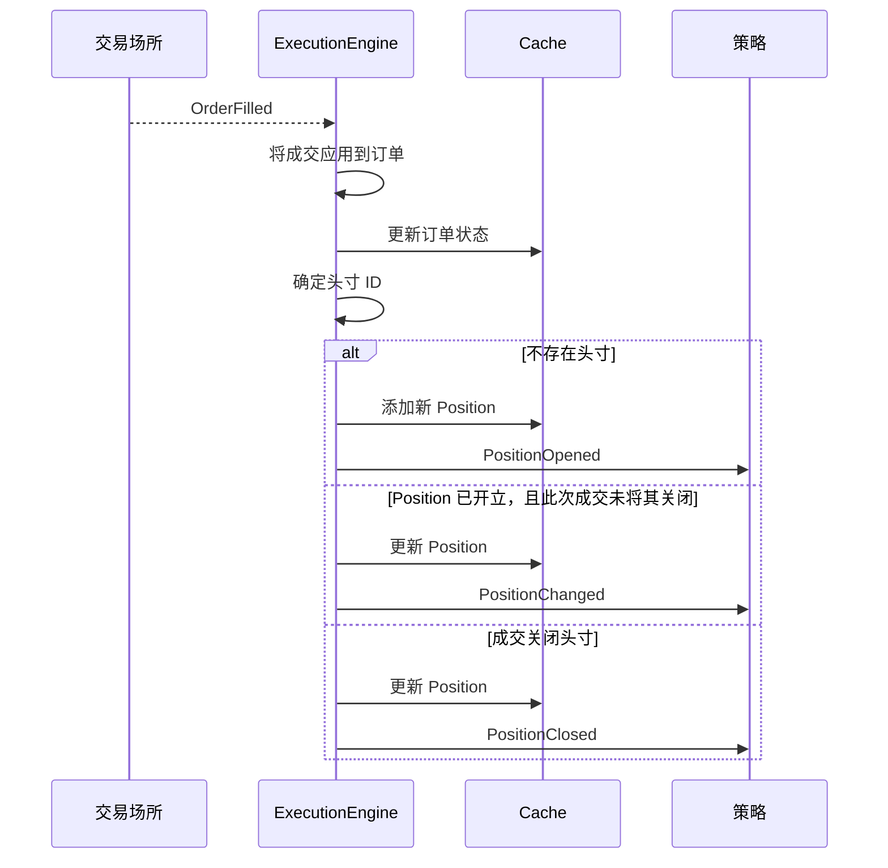

# 事件

Vibe 采用事件驱动架构：系统中的每次状态变更都由事件对象表示，并通过 `MessageBus`
流向策略和 actor 处理器。本指南介绍事件类型、事件分派方式，以及订单成交如何产生持仓事件。

## 事件类别

| 类别 | 示例                                            | 来源                              |
| ---- | ----------------------------------------------- | --------------------------------- |
| 订单 | `OrderAccepted`、`OrderFilled`、`OrderCanceled` | `ExecutionEngine`（来自交易场所） |
| 持仓 | `PositionOpened`、`PositionChanged`             | `ExecutionEngine`（来自成交）     |
| 账户 | `AccountState`                                  | `ExecutionClient` / `Portfolio`   |
| 时间 | `TimeEvent`                                     | `Clock`（计时器与提醒）           |

## 处理器分派

事件到达策略时，系统按固定优先级顺序调用处理器。第一个匹配的处理器运行后，
会继续进入下一层级，因此可以按所需粒度处理事件。

### 订单事件

1. 特定处理器（例如 `on_order_filled`）
2. `on_order_event`（接收所有订单事件）

### 持仓事件

1. 特定处理器（例如 `on_position_opened`）
2. `on_position_event`（接收所有持仓事件）

### 时间事件

计时器和提醒会产生 `TimeEvent` 对象。调用 `set_timer` 或 `set_time_alert` 时传入
`callback`，可将事件定向到自定义方法。如果省略回调，则在存在同名的先前注册回调时使用它；
否则将事件交付给 `on_time_event`。

## 订单事件

每个订单事件都对应[订单状态机](../orders/index.md#order-state-flow)中的一次状态转换。
`ExecutionEngine` 将事件应用于订单、更新 `Cache`，并在 `MessageBus` 上发布。
下表显示主要转换；部分成交和已触发订单还支持完整
[订单状态流](../orders/index.md#order-state-flow)中记录的其他转换。

| 事件                                              | 主要转换                                   | 处理器                     |
| ------------------------------------------------- | ------------------------------------------ | -------------------------- |
| [`OrderInitialized`](order_initialized.md)        | （在本地创建）                             | `on_order_initialized`     |
| [`OrderDenied`](order_denied.md)                  | Initialized -> Denied                      | `on_order_denied`          |
| [`OrderEmulated`](order_emulated.md)              | Initialized -> Emulated                    | `on_order_emulated`        |
| [`OrderReleased`](order_released.md)              | Emulated -> Released                       | `on_order_released`        |
| [`OrderSubmitted`](order_submitted.md)            | Initialized/Released -> Submitted          | `on_order_submitted`       |
| [`OrderAccepted`](order_accepted.md)              | Submitted -> Accepted                      | `on_order_accepted`        |
| [`OrderRejected`](order_rejected.md)              | Submitted -> Rejected                      | `on_order_rejected`        |
| [`OrderTriggered`](order_triggered.md)            | Accepted -> Triggered                      | `on_order_triggered`       |
| [`OrderPendingUpdate`](order_pending_update.md)   | Accepted -> PendingUpdate                  | `on_order_pending_update`  |
| [`OrderPendingCancel`](order_pending_cancel.md)   | Accepted -> PendingCancel                  | `on_order_pending_cancel`  |
| [`OrderUpdated`](order_updated.md)                | PendingUpdate -> 先前状态                  | `on_order_updated`         |
| [`OrderModifyRejected`](order_modify_rejected.md) | PendingUpdate -> 先前状态                  | `on_order_modify_rejected` |
| [`OrderCancelRejected`](order_cancel_rejected.md) | PendingCancel -> 先前状态                  | `on_order_cancel_rejected` |
| [`OrderCanceled`](order_canceled.md)              | PendingCancel/Accepted -> Canceled         | `on_order_canceled`        |
| [`OrderExpired`](order_expired.md)                | Accepted -> Expired                        | `on_order_expired`         |
| [`OrderFilled`](order_filled.md)                  | Accepted -> Filled/PartiallyFilled         | `on_order_filled`          |
| [`OrderFillVoided`](order_fill_voided.md)         | 存在成交 -> 推导；不存在 + false -> Voided | `on_order_fill_voided`     |

### 订单事件公共字段

所有订单事件都共享以下字段：

| 字段              | 说明                       |
| ----------------- | -------------------------- |
| `trader_id`       | 交易者实例标识符。         |
| `strategy_id`     | 提交订单的策略。           |
| `instrument_id`   | 订单对应的金融工具。       |
| `client_order_id` | 客户端分配的订单标识符。   |
| `venue_order_id`  | 交易场所分配的订单标识符。 |
| `account_id`      | 订单所属账户。             |
| `reconciliation`  | 是否在对账期间生成。       |
| `event_id`        | 唯一事件标识符。           |
| `ts_event`        | 事件发生时的时间戳。       |
| `ts_init`         | 事件创建时的时间戳。       |

每个订单事件的页面都会列出在此公共集合之外增加的类型专用字段，以及哪些可选公共字段已填充。
例如，[`OrderFilled`](order_filled.md) 会增加 `last_qty`、`last_px`、`trade_id` 和
`commission`。[`OrderFillVoided`](order_fill_voided.md) 标识被更正的成交，并携带其累计作废数量。

:::tip
覆盖 `on_order_event` 可在一处处理所有订单事件。特定处理器会先触发，
因此可以结合使用两种方式。
:::

## 持仓事件

持仓事件是成交事件的直接结果。`ExecutionEngine` 处理每个 `OrderFilled`，
更新或创建持仓，并发出相应的持仓事件。

`OrderFillVoided` 会根据有效成交历史重建缓存的持仓。它不会发出方向相反的成交，
也不会合成持仓事件。

| 事件                                     | 触发时机                 | 处理器                |
| ---------------------------------------- | ------------------------ | --------------------- |
| [`PositionOpened`](position_opened.md)   | 首次成交创建新持仓。     | `on_position_opened`  |
| [`PositionChanged`](position_changed.md) | 后续成交改变数量或方向。 | `on_position_changed` |
| [`PositionClosed`](position_closed.md)   | 成交将数量减少至零。     | `on_position_closed`  |

### 从成交到持仓：因果链

下图显示单个 `OrderFilled` 事件如何产生持仓事件。这是订单管理与持仓跟踪之间的关键联系。



**分步说明：**

1. **成交到达。** `ExecutionEngine` 从交易场所适配器收到 `OrderFilled` 事件。
2. **订单状态更新。** 引擎将成交应用于订单对象，并把更新后的订单写入 `Cache`。
3. **解析持仓 ID。** 引擎根据 OMS 类型和策略配置，确定该成交所属的持仓。
4. **创建或更新持仓。** 存在三种结果：
   - **不存在此 ID 对应的持仓**：引擎根据成交创建 `Position`，将其添加到 `Cache`，
     并发出 `PositionOpened`。
   - **持仓存在且成交后仍未平仓**：引擎将成交应用于持仓、更新 `Cache`，并发出
     `PositionChanged`。
   - **持仓存在且被平仓**（数量达到零）：引擎应用成交、更新 `Cache`，并发出 `PositionClosed`。
5. **反向开仓情形。** 当成交使持仓反向时（例如多头 10 手又卖出成交 15 手），引擎将成交
   拆分为两部分：一部分关闭原持仓（`PositionClosed`），另一部分打开新持仓（`PositionOpened`）。

### 持仓事件字段

每个持仓事件都会公开以下所有字段（它们定义在 `PositionEvent` 基类上）。勾号表示字段对该事件
携带有意义的值；短横线表示字段保持为零值或默认值（例如持仓关闭前的 `avg_px_close`
和 `duration_ns`）。

| 字段               | 已打开 | 已变化 | 已关闭 | 说明                         |
| ------------------ | ------ | ------ | ------ | ---------------------------- |
| `trader_id`        | ✓      | ✓      | ✓      | 交易者实例标识符。           |
| `strategy_id`      | ✓      | ✓      | ✓      | 持仓所属策略。               |
| `instrument_id`    | ✓      | ✓      | ✓      | 持仓对应的金融工具。         |
| `position_id`      | ✓      | ✓      | ✓      | 唯一持仓标识符。             |
| `account_id`       | ✓      | ✓      | ✓      | 持仓所属账户。               |
| `opening_order_id` | ✓      | ✓      | ✓      | 打开持仓的订单。             |
| `closing_order_id` | -      | -      | ✓      | 关闭持仓的订单。             |
| `entry`            | ✓      | ✓      | ✓      | 开仓成交的方向。             |
| `side`             | ✓      | ✓      | ✓      | 当前持仓方向。               |
| `signed_qty`       | ✓      | ✓      | ✓      | 带符号数量（负数表示空头）。 |
| `quantity`         | ✓      | ✓      | ✓      | 无符号持仓数量。             |
| `peak_qty`         | ✓      | ✓      | ✓      | 持有过的最大数量。           |
| `last_qty`         | ✓      | ✓      | ✓      | 最近一次成交的数量。         |
| `last_px`          | ✓      | ✓      | ✓      | 最近一次成交的价格。         |
| `currency`         | ✓      | ✓      | ✓      | 结算货币。                   |
| `avg_px_open`      | ✓      | ✓      | ✓      | 平均入场价格。               |
| `avg_px_close`     | -      | ✓      | ✓      | 平均出场价格。               |
| `realized_return`  | -      | ✓      | ✓      | 已实现收益率。               |
| `realized_pnl`     | ✓      | ✓      | ✓      | 已实现盈亏。                 |
| `unrealized_pnl`   | -      | ✓      | ✓      | 未实现盈亏。                 |
| `duration_ns`      | -      | -      | ✓      | 持有时长，单位为纳秒。       |
| `ts_opened`        | ✓      | ✓      | ✓      | 持仓打开时的时间戳。         |
| `ts_closed`        | -      | -      | ✓      | 持仓关闭时的时间戳。         |
| `event_id`         | ✓      | ✓      | ✓      | 唯一事件标识符。             |
| `ts_event`         | ✓      | ✓      | ✓      | 触发成交的时间戳。           |
| `ts_init`          | ✓      | ✓      | ✓      | 事件创建时的时间戳。         |

### 从订单追溯到持仓

`Cache` 提供在订单与持仓之间导航的方法：

```python
# From a position, find all orders that contributed fills
orders = self.cache.orders_for_position(position.id)

# From an order, find the position it belongs to
position = self.cache.position_for_order(order.client_order_id)

# The opening order is stored directly on the position
opening_order_id = position.opening_order_id
```

## 账户事件

`AccountState` 事件表示余额和保证金快照。它们在以下情况下触发：

- 交易场所通过执行客户端报告账户更新。
- `Portfolio` 在持仓更新后重新计算账户状态
  （适用于启用了 `calculate_account_state` 的保证金账户）。

账户状态包含余额、保证金、账户类型及基础货币。`Portfolio` 在内部订阅这些事件，
以维护敞口和余额跟踪。完整字段列表请参阅 [`AccountState`](account_state.md)。

## 事件处理

策略通过 `on_order_filled()` 等特定回调或聚合 `on_order_event()` 回调接收订单事件。
Python 数据 actor 不公开订单事件回调或原始消息总线。请使用信号将派生值从策略发送到数据 actor。
请参阅 [Actor：订单事件处理](../actors.md#order-event-handling)。

## 相关指南

- [订单](../orders/) - 订单类型与状态机。
- [持仓](../positions.md) - 持仓生命周期与盈亏。
- [执行](../execution.md) - 执行流程与风险检查。
- [策略](../strategies.md) - 策略中的处理器实现。
- [架构](../architecture.md) - 数据与执行流程模式。
