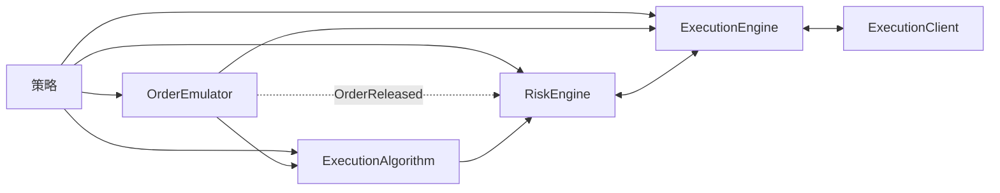

# 执行

VibeTrader 跨多个策略和交易场所协调订单提交、风险检查、交易场所执行、对账和持仓更新。本页介绍支持执行的组件和消息流。

与执行相关的主要组件包括：

- `Strategy`
- `ExecutionAlgorithm`
- `OrderEmulator`
- `RiskEngine`
- `ExecutionEngine`
- `ExecutionClient`

## 执行流程

`Strategy` 在数据 Actor 能力的基础上，增加了管理订单和执行的方法：

- `submit_order(...)`
- `submit_order_list(...)`
- `modify_order(...)`
- `cancel_order(...)`
- `cancel_orders(...)`
- `cancel_all_orders(...)`
- `close_position(...)`
- `close_all_positions(...)`
- `query_account(...)`
- `query_order(...)`

这些方法通过消息总线发送点对点执行命令。创建订单时还会发布 `OrderInitialized` 等事件。

不同命令采用不同路由：

- 对于模拟订单，`submit_order(...)` 路由到 `OrderEmulator`；设置 `exec_algorithm_id` 时路由到 `ExecutionAlgorithm`；否则路由到 `RiskEngine`。
- `submit_order_list(...)` 根据模拟设置和 `exec_algorithm_id` 采用相同的分支逻辑。
- 对于模拟订单，`modify_order(...)` 路由到 `OrderEmulator`；否则路由到 `RiskEngine`。
- 取消和查询命令可以根据具体命令和订单状态，直接路由到 `OrderEmulator`、`ExecutionAlgorithm` 或 `ExecutionEngine`。

新订单通常进入以下路径之一：

`Strategy` -> `OrderEmulator` 或 `ExecutionAlgorithm` 或 `RiskEngine`

下游流程为：

`OrderEmulator` -> `ExecutionAlgorithm` 或 `ExecutionEngine`

`ExecutionAlgorithm` -> `RiskEngine` -> `ExecutionEngine` -> `ExecutionClient`



执行路径会先根据模拟设置和算法路由产生分支，然后再到达执行引擎和客户端。

## 命令结果

执行命令根据当前可用的证据确定结果：

| 证据           | 含义                                   | 结果                                                     |
| -------------- | -------------------------------------- | -------------------------------------------------------- |
| 确定的本地失败 | 验证证明命令并未发送。                 | 如果失败可以归因于该命令，则拒绝提交，或拒绝修改、取消。 |
| 确定结果       | 撮合引擎或交易场所明确确认结果。       | 应用相应的已接受、已更新、已取消或已拒绝事件。           |
| 未知实盘结果   | 命令可能已经到达交易场所，但结果未知。 | 让命令保持传输中状态，不虚构拒绝结果。                   |

失败事件取决于命令类型，以及失败何时得到确证：

| 命令                     | 事件                  | 含义                                               |
| ------------------------ | --------------------- | -------------------------------------------------- |
| 提交或提交订单列表       | `OrderDenied`         | 本地检查阻止提交；不会发出 `OrderSubmitted` 事件。 |
| 提交或提交订单列表       | `OrderRejected`       | 提交已进入执行流程，之后被证明确实失败。           |
| 修改                     | `OrderModifyRejected` | 请求的修改被证明确实失败。                         |
| 取消、全部取消或批量取消 | `OrderCancelRejected` | 请求的取消被证明确实失败。                         |

对于修改或取消命令的准备阶段，只有当失败可以归因于该命令，并且能证明命令未发送时，Vibe 才会发出对应的拒绝事件。否则只记录失败，不虚构命令结果。

成功的批量响应仍可能包含确定的单个订单失败。如果整个请求失败，但没有单个订单层面的证据，就不能证明每个子命令都失败了。

:::note[未知实盘结果]
传输错误、超时、断开连接、任务取消、适配器请求重试耗尽、缺少确认，以及传输后的解析失败，通常都会使交易场所结果处于未知状态。只有当交易场所特定语义能够证明命令未被接受时，HTTP 状态码和速率限制才构成确定结果。

在流更新、轮询、查询或对账确定交易场所状态期间，实盘引擎最初会让未知结果保持传输中状态。达到配置的重试上限后，后续传输中检查可以应用终结对账事件。
:::

**传输中订单**是指正在等待结果确定的订单：

- `SUBMITTED`：初始提交正在等待接受或拒绝。
- `PENDING_UPDATE`：修改正在等待确认。
- `PENDING_CANCEL`：取消正在等待确认。

有关实盘对账如何监控和解析这些状态，请参阅[运行时检查](reconciliation.md#runtime-checks)。

## 订单拒绝原因

本地拒绝（`OrderDenied`）会携带标准化的 `CATEGORY_CONDITION` 原因码，后跟 `key=value` 上下文，例如 `QUANTITY_EXCEEDS_MAXIMUM: effective_quantity=15, max_quantity=10`。
下表涵盖执行算法、执行客户端、风险引擎和执行引擎发出的本地拒绝。这些原因码是本地拒绝订单的事实来源；交易场所拒绝（`OrderRejected`）会原样传递交易场所自己的文本。

<!-- Generated from the `OrderDeniedReason` enum (crates/model). Regenerate with: cargo test -p vibe-model regenerate_order_denied_reasons_doc -- --ignored -->
<!-- BEGIN GENERATED: order-denied-reasons -->

| 代码                                  | 描述                                     |
| ------------------------------------- | ---------------------------------------- |
| `CLIENT_VENUE_MISMATCH`               | 执行客户端不处理该订单所属的交易场所。   |
| `CUM_MARGIN_EXCEEDS_FREE_BALANCE`     | 累计初始保证金超过账户可用余额。         |
| `CUM_NOTIONAL_EXCEEDS_FREE_BALANCE`   | 累计订单名义价值超过账户可用余额。       |
| `EXPIRE_TIME_IN_PAST`                 | 订单到期时间已过去。                     |
| `INSTRUMENT_NOT_FOUND`                | 缓存中未找到该金融工具。                 |
| `INVALID_CLIENT_ORDER_ID`             | 客户端订单 ID 对该交易场所无效。         |
| `INVALID_MAX_NOTIONAL_PER_ORDER`      | 配置的单笔订单最大名义价值无效。         |
| `INVALID_ORDER_SIDE`                  | 订单方向对此操作无效。                   |
| `INVALID_POSITION_ID`                 | 提供的持仓 ID 对订单提交无效。           |
| `MARGIN_EXCEEDS_FREE_BALANCE`         | 订单初始保证金超过账户可用余额。         |
| `MISSING_EXPIRE_TIME`                 | GTD 订单缺少到期时间。                   |
| `MISSING_TRAILING_OFFSET`             | 订单缺少必需的追踪偏移量。               |
| `MISSING_TRAILING_OFFSET_TYPE`        | 订单缺少必需的追踪偏移量类型。           |
| `MISSING_TRIGGER_TYPE`                | 订单缺少必需的触发类型。                 |
| `NOTIONAL_BELOW_MINIMUM`              | 订单名义价值低于金融工具的最小值。       |
| `NOTIONAL_EXCEEDS_FREE_BALANCE`       | 订单名义价值超过账户可用余额。           |
| `NOTIONAL_EXCEEDS_MAXIMUM`            | 订单名义价值超过金融工具的最大值。       |
| `NOTIONAL_EXCEEDS_MAX_PER_ORDER`      | 订单名义价值超过配置的单笔订单最大值。   |
| `NO_EXECUTION_CLIENT`                 | 未找到用于处理该路由命令的执行客户端。   |
| `ORDER_LIST_DENIED`                   | 订单列表未通过风险检查，因此订单被拒绝。 |
| `ORDER_LIST_INCOMPLETE`               | 缓存中的订单列表缺少订单。               |
| `POSITION_NOT_FOUND`                  | 未找到只减仓订单所对应的持仓。           |
| `QUANTITY_BELOW_MINIMUM`              | 订单有效数量低于金融工具的最小值。       |
| `QUANTITY_CONVERSION_FAILED`          | 无法为风险检查转换订单数量。             |
| `QUANTITY_EXCEEDS_MAXIMUM`            | 订单有效数量超过金融工具的最大值。       |
| `RATE_LIMIT_EXCEEDED`                 | 已超过订单提交速率限制。                 |
| `REDUCE_ONLY_WOULD_INCREASE_POSITION` | 只减仓订单会增加持仓。                   |
| `STREAM_RECONCILING`                  | 正在进行重连后的流对账；请在完成后重试。 |
| `SUBMIT_FAILED`                       | 向执行客户端提交订单失败。               |
| `TRADING_HALTED`                      | 交易已停止；新订单会被拒绝。             |
| `TRADING_STATE_REDUCING`              | 交易处于减仓状态；该订单会增加风险敞口。 |
| `TRAILING_STOP_CALC_FAILED`           | 无法计算追踪止损触发价格。               |
| `UNSUPPORTED_ORDER_LIST`              | 交易场所不支持请求的订单列表。           |
| `UNSUPPORTED_ORDER_TYPE`              | 不支持该订单类型。                       |
| `UNSUPPORTED_TIME_IN_FORCE`           | 不支持该订单的有效期类型。               |
| `UNSUPPORTED_TP_SL`                   | 交易场所不支持请求的止盈/止损参数。      |
| `UNSUPPORTED_TRAILING_OFFSET_TYPE`    | 不支持该订单的追踪偏移量类型。           |
| `VALIDATION_FAILED`                   | 订单在提交前未通过验证。                 |

<!-- END GENERATED: order-denied-reasons -->

## 订单管理系统（OMS）

订单管理系统（OMS）类型决定某一金融工具的订单如何映射到持仓。策略和交易场所无论处于模拟还是实盘环境，都各自使用 `OmsType` 枚举定义的 OMS 类型。

`OmsType` 枚举有三个变体：

- `UNSPECIFIED`：策略使用交易场所的 OMS 类型。
- `NETTING`：每个金融工具和策略的持仓合并为一个持仓。
- `HEDGING`：每个金融工具和策略可以有多个未平仓持仓。

当策略和交易场所的 OMS 类型不同时，`ExecutionEngine` 会在 `OrderFilled` 事件中分配或覆盖 `position_id` 值。虚拟持仓存在于 VibeTrader 中，但在交易场所并不是独立持仓。

| 策略 OMS  | 交易场所 OMS | 结果                                       |
| --------- | ------------ | ------------------------------------------ |
| `NETTING` | `NETTING`    | 每个金融工具和策略对应一个持仓。           |
| `HEDGING` | `HEDGING`    | 每个金融工具和策略可以有多个持仓。         |
| `NETTING` | `HEDGING`    | 跨交易场所持仓维护一个虚拟持仓。           |
| `HEDGING` | `NETTING`    | 针对交易场所的单一净持仓维护多个虚拟持仓。 |

### OMS 配置

如果策略省略 `oms_type` 或使用 `UNSPECIFIED`，`ExecutionEngine` 会遵循交易场所的 OMS 类型，不覆盖交易场所的 `position_id` 值。配置回测交易场所时，应使用被模拟交易场所所采用的 OMS 类型。

交易场所的持仓模式可能需要适配器特定配置。例如，请参阅
[Binance 期货对冲模式](../integrations/binance.md#futures-hedge-mode)。

### 自定义持仓 ID 与 NETTING

自定义持仓 ID 仅在 `HEDGING` OMS 下有效。`NETTING` 下，每个金融工具和策略只有一个持仓，其确定性 ID 的格式为 `{instrument_id}-{strategy_id}`。

`ExecutionEngine` 会在提交时强制执行此规则。如果有效 OMS 解析为 `NETTING`，并且调用 `submit_order`（或 `submit_order_list`）时传入了不匹配 `{instrument_id}-{strategy_id}` 的 `position_id`，系统会发出解释不匹配原因的 `OrderDenied` 事件并拒绝订单。

此规则仍允许常见的平仓写法：`Strategy.close_position(position)` 会转发 `position.id`；在 `NETTING` 下，它正是确定性 ID，因此会被接受。若要使用任意 ID 标记或划分持仓，请为策略配置 `oms_type=HEDGING`。

对于 `submit_order_list`，如果提供了 `position_id`，引擎还会拒绝任何混合金融工具的订单列表，无论 OMS 类型为何。一个持仓只属于一个金融工具，因此该组合会被拒绝，并提供明确的 `OrderDenied` 原因。有关混合金融工具的更多注意事项，请参阅[订单列表](orders/advanced.md#order-lists)。

### 跨 NETTING 周期的持仓重放

在 `NETTING` 下，引擎会在平仓和重新开仓的周期中复用同一持仓 ID，因此持仓的重放日志可能累积曾应用到该 ID 的所有成交。`ExecutionEngineConfig.carry_replay_events_on_reopen` 选项控制该日志在重新开仓后是否保留：

| `carry_replay_events_on_reopen` | 行为                                         |
| ------------------------------- | -------------------------------------------- |
| `False`（默认）                 | 只保留当前周期状态，限制每次成交的处理成本。 |
| `True`                          | 仍可更正早期成交，但持仓状态可能持续增长。   |

实盘交易会将该选项固定为 `True`：`LiveExecEngineConfig` 始终保留重放日志，因此引用更早周期的交易场所 [`OrderFillVoided`](events/order_fill_voided.md) 仍可解析。模拟交易场所不会发出成交作废事件，所以回测采用有界的默认设置。对于能够更正先前周期成交的自定义或外部执行客户端，请显式启用该选项；如果不保留日志，引擎就找不到匹配的持仓片段，并会拒绝更正。

已实现盈亏快照会随更正调整。如果成交作废影响到较早周期，系统会跨周期边界重建持仓，使已归档快照所描述的边界随之移动；因此，引擎会将这些快照归入更正后历史本身的已关闭周期，并确保每个周期的已实现盈亏只计算一次。仅影响当前周期的作废不会改变归档。请参阅[持仓快照](positions.md#position-snapshotting)。

## 风险引擎

`RiskEngine` 是每个 Vibe 系统的组成部分，包括回测、沙盒和实盘环境。它位于提交和修改路径中，也会接收来自 `OrderEmulator` 的 `OrderReleased` 等订单事件。取消和查询命令直接路由到其他执行组件，不经过 `RiskEngine`。

除非在 `RiskEngineConfig` 中绕过，否则引擎会验证：

- 金融工具的价格精度和触发价格精度。
- 价格为正数，除非该金融工具允许负价格（期权、期货价差、期权价差和现货大宗商品）。
- 数量精度，以及基础数量的最小值和最大值限制。
- GTD 订单尚未过期。
- `reduce_only` 订单不会增加所引用的持仓。
- 引擎级 `max_notional_per_order` 限制和金融工具 `max_notional` 限制。
- 非保证金账户中的现金余额影响。
- 提交和修改的速率限制。
- 交易状态限制（`ACTIVE`、`HALTED`、`REDUCING`）。

如果提交时的风险检查失败，系统会生成带有标准化[原因码](#订单拒绝原因)的 `OrderDenied` 事件。如果修改时的风险检查失败，则生成 `OrderModifyRejected` 事件。

### 交易状态

`TradingState` 枚举有三个变体：

- `ACTIVE`：提交和修改命令正常执行。
- `HALTED`：拒绝新的提交和修改命令。取消命令仍会继续传递。
- `REDUCING`：允许取消，并且只接受不会增加风险敞口的提交或修改命令。

有关配置详情，请参阅
[`RiskEngineConfig` API 参考](/docs/python-api-latest/config.html#vibe_trader.risk.RiskEngineConfig)。

## 执行算法

`ExecutionAlgorithm` 接收由 `exec_algorithm_id` 选中的主订单，并可将其拆分为更小的派生订单。VibeTrader 支持自定义算法，并包含一个原生 Rust TWAP 实现。

### TWAP（时间加权平均价格）

TWAP 将主订单分散到固定时间间隔中，减少一次性提交全部数量造成的市场冲击。要向已初始化的 `BacktestEngine` 注册原生算法：

```python
from vibe_trader.model import ExecAlgorithmId
from vibe_trader.config import ExecutionAlgorithmConfig

engine.add_native_exec_algorithm(
    "TwapAlgorithm",
    ExecutionAlgorithmConfig(exec_algorithm_id=ExecAlgorithmId("TWAP")),
)
```

路由到 TWAP 的订单必须包含以下字符串值的 `exec_algorithm_params`：

| 键              | 含义                                   |
| --------------- | -------------------------------------- |
| `horizon_secs`  | 与时间间隔共同用于确定切片的时间范围。 |
| `interval_secs` | 切片之间的时间间隔。                   |

两个值都必须能解析为正数，并且 `horizon_secs` 必须至少等于 `interval_secs`。算法会立即提交第一个切片，之后按配置的时间间隔提交其余切片。如果订单类型、金融工具或调度不受支持或无效，TWAP 会在提交前拒绝主订单。

### 编写执行算法

要定义 Python 执行算法，请创建 `ExecutionAlgorithm` 的子类并实现 `on_order(...)`：

```python
from vibe_trader.model import ExecAlgorithmId
from vibe_trader.trading import ExecutionAlgorithm
from vibe_trader.config import ExecutionAlgorithmConfig


class MyExecutionAlgorithm(ExecutionAlgorithm):
    def __init__(self) -> None:
        super().__init__(
            ExecutionAlgorithmConfig(exec_algorithm_id=ExecAlgorithmId("MY-ALGO")),
        )

    def on_order(self, order) -> None: ...
```

Python 执行算法可以访问缓存和投资组合，使用时钟设置定时器和信号，并可调用生成订单的方法。

注册后，消息总线会把订单路由到 `ExecAlgorithmId` 与订单 `exec_algorithm_id` 匹配的算法。可选字段 `exec_algorithm_params` 的类型为 `Mapping[str, str]`。覆写 `on_order_list(...)` 可以把列表作为整体处理；默认实现会把每个订单传给 `on_order(...)`。

:::warning
执行订单前，应验证必需的 `exec_algorithm_params` 键并解析其字符串值。无法执行订单时，请使用标准化[原因码](#订单拒绝原因)调用 `deny_order(...)`，例如 `VALIDATION_FAILED: horizon_secs not found in exec_algorithm_params`。
:::

执行算法接收的订单是主订单。使用以下方法创建派生订单：

- `spawn_market(...)`：创建 `MARKET` 订单。
- `spawn_market_to_limit(...)`：创建 `MARKET_TO_LIMIT` 订单。
- `spawn_limit(...)`：创建 `LIMIT` 订单。

每个方法都以主订单作为第一个参数。默认情况下，方法会从主订单数量中减去派生订单的 `quantity`。传入 `reduce_primary=False` 可保持主订单数量不变。

:::warning
当 `reduce_primary=True` 时，派生订单数量不得超过主订单的 `leaves_qty`（剩余未成交数量）。
:::

如果派生订单在被接受前遭到拒绝，从主订单中扣除的数量会自动恢复。一旦交易场所接受该订单，数量扣减即视为最终确定。

执行算法可以继续生成订单，也可以提交主订单的剩余数量，或同时执行这两项操作。内置 TWAP 算法会在最后一个时间间隔提交主订单的剩余数量。

### 派生订单

每个派生订单都会将 `exec_spawn_id` 设为主订单的 `client_order_id`。派生订单自己的 `client_order_id` 遵循以下格式：

```text
{exec_spawn_id}-E{spawn_sequence}
```

例如，从 `O-20230404-001-000` 生成的第一个订单，其 ID 为 `O-20230404-001-000-E1`。

:::note
"主订单"和"派生订单"这组术语用于区分执行切片与条件订单的父子关系。
:::

### 管理执行算法订单

`Cache` 提供两个主要查询：

- `orders_for_exec_algorithm(...)`：返回某个算法的订单，并可按交易场所、金融工具、策略、账户和方向筛选。
- `orders_for_exec_spawn(...)`：返回某个主 `ClientOrderId` 对应的主订单及其派生订单。

## 自有订单簿

启用 `manage_own_order_books` 后，`ExecutionEngine` 会为每个金融工具维护自有工作订单的逐笔委托（MBO/L3）视图。策略可以从公开订单簿中减去这些订单，以估算净可用流动性。有关生命周期、查询、筛选和审计，请参阅[自有订单簿](order_book.md#own-order-book)。

### 安全的取消查询

查询自有订单簿中的候选取消订单时，应在 `status` 过滤器中排除 `PENDING_CANCEL`。

:::warning
包含 `PENDING_CANCEL` 可能会发出重复的取消请求，并反复选中已经等待确认的订单。
:::

## 超额成交

当订单的累计成交数量超过其原始数量时，就会发生超额成交。例如，一笔数量为 100 的订单累计成交 110 个单位，便超额成交了 10 个单位。

### 超额成交的成因

当报告数量超过订单数量时，引擎会观察到超额成交。这可能是真实的交易场所结果，也可能是使用不同成交 ID 重复传递了同一成交，或交易场所报告不一致。仅凭数量无法判断原因。

实盘成交可能通过两个渠道到达：

- 通过 WebSocket 到达的实时成交事件。
- 定期对交易场所的成交历史和持仓状态进行轮询对账。

稳定的 `trade_id` 值让引擎能够对两个渠道中的同一成交进行去重。如果同一逻辑成交以不同 ID 到达，引擎会把这些报告视为不同成交。有关配置详情，请参阅[持续对账](../how_to/configure_live_trading.md#continuous-reconciliation)。

### 系统行为

应用每个成交事件前，`ExecutionEngine` 会将订单当前的 `filled_qty` 与传入的 `last_qty` 相加，并与原始 `quantity` 比较，以检查是否可能出现超额成交。

配置选项 `allow_overfills`（默认值：`False`）控制超额成交的处理方式：

| `allow_overfills` | 行为                                                       |
| ----------------- | ---------------------------------------------------------- |
| `False`           | 记录并拒绝该成交，保留订单的当前状态。                     |
| `True`            | 记录警告、应用该成交，并在 `overfill_qty` 中跟踪超出数量。 |

允许超额成交时，订单的 `overfill_qty` 字段会跟踪超出数量。
订单会转换到 `FILLED` 状态，并将 `leaves_qty` 限制为零。

### 重复成交检测

`Order` 模型确保每个 `trade_id` 只应用一次成交。同一 ID 已存在于订单中时，`Order.apply()` 会返回错误。

#### 核心引擎路径

应用成交前，`ExecutionEngine` 会调用 `Order.is_duplicate_fill()`，比较以下字段：

- `trade_id`
- `order_side`
- `last_px`
- `last_qty`

完全匹配时会记录警告并跳过。如果 `trade_id` 相同但其他字段不同，四字段检查不会将成交判定为完全重复。随后 `Order.apply()` 会拒绝复用的 ID，引擎则记录并丢弃该成交。

#### 对账路径

对账路径会在生成 `OrderFilled` 事件前检查 `trade_id`。如果订单中已经存在该 ID，就会丢弃报告，无论其价格或数量如何。

合成和推断出的对账成交使用确定性 ID。因此，重启后重放相同输入会生成相同的 `trade_id`，并被去重。

### 配置

对于实盘交易，可在 `LiveExecEngineConfig` 中启用超额成交容忍：

```python
from vibe_trader.config import LiveExecEngineConfig

config = LiveExecEngineConfig(
    allow_overfills=True,
)
```

:::warning
应根据交易场所的执行契约选择此设置。默认值 `False` 可以保护本地状态，但在交易场所确实发生超额成交后，可能留下状态差异。`True` 会应用超出数量，但不能替代重复成交检测。请使用[执行对账](reconciliation.md)检测差异。
:::

## 成交更正

有些交易场所之后可能减少成交数量或使成交失效。Vibe 会将其记录为 [`OrderFillVoided`](events/order_fill_voided.md) 事件，而绝不会记录为相反方向的成交。该事件标识原始成交，并携带累计作废数量和费用更正。

执行引擎会重建受影响的订单和持仓，刷新投资组合中的持仓及盈亏缓存，然后再向策略和执行算法发布更正。支持成交更正的适配器会在成交作废后请求一次权威账户刷新。

对于重新打开订单的更正，或仍让订单可执行的部分更正，适配器必须先发布被引用的成交。如果本地没有该成交，未重新打开订单的更正会让整个订单进入终态，即使 `voided_qty` 小于订单数量也是如此。之后的工作状态报告不会重新打开 `VOIDED`。请参阅完整的 [`OrderFillVoided` 契约](events/order_fill_voided.md#contract)。

### 成交作废的成因

作废是交易场所针对其已经报告的成交采取的操作。此类原因在不同资产类别中反复出现：

- 错误执行审查：交易场所使明显偏离执行时市场状况，或由交易所系统故障造成的成交记录失效。
- 结算失败：已撮合交易未能结算，因此该成交不会产生经济效力。
- 事件失效：标的事件被取消或参赛者退出，因此已撮合持仓不再具有风险敞口。
- 交易后重述：交易场所在清算过程中重述交易的数量或费用。

该事件不会重述成交价格，因此交易场所的价格调整无法用单个更正事件表示。

不同交易场所会通过不同方式把交易撤销通知客户端。FIX 交易场所通过 [`ExecType <150>`](https://www.onixs.biz/fix-dictionary/5.0.sp2/tagnum_150.html) 的值 `H`（取消成交）和 `G`（更正成交）发出信号。通过带外方式通知的交易场所，则由[执行对账](reconciliation.md)发现交易撤销。

### 交易场所参考资料

每个交易场所都会公布其采取操作的条件：

| 交易场所      | 机制                                   | 参考资料                                                                                                                                      |
| ------------- | -------------------------------------- | --------------------------------------------------------------------------------------------------------------------------------------------- |
| Nasdaq        | 明显错误交易（规则 11890）。           | [明显错误交易政策](https://www.nasdaqtrader.com/Trader.aspx?id=ClearlyErroneous)。                                                            |
| NYSE          | 明显错误执行（规则 7.10）。            | [明显错误执行审查](https://www.nyse.com/trade/cee)。                                                                                          |
| Cboe 美国股票 | 明显错误执行（BZX 规则 11.17）。       | [明显错误执行表单](https://www.cboe.com/us/equities/trading/cee_form/)。                                                                      |
| CME Group     | 取消成交和价格调整（规则 588）。       | [CME 规则手册第 5 章](https://www.cmegroup.com/rulebook/CME/I/5/5.pdf)。                                                                      |
| Betfair       | 作废投注，以累计作废数量（`sv`）报告。 | [Stream API 中的作废投注](https://support.developer.betfair.com/hc/en-us/articles/360000391492-How-are-void-bets-treated-by-the-Stream-API)。 |
| Polymarket    | 链上回滚或重组后的 `FAILED` 交易状态。 | [用户频道](https://docs.polymarket.com/developers/CLOB/websocket/user-channel)。                                                              |

当交易场所在适配器所消费的数据流中发布作废信息时，Vibe 适配器会发出 `OrderFillVoided`：对于 [Betfair](../integrations/betfair.md#voided-fills)，该信息来自订单变更消息的 `sv` 字段；对于 [Polymarket](../integrations/polymarket.md#trades)，该信息来自用户频道的交易状态。

## 对账报告

执行引擎使用来自实盘适配器的四种对账报告变体。当匹配订单不在缓存中时，每种变体承担不同作用。

| 变体                   | 用途               | 订单缺失时的操作                     |
| ---------------------- | ------------------ | ------------------------------------ |
| `OrderStatusReport`    | 更新订单状态。     | 创建订单并推断报告中的成交。         |
| `FillReport`           | 独立成交。         | 创建市价订单，再应用成交元数据。     |
| `OrderWithFills`       | 订单状态及成交。   | 创建订单、应用成交，并推断剩余部分。 |
| `PositionStatusReport` | 交易场所持仓快照。 | 记录报告；持仓仍由成交派生。         |

### 各变体的适用情形

适配器根据交易场所事件选择相应的变体：

- 当成交详情通过单独的数据流到达时，使用 `OrderStatusReport` 处理订单生命周期更新。
- 对于由交易场所发起、包含成交但没有用户级订单的平仓，使用 `FillReport`。Hyperliquid 强平采用此模式。
- 当一个交易场所事件同时包含订单状态及其成交时，使用 `OrderWithFills`。Binance Futures 对交易所生成的 ADL、强平和结算订单采用此方式。

### 创建外部订单

当报告引用的订单不在缓存中时，引擎会创建一个*外部订单*。这涵盖交易场所发起的 ADL、强平或结算、其他进程下单，以及本地尚未观察到的订单。引擎会将所有权分配给：

- 通过 `register_external_order_claims` 声明该金融工具的策略。
- 作为默认回退的 `EXTERNAL` 策略。

如果报告包含 `client_order_id`，外部订单就使用该值；否则根据 `venue_order_id` 派生。引擎会把订单加入缓存，注册其交易场所订单 ID，并发出适用的 `OrderAccepted`、`OrderFilled`、`OrderCanceled` 或 `OrderExpired` 事件。之后，持仓通过正常事件管道更新。

## 相关指南

- [事件](events/)：订单和持仓事件类型及分派。
- [执行对账](reconciliation.md)：实盘状态恢复和运行时一致性检查。
- [订单簿](order_book.md)：公开和自有订单簿的行为。
- [订单](orders/)：订单类型和管理。
- [持仓](positions.md)：根据执行跟踪持仓。
- [策略](strategies.md)：从策略提交订单。
