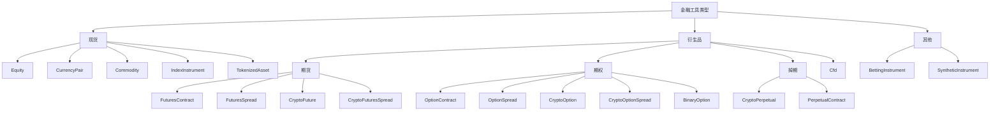

# 金融工具

金融工具表示可交易资产、合约或本地合成市场的规格。市场数据、订单、持仓、会计、投资组合计算和适配器符号体系
都引用 `InstrumentId` 及其金融工具定义。

VibeTrader 向 Rust 和 Python 用户公开相同的金融工具模型。Rust 示例使用 `vibe_model`；Python 示例使用 `vibe_trader.model.instruments`。

## 金融工具类型

| 金融工具类型                                      | 类别         | 说明                                          | 典型适配器                      |
| ------------------------------------------------- | ------------ | --------------------------------------------- | ------------------------------- |
| [`Equity`](equity.md)                             | 现货         | 在现金市场交易的上市股票或 ETF。              | Databento, Interactive Brokers. |
| [`CurrencyPair`](currency_pair.md)                | 现货         | 采用基础/计价形式的法币外汇或加密货币现货对。 | Binance, Kraken, OKX, Tardis.   |
| [`Commodity`](commodity.md)                       | 现货         | 黄金或石油等现货大宗商品。                    | Interactive Brokers.            |
| [`Cfd`](cfd.md)                                   | 差价合约     | 跟踪标的的差价合约。                          | Interactive Brokers.            |
| [`IndexInstrument`](index_instrument.md)          | 现货参考     | 不可直接交易的参考指数。                      | Interactive Brokers.            |
| [`TokenizedAsset`](tokenized_asset.md)            | 代币化现货   | 加密货币交易场所中的代币化资产。              | Kraken.                         |
| [`FuturesContract`](futures_contract.md)          | 期货         | 可交割期货合约。                              | Databento, Interactive Brokers. |
| [`FuturesSpread`](futures_spread.md)              | 期货价差     | 交易所定义的多腿期货策略。                    | Databento, Interactive Brokers. |
| [`CryptoFuture`](crypto_future.md)                | 加密货币期货 | 有到期日的加密货币期货合约。                  | BitMEX, Bybit, Deribit, OKX.    |
| [`CryptoFuturesSpread`](crypto_futures_spread.md) | 加密货币价差 | 交易所定义的加密货币期货价差。                | Deribit, OKX.                   |
| [`CryptoPerpetual`](crypto_perpetual.md)          | 掉期         | 加密货币永续期货合约。                        | Binance, BitMEX, Bybit, dYdX.   |
| [`PerpetualContract`](perpetual_contract.md)      | 通用掉期     | 跨资产类别的永续期货合约。                    | Architect AX, Binance.          |
| [`OptionContract`](option_contract.md)            | 期权         | 交易所交易的看跌或看涨期权。                  | Databento, Interactive Brokers. |
| [`OptionSpread`](option_spread.md)                | 期权价差     | 交易所定义的多腿期权策略。                    | Databento, Interactive Brokers. |
| [`CryptoOption`](crypto_option.md)                | 加密货币期权 | 以加密资产为标的的期权。                      | Bybit, Deribit, OKX, Tardis.    |
| [`CryptoOptionSpread`](crypto_option_spread.md)   | 加密货币价差 | 交易所定义的加密货币期权价差。                | Deribit, OKX.                   |
| [`BinaryOption`](binary_option.md)                | 二元结果     | 结算为 0 或 1 的二元金融工具。                | Hyperliquid, OKX, Polymarket.   |
| [`BettingInstrument`](betting_instrument.md)      | 投注市场     | 体育或博彩市场选项。                          | Betfair.                        |
| [`SyntheticInstrument`](synthetic_instrument.md)  | 本地合成     | 公式派生的本地金融工具。                      | 仅限本地。                      |

## 分类体系

VibeTrader 根据金融工具所表示的市场结构对其分组：



## 通用字段

大多数具体金融工具共享相同的核心结构。各类型页面列出该类型完整的构造函数和结构体字段。

| 字段              | 含义                                         |
| ----------------- | -------------------------------------------- |
| `id`              | 由符号和交易场所组成的 Vibe `InstrumentId`。 |
| `raw_symbol`      | Vibe 规范化之前的交易场所原生符号。          |
| `price_precision` | 价格允许的小数位数。                         |
| `size_precision`  | 数量允许的小数位数。                         |
| `price_increment` | 最小有效价格步长。                           |
| `size_increment`  | 最小有效数量步长。                           |
| `multiplier`      | 名义价值和损益计算中使用的合约乘数。         |
| `lot_size`        | 交易场所发布时采用的取整手数或整批大小。     |
| `margin_init`     | 以名义价值小数比例表示的初始保证金率。       |
| `margin_maint`    | 以名义价值小数比例表示的维持保证金率。       |
| `maker_fee`       | 挂单方费率。负值表示返佣。                   |
| `taker_fee`       | 吃单方费率。负值表示返佣。                   |
| `max_quantity`    | 已知时的最大订单数量。                       |
| `min_quantity`    | 已知时的最小订单数量。                       |
| `max_notional`    | 已知时的最大订单名义价值。                   |
| `min_notional`    | 已知时的最小订单名义价值。                   |
| `max_price`       | 已知时的最大有效报价或订单价格。             |
| `min_price`       | 已知时的最小有效报价或订单价格。             |
| `info`            | 从交易场所或数据源保留的适配器元数据。       |
| `ts_event`        | 定义事件发生时的 UNIX 纳秒时间戳。           |
| `ts_init`         | Vibe 初始化对象时的 UNIX 纳秒时间戳。        |
| `tick_scheme`     | 该类型支持时使用的已注册可变 tick 方案名称。 |

## 符号体系

每个金融工具都有由原生符号和交易场所组成、以句点分隔的唯一 `InstrumentId`。例如，Binance Futures 对以太坊永续合约的表示为：

```text
ETHUSDT-PERP.BINANCE
```

原生符号在一个交易场所中应当唯一，但并非每个交易所都保证这一点。`{symbol}.{venue}` 对在 Vibe 系统内部必须唯一。

:::warning
金融工具定义必须与市场数据和交易场所的订单语义一致。错误的金融工具可能截断价格或数量、使用错误货币计算名义价值，
或使回测接受实盘交易场所会拒绝的价格。
:::

## Rust 与 Python 接口

Rust 用户使用 `vibe_model` 金融工具结构体和 `InstrumentAny`：

```rust
use vibe_model::instruments::{CurrencyPair, InstrumentAny};
```

Python 用户通常使用 `vibe_trader.model` 中的金融工具类：

```python
from vibe_trader.model import CurrencyPair
```

两个接口表示同一个金融工具合约：身份、精度、增量、货币、限制、保证金、费用、元数据和时间戳。

## 加载金融工具

可以通过 `TestInstrumentProvider` 实例化通用测试金融工具：

```python
from vibe_trader.test_kit.providers import TestInstrumentProvider

audusd = TestInstrumentProvider.default_fx_ccy("AUD/USD")
```

实盘集成适配器公开缓存金融工具定义的 `InstrumentProvider` 对象。在集成支持时使用 `InstrumentProviderConfig(load_all=True)`，
或使用 `load_ids` 加载已知金融工具集合。订阅和订单方法要求匹配的金融工具已存在于缓存中。

## 查找金融工具

策略和 actor 从中央缓存检索金融工具：

```rust tab="Rust"
use vibe_model::identifiers::InstrumentId;

let instrument_id = InstrumentId::from("ETHUSDT-PERP.BINANCE");
let instrument = cache.instrument(&instrument_id);
```

```python tab="Python"
from vibe_trader.model import InstrumentId

instrument_id = InstrumentId.from_str("ETHUSDT-PERP.BINANCE")
instrument = self.cache.instrument(instrument_id)
```

也可以订阅一个金融工具或某个交易场所的全部金融工具：

```python
self.subscribe_instrument(instrument_id)
self.subscribe_instruments(venue)
```

当 `DataEngine` 收到金融工具更新时，会将对象传给 `on_instrument()` 处理器。

## 精度

精度定义金融工具价格和数量的规范小数位数。VibeTrader 严格执行由此产生的价格和数量网格，
因为交易场所会验证相同约束，而回测不应以生产环境中不可能出现的价格或数量成交订单。

| 字段              | 约束对象                   | 示例              |
| ----------------- | -------------------------- | ----------------- |
| `price_precision` | 订单价格、触发价格、成交。 | `2` -> `50000.01` |
| `size_precision`  | 订单数量和成交数量。       | `5` -> `1.00001`  |

增量精度必须与声明的精度一致。例如，`price_precision=2` 应与 `price_increment=Price(0.01, 2)` 配对。

生成订单价格和数量时使用金融工具工厂方法：

```python
instrument = self.cache.instrument(instrument_id)

price = instrument.make_price(0.90500)
quantity = instrument.make_qty(150)
```

:::warning
`RiskEngine` 不会自动舍入数值。如果为仅支持 2 位小数的金融工具创建 5 位小数的 `Price`，订单将被拒绝。
使用 `instrument.make_price()` 和 `instrument.make_qty()` 显式舍入。
:::

## 限制、保证金和费用

交易场所和适配器定义可以包含可选限制：

- `max_quantity` 和 `min_quantity`。
- `max_notional` 和 `min_notional`。
- `max_price` 和 `min_price`。

`MarginAccount` 计算初始保证金和维持保证金时使用 `margin_init`、`margin_maint` 和吃单方费用。
Vibe 在适配器和回测中采用统一的费率约定：

- 正费率表示佣金。
- 负费率表示返佣。

有关更深入的会计行为，请参阅[会计](../accounting.md)。

## 元数据

`info` 字段以可序列化为 JSON 的字典形式保留原始或适配器特定元数据。
当交易场所发布不属于统一 Vibe 金融工具 API 的有用详情时使用它。

## 相关指南

- [数据](../data/) 介绍引用金融工具的市场数据类型。
- [订单](../orders/) 介绍引用金融工具的订单字段。
- [合成金融工具](../synthetics.md) 介绍本地公式派生金融工具。
- [Python API 参考](/docs/python-api-latest/model/instruments.html)列出 Python 构造函数和成员。
