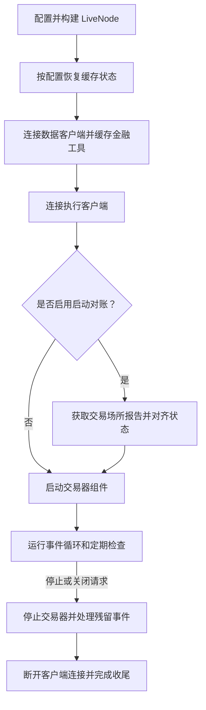

# 实盘交易

VibeTrader 无需修改代码即可把经过回测的策略部署到实时市场。
相同的 Actor、策略和执行算法既可以对接回测引擎，也可以对接实盘交易节点。

:::warning
**实盘交易会带来真实的财务风险。部署到生产环境前，请充分理解系统配置、节点运维、执行对账，
以及回测与实盘交易之间的差异。**
:::

## 实盘节点生命周期

Rust `LiveNode::run()` 会在启动交易组件前准备缓存与场所状态，随后接管事件循环和协同关闭流程。



实盘节点生命周期：策略开始交易前，系统会准备好交易工具和执行状态。

当连接了后备数据库且启用缓存加载时，系统会恢复缓存。连接、对账或交易组件启动失败时，
启动过程会中止并进入协同清理路径。

## 配置

有关配置 struct 如何处理默认值、`T` 与 `Option<T>` 语义及 builder 模式，请参阅
[配置](configuration.md)概念指南。

有关节点与执行引擎设置、策略配置、缓存后备存储和多场所接线，请参阅
[配置实盘交易节点](../how_to/configure_live_trading.md)操作指南。

## 执行对账

有关提交、修改和取消命令如何得出结果，请参阅[命令结果](execution.md#command-outcomes)。

启动时，对账会在交易组件开始运行前，使缓存中的订单和持仓状态与场所报告保持一致。
随后，节点运行期间的持续检查可以监控执行中的订单、未结订单、持仓和自有订单簿。

有关配置、恢复过程、运行时检查、场景和不变量，请参阅[执行对账](reconciliation.md)。

## Rust 实盘运行器指标

Rust `LiveNode` 通过 `LiveNodeHandle::metrics_snapshot()` 暴露基础运行器指标。
调用 `run()` 前从节点获取 handle，然后从另一个任务轮询快照，并根据差值计算速率或利用率。

```rust
use std::time::Duration;

use vibe_common::enums::Environment;
use vibe_live::node::{LiveNode, RunnerMetricsDelta};

let mut node = LiveNode::builder(trader_id, Environment::Live)?
    // Add clients, actors, and strategies here.
    .build()?;

let metrics_handle = node.handle();

tokio::spawn(async move {
    let mut prev = metrics_handle.metrics_snapshot();
    let mut interval = tokio::time::interval(Duration::from_secs(1));

    loop {
        interval.tick().await;

        let next = metrics_handle.metrics_snapshot();
        let delta = RunnerMetricsDelta::from_snapshots(prev, next);
        if delta.elapsed_ns == 0 {
            prev = next;
            continue;
        }

        let elapsed_s = delta.elapsed_ns as f64 / 1_000_000_000.0;
        let data_event_rate = delta.data_events as f64 / elapsed_s;
        let data_event_staleness_ns = if next.data_events.last_dispatch_at_ns == 0 {
            0
        } else {
            next.elapsed_ns
                .saturating_sub(next.data_events.last_dispatch_at_ns)
        };

        log::info!(
            "Runner metrics: data_event_rate={data_event_rate:.0} \
             data_event_staleness_ns={data_event_staleness_ns} \
             dispatch_utilization={:.6} loop_utilization={:.6} \
             mean_dispatch_ns={} data_queue_depth={}",
            delta.dispatch_utilization(),
            delta.loop_utilization(),
            delta.mean_dispatch_ns(),
            next.data_events.queue_depth,
        );

        prev = next;
    }
});

node.run().await?;
```

该快照覆盖启动完成后 `LiveNode::run` 中的通道分派，包括关闭宽限期内的残余分派。
`dispatch_busy_ns` 覆盖五个分派分支；`maintenance_busy_ns` 和 `external_msgbus_busy_ns` 覆盖
非分派循环工作。快照不包含启动缓冲、启动 flush 或循环结束后的最终 drain。队列深度是在节点运行期间
由维护 tick 采集的时点样本，在关闭宽限期内可能已经过时。快照无锁，因此跨字段视图可能不一致；
应根据连续快照并使用饱和差值推导速率。`LiveNode::run` 进入稳态时，计数器会重置。

## 遇到错误时关闭

设置 `LiveNodeConfig.shutdown_on_error=True`，使 Rust error 日志请求关闭实盘节点。
kernel 启动后，Rust logger 会记录第一条 `log::error!`，包括来自其他线程的 error 日志；
实盘事件循环下一次检查关闭状态时，kernel 会发布 `ShutdownSystem` 命令。

关闭请求会沿用正常的实盘节点停止路径。节点会停止交易组件、等待停止后的延迟、断开客户端，
并停止引擎；它不会中止进程。

```python
from vibe_trader.config import LiveNodeConfig

config = LiveNodeConfig(shutdown_on_error=True)
```

被组件过滤器或日志绕过模式抑制的 error 日志仍会请求关闭。新的 kernel 运行开始时，触发器会被清除并
重新启用，因此进程无需重新初始化日志系统即可重启节点。逐引擎的 `graceful_shutdown_on_error` 选项
已被移除；应在节点/kernel 层配置遇错关闭。遇错关闭观察 Rust `log` record，不观察 Python
`logging.error(...)` 调用。

## 相关指南

- [执行对账](reconciliation.md)--状态恢复和运行时一致性检查。
- [配置实盘交易节点](../how_to/configure_live_trading.md)--节点与引擎配置。
- [使用 Rust 运行实盘交易](../how_to/run_rust_live_trading.md)--Rust 节点设置与场所连接。
- [适配器](adapters.md)--场所连接。
- [执行](execution.md)--命令结果与订单执行。
- [回测](backtesting/)--部署前测试策略。
