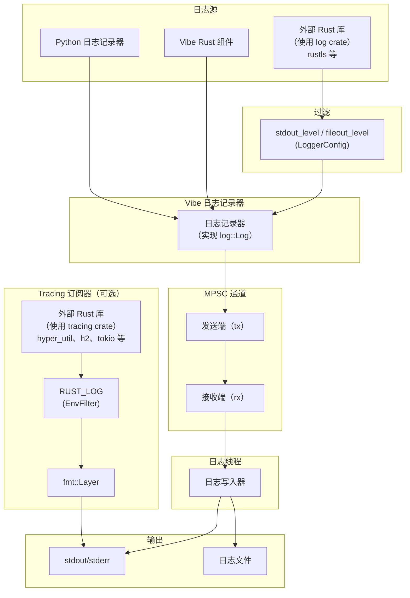

# 日志

平台通过一个使用 Rust 实现的高性能日志子系统，为回测和实盘交易提供日志功能，并使用 `log` crate 的标准化门面。

核心日志器运行在独立线程中，通过多生产者单消费者（MPSC）通道接收日志消息。该设计避免日志字符串格式化或文件 I/O 操作形成潜在瓶颈，使主线程保持高性能。

日志输出可以配置，并支持：

- 用于控制台输出的 **stdout/stderr 写入器**
- 用于持久存储日志的**文件写入器**

:::info
可以集成 [Vector](https://github.com/vectordotdev/vector) 等基础设施，在系统中收集和聚合事件。
:::

## 架构

日志子系统从多个来源捕获事件，通过 MPSC 通道将其路由到专用日志线程：



- **Python 和 Vibe 组件**：直接通过 Vibe Logger 记录日志。
- **外部 `log` crate 使用方**：按 `LoggerConfig` 中的 `stdout_level`/`fileout_level` 筛选。
- **外部 `tracing` crate 使用方**：启用后，输出直接写入 stdout（独立于 Vibe 日志），并由 `RUST_LOG` 环境变量筛选。
- **日志线程**：所有 Vibe 日志事件都经 MPSC 通道发送到专用线程，避免 I/O 操作阻塞主线程。

## 配置

导入 `LoggerConfig` 对象即可配置日志。默认情况下，`LogLevel` 为 'INFO' 或更高级别的日志事件会写入 stdout/stderr。

日志级别（`LogLevel`）采用标准日志级别约定，包含以下值。

支持的日志级别：

- `OFF` - 禁用日志。
- `TRACE` - 最详细；仅由 Rust 组件发出（Python 无法生成）。
- `DEBUG` - 详细诊断信息。
- `INFO` - 常规运行消息。
- `WARNING` - 不会阻止运行的潜在问题。
- `ERROR` - 可能影响功能的错误。

:::tip
可以把 `TRACE` 设为筛选级别，以捕获 Rust 组件的追踪日志，即使 Python 代码无法直接发出该级别。
:::

更多信息请参阅 `LoggerConfig` [API 参考](/docs/python-api-latest/common.html#vibe_trader.common.LoggerConfig)。

日志支持以下配置：

- stdout/stderr 的最低 `LogLevel`。
- 日志文件的最低 `LogLevel`。
- 日志文件轮转前的最大大小。
- 轮转时保留的备份日志文件最大数量。
- 使用日期或时间戳自动命名日志文件，或使用自定义文件名。
- 写入日志文件的目录。
- 纯文本或 JSON 日志文件格式。
- 按日志级别筛选单个组件。
- 日志行中的 ANSI 颜色。
- 完全绕过日志记录。
- 初始化时将 Rust 配置打印到 stdout。
- 启动时截断已有日志文件（`clear_log_file`）。

### 标准输出日志

日志消息通过 stdout/stderr 写入器写到控制台。使用 `stdout_level` 设置最低级别。

### 文件日志

日志文件默认写入当前工作目录。命名约定和轮转行为均可配置，并会根据设置采用特定模式。

使用 `FileWriterConfig.directory` 和 `FileWriterConfig.file_name` 设置日志目录及自定义文件基本名。

**日志文件格式：**

- `None`（默认）- 纯文本格式，扩展名为 `.log`。
- `"json"` - JSON 格式，扩展名为 `.jsonl`，适合日志聚合工具。

日志文件命名约定和轮转行为的详细说明，请参阅下文[日志文件轮转](#日志文件轮转)和[日志文件命名约定](#日志文件命名约定)。

#### 日志文件轮转

轮转行为同时取决于是否设置大小限制以及是否提供自定义文件名：

- **按大小轮转**：
  - 把 `FileWriterConfig.file_rotate` 设为 `(max_file_size, max_backup_count)` 元组，例如 `(100_000_000, 5)` 表示 100 MB 和五个备份文件。
  - 如果写入一条日志会使当前文件超过该大小，系统会关闭当前文件并新建文件。
  - 轮转文件名精确到毫秒。如果一次轮转解析到当前活动路径，日志会继续写入该文件，因此可能短暂超过配置的最大大小。
- **按日期轮转（仅限默认命名）**：
  - `file_rotate` 和 `file_name` 均未设置时适用。
  - 每次 UTC 日期变化（午夜）时关闭当前日志文件并启动新文件，使每个 UTC 日期对应一个文件。
- **不轮转**：
  - 设置 `file_name` 但未设置 `file_rotate` 时，日志持续追加到同一个文件。
  - 注意：按大小轮转优先；同时提供自定义名称和大小限制时仍会轮转。
- **备份文件管理**：
  - `file_rotate` 中的第二个值限制保留的轮转文件总数。
  - 超出限制时自动删除最旧的备份文件。

#### 日志文件命名约定

默认命名约定确保日志文件具有唯一标识和时间戳，具体格式取决于是否启用文件轮转。

**启用文件轮转时**：

- **格式**：`{trader_id}_{%Y-%m-%d_%H%M%S-%3f}_{instance_id}.{log|jsonl}`
- **示例**：`TESTER-001_2025-04-09_210721-521_d7dc12c8-7008-4042-8ac4-017c3db0fc38.log`
- **组成部分**：
  - `{trader_id}`：交易者标识符（例如 `TESTER-001`）。
  - `{%Y-%m-%d_%H%M%S-%3f}`：精确到毫秒的 UTC 日期时间。
  - `{instance_id}`：唯一实例标识符。
  - `{log|jsonl}`：由格式设置决定的文件后缀。

**不按大小轮转时（默认命名）**：

- **格式**：`{trader_id}_{%Y-%m-%d}_{instance_id}.{log|jsonl}`
- **示例**：`TESTER-001_2025-04-09_d7dc12c8-7008-4042-8ac4-017c3db0fc38.log`
- **组成部分**：
  - `{trader_id}`：交易者标识符。
  - `{%Y-%m-%d}`：仅日期（YYYY-MM-DD）。
  - `{instance_id}`：唯一实例标识符。
  - `{log|jsonl}`：由格式设置决定的文件后缀。
- **注意**：使用默认命名且没有大小限制时，日志会在每天 UTC 午夜轮转。

**自定义命名**：

如果设置 `file_name`（例如 `my_custom_log`）：

- 禁用轮转时：文件名与所提供名称完全一致（例如 `my_custom_log.log`）。
- 启用轮转时：文件名包含自定义名称和时间戳（例如 `my_custom_log_2025-04-09_210721-521.log`）。

### 组件日志筛选

`component_levels` 参数用于设置单个组件的日志级别。输入值应为从组件 ID 字符串到日志级别字符串的字典：`dict[str, str]`。

以下交易节点日志配置示例包含上文介绍的部分选项：

```python
from vibe_trader.common import LogLevel
from vibe_trader.config import FileWriterConfig
from vibe_trader.config import LoggerConfig
from vibe_trader.config import LiveNodeConfig
from vibe_trader.model import TraderId

config_node = LiveNodeConfig(
    trader_id=TraderId.from_str("TESTER-001"),
    logging=LoggerConfig(
        stdout_level=LogLevel.INFO,
        fileout_level=LogLevel.DEBUG,
        component_levels={"Portfolio": "INFO"},
        file_config=FileWriterConfig(file_format="json"),
    ),
)
```

回测可以使用 `BacktestEngineConfig` 类代替 `LiveNodeConfig`，两者提供相同选项。

### 环境变量配置

`VIBE_LOG` 环境变量提供另一种日志配置方式：使用分号分隔的规范字符串。它适合纯 Rust 二进制文件，也适合在不修改代码的情况下覆盖日志设置。

```bash
export VIBE_LOG="stdout=Info;fileout=Debug;RiskEngine=Error;is_colored"
```

**支持的键：**

| 键                    | 类型     | 说明                                  |
| --------------------- | -------- | ------------------------------------- |
| `stdout`              | 日志级别 | stdout 输出的最高级别。               |
| `fileout`             | 日志级别 | 文件输出的最高级别。                  |
| `is_colored`          | 标志     | 启用 ANSI 颜色（默认：true）。        |
| `print_config`        | 标志     | 启动时把配置打印到 stdout。           |
| `log_components_only` | 标志     | 只记录显式设置筛选条件的组件。        |
| `<Component>`         | 日志级别 | 组件专用级别（精确匹配）。            |
| `<module::path>`      | 日志级别 | 模块专用级别（前缀匹配，仅限 Rust）。 |

只要某个标志出现在规范字符串中即为启用，无需赋值。日志级别不区分大小写：`Off`、`Trace`、`Debug`、`Info`、`Warning`（或 `Warn`）、`Error`。

:::note
对于纯 Rust 二进制文件，设置 `VIBE_LOG` 会在首次使用时延迟初始化日志子系统，无需显式调用 `init_logging()`。
:::

### 仅记录指定组件

需要专注于少数嘈杂系统时，可以启用 `log_components_only`，仅记录 `component_levels` 中列出的组件。无论全局 stdout 或文件级别如何，其他组件都会被抑制。

示例（Python 配置）：

```python
logging = LoggerConfig(
    stdout_level=LogLevel.INFO,
    component_levels={
        "RiskEngine": "DEBUG",
        "Portfolio": "INFO",
    },
    log_components_only=True,
)
```

如果使用 Rust 规范字符串通过环境变量配置，应把 `log_components_only` 与组件筛选条件一并加入，例如：

```bash
export VIBE_LOG="stdout=Info;log_components_only;RiskEngine=Debug;Portfolio=Info"
```

### 模块路径筛选（仅限 Rust）

使用 `VIBE_LOG` 环境变量时，除了组件名称，还可以按 Rust 模块路径筛选。包含 `::` 的键会被视为模块路径筛选条件并执行前缀匹配；不含 `::` 的键则是精确匹配的组件筛选条件。

```bash
# Filter all adapters to Warn, but allow Debug for OKX specifically
export VIBE_LOG="stdout=Info;vibe_okx=Warn;vibe_okx::websocket=Debug"
```

最长匹配前缀优先。在上述示例中，`vibe_okx::websocket::handler` 使用 `Debug` 级别（前缀更长），`vibe_okx::data` 使用 `Warn`。

:::tip
未显式提供组件时，Rust 日志宏会自动捕获模块路径，因此标准日志调用也能使用模块级筛选。
:::

:::note
模块路径筛选只能通过 `VIBE_LOG` 环境变量使用。Python `component_levels` 配置只按组件名称匹配。
:::

:::warning
如果 `log_components_only=True`（或规范字符串中包含 `log_components_only`）且 `component_levels` 为空，则 stdout/stderr 和文件都不会发出任何日志消息。请至少添加一个组件筛选条件，或禁用仅记录指定组件。
:::

### 日志颜色

ANSI 颜色代码可以提高终端中日志的可读性。在不支持 ANSI 颜色渲染的环境（例如部分云环境或文本编辑器）中，这些代码可能显示为原始文本，因此并不适用。

这类环境应设置 `LoggerConfig.is_colored=False`。禁用颜色可防止日志消息加入 ANSI 颜色代码，从而避免不支持颜色的环境显示原始转义码。

## 直接使用日志器

可以直接使用 `Logger` 对象，并在任意位置初始化，其用法与 Python 内置 `logging` API 很相似。

如果你***没有***使用会自行初始化 `VibeKernel`（以及日志）的对象，例如 `BacktestEngine` 或 `LiveNode`，可以按以下方式启用日志：

```python
from vibe_trader.common import init_logging
from vibe_trader.common import Logger
from vibe_trader.common import LogLevel
from vibe_trader.core import UUID4
from vibe_trader.model import TraderId

log_guard = init_logging(
    trader_id=TraderId.from_str("TESTER-001"),
    instance_id=UUID4(),
    level_stdout=LogLevel.INFO,
)
logger = Logger("MyLogger")
```

更多信息请参阅 [`init_logging` API 参考](/docs/python-api-latest/common.html)。

在需要直接记录日志的整个期间，应保持返回的 `LogGuard` 存活。日志子系统最多支持 255 个并发 guard。

## LogGuard：管理日志生命周期

`init_logging` 返回一个 `LogGuard`，用于跟踪进程全局日志子系统的一个使用方。`BacktestEngine` 和 `LiveNode` 在内部持有各自的 guard，因此应用代码无需从引擎或节点获取 guard。

### 引用计数实现

日志系统使用引用计数跟踪活动 `LogGuard` 实例：

- **计数器递增**：创建新 `LogGuard` 时，原子计数器递增。
- **计数器递减**：丢弃 `LogGuard` 时，计数器递减。
- **最后一个 guard**：计数器归零时，会刷新待写文件日志并同步到磁盘。进程全局日志线程仍保持可用，以供之后的 guard 使用。
- **guard 上限**：系统最多支持 255 个并发 `LogGuard` 实例。尝试创建更多实例会抛出 `RuntimeError`。

突然终止仍可能丢失缓冲日志。应正常释放引擎和节点，并保留直接调用 `init_logging` 返回的 guard，直到应用不再需要日志。

## 外部 Rust 库的 tracing subscriber

使用 `tracing` crate 的外部 Rust crate 可以通过启用 tracing subscriber 显示日志输出。它适合调试外部依赖，或集成以独立 PyO3 扩展形式编译的自定义 Rust 组件（例如特征提取器或适配器）。

### 启用 subscriber

直接初始化 tracing subscriber：

```python
from vibe_trader.common import init_tracing

init_tracing()
```

### 使用 RUST_LOG 筛选

`RUST_LOG` 环境变量控制显示哪些 tracing 事件：

```bash
# Show debug logs from your crate, warn and above from hyper
RUST_LOG=my_feature_extractor=debug,hyper=warn python my_script.py
```

未设置 `RUST_LOG` 时，默认筛选级别为 `warn`。

### 工作原理

tracing subscriber 使用带自定义格式化器的 `tracing-subscriber` fmt 层，直接输出到 stdout。它独立于 Vibe 日志基础设施；tracing 输出采用与 Vibe 一致的格式和纳秒时间戳。

tracing 输出示例：

```
2026-01-24T05:51:42.809619000Z [DEBUG] hyper_util::client::legacy::connect::http: connecting to 104.18.5.240:443
2026-01-24T05:51:42.810543000Z [DEBUG] hyper_util::client::legacy::pool: pooling idle connection for ("https", api.example.com)
```

**与 Vibe 日志的区别：**

- tracing 输出直接写入 stdout，不经过 Vibe 日志线程。
- tracing 事件不会写入 Vibe 日志文件。
- 筛选完全由 `RUST_LOG` 控制，与 `LoggerConfig` 无关。

对于使用 `log` crate 的外部库（例如 `rustls`），其事件会经过 Vibe 日志器，并按 `LoggerConfig` 中的 `stdout_level`/`fileout_level` 筛选。

:::tip
`RUST_LOG` 只影响使用 `tracing` 的 crate。使用 `log` 的 crate 应通过 `LoggerConfig` 或 `VIBE_LOG` 环境变量配置详细程度（例如 `VIBE_LOG=stdout=Debug`）。
:::

:::note
每个进程只能初始化一次 tracing subscriber。第二次调用 `init_tracing()` 会抛出错误。
:::

## 平台特定注意事项

### Windows 关闭行为

在 Windows 上，解释器关闭期间的非确定性垃圾回收偶尔会导致日志线程无法正确 join。最后一个 `LogGuard` 被丢弃时，日志子系统会通知后台线程关闭并等待它结束，以确保写出所有待处理消息。如果 Python 垃圾回收器延迟丢弃 guard，直到解释器已经开始关闭，这次 join 可能无法完成，导致日志被截断。

该问题记录在 GitHub issue #3027（源 issue #3027）中。目前正在考虑更具确定性的关闭机制。

## 相关指南

- [架构](architecture.md) - 系统架构，包括日志基础设施。
