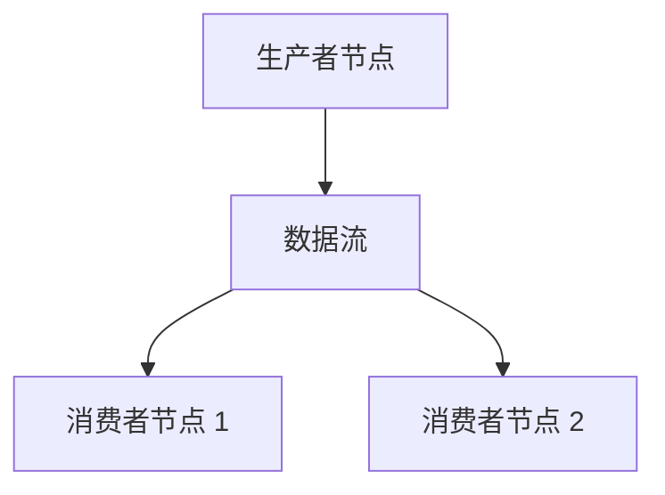

# 消息总线

`MessageBus` 通过消息传递实现系统组件之间的通信。
这种设计形成了松耦合架构，让组件无需直接依赖即可交互。

*消息传递模式*包括：

- 点对点
- 发布/订阅
- 请求/响应

通过 `MessageBus` 交换的消息分为三类：

- 数据
- 事件
- 命令

## 主题层级

Vibe 将市场数据主题置于 `data` 根主题下。实盘数据发布使用直接的 `data.<kind>...` 主题，例如 `data.book.deltas.XCME.ESZ24`。

当请求数据、重放数据或工作流生成的数据以可按主题寻址的数据形式流经消息总线时，`DataEngine` 会将其发布到 `data.pipeline.<kind>...` 下。
长请求、分组请求和聚合链可以在父请求完成前拆分、转换数据，并将数据扇入。此类消息仍是数据消息，但并不具备普通实时发布所采用的实盘顺序和时序语义。例如，管道路径上的订单簿增量使用 `data.pipeline.book.deltas.XCME.ESZ24`。

关联请求的响应通过以关联 ID 为键的响应处理程序传递。`data.response` 主题是响应发布的捕获通道，而不是管道数据路径。

## 消息完整性

消息一旦创建，就不得修改其字段，其中也包括 `params` 映射等容器字段。组件可以读取消息并据此派生本地状态，但不得改写原消息。

不可变消息可确保每个消费者看到相同输入，保留消息发出时的真实状态，并消除一类共享状态竞争。重放、调试和审计都依赖消息在分派后保持稳定。

由此得到三条所有权规则：

- 调用方提供的请求选项保留在消息上。
- 返回给调用方的响应元数据保留在响应上。
- 组件工作流状态（有界日期范围、分组状态、重放游标、计数器和处理标志）保存在组件所有的上下文中，并以消息 ID 或请求 ID 为键。

组件需要派生消息时，应使用所需值创建新消息，而不是改写原消息。

## 发布数据和信号

`MessageBus` 是用户通常间接交互的底层组件，而 `DataActor` 和 `Strategy` 在它之上提供了类型化方法：

```python
def publish_data(self, data_type: DataType, data: CustomData) -> None:
def publish_signal(self, name: str, value, ts_event: int = 0) -> None:
```

这些方法可以发布自定义数据和信号，而不向 Python 暴露原始消息总线。

## 直接访问

当前 Python `DataActor` 和 `Strategy` API 不公开 `self.msgbus`。Python 组件应使用自定义数据或信号进行受支持的消息传递。Rust 组件可以直接使用类型化消息总线门面。

## 消息传递方式

VibeTrader 是一个**事件驱动**框架，组件通过收发消息进行通信。
理解不同的消息传递方式有助于构建交易系统。

本指南介绍 VibeTrader 提供的三种主要消息传递模式：

| **消息传递方式**              | **用途**           | **最适合**                           |
| :---------------------------- | :----------------- | :----------------------------------- |
| **自定义数据发布/订阅**       | 交换结构化交易数据 | 交易度量、技术指标、需要持久化的数据 |
| **信号发布/订阅**             | 轻量通知           | 简单告警、标志和状态更新             |
| **Rust MessageBus 发布/订阅** | 低层类型化主题通信 | 原生运行时组件                       |

每种方式各有用途。本节可帮助你决定采用哪种模式。

### Rust MessageBus 向主题发布/订阅

#### 概念

`MessageBus` 是 VibeTrader 中所有消息的中央枢纽。Rust 组件可以向命名主题发布类型化消息，并为这些主题订阅处理程序。当前 Python Actor 或策略接口不包含此底层接口。

#### 主要优势和用例

需要以下能力的原生组件可以直接访问消息总线：

- 系统内的**跨组件通信**。
- 定义类型化主题和载荷的**灵活性**。
- 发布者与订阅者之间的**解耦**，双方无需相互了解。
- **全局覆盖**，让多个订阅者可以接收消息。
- 处理不适合数据 Actor 模型的事件。
- 需要完全控制消息传递的高级场景。

#### 注意事项

- 必须手动跟踪主题名称（拼写错误可能导致消息丢失）。
- 必须手动定义处理程序。

### 自定义数据发布/订阅

#### 概念

自定义数据用于在数据 Actor 和策略之间交换结构化值。`CustomData` 值携带 `DataType`、载荷、事件时间戳和初始化时间戳，用于路由和事件排序。

#### 主要优势和用例

需要以下能力时，数据发布/订阅方式很适合：

- **交换结构化交易数据**，例如市场数据、指标、自定义度量或期权希腊字母指标。
- 通过内置时间戳（`ts_event`、`ts_init`）实现**正确的事件顺序**，这对于回测准确性至关重要。
- 通过 `@customdataclass` 装饰器实现**数据持久化和序列化**，并与 VibeTrader 数据目录系统集成。
- 在系统组件之间**标准化交换交易数据**。

#### 注意事项

- 载荷必须公开 `ts_event` 和 `ts_init`。
- 持久化要求注册可序列化的自定义数据类。

#### 快速概览代码

```python
from dataclasses import dataclass

from vibe_trader.model import CustomData
from vibe_trader.model import DataType


@dataclass
class GreeksData:
    delta: float
    gamma: float
    ts_event: int
    ts_init: int


data_type = DataType("GreeksData")
data = CustomData(
    data_type,
    GreeksData(
        delta=0.75,
        gamma=0.1,
        ts_event=1_630_000_000_000_000_000,
        ts_init=1_630_000_000_000_000_000,
    ),
)
self.publish_data(data_type, data)

self.subscribe_data(data_type)


def on_data(self, data: CustomData) -> None:
    if data.data_type == data_type:
        greeks = data.data
        self.log.info(f"Delta: {greeks.delta}, Gamma: {greeks.gamma}")
```

有关注册和持久化，请参阅[自定义数据](custom_data.md)。

### 信号发布/订阅

#### 概念

**信号**是在 Actor 框架内发布和订阅简单通知的轻量方式。
这是最简单的消息传递方式，无需定义自定义类。

#### 主要优势和用例

需要以下能力时，信号消息传递方式很适合：

- **简单、轻量的通知/告警**，例如 "RiskThresholdExceeded" 或 "TrendUp"。
- 无需定义自定义类的**快速即时消息传递**。
- 以原始数据（`int`、`float` 或 `str`）**广播告警或标志**。
- 通过简单直接的方法（`publish_signal`、`subscribe_signal`）**轻松集成 API**。
- **多订阅者通信**，发布信号时所有订阅者都会收到。
- 无需定义类，**设置开销极低**。

#### 注意事项

- 每个信号只能包含一个 `int`、`float` 或 `str` 类型的**单一值**。这意味着不支持复杂数据结构或其他 Python 类型。
- 在 `on_signal` 处理程序中，只能通过 `signal.value` 区分信号，因为处理程序无法访问其信号名称。

#### 快速概览代码

```python
# Define signal constants for better organization (optional but recommended)
import types

from vibe_trader.common import LogColor
from vibe_trader.core.datetime import unix_nanos_to_dt

signals = types.SimpleNamespace()
signals.NEW_HIGHEST_PRICE = "NewHighestPriceReached"
signals.NEW_LOWEST_PRICE = "NewLowestPriceReached"

# Subscribe from a DataActor or Strategy
self.subscribe_signal(signals.NEW_HIGHEST_PRICE)
self.subscribe_signal(signals.NEW_LOWEST_PRICE)

# Publish from a DataActor or Strategy
self.publish_signal(
    name=signals.NEW_HIGHEST_PRICE,
    value=signals.NEW_HIGHEST_PRICE,  # value can be the same as name for simplicity
    ts_event=bar.ts_event,  # timestamp from triggering event
)


# Handler (this is static callback function with fixed name)
def on_signal(self, signal):
    # IMPORTANT: We match against signal.value, not signal.name
    match signal.value:
        case signals.NEW_HIGHEST_PRICE:
            self.log.info(
                f"New highest price was reached. | "
                f"Signal value: {signal.value} | "
                f"Signal time: {unix_nanos_to_dt(signal.ts_event)}",
                color=LogColor.GREEN,
            )
        case signals.NEW_LOWEST_PRICE:
            self.log.info(
                f"New lowest price was reached. | "
                f"Signal value: {signal.value} | "
                f"Signal time: {unix_nanos_to_dt(signal.ts_event)}",
                color=LogColor.RED,
            )
```

### 总结和决策指南

以下快速参考可帮助你选择消息传递方式：

#### 决策指南：应该选择哪种方式？

| **用例**                 | **推荐方式**                | **所需设置**                            |
| :----------------------- | :-------------------------- | :-------------------------------------- |
| 原生系统级通信           | Rust `MessageBus` 发布/订阅 | 类型化主题和处理程序                    |
| Python 组件的结构化数据  | `DataActor` 自定义数据方法  | `DataType`、`CustomData` 和 `on_data()` |
| 简单的 Python 告警和通知 | `DataActor` 信号方法        | 信号名称和 `on_signal()`                |

## 外部出站和入站

`MessageBus` 可以将序列化消息写入外部流。本节介绍外部总线的出站和入站两侧。Rust 原生实盘节点使用注入的 `MessageBusExternalEgress` 和 `MessageBusExternalIngress` 接口，因此核心节点不依赖 Redis、消息代理、共享内存实现或套接字协议。

:::info
Redis 目前可作为可序列化消息的一种外部后端。支持的最低 Redis 版本为 6.2，这是使用[流](https://redis.io/docs/latest/develop/data-types/streams/)功能的要求。
:::

配置外部出站后，传出的发布消息会先分派给进程内订阅者，再序列化为现有的 `BusMessage` 线协议记录：

- `topic`：内部发布调用使用的确切消息总线主题，例如 `data.quotes.BINANCE.BTCUSDT` 或 `events.order.S-001`。
- `type`：规范载荷类型名称，例如 `QuoteTick` 或 `OrderEventAny`。
- `encoding`：从消息总线编码策略中选择的载荷编码。
- `payload`：采用所选编码进行序列化的字节。

外部出站以 `publish(BusMessage)` 接收该记录。此出站调用不得阻塞节点的总线线程。有界出站实现在队列已满时会丢弃消息，而不会对交易循环施加背压。关闭消息总线时，也会关闭已配置的出站接口。

入站外部流通过单独的 Rust `MessageBusExternalIngress` trait 公开。
入站会生成相同的 `BusMessage { topic, payload_type, encoding, payload }` 结构。
`republish_external_message` 会解码受支持的入站消息并在内部重新发布，但不会将消息再次转发到外部。必须先在接收端消息总线上注册入站载荷类型以进行流传输；未注册的类型会在不解码的情况下跳过。

对于 Redis，消息会通过多生产者单消费者（MPSC）通道传输到单独的 Rust 任务。该任务将消息写入 Redis 流。

把 I/O 卸载到单独线程可避免阻塞主线程。

使用 MessagePack 或 JSON 时，Rust 原生外部出站会转发可序列化的类型化发布。其中包括金融工具、报价、成交、K 线、订单簿增量、深度 10 快照、标记价格/指数价格/资金费率更新、期权希腊字母指标、账户状态、投资组合快照、订单事件、持仓事件和自定义数据。启用 `defi` 功能后，还包括 DeFi 区块、池、流动性更新、手续费收取和闪电事件。完整订单簿快照、希腊字母数据、期权链切片和 DeFi 池交换不会转发，因为这些类型没有实现 Serde 序列化。

使用 SBE 或 Cap'n Proto 时，Rust 原生外部出站通过 schema 编解码器转发内置市场数据载荷：报价、成交、K 线、订单簿增量、深度 10 快照、标记价格更新、指数价格更新、资金费率更新和期权希腊字母指标。选择这些 schema 编码时，其他载荷类型会被丢弃，并记录 debug 日志。

### 序列化

Vibe 支持序列化：

- 所有 Vibe 内置类型（序列化为由可序列化原始值组成的字典 `dict[str, Any]`）。
- Python 原始类型（`str`、`int`、`float`、`bool`、`bytes`）。

可以通过 `serialization` 子包注册自定义类型，为其增加序列化支持。

```python
def register_serializable_type(
    cls,
    to_dict: Callable[[Any], dict[str, Any]],
    from_dict: Callable[[dict[str, Any]], Any],
): ...
```

- `cls`：要注册的类型。
- `to_dict`：根据对象创建原始类型字典的委托。
- `from_dict`：根据原始类型字典创建对象的委托。

## 配置

消息总线的外部后端技术使用行为配置，以及具体技术专属的后端配置。`MessageBusConfig` 控制消息总线行为。`RedisMessageBusConfig` 包含 Redis 连接设置，`RedisMessageBusFactory` 实现 `MessageBusBackingFactory`。

```rust
use vibe_common::{
    enums::SerializationEncoding,
    msgbus::{MessageBusBackingFactory, MessageBusConfig},
};
use vibe_infrastructure::redis::msgbus::{RedisMessageBusConfig, RedisMessageBusFactory};

let config = MessageBusConfig {
    encoding: SerializationEncoding::Json,
    encoding_market_data: Some(SerializationEncoding::Sbe),
    timestamps_as_iso8601: true,
    buffer_interval_ms: Some(100),
    autotrim_mins: Some(30),
    use_trader_prefix: true,
    use_trader_id: true,
    use_instance_id: false,
    streams_prefix: "streams".to_string(),
    types_filter: Some(vec!["QuoteTick".to_string(), "TradeTick".to_string()]),
    ..Default::default()
};

let redis_config = RedisMessageBusConfig::default();
let factory = RedisMessageBusFactory::new(redis_config);
let backing = factory.create(trader_id, instance_id, config.clone())?;
```

### 后端配置

使用内置 Redis 后端时必须提供 `RedisMessageBusConfig`。对于本地回环地址上的默认 Redis 设置，可以传入 `RedisMessageBusConfig::default()`。

Rust 类型会显式选择 Redis。配置不使用 `type = "redis"` 或 `backing_type = "redis"` 等面向用户的选择器。

注入 `MessageBusExternalEgress` 的 Rust 原生调用方会在构建该出站接口时传入具体连接详情。核心消息总线不要求注入的出站接口提供 `RedisMessageBusConfig`。

Rust 实盘运行时接受 `MessageBusConfig` 中的 `external_streams`；调用方使用 `LiveNodeBuilder::with_external_ingress` 注入 `MessageBusExternalIngress` 后，运行时会消费入站 `BusMessage`。配置指定外部流键，注入的入站接口则是具体运行时来源。Rust 调用方可以使用 `LiveNodeBuilder::with_external_msgbus_factory` 安装 `RedisMessageBusFactory`。如果同时使用工厂和单独注入的出站或入站接口，构建会失败。工厂始终安装出站接口，并且仅在 `external_streams` 非空时创建入站接口。

Python 为包括 `RedisMessageBusFactory` 在内的内置工厂类公开了相同的构建器方法，但不接受任意 Python 工厂类。

内置 Redis 入站会从当前时间戳开始读取每个已配置流，因此不会重放节点启动时已经存在的条目。启动后，它会推进每个流最近读取的 ID，并在连接重试期间保留这些 ID。需要持久重放启动前的数据时，应使用缓存恢复或事件存储；`external_streams` 提供实盘转发，而不是消费者组积压。

### 编码

Rust 原生外部消息总线出站支持以下编码名称：

- JSON（`json`）
- MessagePack（`msgpack`）
- Cap'n Proto（`capnp`，需启用 Rust `capnp` 功能）
- SBE（`sbe`，需启用 Rust `sbe` 功能）

使用 `encoding` 配置选项控制消息写入编码。
使用 `encoding_market_data` 覆盖由外部总线二进制编解码器支持的市场数据载荷编码。使用 `encoding_builtin` 覆盖账户状态、投资组合快照、订单事件和持仓事件载荷。自定义和未映射的载荷类型始终使用 `encoding`。

`MessageBusConfig::validate` 要求默认 `encoding` 能够支持自定义载荷，因此必须使用 JSON 或 MessagePack。类别覆盖必须受该类别中每种已发布载荷类型支持。SBE 和 Cap'n Proto 目前只能用于 `encoding_market_data`，并且必须启用匹配的 Rust 功能。在相应 schema 编解码器覆盖内置事件类别之前，`encoding_builtin = "sbe"` 和 `encoding_builtin = "capnp"` 都无法通过验证。

旧版 Python/Cython Redis 序列化器和 Redis 缓存载荷路径支持 MessagePack 和 JSON。SBE 和 Cap'n Proto 是 Rust 原生外部消息总线出站的 schema 载荷编码，不是 Redis 缓存编码。

:::tip
默认使用 `json` 编码，以便于人工阅读和互操作。
当载荷大小和序列化性能是主要考虑因素时，请使用 `msgpack`。
:::

### 时间戳格式

默认情况下，时间戳格式为 UNIX 纪元纳秒整数。也可以将 `timestamps_as_iso8601` 设为 `true`，配置为 ISO 8601 字符串格式。

### 消息流键

消息流键对于标识各个交易者节点和组织流内消息至关重要。
它们可以根据具体要求和用例定制。在消息总线流中，交易者键通常采用以下结构：

```
trader:{trader_id}:{instance_id}:{streams_prefix}
```

这些选项控制 Redis 流键，但不会改写传给注入的 `MessageBusExternalEgress` 的 `topic`；该主题仍是内部消息总线的发布主题。当 `stream_per_topic` 为 `True` 时，Redis 出站会把主题附加到流键。当其为 `False` 时，Redis 会将所有消息存入基础流键，并把主题保留为消息字段。

以下选项可用于配置消息流键：

#### 交易者前缀

键是否应以 `trader` 字符串开头。

#### 交易者 ID

键是否应包含节点的交易者 ID。

#### 实例 ID

每个交易者节点都会分配一个唯一的"实例 ID"，即 UUIDv4。此实例 ID 可在消息分布到多个流时区分各个交易者。将 `use_instance_id` 配置选项设为 `True`，即可在交易者键中包含实例 ID。
在多节点交易系统中需要跨不同流跟踪和识别交易者时，此选项尤其有用。

#### 流前缀

`streams_prefix` 字符串可用于对单个交易者实例的所有流分组，或组织多个实例的消息。配置时，将字符串传给 `streams_prefix` 配置选项，并确保其他前缀设为 false。

#### 每个主题一个流

指示生产者是否为每个主题写入单独的流。此设置对 Redis 后端尤其有用，因为 Redis 监听流时不支持通配符主题。
如果设为 False，所有消息都会写入同一个流。

:::info
Redis 不支持通配符流主题。为提高与 Redis 的兼容性，建议将此选项设为 False。
:::

### 类型过滤

在消息总线上发布消息时，如果消息总线后端已配置并启用，消息会经过序列化并写入流。为了避免高频报价等数据淹没流，可以过滤某些消息类型，不将其发布到外部。

要启用此过滤机制，请向消息总线配置的 `types_filter` 参数传入 `type` 对象列表，指定应从外部发布中排除的消息类型。

```python
from vibe_trader.config import MessageBusConfig
from vibe_trader.model import QuoteTick
from vibe_trader.model import TradeTick

# Create a MessageBusConfig instance with types filtering
message_bus = MessageBusConfig(types_filter=[QuoteTick, TradeTick])
```

### 流自动修剪

`MessageBusConfig` 提供 `autotrim_maxlen` 选项。

使用 `autotrim_mins` 设置以分钟为单位的回溯窗口，使用 `autotrim_maxlen` 设置每个 Redis 流的近似最大条目数。可以配置其中任一策略，也可以同时配置。两者同时设置时，消息总线会移除超出时间窗口或条目数阈值的条目。

Redis 会采用近似修剪方式应用 `autotrim_maxlen`，以提高写入性能，因此流中条目可能略多于配置的阈值。

:::info
当前 Redis 实现会把 `autotrim_mins` 维持为最大宽度（另加约一分钟，因为流的修剪频率不超过每分钟一次），而不是根据当前挂钟时间计算的最大回溯窗口。
:::

## 外部流

`LiveNode`（节点）内的消息总线称为"内部消息总线"。
生产者节点将消息发布到外部流（请参阅[外部出站和入站](#外部出站和入站)）。
消费者节点监听外部流，以接收反序列化的消息载荷，并将其发布到自身的内部消息总线。



:::tip
将 `LiveDataEngineConfig.external_clients` 设为用于表示外部流客户端的 `client_id` 列表。
`DataEngine` 会过滤这些客户端的订阅命令，确保外部流传输为这些客户端的所有订阅提供必要数据。
当 Rust `DataEngine` 跳过外部客户端订阅时，它会在消息总线上注册相应的流载荷类型，以供入站重新发布。
:::

### 配置示例

以下示例展示一种流传输设置：生产者节点向外部发布 Binance 数据，下游消费者节点则将这些数据消息发布到自身的内部消息总线。

#### 生产者节点

将生产者节点的 `MessageBus` 配置为发布到 `"binance"` 流。
设置 `use_trader_id`、`use_trader_prefix` 和 `use_instance_id` 均为 `false`，以得到简单且可预测的流键，供消费者节点注册。

```rust
let message_bus = MessageBusConfig {
    use_trader_id: false,
    use_trader_prefix: false,
    use_instance_id: false,
    streams_prefix: "binance".to_string(), // <---
    stream_per_topic: false,
    autotrim_mins: Some(30),
    ..Default::default()
};

let redis_config = RedisMessageBusConfig {
    connection_timeout: 2,
    response_timeout: 2,
    ..Default::default()
};

let mut node = LiveNode::builder(trader_id, Environment::Live)?
    .with_msgbus_config(message_bus)
    .with_external_msgbus_factory(Box::new(RedisMessageBusFactory::new(redis_config)))
    .build()?;
node.run().await?;
```

#### 消费者节点

将消费者节点的 `MessageBus` 配置为从同一个 `"binance"` 流接收消息。`RedisMessageBusFactory` 根据 `external_streams` 创建入站接口，`LiveNode::run` 则将接收到的消息发布到节点的内部消息总线。我们将客户端 ID `"BINANCE_EXT"` 声明为外部客户端，使 `DataEngine` 不会尝试向该客户端 ID 发送数据命令。

```rust
let data_engine = LiveDataEngineConfig {
    external_clients: Some(vec![ClientId::from("BINANCE_EXT")]),
    ..Default::default()
};

let message_bus = MessageBusConfig {
    external_streams: Some(vec!["binance".to_string()]), // <---
    ..Default::default()
};

let redis_config = RedisMessageBusConfig {
    connection_timeout: 2,
    response_timeout: 2,
    ..Default::default()
};

let mut node = LiveNode::builder(trader_id, Environment::Live)?
    .with_data_engine_config(data_engine)
    .with_msgbus_config(message_bus)
    .with_external_msgbus_factory(Box::new(RedisMessageBusFactory::new(redis_config)))
    .build()?;
node.run().await?;
```

## 相关指南

- [Actor](actors.md) - Actor 使用消息总线处理事件。
- [架构](architecture.md) - 消息总线在系统架构中的作用。
