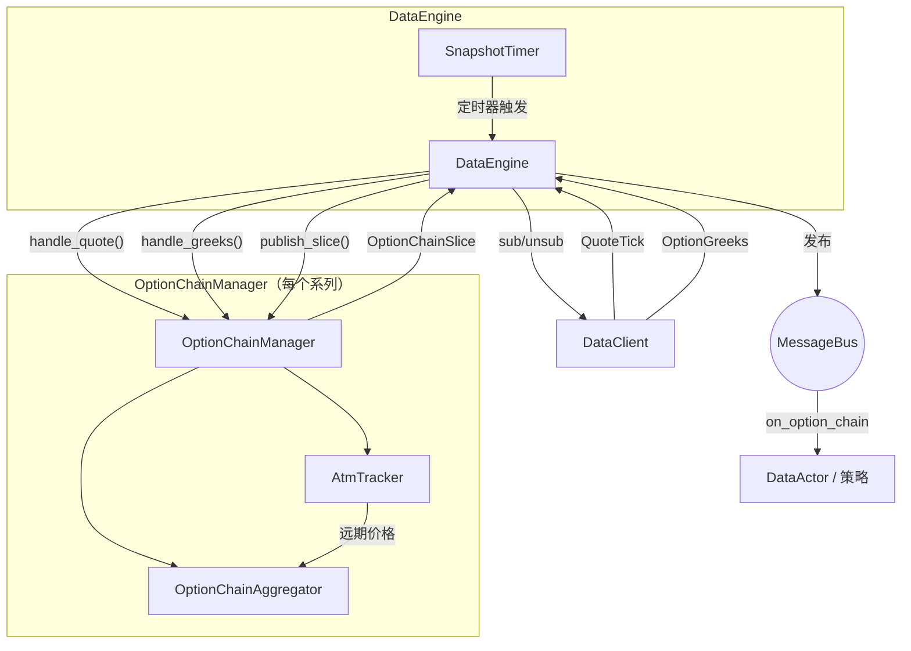

# 期权

Vibe 为传统市场和加密货币市场的期权交易提供一等支持，包括期权专用金融工具类型、交易场所提供的 Greeks 数据流、期权链聚合，以及用于风险管理的本地 Black-Scholes Greeks 计算器。

## 期权金融工具类型

平台定义了多种期权金融工具类型：

| 金融工具             | 说明                                                    |
| -------------------- | ------------------------------------------------------- |
| `OptionContract`     | 在交易所交易、具有标的、行权价和到期日的期权。          |
| `OptionSpread`       | 由交易所定义、作为单一交易标的的多腿期权策略。          |
| `CryptoOption`       | 使用加密货币计价/结算的期权，可采用反向或 quanto 形式。 |
| `CryptoOptionSpread` | 支持反向、结算货币和小数数量的加密货币期权价差。        |
| `BinaryOption`       | 结算为 0 或 1、赔付固定的二元期权。                     |

与 Greeks 相关的元数据因金融工具类型而异：

- `OptionContract`、`CryptoOption`：包含完整的 Greeks 输入，包括 `strike_price`、`option_kind`（CALL/PUT）、`expiration_ns`、`underlying`、`multiplier`。
- `OptionSpread`、`CryptoOptionSpread`：最多由 4 条期权腿组合而成，每条腿按比率加权。自身包含 `underlying`、`expiration_ns` 和 `strategy_type`（垂直价差、日历价差、跨式等）。每条腿的 `strike_price` 和 `option_kind` 位于对应腿的 `OptionContract`/`CryptoOption`，而不在价差本身。Greeks 按腿计算后聚合。价差通常用于下单（交易所把它作为一个订单执行），各条腿则分别体现为持仓。`CryptoOptionSpread` 还为 Deribit 等交易场所提供 `is_inverse` 和 `settlement_currency`。
- `BinaryOption`：包含 `expiration_ns` 和 `outcome`/`description`，但没有 `strike_price`、`option_kind` 或 `underlying`。

## 订阅 Greeks

Deribit、Bybit、OKX 等交易场所会随期权市场数据发布实时 Greeks。Vibe 提供两个订阅层级：

- **按金融工具订阅 Greeks**：订阅单个期权合约。
- **期权链切片**：订阅整个期权系列的聚合视图。

### 按金融工具订阅 Greeks

可以从参与者或策略订阅交易场所为单个期权合约提供的 Greeks：

```python
from vibe_trader.model.identifiers import ClientId

client_id = ClientId("DERIBIT")
self.subscribe_option_greeks(instrument_id, client_id=client_id)
```

实现 `on_option_greeks` 处理程序以处理传入更新：

```python
def on_option_greeks(self, greeks) -> None:
    self.log.info(
        f"{greeks.instrument_id}: "
        f"delta={greeks.delta:.4f} gamma={greeks.gamma:.6f} "
        f"vega={greeks.vega:.4f} theta={greeks.theta:.4f} "
        f"mark_iv={greeks.mark_iv} underlying={greeks.underlying_price}"
    )
```

停止接收更新：

```python
self.unsubscribe_option_greeks(instrument_id, client_id=client_id)
```

### 期权链订阅

期权链订阅把一个期权系列中所有行权价的报价和 Greeks 聚合为 `OptionChainSlice` 快照。`DataEngine` 为每个系列创建一个 Rust `OptionChainManager` 并管理其生命周期：创建管理器、路由传入数据、运行快照计时器，以及排空线路订阅变更。

```python
from vibe_trader.model import OptionSeriesId
from vibe_trader.model import StrikeRange

series_id = OptionSeriesId(...)  # identifies the series (venue, underlying, expiry)

# Subscribe to 5 strikes above and below ATM, snapshot every 1000ms
strike_range = StrikeRange.atm_relative(strikes_above=5, strikes_below=5)
self.subscribe_option_chain(
    series_id,
    strike_range=strike_range,
    snapshot_interval_ms=1000,
)
```

实现 `on_option_chain` 处理程序以处理快照：

```python
def on_option_chain(self, chain) -> None:
    for strike in chain.strikes():
        call = chain.get_call(strike)
        put = chain.get_put(strike)
        if call and call.greeks:
            self.log.info(f"Call {strike}: delta={call.greeks.delta:.4f}")
```

### 行权价区间筛选

`StrikeRange` 控制期权链订阅中哪些行权价处于活动状态：

| 变体          | 说明                                            | 示例                             |
| ------------- | ----------------------------------------------- | -------------------------------- |
| `Fixed`       | 订阅显式指定的一组行权价。                      | `StrikeRange.fixed([...])`       |
| `AtmRelative` | 订阅当前 ATM 行权价之上 N 个和之下 N 个行权价。 | `StrikeRange.atm_relative(5, 5)` |
| `AtmPercent`  | 订阅 ATM 周围指定百分比区间内的全部行权价。     | `StrikeRange.atm_percent(0.10)`  |
| `Delta`       | 订阅看涨或看跌 delta 接近目标值的行权价。       | `StrikeRange.delta(0.25, 0.05)`  |

对于基于 ATM 的变体，在确定 ATM 价格前会延后订阅。ATM 根据交易场所提供的 `OptionGreeks` 更新中内嵌的远期价格（`underlying_price` 字段）推导。也可以使用通过 HTTP 获取的初始远期价格预先设定，使系统在实盘 WebSocket tick 到达前立即启动。ATM 变化时，活动行权价集合会自动再平衡。

`Delta` 根据交易场所提供的 Greeks 解析：如果某行权价的看涨或看跌 delta 绝对值（看涨为正、看跌为负，比较时取绝对值）与 `target` 的差不超过 `tolerance`，该行权价便处于活动状态。典型的价外目标（例如 `0.25`）会在 ATM 两侧各选一个行权价。在 ATM/远期价格确定前，`Delta` 与其他基于 ATM 的区间一样延后处理。ATM 确定后，如果没有活动行权价的 Greeks 符合该区间（包括尚未收到任何 Greeks 时），`Delta` 会回退到 ATM 两侧各五个行权价的相对窗口。从回退窗口切换到按 delta 选择的行权价前，聚合器会等待回退窗口内每条腿都具备 Greeks，避免早期不完整更新导致相邻行权价被移除。

### 快照模式与原始模式

`snapshot_interval_ms` 参数控制发布行为：

- **快照模式**（`snapshot_interval_ms=1000`）：报价和 Greeks 累积到缓冲区，由计时器发布为 `OptionChainSlice`。适合周期性投资组合再平衡或 UI 展示。
- **原始模式**（`snapshot_interval_ms=None`）：每次报价或 Greeks 更新都立即发布切片。适合响应单次更新、对延迟敏感的策略。

## 回测期权链

期权链回测与实盘订阅使用相同的 `OptionChainManager` 和 `OptionChainAggregator` 路径。前提是 Vibe Parquet 目录已经包含期权金融工具，以及期权链所需的按金融工具数据：

- 每个期权合约的 `QuoteTick` 记录，携带重放的最优买价和卖价。
- 每个期权合约的 `OptionGreeks` 记录，携带 delta、隐含波动率、计价约定，以及用于设定 ATM 的 `underlying_price`。
- 使用相同金融工具 ID 的 `CryptoOption` 或 `OptionContract` 金融工具。

如果把期权订单簿快照或报价写为 `QuoteTick`，并把 `option_summary` 消息写为 `OptionGreeks`，Tardis 重放就符合该契约。回测运行期间不会下载或请求目录中缺失的数据。

为该系列的期权金融工具同时配置两种数据流，再运行 `BacktestNode`：

```python
data = [
    BacktestDataConfig(
        data_type="QuoteTick",
        catalog_path="/path/to/catalog",
        instrument_ids=option_instrument_ids,
    ),
    BacktestDataConfig(
        data_type="OptionGreeks",
        catalog_path="/path/to/catalog",
        instrument_ids=option_instrument_ids,
    ),
]
```

然后从策略订阅：

```python
strike_range = StrikeRange.delta(0.25, 0.05)
self.subscribe_option_chain(
    series_id,
    strike_range=strike_range,
    snapshot_interval_ms=1000,
)
```

原始模式使用 `snapshot_interval_ms=None`。每次报价或 Greeks 更新使活动期权链发生变化后，原始模式都会发布一个切片。稀疏快照使用整数间隔。稀疏模式会按金融工具累积最新 BBO 和 Greeks，并按计时器节奏发布期权链，从而减少大型期权链的事件量。

每个 `OptionChainSlice` 都按金融工具合并最新 BBO 和 Greeks，再按行权价和期权类型分组。报价可能先于 Greeks 到达，Greeks 也可能先于报价到达；聚合器会保留最新状态，并在两者可用时一并附加。`OptionGreeks` 中的 `underlying_price` 驱动 ATM 检测。

可以在订阅区间中选择，也可以在策略内部选择：

- 价内外程度：使用 `StrikeRange.atm_relative(...)` 或 `StrikeRange.atm_percent(...)`。
- Delta：使用 `StrikeRange.delta(target, tolerance)`，或在 `on_option_chain` 中检查 `entry.greeks.delta`。
- 行权价：使用 `StrikeRange.fixed([...])`，或读取 `chain.get_call(strike)` 和 `chain.get_put(strike)`。

期权撮合由报价驱动。市价订单和可立即成交的限价订单会作为 taker 与重放的对手方 BBO 成交。被动限价订单会挂在模拟订单簿上，后续 BBO 更新穿过限价时可以作为 maker 成交。该模型不模拟期权的 L2 队列位置。

结构化期权费用模型在模拟交易场所中配置，而不是根据交易场所名称推断：

```python
from decimal import Decimal

from vibe_trader.execution import CappedOptionFeeModel
from vibe_trader.execution import TieredNotionalOptionFeeModel

deribit_like = CappedOptionFeeModel(
    maker_rate=Decimal("0.0003"),
    taker_rate=Decimal("0.0003"),
)
okx_like = TieredNotionalOptionFeeModel(
    maker_rate=Decimal("0.0002"),
    taker_rate=Decimal("0.0005"),
)
```

把其中一个对象作为 `BacktestVenueConfig` 的 `fee_model` 传入。Rust 接口使用 `FeeModelAny::CappedOption(CappedOptionFeeModel::new(...))` 和 `FeeModelAny::TieredNotionalOption(TieredNotionalOptionFeeModel::new(...))`。

参见 `examples/backtest/tardis_option_chain.py`，以及 `crates/backtest/examples/` 中的 Rust `tardis-option-chain` 示例。

## 期权链架构

期权链系统采用事件驱动，并按系列隔离。`DataEngine` 为每个已订阅期权系列创建一个 Rust `OptionChainManager`。管理器封装 `OptionChainAggregator` 和 `AtmTracker`、注册消息总线处理程序、发布快照，并把线路订阅变更排队等待引擎排空。另一个 PyO3 `OptionChainManager` 向 Python 公开相同的聚合核心。



### 组件职责

#### DataEngine

为每个活动 `OptionSeriesId` 保存一个 `OptionChainManager`。收到 `SubscribeOptionChain` 后，它从缓存解析金融工具，为基于 ATM 的区间请求远期价格，创建管理器，向数据客户端订阅活动金融工具，并设置快照计时器。每次计时器触发时，管理器会检查是否需要再平衡、发布快照，并把线路订阅变更排队等待引擎排空。收到 `UnsubscribeOptionChain` 或全部金融工具到期时，它会拆除管理器、取消计时器，并取消线路级数据源订阅。

#### OptionChainManager

围绕 `OptionChainAggregator` 和 `AtmTracker` 构建的逐系列 Rust 管理器。`DataEngine` 通过 `handle_quote()` 和 `handle_greeks()` 向其输入市场数据。快照模式下，计时器回调会调用 `publish_slice()`；原始模式下，每次活动报价或 Greeks 更新都会立即调用 `publish_slice()`。面向 Python 的管理器，其 `handle_*` 方法会返回首个 ATM 价格是否已启动活动金融工具集合；Rust 管理器则在内部完成该启动过程。

#### OptionChainAggregator

使用"保留最新值"语义，把报价和 Greeks 累积到看涨/看跌缓冲区。自上次快照后未更新的金融工具仍会包含在内。某金融工具的 Greeks 如果先于任何报价到达，会保存在 `pending_greeks` 缓冲区，首个报价到达时再附加。每次调用 `snapshot()`，聚合器都会生成不可变的 `OptionChainSlice`。

#### AtmTracker

根据传入 `OptionGreeks` 事件的 `underlying_price` 字段（交易场所为该到期日提供的远期价格）响应式推导 ATM 价格。也可以使用 HTTP 远期价格响应预先设定，无需等待 WebSocket tick 即可立即启动。

### 启动与再平衡

对于基于 ATM 的行权价区间（`AtmRelative`、`AtmPercent`），必须先知道 ATM 价格才能确定活动金融工具集合。存在两种启动路径：

**立即启动（远期价格可用）：**

1. `DataEngine` 收到 `SubscribeOptionChain`，从缓存解析该系列的全部金融工具，并向数据客户端请求远期价格。
2. 远期价格响应到达后，引擎使用预设 ATM 价格创建管理器；管理器在构造期间计算活动行权价集合。
3. 引擎立即订阅活动金融工具。

**延后启动（无远期价格）：**

1. 与上文相同，但响应中没有找到匹配的远期价格。
2. 引擎创建没有初始 ATM 价格的管理器。活动集合为空，不为该期权链建立线路订阅。
3. 启动依赖其他订阅中已经流动的相关 Greeks 数据（例如按金融工具调用 `subscribe_option_greeks`）。引擎通过 `handle_greeks()` 输入带 `underlying_price` 的 `OptionGreeks` 事件时，管理器会启动活动金融工具集合、注册消息总线处理程序，并把新线路订阅排队等待引擎排空。

启动后，聚合器会监控 ATM 漂移。每次快照计时器触发时，引擎调用 `check_rebalance()`，返回需要添加或移除的金融工具。滞后阈值和冷却期可以防止系统在行权价边界附近频繁切换。

## OptionGreeks 数据类型

`OptionGreeks` 携带交易场所为单个期权合约提供的敏感度和隐含波动率：

| 字段               | 类型               | 说明                                     |
| ------------------ | ------------------ | ---------------------------------------- |
| `instrument_id`    | `InstrumentId`     | 这些 Greeks 所对应的期权合约。           |
| `convention`       | `GreeksConvention` | Greeks 的计价基准约定。                  |
| `delta`            | `float`            | 标的每变化一个单位时，期权价格的变化率。 |
| `gamma`            | `float`            | 标的每变化一个单位时，delta 的变化率。   |
| `vega`             | `float`            | 隐含波动率变化 1% 时的敏感度。           |
| `theta`            | `float`            | 每日时间衰减（dV/dt / 365.25）。         |
| `rho`              | `float`            | 对利率变化的敏感度。                     |
| `mark_iv`          | `float` 或 None    | 标记隐含波动率。                         |
| `bid_iv`           | `float` 或 None    | 买价隐含波动率。                         |
| `ask_iv`           | `float` 或 None    | 卖价隐含波动率。                         |
| `underlying_price` | `float` 或 None    | 计算时的标的价格。                       |
| `open_interest`    | `float` 或 None    | 合约未平仓量。                           |
| `ts_event`         | `int`              | 事件的 UNIX 时间戳（纳秒）。             |
| `ts_init`          | `int`              | 初始化时的 UNIX 时间戳（纳秒）。         |

## OptionChainSlice 数据类型

`OptionChainSlice` 是整个期权系列在某一时点的快照。

属性：

| 属性         | 类型             | 说明                              |
| ------------ | ---------------- | --------------------------------- |
| `series_id`  | `OptionSeriesId` | 期权系列标识符。                  |
| `atm_strike` | `Price` 或 None  | 当前 ATM 行权价（如果已经确定）。 |
| `ts_event`   | `int`            | UNIX 时间戳（纳秒）。             |
| `ts_init`    | `int`            | UNIX 时间戳（纳秒）。             |

看涨和看跌数据通过方法访问，而不是作为直接属性。每个方法返回的 `OptionStrikeData` 都包含该行权价的 `quote`（`QuoteTick`）和可选 `greeks`（`OptionGreeks`）。

方法：

- `strikes()`：期权链中全部不重复的行权价。
- `strike_count()`、`call_count()`、`put_count()`：数量统计。
- `get_call(strike)`、`get_put(strike)`：完整 `OptionStrikeData`。
- `get_call_greeks(strike)`、`get_put_greeks(strike)`：仅 Greeks。
- `get_call_quote(strike)`、`get_put_quote(strike)`：仅报价。
- `is_empty()`：期权链没有数据时为 true。

## 适配器支持

以下适配器目前支持订阅期权 Greeks：

| 适配器  | 按金融工具 Greeks | 期权链 |
| ------- | :---------------: | :----: |
| Deribit | ✓                 | ✓      |
| Bybit   | ✓                 | ✓      |
| OKX     | ✓                 | -      |

## 另请参阅

- [Greeks](greeks.md) - 本地 Greeks 计算和投资组合风险管理。
- [数据](data/) - 内置数据类型和订阅模型。
- [参与者](actors.md) - 订阅和处理程序参考表。
