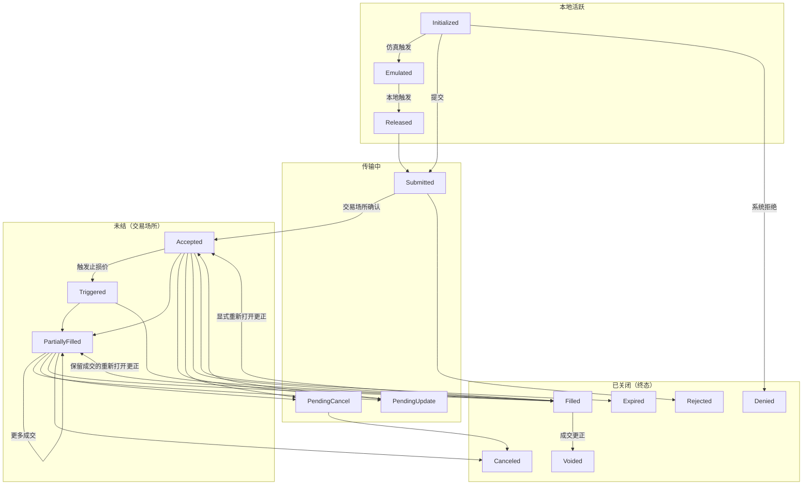

# 订单

VibeTrader 支持广泛的订单类型和执行指令，尽可能公开交易场所的功能。
交易者可以为任何交易策略中的订单执行与管理定义指令和或有关系。

## 概述

所有订单类型都源自两个基本类型：*Market* 和 *Limit* 订单。从流动性角度看，两者相反。
*Market* 订单按最佳可用价格立即执行，从而消耗流动性；*Limit* 订单则以指定价格挂在订单簿中，
直到完成撮合，从而提供流动性。

VibeTrader 支持九种订单类型（即 `OrderType` 枚举值）。[订单类型](#订单类型)一节汇总这些类型，
并为每种类型提供专门指南。

:::info
VibeTrader 为众多订单类型和执行指令提供统一 API，但并非所有交易场所都支持每个选项。
如果订单包含目标交易场所不支持的指令或选项，系统不会提交订单，而会记录清晰的解释性错误。
:::

### 术语

- 如果订单类型为 `MARKET`，或者以*可成交*订单执行（即获取流动性），则订单是**主动型**。
- 如果订单不可立即成交（即提供流动性），则订单是**被动型**。
- 如果订单以下列三个非终态之一留在本地系统边界内，则订单处于**本地活动**状态：
  - `INITIALIZED`
  - `EMULATED`
  - `RELEASED`
- 如果订单处于以下状态之一，则订单**在途**：
  - `SUBMITTED`
  - `PENDING_UPDATE`
  - `PENDING_CANCEL`
- 如果订单处于以下（非终态）状态之一，则订单**未关闭**：
  - `ACCEPTED`
  - `TRIGGERED`
  - `PENDING_UPDATE`
  - `PENDING_CANCEL`
  - `PARTIALLY_FILLED`
- 如果订单处于以下（终态）状态之一，则订单**已关闭**：
  - `DENIED`
  - `REJECTED`
  - `CANCELED`
  - `EXPIRED`
  - `FILLED`
  - `VOIDED`

### 订单状态流

下图展示订单生命周期及主要状态转换：

### 订单状态定义

| 状态               | 说明                                                       |
| ------------------ | ---------------------------------------------------------- |
| `INITIALIZED`      | 订单已在 Vibe 系统内实例化。                               |
| `DENIED`           | 订单因无效、无法处理或超过风险限额而被 Vibe 否决。         |
| `EMULATED`         | 订单正在由 `OrderEmulator` 组件模拟。                      |
| `RELEASED`         | 订单已从 `OrderEmulator` 组件释放。                        |
| `SUBMITTED`        | 订单已提交至交易场所（等待确认）。                         |
| `ACCEPTED`         | 交易场所已确认收到订单且订单有效（现在可能处于工作状态）。 |
| `REJECTED`         | 订单已被交易场所拒绝。                                     |
| `CANCELED`         | 订单已取消（终态）。                                       |
| `EXPIRED`          | 订单已达到 GTD 到期时间（终态）。                          |
| `TRIGGERED`        | 订单的 STOP 价格已在交易场所触发。                         |
| `PENDING_UPDATE`   | 订单正在等待交易场所处理修改请求。                         |
| `PENDING_CANCEL`   | 订单正在等待交易场所处理取消请求。                         |
| `PARTIALLY_FILLED` | 订单已在交易场所部分成交。                                 |
| `FILLED`           | 订单已完全成交（终态）。                                   |
| `VOIDED`           | 订单在权威成交更正后进入终态。                             |

## 执行指令

某些交易场所允许交易者指定订单处理和执行方式的条件与限制。
以下简要汇总可用的不同执行指令。

### 有效期类型

订单有效期类型指定订单保持未关闭或活动状态多久，之后会取消任何剩余数量。

- `GTC` **（Good Till Cancel，撤销前有效）**：订单保持活动，直到交易者或交易场所将其取消。
- `IOC` **（Immediate or Cancel / Fill and Kill，立即成交否则取消）**：订单立即执行，并取消任何未成交部分。
- `FOK` **（Fill or Kill，全部成交否则取消）**：订单立即全部执行，否则完全不执行。
- `GTD` **（Good Till Date，指定日期前有效）**：订单保持活动，直到指定的到期日期和时间。
- `DAY` **（Good for session/day，当日有效）**：订单保持活动，直到当前交易时段结束。
- `AT_THE_OPEN` **（OPG）**：订单仅在交易时段开盘时活动。
- `AT_THE_CLOSE`：订单仅在交易时段收盘时活动。

### 到期时间

此指令应与 `GTD` 有效期类型结合使用，用于指定订单到期并从交易场所订单簿
（或订单管理系统）移除的时间。

### 仅做挂单

标记为 `post_only` 的订单只会向限价订单簿提供流动性，绝不会作为主动方发起获取流动性的成交。
此选项对做市商，或希望将订单限制在流动性*挂单方*费率等级的交易者非常重要。

### 仅减仓

设为 `reduce_only` 的订单只会减少某个金融工具的现有持仓，绝不会在已经没有持仓时打开新持仓。
此指令的确切行为可能因交易场所而异。

不过，Vibe `SimulatedExchange` 中的行为是实际交易场所的典型做法。

- 如果关联持仓已关闭（变为零持仓），则取消订单。
- 随关联持仓数量减少，相应减少订单数量。

### 显示数量

`display_qty` 指定 *Limit* 订单在限价订单簿上显示的部分。这类订单也称冰山订单，
因为只显示一部分，更多数量会被隐藏。将显示数量指定为零，也等同于将订单设为 `hidden`。

### 触发类型

也称[触发方法](https://www.interactivebrokers.com/en/software/tws/usersguidebook/configuretws/Modify%20the%20Stop%20Trigger%20Method.htm)，
适用于条件触发订单，用于指定触发止损价格的方法。

- `DEFAULT`：交易场所的默认触发类型（通常是 `LAST_PRICE` 或 `BID_ASK`）。
- `LAST_PRICE`：触发价格以最新成交价格为基础。
- `BID_ASK`：买单的触发价格以买价为基础，卖单则以卖价为基础。
- `DOUBLE_LAST`：触发价格以连续两个最新成交价格为基础。
- `DOUBLE_BID_ASK`：触发价格以连续两个适用的买价或卖价为基础。
- `LAST_OR_BID_ASK`：触发价格以最新成交价格或买卖报价中的任一种为基础。
- `MID_POINT`：触发价格以买卖报价之间的中点为基础。
- `MARK_PRICE`：触发价格以交易场所为该金融工具提供的标记价格为基础。
- `INDEX_PRICE`：触发价格以交易场所为该金融工具提供的指数价格为基础。

### 触发偏移类型

适用于条件追踪止损触发订单，用于指定如何根据相对*市场*（视情况采用买价、卖价或最新价）的偏移
来触发对止损价格的修改。

- `DEFAULT`：交易场所的默认偏移类型（通常为 `PRICE`）。
- `PRICE`：偏移以价格差为基础。
- `BASIS_POINTS`：偏移以基点表示的价格百分比差为基础（100bp = 1%）。
- `TICKS`：偏移以 tick 数量为基础。
- `PRICE_TIER`：偏移以交易场所特定的价格层级为基础。

### 或有订单

可以在订单之间指定更高级的关系。例如，可以将子订单设为只有父订单激活或成交后才触发，
也可以关联订单，使其中一笔订单取消另一笔订单或减少其数量。详情请参阅[高级订单](advanced.md)指南。

## 订单工厂

创建新订单最简单的方式是使用内置的 `OrderFactory`，它会自动附加到每个 `Strategy` 类。
该工厂会处理底层细节，例如确保分配正确的交易者 ID 和策略 ID、生成所需的初始化 ID 和时间戳，
并抽象掉不一定适用于所创建订单类型，或仅在指定更高级执行指令时才需要的参数。

这样，工厂就能提供更简单的订单创建方法。所有示例都在 `Strategy` 上下文中使用 `OrderFactory`。

更多详情请参阅 [`OrderFactory` API 参考](/docs/python-api-latest/common.html#vibe_trader.common.factories.OrderFactory)。

## 订单类型

VibeTrader 支持以下订单类型。每种类型都链接到包含代码示例的专门指南；
可选参数以显示默认值的注释标记。

| 订单类型                                          | 类别       | 说明                                                     |
| ------------------------------------------------- | ---------- | -------------------------------------------------------- |
| [`MARKET`](market.md)                             | 主动型     | 立即按最佳可用价格交易指定数量。                         |
| [`LIMIT`](limit.md)                               | 被动型     | 挂在订单簿中，只按限价或更优价格交易。                   |
| [`STOP_MARKET`](stop_market.md)                   | 条件型     | 触及触发价格后，挂出 *Market* 订单。                     |
| [`STOP_LIMIT`](stop_limit.md)                     | 条件型     | 触及触发价格后，按设定价格挂出 *Limit* 订单。            |
| [`MARKET_TO_LIMIT`](market_to_limit.md)           | 混合型     | 以 *Market* 提交；剩余部分按成交价格作为 *Limit* 挂单。  |
| [`MARKET_IF_TOUCHED`](market_if_touched.md)       | 条件型     | 触及触发价格后，挂出 *Market* 订单。                     |
| [`LIMIT_IF_TOUCHED`](limit_if_touched.md)         | 条件型     | 触及触发价格后，按设定价格挂出 *Limit* 订单。            |
| [`TRAILING_STOP_MARKET`](trailing_stop_market.md) | 条件追踪型 | 触发价格保持一定偏移并追踪移动，随后挂出 *Market* 订单。 |
| [`TRAILING_STOP_LIMIT`](trailing_stop_limit.md)   | 条件追踪型 | 触发价格保持一定偏移并追踪移动，随后挂出 *Limit* 订单。  |

### FIX OrdType 映射

如果协议定义了对应值，每种类型都会映射到最接近的 FIX 5.0 SP2
[`OrdType <40>`](https://www.onixs.biz/fix-dictionary/5.0.sp2/tagnum_40.html) 值：

| 订单类型             | FIX `OrdType <40>`                    |
| -------------------- | ------------------------------------- |
| Market               | `1`（Market）                         |
| Limit                | `2`（Limit）                          |
| Stop‑Market          | `3`（Stop）                           |
| Stop‑Limit           | `4`（Stop Limit）                     |
| Market‑To‑Limit      | `K`（Market With Left Over as Limit） |
| Market‑If‑Touched    | `J`（Market If Touched）              |
| Limit‑If‑Touched     | 无专用值 †                            |
| Trailing‑Stop‑Market | `3`（Stop）+ 追踪挂钩                 |
| Trailing‑Stop‑Limit  | `4`（Stop Limit）+ 追踪挂钩           |

† FIX 没有为 *Limit-If-Touched* 定义专用 `OrdType`；通常以带有有利方向触发条件的 `4`
（Stop Limit）发送。追踪止损同样没有专用值，而是建模为 `3`/`4` 加追踪挂钩字段。

## 高级订单

订单可以分组到列表，并通过或有关系（OTO、OCO、OUO）关联；括号订单则会为入场订单附加
止盈和止损子订单。有关订单列表、或有类型、校验规则和括号订单，请参阅[高级订单](advanced.md)指南。

## 模拟订单

VibeTrader 可以在本地模拟交易场所不原生支持的订单类型，但在实际执行时只使用
`MARKET` 和 `LIMIT` 订单。有关模拟生命周期、支持的类型、查询方式及最佳实践，
请参阅[模拟订单](emulated.md)指南。

## 相关指南

- [事件](../events/) - 订单事件、持仓事件与处理器分派。
- [执行](../execution.md) - 订单执行与成交处理。
- [持仓](../positions.md) - 由订单成交创建的持仓。
- [策略](../strategies.md) - 从策略管理订单。
