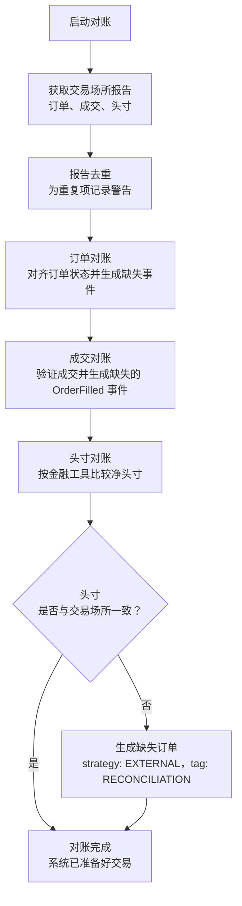

# 执行对账

执行对账用于使交易场所的实际订单与持仓状态同系统内部的事件溯源状态保持一致。本指南介绍启动时的状态恢复，以及用于发现运行期间状态差异的持续检查。

未解决的实盘命令结果是导致状态分歧的原因之一。关于 Vibe 如何区分本地失败、确定结果和未知结果，请参阅[命令结果](execution.md#command-outcomes)。

完整节点生命周期请参阅[实盘交易](live.md)。可用设置和推荐值请参阅[配置实盘交易节点](../how_to/configure_live_trading.md#executionengine-configuration)。

## 对账模型

只有 `LiveExecutionEngine` 执行对账，因为回测同时控制状态的两端。

存在两种情形：

- **存在缓存状态**：根据报告数据生成缺失事件，使状态一致。
- **不存在缓存状态**：从头生成交易场所的所有订单和持仓。

:::tip
应把所有执行事件持久化到缓存数据库。这样可以减少对交易场所历史记录的依赖，即使回溯窗口较短也能完整恢复。
:::

## 对账配置

除非把 `reconciliation` 设为 false，否则执行引擎会在启动时对每个交易场所进行状态对账。`reconciliation_lookback_mins` 参数控制引擎向前请求历史记录的时间范围。

:::tip
建议不要设置 `reconciliation_lookback_mins`，让引擎请求交易场所能够提供的最长执行历史。
:::

:::warning
回溯窗口之前的执行仍会生成状态对齐事件，但会丢失一些本可由更长窗口保留的信息。部分交易场所还会筛除或丢弃较早的执行数据。把所有事件持久化到缓存数据库可以避免这两类问题。
:::

每个策略都可以通过 `external_order_claims` 配置参数，按金融工具 ID 认领来自交易场所的外部订单和对账过程中生成的交易活动。因此，即使不存在缓存状态，策略也能恢复管理未结订单和未平持仓。

未认领的外部订单使用策略 ID `EXTERNAL` 和标签 `VENUE`。持仓对账期间生成的未认领订单使用策略 ID `EXTERNAL` 和标签 `RECONCILIATION`。已认领订单和成交使用认领方的策略 ID，不带外部/对账标签，因此策略可以继续管理恢复后的状态。

:::tip
要在策略中发现未认领的外部订单，请检查 `order.strategy_id.value == "EXTERNAL"`。这些订单与其他订单一样参与投资组合计算和持仓跟踪。
:::

全部实盘交易选项请参阅 `LiveExecEngineConfig` [API 参考](/docs/python-api-latest/config.html#vibe_trader.live.LiveExecEngineConfig)。

## 对账流程

所有适配器执行客户端都遵循相同的对账流程，调用以下三个方法生成执行汇总状态：

- `generate_order_status_reports`
- `generate_fill_reports`
- `generate_position_status_reports`

这些报告代表外部真实状态。流程按图示顺序处理报告，使每次持仓检查都建立在已经完成对账的订单和成交状态之上。

### 报告去重

- 对同一批次中的订单报告去重并记录警告。
- 把重复交易 ID 记录为警告，以供调查。

### 订单对账

- 生成并应用事件，使订单从缓存状态转换为当前状态。
- 对无法识别的客户端订单 ID，或缺少客户端订单 ID 的报告，生成外部订单事件。

### 成交对账

- 为缺失的交易报告推导 `OrderFilled` 事件。
- 使用基于容差的价格和佣金比较，验证成交报告数据的一致性。

### 持仓对账

- 按金融工具精度，将每个账户和金融工具的净持仓与交易场所持仓报告匹配。
- 如果订单对账完成后持仓仍与交易场所不同，则生成外部订单事件。
- 启用 `generate_missing_orders` 时（默认：True），生成策略 ID 为 `EXTERNAL`、标签为 `RECONCILIATION` 的订单以消除差异。
- 如果同一账户和金融工具的 NETTING 所有权分散在多个策略中，则记录警告，因为交易场所持仓报告是账户级净持仓。

生成对账订单时，引擎按以下价格优先级选择：

1. **计算得出的对账价格**（首选）：以获得正确的平均持仓价格为目标。
1. **市场中间价**：使用当前买卖价中点。
1. **当前持仓均价**：使用现有持仓的平均价格。
1. **MARKET 订单**（最后手段）：仅在没有任何价格数据时使用（既无持仓，也无市场数据）。

如果能够确定价格（情形 1-3），引擎会使用 LIMIT 订单以保持盈亏准确性；按精度舍入后数量差为零时则跳过。

### 部分窗口调整

设置 `reconciliation_lookback_mins` 后，窗口可能遗漏开仓成交。系统使用生命周期分析准确重建持仓：

- 检测零点穿越（持仓数量穿过 FLAT）以识别不同生命周期。
- 最早的生命周期不完整时，添加合成开仓成交。
- 当前生命周期与交易场所持仓匹配时，筛除已关闭的生命周期。
- 当前生命周期不匹配时，用反映交易场所持仓的合成成交替换它。

合成成交使用计算得出的对账价格，以获得正确的平均持仓价格。详情请参阅[部分窗口调整情形](#部分窗口调整情形)。

### 失败处理

- 单个适配器失败不会中止整个对账流程。
- 成交报告先于订单状态报告到达时，会延后处理，直到订单状态可用。

对账失败时，系统会记录错误且不启动。

## 常见对账情形

下列表格涵盖启动对账（汇总状态）和运行时检查（传输中订单检查、未结订单轮询、自有订单簿审计）。

### 启动对账

| 情形                       | 说明                                                                  | 系统行为                                                          |
| -------------------------- | --------------------------------------------------------------------- | ----------------------------------------------------------------- |
| **订单状态差异**           | 本地状态与交易场所不同（例如本地 `SUBMITTED`，交易场所 `REJECTED`）。 | 更新本地订单以匹配交易场所状态，并发出缺失事件。                  |
| **遗漏成交**               | 交易场所已成交，但引擎遗漏了事件。                                    | 生成缺失的 `OrderFilled` 事件。                                   |
| **多笔成交**               | 订单有多笔部分成交，其中一些被引擎遗漏。                              | 根据交易场所报告重建完整成交历史。                                |
| **外部订单**               | 交易场所存在订单，但本地缓存中不存在。                                | 创建策略 ID 为 `EXTERNAL`、标签为 `VENUE` 的未认领订单。          |
| **部分成交后取消**         | 订单部分成交后被交易场所取消。                                        | 把状态更新为 `CANCELED`，并保留成交历史。                         |
| **成交数据不同**           | 交易场所报告的成交价格/佣金与缓存不同。                               | 保留缓存数据并记录差异。                                          |
| **筛选订单**               | 配置把订单标记为需要筛选。                                            | 根据 `filtered_client_order_ids` 或金融工具筛选条件跳过。         |
| **重复订单报告**           | 多个订单共用同一标识符。                                              | 去重并记录警告。                                                  |
| **持仓数量不匹配（多头）** | 内部多头持仓与交易场所不同（例如 100 与 150）。                       | 当 `generate_missing_orders=True` 时，以计算价格生成 BUY LIMIT。  |
| **持仓数量不匹配（空头）** | 内部空头持仓与交易场所不同（例如 -100 与 -150）。                     | 当 `generate_missing_orders=True` 时，以计算价格生成 SELL LIMIT。 |
| **持仓减少**               | 交易场所持仓小于内部持仓（例如内部多头 150，交易场所多头 100）。      | 以计算价格生成反向 LIMIT 订单。                                   |
| **持仓方向反转**           | 内部持仓与交易场所方向相反（例如内部多头 100，交易场所空头 50）。     | 生成 LIMIT 订单，关闭内部持仓并建立外部持仓。                     |
| **内部对账订单**           | 为消除持仓差异而生成的订单。                                          | 配置认领时使用认领方；否则使用 `EXTERNAL` + `RECONCILIATION`。    |

### 运行时检查

启动对账完成后会开始持续对账。它会：

- 监控传输中订单是否延迟超过配置阈值。
- 按配置间隔与交易场所核对未结订单。
- 按配置间隔向交易场所检查持仓状态。
- 根据交易场所公开订单簿审计内部*自有*订单簿。

循环会等待启动对账完成后再开始周期检查。`reconciliation_startup_delay_secs` 参数会在启动对账完成*之后*进一步延迟，让系统有时间稳定下来。

| 情形                     | 说明                                                | 系统行为                                    |
| ------------------------ | --------------------------------------------------- | ------------------------------------------- |
| **传输中提交超时**       | 重试耗尽后，`SUBMITTED` 仍未得到确认。              | 解析为带 `INFLIGHT_TIMEOUT` 的 `REJECTED`。 |
| **传输中取消/更新超时**  | `PENDING_CANCEL` 或 `PENDING_UPDATE` 超过重试次数。 | 通过对账解析为 `CANCELED`。                 |
| **未结订单检查差异**     | 周期轮询发现交易场所状态变化。                      | 确认状态并应用转换。                        |
| **持仓检查差异**         | 周期轮询发现持仓不匹配。                            | 符合条件时生成对账事件。                    |
| **自有订单簿审计不匹配** | 自有订单簿与交易场所公开订单簿不一致。              | 审计并记录不一致。                          |

**传输中订单超时解析**（达到最大重试次数后交易场所仍未响应）：

| 当前状态         | 解析为     | 理由                             |
| ---------------- | ---------- | -------------------------------- |
| `SUBMITTED`      | `REJECTED` | 达到重试上限前没有收到接受确认。 |
| `PENDING_UPDATE` | `CANCELED` | 传输中检查器应用终结对账事件。   |
| `PENDING_CANCEL` | `CANCELED` | 传输中检查器应用终结对账事件。   |

这些终结结果来自传输中超时检查器。缺少未结订单报告本身不能证明待修改或待取消操作的结果，因此下列一致性检查会让这些状态保持未解决，直到其他检查能够确定交易场所状态。

**订单一致性检查**（缓存状态与交易场所状态不同时）：

*未找到*行只适用于完整历史模式（`open_check_open_only=False`）；默认使用仅未结模式。

| 缓存状态           | 交易场所状态 | 解析结果   | 理由                                                 |
| ------------------ | ------------ | ---------- | ---------------------------------------------------- |
| `SUBMITTED`        | *未找到*     | `REJECTED` | 订单从未得到交易场所确认（例如在网络错误期间丢失）。 |
| `ACCEPTED`         | *未找到*     | `REJECTED` | 交易场所不存在该订单，可能从未成功提交。             |
| `ACCEPTED`         | `CANCELED`   | `CANCELED` | 交易场所取消订单（用户操作或交易场所发起）。         |
| `ACCEPTED`         | `EXPIRED`    | `EXPIRED`  | 订单在交易场所达到 GTD 到期时间。                    |
| `ACCEPTED`         | `REJECTED`   | `REJECTED` | 交易场所在初次接受后拒绝订单（少见但可能）。         |
| `PENDING_UPDATE`   | *未找到*     | *未解决*   | 修改结果仍未知。                                     |
| `PENDING_CANCEL`   | *未找到*     | *未解决*   | 取消结果仍未知。                                     |
| `PARTIALLY_FILLED` | `CANCELED`   | `CANCELED` | 订单在交易场所被取消，已成交记录予以保留。           |
| `PARTIALLY_FILLED` | *未找到*     | `CANCELED` | 订单不存在但已有成交（对成交历史进行对账）。         |

:::note
**运行时对账注意事项：**

- **仅未结模式**：交易场所的"未结订单"端点按设计会排除已关闭订单，因此无法区分缺失订单与刚刚关闭的订单。缺失订单检查无法证明最终交易场所状态时，待取消/更新订单会保持未解决。
- **近期订单保护**：引擎会跳过最近事件位于 `open_check_threshold_ms` 窗口内的订单，避免交易场所仍在处理时因竞态产生误报。
- **定向查询保护**：应用终结"未找到"解析前，引擎会向交易场所发起一次单订单查询，以发现批量查询限制或时序延迟导致的假阴性。
- **持仓报告失败**：如果查询交易场所持仓失败，引擎会在本轮跳过该交易场所的缓存持仓，而不会把缺失报告当作空仓。
- **`FILLED` 订单**在交易场所"未找到"时会被静默忽略。交易场所通常会从查询结果中移除已完成订单。

:::

**重试协调。** 传输中循环会根据 `inflight_check_retries` 增加自己的逐订单重试计数，并把该值同步到缺失订单跟踪。未结订单循环则根据 `open_check_missing_retries` 增加缺失订单计数。每个循环应用自己的上限，两项设置都不会自动覆盖另一项。

未结订单循环耗尽重试后，引擎会发出一次定向 `GenerateOrderStatusReport` 探测，再应用终结状态或让含义不明确的待取消/更新状态保持未解决。如果交易场所返回订单，就继续对账并清除缺失订单跟踪。如果待处理状态仍未解决，引擎还会重置传输中计数，待配置阈值过后再次检查。

持仓检查对每个金融工具和账户使用独立重试计数器。持仓成功匹配时清除计数器；差异反复无法解决时，停止对该组合主动对账，直到差异消失。

**单订单查询限流。** 引擎通过 `max_single_order_queries_per_cycle` 限制每轮单订单查询数量，其余订单延后到下一轮。`single_order_query_delay_ms` 会在连续查询之间加入间隔以避免速率限制。这样可以在数百个订单的批量查询失败时避免压垮交易场所 API。

## 常见对账问题

- **缺少交易报告**：部分交易场所会筛除较早交易。增加 `reconciliation_lookback_mins`，或在本地缓存所有事件。
- **持仓不匹配**：早于回溯窗口的外部订单会导致持仓偏差。重启前先平掉账户持仓以重置状态。
- **NETTING 所有权分散**：多个策略可能持有同一账户和金融工具的缓存持仓，但交易场所只报告一个账户级净持仓。恢复外部状态时，每个 NETTING 账户/金融工具组合最好只由一个策略认领。
- **重复订单 ID**：系统会去重并记录警告。频繁重复可能表明交易场所数据完整性存在问题。
- **精度差异**：系统按金融工具精度处理很小的小数差异。较大差异可能表示订单缺失。
- **报告乱序**：成交报告先于订单状态报告到达时会延后处理，直到订单状态可用。

:::tip
问题持续存在时，可以删除缓存状态或在重启前平掉账户持仓。
:::

## 对账不变量

对账系统维护四项不变量：

1. **持仓数量**：最终数量在金融工具精度范围内与交易场所一致。
1. **平均入场价**：持仓平均入场价在容差范围内与交易场所报告价格一致（默认 0.01%）。
1. **盈亏完整性**：所有生成的成交（包括合成成交）都使用计算得出的价格，以保持正确的未实现盈亏。
1. **ID 确定性**：对账期间生成的合成 `trade_id` 和 `venue_order_id` 值是逻辑事件的确定性函数。同一个逻辑成交或持仓调整订单在多次重启间会产生相同 ID，因此重放的对账事件会与较早运行去重，而不会被视为新事件。

即使出现以下情况，这些不变量仍成立：

- 对账窗口遗漏完整成交历史。
- 交易场所报告缺少成交。
- 持仓生命周期延伸到回溯窗口之外。
- 已发生多次零点穿越。

## 部分窗口调整情形

当 `reconciliation_lookback_mins` 限制窗口时，系统会根据成交分析持仓生命周期，并进行调整以准确重建持仓。

| 情形                         | 说明                                         | 系统行为                             |
| ---------------------------- | -------------------------------------------- | ------------------------------------ |
| **完整生命周期**             | 从开仓到当前状态的全部成交都在窗口内。       | 不调整。                             |
| **单个生命周期不完整**       | 窗口遗漏开仓成交，且未发生零点穿越。         | 以计算价格添加合成开仓成交。         |
| **多个生命周期，当前匹配**   | 检测到零点穿越，当前生命周期与交易场所一致。 | 筛除旧生命周期，只返回当前生命周期。 |
| **多个生命周期，当前不匹配** | 检测到零点穿越，当前生命周期与交易场所不同。 | 用一笔合成成交替换当前生命周期。     |
| **空仓**                     | 无论成交历史如何，交易场所都报告 FLAT。      | 不调整。                             |
| **无成交**                   | 窗口内没有成交报告。                         | 不调整，返回空结果。                 |

**关键概念：**

- **零点穿越**：持仓数量穿过零（FLAT），标志着生命周期边界。
- **生命周期**：两次零点穿越之间的一系列成交，代表一个开仓到平仓周期。
- **合成成交**：用于表示缺失交易活动的计算成交报告，其定价用于获得正确的平均持仓价格。
- **容差**：持仓匹配使用可配置的价格容差（默认 0.0001 = 0.01%），以吸收微小计算差异。

## 相关指南

- [实盘交易](live.md) - 节点生命周期、配置、指标和关闭。
- [配置实盘交易节点](../how_to/configure_live_trading.md) - 节点和引擎配置。
- [适配器](adapters.md) - 交易场所连接。
- [执行](execution.md) - 命令结果和执行流程。
